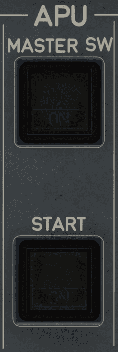

# Auxiliary Power Unit

---

[Back to Overhead](../overviews/ovhd.md){ .md-button }

---

{loading=lazy width=20%}

[//]: # (TODO)
<!-- TODO
!!! note "API Documentation: [APU Panel API](../../../../../aircraft/a32nx/a32nx-api/a32nx-flightdeck-api.md#apu-panel)"
-->

## Description

The Auxiliary Power Unit (APU) is a small jet engine in the back of the aircraft which supplies the 
aircraft with pneumatic and electrical power.

## Usage

### MASTER SW

Controls the APU operation and its start- and shutdown sequence.

- OFF:
    - The APU is off. 
    - When pressed, the APU system is powered and the air-intake flap opens.
- ON:
    - The APU is in operation. 
    - When pressed, the APU shutdown sequence begins.
- FAULT Lt:
    - The APU is failed, or
    - An automatic shutdown has occurred, or
    - An emergency shutdown has occurred.
    - Associated with an ECAM alert.

### START

- OFF:
    - The APU is not running. 
- ON:
    - The APU is starting.
    - When the APU reaches 95 % speed, the ON light goes off and the AVAIL light
      comes on.
- AVAIL Lt:
    - The APU is started, and can provide electrical power, and/or bleed air.

---

[Back to Overhead](../overviews/ovhd.md){ .md-button }

---
