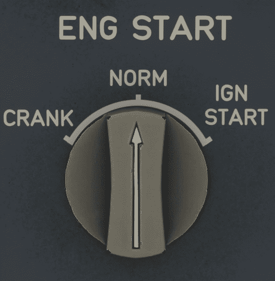

# Engine Start Panel

---

[Back to Overhead](../overviews/ovhd.md){ .md-button }

---

{loading=lazy}

[//]: # (TODO API Doc Link) 
    
## Usage

### ENG MODE selector

- NORM:
    - Normal operation mode.
- IGN START:
    - Starts the automatic or manual start sequences when on ground.
    - When engine is running, it initiates continues ignition.
- CRANK:
    - Used for a dry or a wet engine cranking.      
    !!! info ""
        Currently not available or INOP in the FBW A380X for Microsoft Flight Simulator.

