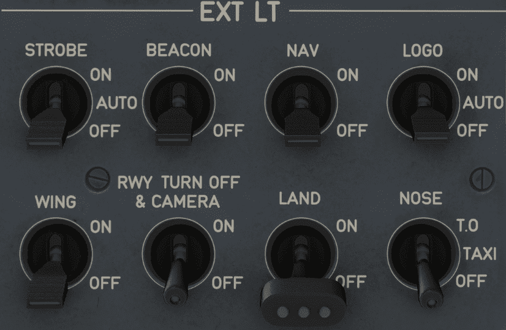

# Exterior Lights Panel

---

[Back to Overhead](../overviews/ovhd.md){ .md-button }

---

[//]: # (TODO)
<!-- TODO 
!!! note "API Documentation: [EXT LT Panel API](../../../../../aircraft/a32nx/a32nx-api/a32nx-flightdeck-api.md#external-lights-panel)"
-->

## Description

The Exterior Lighting of an Airbus A380 includes these lights:

- The navigation lights
- The landing lights
- The runway turn off lights
- The TO and TAXI lights
- The logo lights
- The anti collision lights
- The wing and engine scan lights.

### External lighting configuration:

[//]: # (TODO)

TODO: Update this table for A380X

{loading=lazy}

## Usage

### STROBE

Turns on and off the three synchronized strobe lights, one on each wing tip and one below the tail cone.

- ON:
    - Strobe lights or on.
- AUTO:
    - Automatically turns on strobe lights when the main gear strut is not compressed.
- OFF:
    - Strobe lights are off.

Strobes are turned on at the latest when airborne. Usually shortly before the takeoff roll.

### BEACON

There are three anti-collision beacon lights: Two on the top of the fuselage, and one under the
fuselage.

- ON:
    - Beacon lights or on.
- OFF:
    - Beacon lights are off.

The beacon lights are also used to signal the ground crew that the engines are about to start or
are still running.

### WING

Illuminate the leading edges of the wings and the engine air intake to show if ice is accumulating there.

### NAV

This switch turns the navigation lights on and off.

- ON:
    - Navigation lights or on.
- OFF:
    - Navigation lights are off.

The navigation lights are on the wing tips and the tail cone. They show the aircraft's position to
other aircraft and ground personnel.

These lights are visible from all sides of the aircraft and show:

- red if the aircraft is viewed from the left side
- green if viewed from the right side
- white if viewed from the rear
- red and green if viewed from the front.

The aircraft also has two white obstruction lights on each wing tip. These are only on when the
navigation lights are on and the aircraft is on the ground.

### LOGO

There are two logo lights: One on the upper surface of each horizontal stabilizer.
These lights provide lighting on the company logo that is on the tail fin.

- ON:
    - LOGO lights or on.
- AUTO:
    - The logo lights come on automatically, when the aircraft is on ground or in flight, when the
      slats are extended.
- OFF:
    - LOGO lights are off.

!!! warning ""
    Currently not available or INOP in the FBW A380X for Microsoft Flight Simulator.

### RWY TURN OFF

The aircraft has two runway turnoff lights on the nose landing gear strut, that provide lighting
during taxi, and enable the flight crew to detect any obstacle on the runway and on the taxiway

The aircraft also has four camera lights: One camera light on each side of the forward fuselage, and
one under each wing.

When the flight crew uses the taxi cameras at night, the camera lights provide ground lighting
for the nose landing gear and the main landing gear.

- ON:
    - RWY TURN OFF lights or on.
    - Camera lights or on, if ETACS is set to ON
- OFF:
    - RWY TURN OFF lights are off.
    - Camera lights are off.

These lights go off automatically when the landing gear is retracted.

During takeoff, landing and approach, only the camera lights
are on if:

- ETACS is set to ON.
- The nose landing gear is extended.

### LAND

There are two landing lights near the wing root of each wing leading edge. These lights provide
lighting that enables the flight crew to detect any obstacle on the runway.

- ON:
    - Landing lights are on.
- OFF:
   - Landing lights are off.

### NOSE

The aircraft has three takeoff lights on the nose landing gear strut, that enable the flight crew to detect
obstacles on the runway.

It has also one taxi light, near the wing root of each leading edge, and one taxi light on the nose landing
gear strut.
The taxi lights enable the flight crew to detect obstacles on the taxiway.

- T.O.:
    - Turns on both taxi and takeoff lights.
- TAXI:
    - Turns on only taxi light.
- OFF:
    - Taxi and takeoff lights are off.

Note: The lights attached to the nose gear strut, go off automatically when the landing gear is retracted.

---

[Back to Overhead](../overviews/ovhd.md){ .md-button }

---
