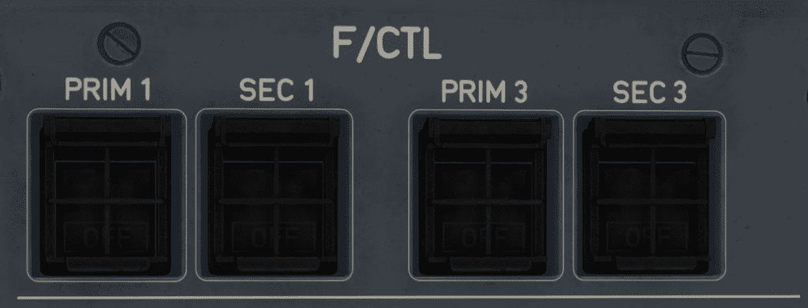
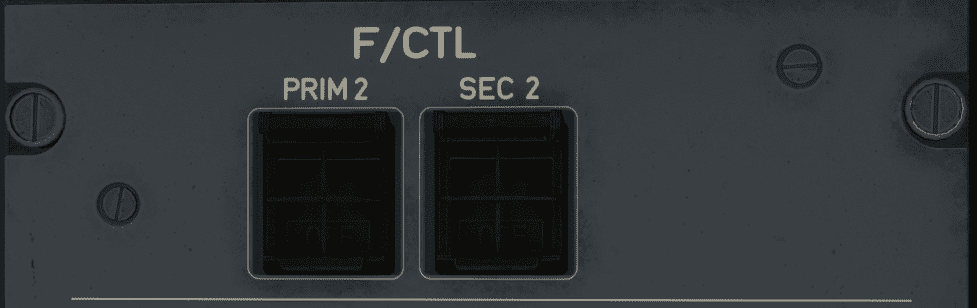

# Flight Control System Panel

---

[Back to Overhead](../overviews/ovhd.md){ .md-button }

---

## Left Side
{loading=lazy}

## Right Side
{loading=lazy}

[//]: # (TODO API Doc Link)

[//]: # (TODO)

TODO: 

---

[Back to Overhead](../overviews/ovhd.md){ .md-button }

---
