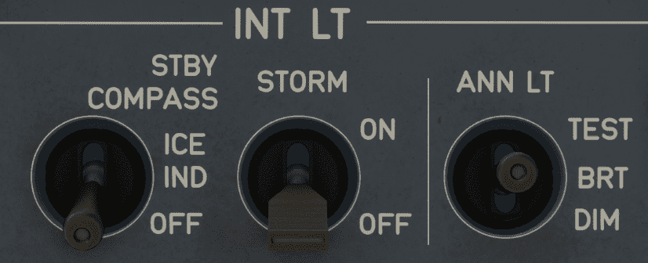

# Internal Lights Panel

---

[Back to Overhead](../overviews/ovhd.md){ .md-button }

---

[//]: # (TODO)
<!-- TODO
!!! note "API Documentation: [INT LT Panel API](../../../../../aircraft/a32nx/a32nx-api/a32nx-flightdeck-api.md#interior-lights-panel)"
-->

## Usage

### STBY COMPASS

- ICE IND & STBY COMPASS:
    - The standby compass light and the eye reference light are on.
- OFF:
    - The standby compass light and the eye reference light are off.

### STORM

The storm function enables the flight crew to obtain maximum lighting in the cockpit, via the ambient
lights and the main instrument panel lights.

Ambient lights on the ceiling, and main instrument panel lights are at their
maximum brightness.

Overrides all the other lighting selections, regardless of the position of the
AMBIENT LIGHT knob or the MAIN PNL FLOOD LT knob.

!!! warning ""
    Currently not available or INOP in the FBW A380X for Microsoft Flight Simulator.

### ANN LT

Brightness of cockpit annunciator lights. Either "bright" or "dim", or test.

- TEST:
    - Turns on all annunciator lights in the cockpit and LCDs in the FCU for the test.
- DIM:
    - Dims all annunciator lights.
- BRT:
    - Normal brightness for all annunciator lights.

---

[Back to Overhead](../overviews/ovhd.md){ .md-button }

---