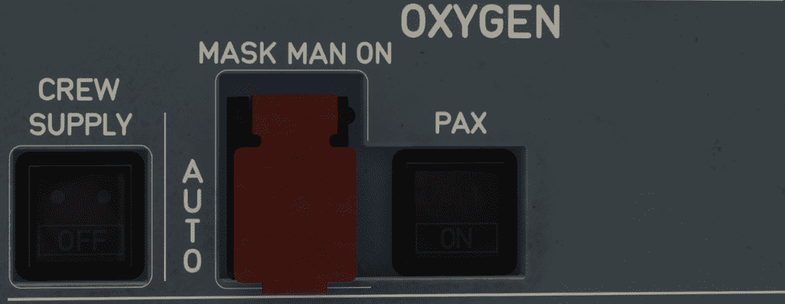

# Oxygen Panel

---

[Back to Overhead](../overviews/ovhd.md){ .md-button }

---

{loading=lazy}

!!! note "API Documentation: [OXYGEN Panel API](../../../../../aircraft/a380x/a380x-api/a380x-flight-deck-api.md#oxygen-panel)"

## Usage

### CREW SUPPLY pb-sw
The CREW SUPPLY pb-sw controls oxygen supply to the masks in the cockpit.

- ON:
  - The supply valve is open, and supplies oxygen to the masks.
- OFF:
  - The supply valve is closed.

### MASK MAN ON pb
The MASK MAN ON pb is a guarded pushbutton.

- GUARD CLOSED:
    - Normal position.
    - If the cabin altitude is above 13 800 ft, the masks drop automatically.
- GUARD OPEN:
    - When pushbutton is pressed the masks will drop.

### PAX SYS ON LIGHT

- SYS ON:
    - Oxygen flows toward the passenger masks.
    - The light remains on, until the RESET pb on the [OXYGEN maintenance panel](maintenance.md#reset-pb) is pressed.

---

[Back to Overhead](../overviews/ovhd.md){ .md-button }

---

