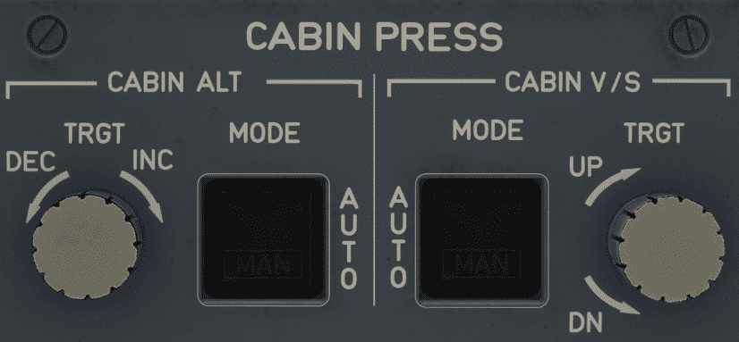
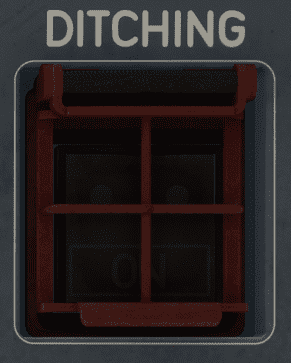

# Pressurization Panel

---

[Back to Overhead](../overviews/ovhd.md){ .md-button }

---
{loading=lazy}
{loading=lazy width=20% align=right}

[//]: # (TODO API Doc Link)

## Description

The cabin pressurization system controls the pressurization of the cabin to allow crew and passengers
to fly comfortably without the use of oxygen masks and the negative impact of too low pressure at high altitude.

In normal operation, the pressurization system does not require any action by the flight crew.
Cabin air pressure is automatically regulated to provide maximum passenger comfort.

The cabin pressure regulation is performed via the automatic control of the outflow valves during all
flight phases, from takeoff to landing.

During cruise, the cabin altitude is regulated not to exceed 7500 ft.

If necessary, the flight crew can manually operate the cabin air pressurization system by selecting
the cabin altitude target and/or the cabin vertical speed.

The CABIN PRESS panel is only used when pressurization has to be controlled in manual mode
or in the event of a ditching.

## Usage

### CABIN ALT MODE pb-sw

- AUTO:
    - Cabin altitude is automatically regulated.
- MAN:
    - Cabin altitude is manually controlled.
    - The cabin altitude target must be manually selected via the CABIN ALT TRGT selector.
    - The cabin altitude target remains steady at the current value until the flight
      crew manually selects a new cabin altitude target.

### CABIN ALT TRGT selector

When the CABIN ALT MODE pb-sw is set to MAN, the flight crew uses the selector to manually select
the cabin altitude target.

The selected cabin altitude target is displayed on the CAB PRESS and on the CRUISE page of the SD.

The cabin altitude selection has a range of –2000 ft to 15000 ft.

### CABIN V/S MODE pb-sw

- AUTO:
    - Cabin vertical speed is automatically regulated according to the flight profile and the cabin
      altitude target.
- MAN:
    - Cabin pressure vertical speed is manually controlled.
    - The vertical speed must be manually selected via the CABIN V/S TRGT selector.

### CABIN V/S TRGT selector

When the CABIN V/S MODE pb-sw is set to MAN, the flight crew uses the selector to manually select
the cabin pressure vertical speed.

The selected cabin pressure vertical speed is displayed on the CAB PRESS and on the CRUISE page of the
system display.

The cabin vertical speed selection has a range of –1500 ft/min to +2500 ft/min.

### DITCHING guarded

- Normal:
    - The system functions normally.
- ON:
    - To prepare for ditching, the flight crew sets the DITCHING pb-sw on the CAB PRESS control panel
      to ON. This closes all the valves located below the flotation line.

---

[Back to Overhead](../overviews/ovhd.md){ .md-button }

---