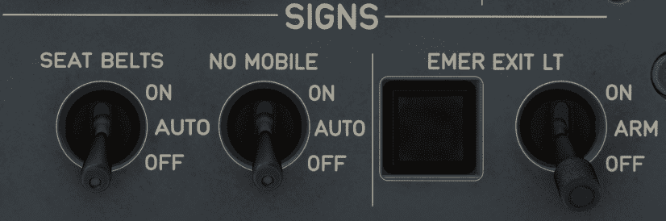

# Signs Panel

---

[Back to Overhead](../overviews/ovhd.md){ .md-button }

---

[//]: # (TODO)
<!-- TODO
!!! note "API Documentation: [Signs Panel API](../../../../../aircraft/a32nx/a32nx-api/a32nx-flightdeck-api.md#signs-panel)"
-->

## Usage

### EMER EXIT LT

- ON:
    - Turn on Overhead Emergency Lights, EXIT signs and proximity marking system (floor light band).
- OFF:
    - Turn off Overhead Emergency Lights, EXIT signs and proximity marking (floor light band) system.
- ARM:
    - Emergency lighting and proximity marking turn on, when normal aircraft electrical power system fails or DC SHED ESS BUS fails or AC BUS 1 fails.
    - Exit signs turn on when normal aircraft electrical power system fails or DC SHED ESS BUS fails.

### EMER EXIT LT

- OFF Lt:
    - Amber light when the EMER EXIT LT selector is selected OFF.

###  SEAT BELTS

- ON:
    - Turn on FASTEN SEAT BELT and RETURN TO SEAT signs. A low tone chime is played in the passenger compartment.
- AUTO:
    - The FASTEN SEAT BELT signs and the RETURN TO SEAT signs come
      on automatically in the cabin when engines are ON (depending on CIDS
      programming), and: 
        - The slats are extended, or
        - The main landing gear is extended.
      An associated low tone chime sounds in the cabin.
- OFF:
    - Turn off FASTEN SEAT BELT and RETURN TO SEAT signs.

!!! note ""
    Chime is barely audible in the cockpit with the cockpit door closed.

### NO MOBILE

- ON:
    - NO MOBILE and EXIT signs come on together with a low tone chime.
- AUTO:
    - The NO MOBILE signs come on automatically in the cabin, when:
        - The aircraft is flying over a country where the use of mobile phone is not
          authorized, or
        - The aircraft altitude is approximately below 13 000 ft AGL.
        - Depending on CIDS programming, an associated low tone chime
          sounds in the cabin.
    - The EXIT signs come on automatically in the cabin, when
        - The slats are extended, or
        - The landing gear is extended.
- OFF:
    - The NO MOBILE signs, and the EXIT signs go off in the cabin. Depending on the CIDS programming, 
      an associated low tone chime sounds in the cabin.

!!! note ""
    Chime is barely audible in the cockpit with the cockpit door closed.

---

[Back to Overhead](../overviews/ovhd.md){ .md-button }

---