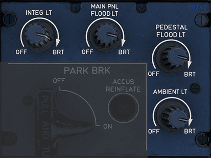

# Cockpit Lighting

[Back to A380 Flight Deck Overview](../index.md){ .md-button }

---

## Overview

The Cockpit Lighting Panel has knobs to control various cockpit lights.
The knob settings range from "OFF" to "BRT" (Bright), allowing pilots to set the lighting levels to their
preference and the needs of the flight environment.

## INTEG LT (Integral Lighting):

This knob adjusts the backlighting intensity of the integrated instruments on the main instrument panel. This
illumination helps pilots find and read switches, knobs, buttons, etc. during low-light conditions, such as night flying
or when flying through clouds.

## MAIN PNL FLOOD LT (Main Panel Flood Light):

This control adjusts the flood lighting for the main panel, which provides a wash of light over the entire instrument
panel. This general lighting is useful when the pilots need to see the entire panel without the need for backlighting on
individual instruments.

## PEDESTAL FLOOD LT (Pedestal Flood Light):

This knob controls the flood lighting over the pedestal area, where the throttle and other control systems like the
radio and flight management systems are located. This light allows for better visibility of the pedestal controls,
especially important during critical flight operations.

## AMBIENT LT (Ambient Light):

The ambient light control adjusts the cabin's general lighting, usually providing a soft, indirect light to help the
pilots adjust their eyes between looking at brightly lit instruments and the darker outside conditions. This helps to
reduce eye strain and maintain night vision.

---

[Back to A380 Flight Deck Overview](../index.md){ .md-button }

