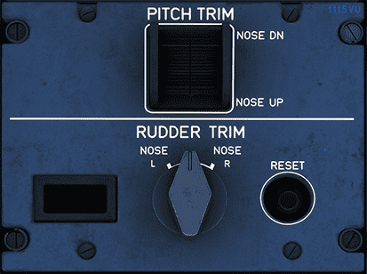

# Trim Panel

[Back to A380 Flight Deck Overview](../index.md){ .md-button }

---

## Overview

The image showcases the trim controls of the Airbus A380, which are used to fine-tune the aircraft's flight attitude and
balance:

## Pitch Trim

This control is used to adjust the aircraft's nose attitude up or down. It changes the angle of the
horizontal stabilizer on the tail to reduce control forces on the stick or yoke for the pilot. It is particularly
useful for maintaining a steady altitude during level flight or during a climb or descent. The actual adjustment is
made by moving the switch up to trim the nose down or down to trim the nose up.

## Rudder Trim

This is used to adjust the aircraft's yaw to keep it flying straight with minimal control input,
especially useful when the aircraft experiences asymmetrical forces like engine failure or crosswinds. The rudder
trim is controlled by moving the knob left to turn the nose left (L) or right to turn the nose right (R).

## Rudder Trim Display 

This display shows the current rudder trim setting in degrees. 

## Reset Button

Typically, this button is used to reset the rudder trim settings to a neutral  position.

---

[Back to A380 Flight Deck Overview](../index.md){ .md-button }
