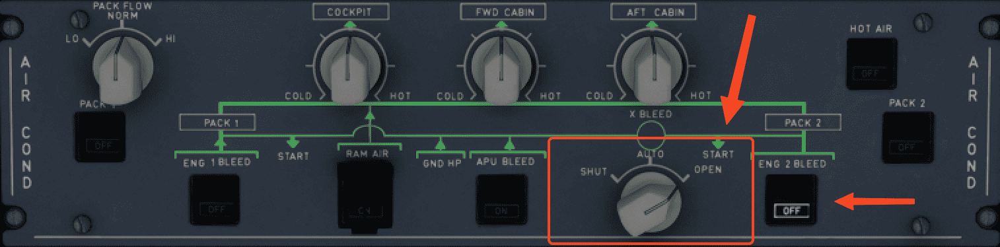

# Crossbleed Engine Start

## Overview

This procedure is used when a normal APU Bleed start is not possible, usually due to the APU being inoperative. 

It may be prudent to inform ATC that you will be performing a crossbleed start, as the procedures and process may take longer than a normal start and carry certain risks both 
to the ground crew and the airport infrastructure.

!!! warning "Realistic Situations"
    It is important to note that crossbleed engine starts **should not** be performed under the following conditions in real life:

    - During pushback operations
    - Situations where the thrust of the engine would endanger life or property

## Procedure

To explain this procedure, we will assume that an ASU was used to start `ENG 1`, and the flight crew will start `ENG 2` using the crossbleed procedure.

[ASU Engine Start Guide](asu-start.md){.md-button}

!!! warning "Stable Version"
    !!! danger "Actual Procedure Requires ASU"
        A crossbleed engine start normally requires an ASU to be connected to the aircraft to start the first engine. This is not available in the Stable version.

    For now, you would have to start a single engine normally (`APU ON` and `APU BLEED ON`) before carrying on with a crossbleed start.

### Initial State

Before using this procedure ensure:

- One engine should already be started and AVAIL. This allows the bleed air from the running engine to be used to start the other engine.
- `APU BLEED` - `OFF`
- `ENG MODE` - `NORM`

{loading=lazy}

### Overhead Bleeds Configuration

`ENG BLEED` for the receiving engine needs to be switched `OFF`. This is to prevent the bleed air from the running engine from escaping through the receiving engine 
(reverse flow leakage).

The `X BLEED VALVE` should be switched to the `OPEN` position.

Ensure that `ENG 2 BLEED` is `OFF` for this sample procedure.

{loading=lazy}

### Engine Start

1. Begin by verifying the bleed page on the lower ECAM display. 
     - Crucially, that the bleeds on both sides are connected via the `X BLEED` valve and that the `ENG 2 BLEED` valve is closed (indicated by the amber line above IP for ENGINE 2).
     
     {loading=lazy width=80%}
   
2. Deselect the BLEED page and turn the `ENG MODE` to `IGN/START`. 
     - This should display the ENGINE page on the lower ECAM display.
     
       {loading=lazy width=80%}
   
3. Ensure that the IGN Bleed PSI for `ENG 2` is at or above 30 PSI before attempting to start the engine. 
     - It is not unusual on the NEO to see the pressure be at or above 30 PSI at IDLE power. If the pressure is below 30 PSI, increase the thrust of the running engine.
   
4. Switch `ENG MASTER 2` to the ON position. **Maintain at least 25 PSI during the entire start procedure**.

    {loading=lazy width=80%}

!!! warning ""
    It is common to lose pressure during the start sequence. Advance the `THR LEVERS` of the supplying engine (`ENG 1` in this scenario) to maintain at least 25 PSI.

    If thrust required approaches 40 % N1 to maintain at least 25 PSI, ensure the surrounding area continues to be clear of obstructions. If you exceed 40 % N1 there maybe issues 
    with your configuration and consider aborting the procedure.

The engine should start normally if you have followed the procedure correctly.

### After Start

Once both engines are started, ensure the following in order:

1. Set `ENG 1` thrust lever to `IDLE`
2. Turn the `X BLEED` switch on the overhead panel back to `AUTO`
3. Turn `ENG 2 BLEED` switch back to `ON`
4. Continue your regular flows and procedures before taxi out
