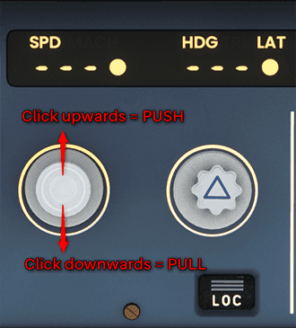

# Flight Guidance in the A320

The flight management and guidance system (FMGS) performs navigation functions and lateral and vertical flight planning functions. It also computes performance parameters and guides the aircraft along a pre-planned route.

It generates and sends commands to the FADECs, autothrust system, autopilot, and flight director to control aircraft roll, pitch, speed, and thrust. This gives three-dimensional flight management with fully automatic, optimized flight performance and guidance.

## Lateral Guidance

The primary flight plan is used for lateral guidance and automatically sequences route legs. The current aircraft position is used to determine the required steering commands (AP and FD) to achieve the desired flight plan path.

## Vertical Guidance

Vertical guidance is available for TAKEOFF, CLIMB, CRUISE, DESCENT, and APPROACH phases of the flight plan. The flight planning capability lets the pilot enter published departure, arrival, and approach segments with individual pseudo waypoints that include speed/altitude constraints. These constraints, as well as the entered cruise altitude and cost index,
define the vertical profile.

## Autopilot and Flight Director Modes

Two types of autopilot and flight director modes are available to guide the aircraft:

### Managed modes

When the aircraft is using managed targets, the Flight Management and Guidance System (FMGS) guides it along lateral and vertical flight paths and speed profiles computed by the Flight Management function (FM) from data in the MCDU. FM manages the guidance targets.

Managed Modes are activated when the corresponding knob on the FCU is pushed in provided that the aircraft meets the necessary engagement conditions. E.g. Managed Heading (NAV) requires a valid flight plan defined in the MCDU.

### Selected modes

When the flight crew is using selected targets, the FMGS guides the aircraft along lateral and vertical flight paths and speed profiles to meet targets that the flight crew has selected manually on the FCU. The flight crew selects the guidance targets.

Selected Modes are activated by pulling the corresponding knob in the FCU.

### Pulling and Pushing Knobs in Microsoft Flight Simulator

Using the legacy [Cockpit Interaction System](../../../fbw-a32nx/settings.md#legacy-cockpit-interaction-system) you can push and pull 
knobs on the FCU 
like this:

{loading=lazy width=30%}

## Available Guidance Modes

The following guidance modes are available and displayed in the PFD's FMA as either active or armed. See our [PFD FMA](../../a32nx-briefing//pfd/fma.md) documentation.

| Guidance | MANAGED                   | SELECTED       |
|:---------|:--------------------------|:---------------|
| LATERAL  | NAV, APP NAV              | HDG-TRK        |
|          | LOC*, LOC                 |                |
|          | RWY                       |                |
|          | RWY TRK                   |                |
|          | LAND                      |                |
|          | GA TRK                    |                |
|          | ROLL OUT                  |                |
|          |                           |                |
| VERTICAL | SRS (TO and GA)           |                |
|          | CLB, DES                  | OP CLB, OP DES |
|          | ALT CST*, ALT CST         | ALT*, ALT      |
|          | ALT CRZ                   | EXPEDITE       |
|          | G/S*, G/S                 |                |
|          | FINAL, FINAL APP          |                |
|          | FLARE                     |                |
|          | TCAS                      |                |
| SPEED    | FMGC REFERENCE            | FCU REFERENCE  |
|          | (ECON, Auto SPD, SPD LIM) |                |
|          | EXPEDITE                  |                |
