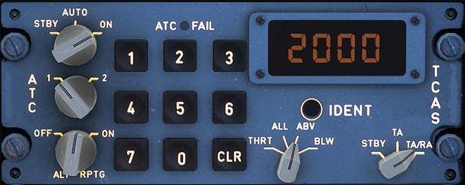
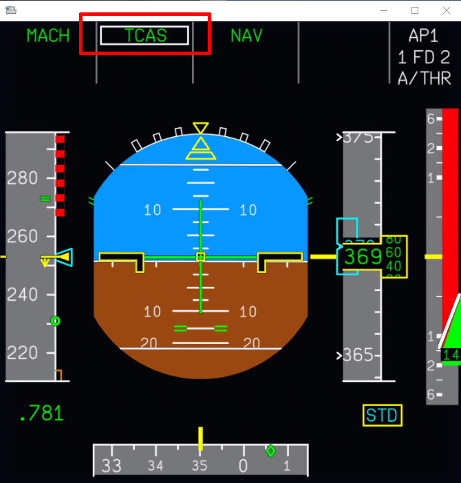
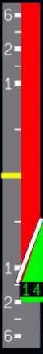
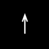
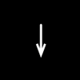
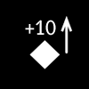

# Traffic Alert and Collision Avoidance System

{==

The initial implementation of TCAS features the AP/FD TCAS function and is available in the Development version.

Our TCAS supports online network traffic services (Vatsim / IVAO) and the live traffic feature in MSFS.

==}

## Overview

The Traffic Collision Avoidance System (TCAS) is a system available on Airbus aircraft that helps to reduce the risk of airborne collisions. Numerous improvements have been made to this system over the years that enhance the pilot interface and decrease non-optimal pilot handling of advisories from TCAS. The FlyByWire A32NX uses the AP/FD TCAS mode function developed by Airbus.

There are two typical procedures pilots will encounter when TCAS detects an intruder in the flight path of the aircraft.

- [Traffic Advisory (TA)](#traffic-advisory): Potential threats to monitor
- [Resolution Advisory (RA)](#resolution-advisory): Collision threats that require intervention

The TCAS panel can be found on the lower pedestal to the right of the throttle quadrant.

For more information on how to ensure TCAS is active for your flight and the corresponding controls please see the [ATC TCAS PANEL](../../a32nx-briefing/flight-deck/pedestal/atc-tcas.md) page.

## AP/FD TCAS

!!! warning "Manual Flight Assumptions"
    The operating flight crew should always be able to take command of the aircraft manually by disconnecting the autopilot and flight directors to respond to a TCAS RA by flying the aircraft at a vertical speed outside the red zone in the vertical speed indicator.

AP/FD TCAS includes vertical guidance as part of the Auto Flight System (AFS) to support pilots during a TCAS RA. It provides control of the vertical speed via the AFS which is specifically tailored to each target that generated an RA. 

Essentially this feature allows the flight crew to resolve TCAS RAs using the autopilot. It is also entirely possible to complete a TCAS RA maneuver manually by using the flight director guidance with the autopilot switched off as well. The major benefit of this system is to provide optimal maneuvers when a conflict arises.

### Traffic Advisory

This advisory is generated when TCAS detects an intruder along the current flight path it would consider a potential threat. Flight crews will receive multiple cues from TCAS that identifies a TA. No specific action is mandatory during a TA but the flight crew should remain vigilant of intruders and anticipate a potential RA. 

- Visual amber cues on the navigation display (ND providing information about the potential threat
- "*Traffic, Traffic*" aural warning

Once a TA is triggered the AP/FD TCAS will arm itself to notify the crew (alongside other visual cues noted above). This ensures that if the intruder would turn into a threat that would trigger an RA the system is ready to act.

### Resolution Advisory

When a traffic advisory becomes a collision threat an RA is generated. AP/FD TCAS shines in this regard allowing for fully automated flight in the case of an RA. Pilots will now have additional information provided to them on the primary flight display (PFD) and navigation display (ND) depending on what actions the flight crew needs to perform to clear the conflict.

- Visual red cues on the ND providing information about the potential threat
- Aural commands instructing the pilot of what type of vertical maneuver to perform
- Visual green and red zones on the vertical speed indicators on the PFD

!!! info "Additional Conditions with AP/FD TCAS"
    Please be aware that there are certain scenarios that happen during a TCAS RA that affects how flight crews should react depending on the conditions of the flight deck.

    === "AP + FD Engaged"
        Any vertical mode will revert to `TCAS` in the FMA and the autopilot will fly the TCAS maneuver

    === "AP Disengaged / FD Engaged"
        TCAS mode will be engaged and supercede the flight directory guidance. Flight crews should ensure they are centered on the pitch bar and bring the vertical speed of the aircraft into the green zone indicated on the vertical speed indicator on the PFD.

    === "AP + FD Disengaged"
        The FD bars will appear automatically. TCAS mode will be engaged and provide guidance and flight crews should perform actions as stated in above.

There are generally two types of behaviors associated with an RA - preventative and corrective

#### Preventative

This behavior starts with the vertical speed in the green zone of the VSI. It requires the flight crew or commands the autopilot to maintain the current vertical speed and is coupled with an audible alert such as "Monitor V/S". This would help increase the safety margin before any further measures would need to be taken and allow for safe capture of a selected flight level clear of any conflicts. The following conditions will apply:

- TCAS will maintain a safe V/S target
- Longitudinal modes previously armed will automatically be disarmed except ALT^*^
- In the situation that conditions for altitude capture are met a preventative RA will allow for safe capture of the targeted altitude
    - This prevents the aircraft from exceeding a commanded altitude in the FCU
- The audible alert "Adjust V/S" will play and TCAS will avoid conflicts by maintaining a safe vertical speed when attempting to level-off at a targeted altitude
- To ensure a safe speed during any maneuvers A/THR will engage SPEED/MACH

#### Corrective

This behavior starts with the vertical speed in the red zone of the VSI. As the behavior denotes this RA will require active corrective measure either automatically via the autopilot or manually from the flight crew to fly out of the red zone towards the edge of the green / red zone on the VSI. It is usually coupled with audible alerts such as "Climb, Descend".

- TCAS will engage and modify vertical guidance to avoid conflict. It will target the zone mentioned above
- Targets a V/S of 200ft/min inside the green band on the VSI
- Longitudinal modes previously armed will automatically be disarmed except ALT^*^
    - This prevents the aircraft from exceeding a commanded altitude / prevent excursions
    - A V/S of 0 ft/min is always within the safe zone for a corrective RA which allows for TCAS to capture a targeted flight level if capture conditions are met
- To ensure a safe speed during any maneuvers A/THR will engage SPEED/MACH

---

## Flight Instrument Indicators

### PFD during TCAS RA

!!! block ""
    {width=50% align=left}

    This image showcases an aircraft experiencing a TCAS RA during cruise to "descend". 

    There are two critical elements to pay attention to in this image:

    - The Flight Mode Annunciators (FMA) in the highlighted box
    - The Vertical speed indicator (VSI) to the right of the PFD.

As a conflict occurs and the AP/FD TCAS system kicks in typically you will see:

- TCAS in the FMA:
    - TCAS will be armed in cyan below the current vertical guidance mode. (Not Pictured).
    - A mode revision and TCAS will engage with a box around it. (Pictured).
    - TCAS in green after 10s.
- The aircraft will also target a safe vertical speed in the VSI as seen below.

!!! block ""
    {align=left}

    This is an example of the PFD's vertical speed indicator during a TCAS RA. It showcases a corrective measure to "descend" the aircraft to prevent a collision. These zones can also indicate a positive vertical speed change in the case of a corrective measure to "climb".

    There are two notable indiations in this example. 

    - Green Zone which indicates the proper and safe vertical speed during the TCAS maneuver.
    - Red Zone which indicates a forbidden vertical speed during the TCAS maneuver.

### ND Symbology

The following chart explains the various symbols displayed on the navigation display (ND) when TCAS detects potential threats (increasing in severity):

|                                            Symbol on ND                                             |     Type of Traffic      | Information                                                                 |
|:---------------------------------------------------------------------------------------------------:|:------------------------:|:----------------------------------------------------------------------------|
|       {width=75%}       |      Other Traffic       | Not a threat. Visible within the surveillance field.                     |
|       {width=75%}       |    Proximate Traffic     | Not a threat. Identified as a possible intruder within 6 NM and 1200 FT. |
|    {width=75%}    |  Traffic Advisory (TA)   | Possible threat.                                                            |
| {width=75%} | Resolution Advisory (RA) | Collision threat.                                                           |

This next chart includes additional symbology when traffic is seen on the ND.

|                                          Symbol                                           | Information                                                                                                                                      |
|:-----------------------------------------------------------------------------------------:|:-------------------------------------------------------------------------------------------------------------------------------------------------|
|  {width=75%}  | This arrow represents traffic that is climbing.                                                                                                  |
| {width=75%} | This arrow represents traffic that is descending.                                                                                                |
|  {width=75%}   | Complete picture of traffic on the ND. This example showcases Proximate Traffic that is 1000 ft above the aircraft and is currently climbing. |

---

## External Resources

Airbus' Safety First publication has great resources further explaining their systems in-depth with supporting graphics and statistics. We've provided a link below to a great article detailing TCAS Alert Prevention (TCAP) and the AP/FD TCAS function.

[Safe Handing of TCAS Alerts](https://safetyfirst.airbus.com/safe-handling-of-tcas-alerts/){.md-button primary target=new}

---

## TCAS Known Issues

- No support for offline AI traffic (sim limitation)
- No support of multiplayer (MSFS) traffic (sim limitation)
- Possible false detection of ground traffic
- Possible ghost TA / RA due to jumping traffic (*improvements and changes expected*)

!!! tip "A Quick Note on TCAS Performance"
    TCAS relative altitude is now based on plane altitude (true altitude) for both airplanes. This should work exactly as intended for MSFS airplanes relative to one another (though not as the IRL TCAS works). It can still be somewhat of an issue when on a network with non-MSFS airplanes.

    The reason for this is that MSFS is the only sim that should correctly compute the true altitude. Depending on the atmospheric conditions, an MSFS airplane flying in the same weather and with the same baro setting as a non-MSFS airplane may be at a different true altitude than the non-MSFS airplane. Said differently, each aircraft could be at the same altitude in their respective simulator, but TCAS would show them at different altitudes.

    {==

    This is not just a TCAS issue. It is an issue that VATSIM and all the other networks are struggling with so that ATC sees all airplanes, regardless of sim, at the right altitudes, at least relative to one another.

    ==}