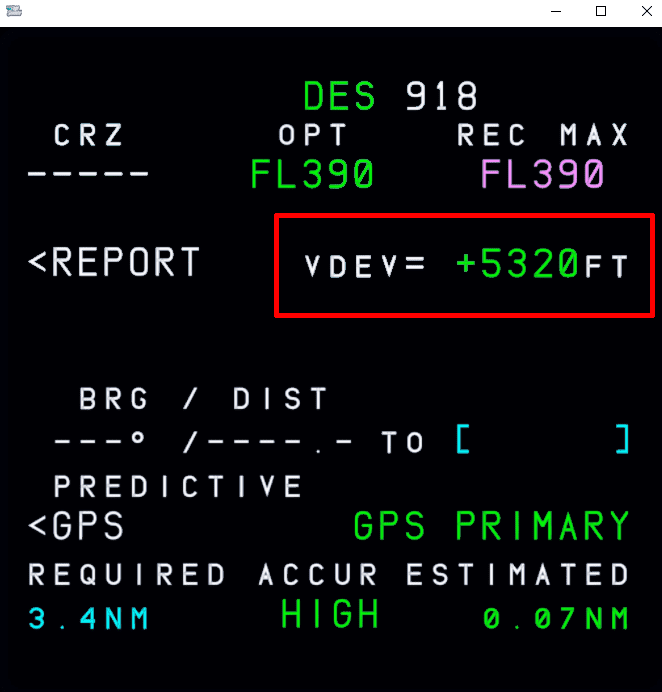

# Example Managed Flight

# Indications in Flight Instruments

This section will showcase a complete picture of the PFD and the ND during different flight phases to help pilots understand what might be seen when climbing or descending in managed modes. It will be based on the `SKAT1X` departure from RWY 07R at VHHH. Sample image:

{width=90%}

*Copyright © 2021 Navigraph / Jeppesen 
"Navigraph Charts are intended for flight simulation use only, not for navigational use."*

Specific details on the symbology associated with vertical guidance can be seen in the section below:

[Vertical Guidance Symbology](#vertical-guidance-symbology){.md-button}

##  Primary Flight Display Indications

## ^^Sample Pre-Flight^^

!!! block ""
{align=left width=50%}

    This is an example of the PFD after you have fully configured the aircraft for takeoff and are ready to taxi to the departure runway. It's important to take note of two items:
    
    1. `CLB` is armed in blue (for Managed Climb).
    - `5000` in Magenta denotes that the commanded altitude in the FCU is above a constraint set in the MCDU on the flight path. This means the aircraft will level off at 5000 ft.

## ^^Sample Takeoff^^

!!! block ""
{align=left width=50%}

    This example showcases the aircraft in a managed climb after taking off from the runway. You can still see `5000` in magenta at the top of the altitude indicator however the FMA has new information.

    The current mode is `CLB` but the aircraft has an `ALT` armed in magenta. This means that the aircraft is ready to level off at 5000 ft and will transition to `ALT CST*`.

!!! block ""
{align=left width=50%}

    As you reach 5000 ft again it's important to note two items:

    1. A mode revision to `ALT CST*` as you capture the altitude constraint set in the MCDU.
    2. `CLB` will be armed in blue indicating further climb is expected as set in your FCU.
    3. The altitude indicator will show the targeted altitude of 5000 ft in magenta.

## ^^Descent^^

!!! bug "TODO PFD Descent Example"

- V/DEV Indication
- Speed Range
- Target Alt (magnenta, blue)
- FMA (link to PFD briefing?)

## Navigation Display Indications

As a reminder the section [Vertical Guidance Symbology](#vertical-guidance-symbology) contains detailed descriptions of the various symbols you'll encounter when indicated on the flight instruments.

## ^^Departure^^

{width=60%}

The above image showcases a typical departure with constraints set at the first waypoint on the flight plan. The aircraft at this juncture has just taken off the runway and is climbing to a cleared altitude of 7000 ft. Following the direction of the aircraft's flight path as indicated on the ND we can note that at the waypoint `PORPA` we have a planned constraint *at or below* 5000 ft with a speed restriction of 205 kts.

There are also a few **pseudo waypoints** indicated on the ND indicating different changes to the flight profile as the aircraft continues along the flight plan.

- The first pseudo waypoint you encounter in magenta indicates the calculated point where the aircraft will level off at 5000 ft to meet the constraint at `PORPA`.
- At the waypoint `PORPA` there are a few different indicators described in more detail below. This is a result of information entered into the F-PLN page on the MCDU.
- The final pseudo waypoint displayed is a cyan arrow indicating the point where the FCU commanded altitude (in our case 7000 ft) will be reached.

---

!!! block ""
PORPA Waypoint Indicators

    {align=left width=30%}

    - The cyan arrow indicates that CLB is armed and the AP will continue climbing above 5000 ft at `PORPA`.
    - The solid magenta dot indicates the aircraft will increase speed at `PORPA` to 220 kts as indicated by the `SKAT1X` SID.
    - The magenta outer ring reaffirms there is a constraint at `PORPA` but additionally signifies the `ALT CSTR` will be met and the aircraft will cross *at or below* 5000 ft.

---

## ^^Climb^^

!!! block ""
{align=left width=50%}

    As we continue along the flight path and pass all speed restrictions again we can see a couple familiar indicators on the ND.

    - The solid magenta dot inidcating our aircraft will increase speed to 250 kts as we climb out of 7000 ft.
    - The cyan arrow indicating the point where the FCU commanded altitude (in our case FL170) will be reached.
        - **Note:** This pseudo waypoint can shift as various flight conditions affect climb performance.

## ^^Descent^^

!!! bug "TODO ND Descent Example"

## FMS (MCDU) PROG Page Indications

When the aircraft is descending you can take note of the vertical deviation against the predicted descent profile on the `PROG` page of the MCDU. Alongside other indicators on the PFD the `PROG` page provides a numerical value in feet.

{width=70%}

- V/DEV Indication

# Example Flight

!!! bug "TODO: take off - press button until TOD; watch Netflix; press button again, autoland"