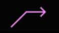

# Vertical Guidance Symbols

|                                       Pseudo Waypoint                                        | Definition                                                 | Conditions / Additional Info                                                                                                                                                       |
|:--------------------------------------------------------------------------------------------:|:-----------------------------------------------------------|------------------------------------------------------------------------------------------------------------------------------------------------------------------------------------|
|   {loading=lazy}    | Indicates *top of climb*                                   | The FCU selected altitude (cyan)                                                                                                                                                   |
|  {loading=lazy}  |                                                            | A constraint altitude (if all appropriate modes are engaged) (magenta)                                                                                                             |
|                                                                                              |                                                            | Will not appear if the aircraft is 100 ft above or below selected altitude                                                                                                         |
|  {loading=lazy}   | Indicates *level-off*                                      | The FCU selected altitude (cyan)                                                                                                                                                   |
| {loading=lazy} |                                                            | A constraint altitude (if all appropriate modes are engaged) (magenta)                                                                                                             |
|                                                                                              |                                                            | Will not appear if the aircraft is 100 ft above or below selected altitude                                                                                                         |
|                                                                                              |                                                            |                                                                                                                                                                                    |
|        {loading=lazy}         | Indicates *top of descent* or *continue descent*.          | Arrow is White if DES is not armed                                                                                                                                                 |
|         {loading=lazy}         |                                                            | Arrow is Blue if DES is armed                                                                                                                                                      |
|                                                                                              |                                                            |                                                                                                                                                                                    |
|    {loading=lazy}    | Indicates *start of climb*                                 | Arrow is White if CLB is not armed                                                                                                                                                 |
|    {loading=lazy}     |                                                            | Arrow is BLUE if CLB is armed                                                                                                                                                      |
|                                                                                              |                                                            |                                                                                                                                                                                    |
|     {loading=lazy}      | Indicates *intercept point*                                | Symbol is White if NAV mode is engaged                                                                                                                                             |
|      {loading=lazy}      |                                                            | Symbol is Blue, if DES mode is engaged                                                                                                                                             |
|                                                                                              |                                                            | Predictions assume half speedbrake if above the profile                                                                                                                            |
|                                                                                              |                                                            | If vertical deviation is detected while in DES / NAV mode, continuously indicates predicted point where aircraft will intercept the descent path                                   |
|                                                                                              |                                                            | If not in NAV, predictions assume immediate return to NAV path with 45° intercept                                                                                                  |
|                                                                                              |                                                            |                                                                                                                                                                                    |
|       {loading=lazy}       | Indicates a *speed change*                                 | Point on the flight plan where the aircraft will automatically accelerate or decelerate to a new computed speed                                                                    |
|                                                                                              |                                                            |                                                                                                                                                                                    |
|       {loading=lazy}        | Indicates *decelerate point*                               | Predicted point on the flight plan where aircraft is predicted to decelerate for approach (and change to approach phase). Symbol is White if in selected speed or HDG/TRK mode |
|      {loading=lazy}       |                                                            | Symbol is Magenta if managed speed and NAV / Approach mode are engaged                                                                                                             |
|                                                                                              |                                                            |                                                                                                                                                                                    |
|       {loading=lazy}       | Set around a waypoint and indicates a constrained waypoint | Symbol is Magenta indicates predicted `ALT CSTR` will be satisfied                                                                                                                 |
|        {loading=lazy}        |                                                            | Symbol is Amber indicates predicted `ALT CSTR` will be missed                                                                                                                      |
|        {loading=lazy}        |                                                            | Symbol is White indicates `ALT CSTR` is not applicable and NAV mode is engaged                                                                                                     |
|                                                                                              |                                                            |                                                                                                                                                                                    |
|       {loading=lazy}        | Indicates TIME MARKER or EQUI-TIME POINT (ETP)             | Symbol appears in Green indicating on the flight plan where the aircraft will reach the time marker or ETP                                                                         |
|                                                                                              |                                                            |                                                                                                                                                                                    |
|      {loading=lazy}       | Indicates the ENERGY CIRCLE symbol                         | Symbol is oriented to the current track line and centered on the aircraft position                                                                                                 |
|                       (Energy Circle not yet implemented in the A32NX)                       |                                                            | Indicates Required Distance to Land                                                                                                                                                |
|                                                                                              |                                                            | Displayed during descent and approach phase when selected HDG or TRK mode is engaged                                                                                               |

Also see our [Example Managed Flight](example.md) with several screenshots of the ND symbols during flight. 
