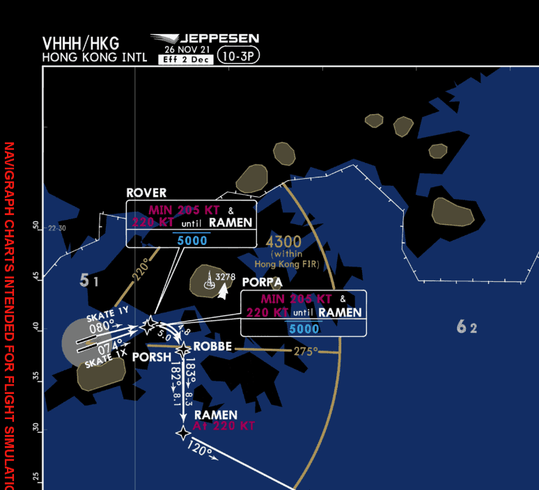
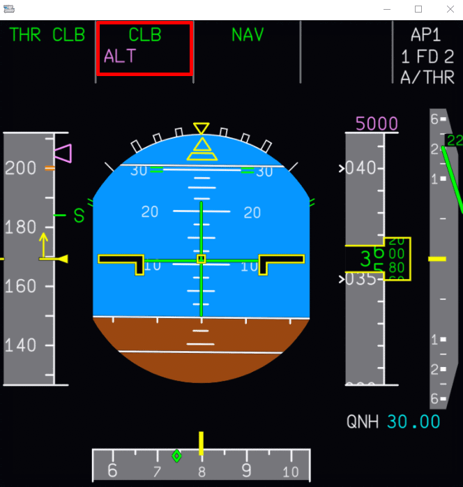
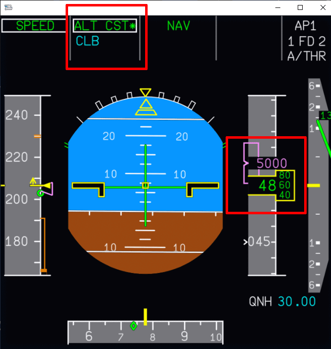
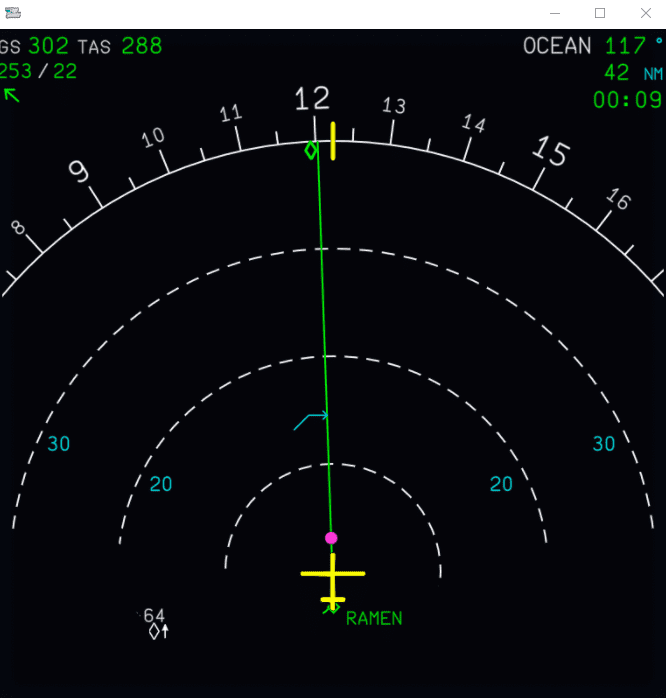

<link rel="stylesheet" href="/../../stylesheets/larger-admon-font.css">
<link rel="stylesheet" href="/../../stylesheets/toc-tables.css">

# Vertical Guidance

## Overview

Vertical guidance in the A320 is supporting the flight crew by providing guidance or automations for the vertical 
flight paths during a flight. This reduces the workload of the flight crew and allows for a nearly fully automated 
flight in combination with Lateral Guidance and Manged Speed.

Vertical guidance is available for TAKEOFF, CLIMB, CRUISE, DESCENT, and APPROACH phases of the flight plan. The flight 
planning capability lets the pilot enter published departure, arrival, and approach segments with individual pseudo
waypoints that include speed/altitude constraints. These constraints, as well as the entered cruise altitude and 
cost index, define the vertical profile.

Vertical guidance is managed by the Flight Management Guidance Systems (FMGS), in particular, the Flight Guidance 
Computer (FGC) which controls the Flight Directors (FD), the Autopilots (AP), and the Autothrust (A/THR).    

!!! warning "Real Life and Online ATC Considerations"
    It is the sole responsibility of the pilot to conduct proper flight planning and execution. It is not sufficient 
    to solely rely on the automatic aircraft guidance and indications. All indications and guidance need to be 
    reconfirmed by the flight crew with their own calculations.
 
    This is especially true for indications like the **Top of Descent** which typically does not account for likely 
    ATC interventions and often lead to late descents preventing ATC from issuing approach shortcuts and may even lead to 
    forced holds to lose altitude.

!!! warning "Disclaimer"
    The level of detail in this guide is meant to provide FlyByWire A32NX users the ability to adequately use the  
    vertical navigation features of the aircraft.

    As this is a vast and complicated topic this guide can't cover everything and additional sources and further 
    reading is recommended to master this topic.  

## Chapters

| Quick Links                                                             |
|:------------------------------------------------------------------------|
| [Vertical Modes](#vertical-modes)                                       |
| [Selected Vertical Modes](#selected-vertical-modes)                     |
| [Managed Vertical Modes](#managed-vertical-modes)                       |
| [Altitude Acquire Mode](#altitude-acquire-mode-alt)                     |
| [Altitude Hold Mode](#altitude-hold-mode-alt)                           |
| [TCAS Mode](#tcas-mode)                                                 |
| [Speed/Mach Control](#speedmach-control)                                |
| [Descent Strategies](#descent-strategies)                               |
| [Indications in Flight Instruments](#indications-in-flight-instruments) |

## Vertical Modes Overview 

Vertical guidance includes these modes:

| Guidance | MANAGED                   | SELECTED       |
|:---------|:--------------------------|:---------------|
| VERTICAL | SRS (TO and GA)           |                |
|          | CLB, DES                  | OP CLB, OP DES |
|          | ALT CST*, ALT CST         | ALT*, ALT      |
|          | ALT CRZ                   | EXPEDITE       |
|          | G/S*, G/S                 |                |
|          | FINAL, FINAL APP          |                |
|          | FLARE                     |                |

Find a detailed description of the modes in the sections below. 

Vertical guidance interacts closely with the autothrust system and the speed control modes selected in the FCU 
(managed vs. selected).

One of the main notable differences between Selected and Managed Vertical Guidance is that the managed mode accounts 
for altitude and speed constraints at waypoints and computes the vertical flight path accordingly. Selected mode on 
the other hand ignore any constraints from the flight plan.

## Selected Vertical Modes

Selected modes guide the aircraft according to target values that the pilot selects and the
FCU windows display.

Selected modes disregard all altitude constraints.

### OP CLB (Open Climb)
The OPEN CLB mode uses the AP/FD pitch mode to maintain a SPD/MACH (selected or managed) while the autothrust (if 
active) maintains maximum climb thrust.

When OPEN CLB is engaged, the target speed/Mach is maintained by adjusting the pitch with the
elevator, whereas thrust is maintained either by the A/THR, or manually by the flight crew. Speed
target may either be selected or managed.

The OPEN CLB mode disregards all altitude constraints up to the FCU selected altitude.

OPEN CLB mode can be engaged when:

- the aircraft has been in flight for more than 5 seconds
- LAND mode is not engaged
- the altitude selected in the FCU is higher than the present altitude

It is activated when:

- the flight crew pulls the FCU ALT knob
- guidance reverts to speed protection
- acceleration altitude is reached with CLB armed and lateral navigation (NAV) not engaged

### OP DES (Open Descent)
The OPEN DES mode maintains a SPD/MACH (selected or managed) with the AP/FD pitch mode while 
autothrust (if active) maintains IDLE thrust. It is not to be used for final approach.

When OPEN DES is engaged, pitch control maintains the target speed/Mach number, and autothrust
maintains idle thrust (or the flight crew maintains it manually). The speed target may be either
selected or managed.

The OPEN DES mode disregards all altitude constraints.

OP DES mode can be engaged when:

- the aircraft has been in flight for more than 5 seconds
- LAND mode is not engaged
- the altitude selected in the FCU is lower than the present altitude

It is activated when:
- the flight crew pulls the FCU ALT knob
- Selecting a manual speed when EXPEDITE mode is engaged.

### V/S and FPA (Vertical Speed and Flight Path Angle)
The V/S-FPA mode acquires and holds the vertical speed or the flight path angle displayed 
in the V/S-FPA window of the FCU. The HDG V/S-TRK FPA pb on the FCU allows the flight crew to select vertical speed 
or flight path angle to be used. 

The FMGC pitch mode guides the aircraft to the target V/S or FPA. The corresponding A/THR mode is SPEED or MACH. The 
FMA displays V/S (FPA).

{--

The V/S (FPA) guidance has priority over the speed guidance. If the selected target V/S or FPA is too high (relative 
to the current thrust condition and speed), the FMGC will steer the aircraft to the target V/S or FPA, but the 
aircraft will also accelerate or decelerate.

When the speed reaches its authorized limit, V/S or FPA automatically decreases to maintain the
minimum (or maximum) speed limit.

--}

V/S-FPA can be manually engaged when:

- the aircraft has been in flight for more than 5 seconds
- the AP or FD are activated when they have been off
- changing target altitude by >250ft when in ALT^*^ mode
- selecting a higher altitude when in any descent mode
- selecting a lower altitude when in any climb mode

It engages automatically when:
- no other vertical mode is engaged after 5 seconds after lift off
‐ loss of G/S* or G/S mode
‐ loss of FINAL mode
‐ loss of LOC* or LOC mode
‐ loss of NAV mode when DES mode is engaged
‐ loss of vertical flight path in DES mode
‐ TCAS mode disengagement.

To immediate level off the aircraft the flight crew can push the FCU V/S-FPA knob or set the V/S-FPA to 0.

Note: If AP is engaged while a V/S is selected with only FD ON, the V/S will synchronise on the
current aircraft V/S.

### EXP (Expedite)
Expedite mode is used in climb or descent to reach the desired altitude with the
maximum vertical gradient.

When the aircraft is in EXP CLB, the target speed is Green Dot, which is maintained with pitch control. If 
Autothrust is active it sets the thrust at CLB THRUST automatically.

When the aircraft is in EXP DES, the target speed is 340 kt or M 0.8 which is maintained with pitch control. 
If Autothrust is active it sets the thrust at IDLE automatically.

When EXPEDITE is engaged, the system disregards speed constraints (SPD CSTR), altitude constraints (ALT CSTR), and 
speed limits (SPD LIM).

EXPEDITE can be engaged when
‐ the aircraft has been in flight for more than 5 s
‐ managed speed is available.

It is engaged manually only when
‐ the FCU selected altitude is higher than present altitude, EXP CLB mode engages
‐ the FCU selected altitude is lower than present altitude, EXP DES mode engages

## Managed Vertical Modes
Managed modes guide the aircraft along the vertical profile according to the data the pilot inserts into the MCDU. 
Flight Management (in the Flight Management and Guidance Computer) computes the corresponding guidance targets.

Managed modes accounts for altitude constraints at waypoints and also for speed constraints at waypoints when speed 
is in managed mode.

### Takeoff SRS (Speed Reference System)
The SRS mode controls pitch at takeoff to steer the aircraft along a path in the vertical plan at a speed
defined by the SRS guidance law.

In SRS mode, the aircraft maintains a speed target equal to V2+10 kt in normal engine configuration. When the FMGS 
detects an engine failure, the speed target becomes the highest of V2 or current speed, limited by V2+15 kt.

The SRS mode engages automatically when the thrust levers are set to the TOGA or FLX/MCT detent (when a Flex 
takeoff temperature has been selected), if:

- V2 has been inserted in the MCDU PERF TAKEOFF page
- The slats are extended
- The aircraft has been on ground for at least 30 s.

The SRS mode disengages:
- Automatically, at the acceleration altitude (ACC ALT), or if ALT* or ALT CST* mode engages (above 400 ft RA)
- If the flight crew engages another vertical mode.
- If the flight crew selects a speed while in SRS mode: SRS reverts to OP CLB mode, and a triple-click aural 
warning is heard
- If the TCAS mode engages.

The SRS guidance law also includes:

- Attitude protection to reduce aircraft nose-up effect during takeoff (18 ° or 22.5 ° maximum in
case of windshear)
- Flight path angle protection that ensures a minimum vertical speed of 120 ft/min
- A speed protection limiting the target speed to V2+15 kt.

### CLB (Climb)
CLB mode guides the aircraft in a managed climb, at either a managed or a selected target speed, to an FCU selected
altitude, taking into account altitude constraints at waypoints. The system also considers speed constraints if the
target speed is managed.

The AP/FD pitch controls the speed or Mach number target and the A/THR is in thrust mode (CLB) corresponding to maximum 
climb thrust. The flight path may include several segments. The flight crew can arm the CLB mode during the takeoff, 
go-around, climb, and cruise phases and engage it during the climb and cruise phases.

The CLB mode can be armed under the following conditions:

- On ground or when in SRS mode
    - if no other vertical mode is activated
    - the acceleration altitude defined in the MCDU PERF TO or GA page is below the lowest altitude constraint and
      also below the altitude selected in the FCU
- In flight in climb or go-around phase
    - if lateral navigation (NAV) is engaged
    - if the altitude selected in the FCU is above the current altitude and the aircraft captures or flies an
      altitude constraint.

The CLB mode can be engaged when:

‐ the aircraft has been in flight for more than 5 seconds
- the altitude selected in the FCU is above the current altitude
- not in descent, approach, or go-around phase
- Lateral navigation (NAV) is engaged
- Not in G/S mode#

It is automatically engaged at acceleration altitude (ACC ALT) or when a waypoint with an altitude constraint is
passed while CLB mode was armed.

It can be manually engaged by pushing the FCU ALT knob while the CLB mode is not armed and the current altitude is
not at an altitude constraint.

- When CLB mode is engaged, the system arms ALT and displays the applicable target altitude on
  the ALT scale.
    - Magenta for another altitude constraint
    - Blue for a FCU selected altitude
- The guidance does **not** modify the target speed in order to satisfy an altitude constraint. Therefore, the
  constraint may not be met and may be predicted as missed
  ‐ When the aircraft levels off at the ALT CSTR, CLB mode arms automatically, then engages when the aircraft passes
  the constrained waypoint (if the FCU altitude is above the constraint altitude).

### DES (Descent)
The managed descent mode guides the aircraft along the FMS computed vertical flight path. The DES mode is preferred 
when conditions permit since it ensures the management of altitude constraints and reduces the operating cost when 
flying at ECON DES speed.

The DES mode is only available when the aircraft flies on the FMS lateral flight plan, i.e. when the aircraft uses 
the NAV horizontal guidance mode.

The FMGS computes the flight path backwards from the deceleration point up to the top of descent (T/D), with 
respect to the speed and altitude constraints at the deceleration point, the guidance begins the deceleration to 
V~APP~, to be reached at 1 000 ft above touchdown on the final descent path.

This computation starts with an idle power segment down to the first constraint followed by geometric 
segments between constraints until reaching the deceleration point. The FMGS accounts for wind and data from 
the vertical and lateral flight plan and bases its computations on the managed speed profile. Holding patterns are 
not considered.  

Each descent can have the following segments:

- Idle path segment:
    - Autothrust uses idle thrust while the AF/FD controls speed by adjusting the vertical trajectory (pitch)
- Geometric path segment:
    - AP/FD controls the required vertical path while autothrust controls speed.   
- Repressurization segment:
    - If required, this ensures a specific rate of pressurization for the cabin during descent. It is calculated 
      from the destination airport altitude and the selected cabin rate (default -350ft/min which can be modified)
      
    !!! warning "Repressurization segments are not yet implemented in the A32NX"

The DES mode can be engaged when:

- the altitude selected in the FCU os lower than the present altitude
- either MVA, LOC^*^, LOC are active
- takeoff, climb or go-around phase are not active
- vertical flight path is valid
- not in TO, G/S, LAND, FINAL or GA mode
- Either 
    - an ALT CSTR waypoint is sequenced (passed) and DES mode was armend (DES will activate automatically), or
    - pilot presses the ALT knob (ALT CST^*^, ATL CST may not be active), or
    - pilot presses the ALT knob when ALT^*^ or ALT is active and current altitude is not a constraint

During the descent, approach and landing the managed speed is equal to either:

- ECON DES speed or the descent speed manually entered in the PERF DES page of the FMS, or
- The speed constraint, speed limit, or
- The manoeuvring speed of the current aircraft configuration, or
- V~APP~.

Descent initiation is not started automatically in the Airbus A320.  To start the descent the flight crew sets the 
ATC cleared altitude in to the FCU and pushes the ALT knob. If the aircraft has not yet reached the top of descent 
point it will start descent immediately at a constant V/S until intercepting the cmputed descent path. If the 
aircraft is at or beyond the top of descent point it descents at idle thrust. 

After initiating the descent the aircraft shows a vertical deviation symbol (green dot) next to the altitude scale on the 
PFD so that the flight crew can monitor the aircraft's position relative to the descent path. 

When the speed is managed, a target speed range is displayed in the speed band on the PFD (magenta bars) which defines 
acceptable speed variations around the nominal descent speed target.

Associated with the VDEV displayed on PFD, the ND shows an intercept point (zigzag symbol) on the flight plan. It 
indicates the position where the system predicts that the aircraft will intercept the descent profile.

See all symbols below: [Vertical Guidance Symbology](#vertical-guidance-symbology).

### G/S, G/S*

!!! bug "TODO"

### FINAL / FINAL APP

!!! bug "TODO"

### FLARE

!!! bug "TODO"

## Altitude Acquire Mode (ALT*, ALT CST^*^)
ALT* mode guides the aircraft to acquire the FCU selected altitude.

ALT CST* guides the aircraft to acquire an altitude constraint provided by Flight Management. Once the aircraft has 
reached the altitude, the altitude mode (ALT or ALT CST) engages.

The mode engages when the aircraft reaches the altitude capture zone, defined by the aircraft vertical speed (among 
other parameters).

## Altitude Hold Mode (ALT, ALT CST, ALT CRZ)
The ALT mode maintains a target altitude. This target altitude is either the FCU selected altitude or an altitude 
constraint delivered by Flight Management.

The ALT mode arms automatically whenever the aircraft climbs or descends toward the target altitude.

When ALT is armed, the FMA displays the ALT message on its second line:

- Blue when the target altitude is the FCU selected altitude
- Magenta if the target altitude is an altitude constraint.

The ALT mode is engaged automatically when the difference between present altitude and the target altitude becomes 
less than 20 ft with ALT* engaged.

The altitude that ALT mode holds is the altitude it memorized when engaged. It is not affected by a change of 
reference in the ALT window or by a change in the barometric correction.

When ALT is engaged, the FMA displays ALT in green (FCU altitude hold), ALT CST in green if it is an altitude 
constraint, or ALT CRZ in green if cruise flight level is held.  

## TCAS Mode 
The TCAS mode is an Auto Flight System (AFS) guidance mode that provides vertical guidance in the case of a Traffic
Alert and Collision Avoidance System (TCAS) Resolution Advisory (RA). When a Traffic Advisory (TA) is triggered, the TCAS mode arms.

When a RA is triggered, the TCAS mode engages. The TCAS mode provides vertical guidance in accordance with the TCAS
RA order.

When clear of conflict (the “CLEAR OF CONFLICT” aural alert sounds), the TCAS mode disengages.

The AFS provides guidance toward the latest target altitude set on the FCU.

See or detailed guide for TCAS: [Traffic Alert and Collision Avoidance System](tcas.md)

## Speed/Mach Control
In flight, either the AP/FD pitch control, or autothrust may acquire and hold a target speed or Mach
number, depending on the engaged modes.

Speed control is:
‐ Managed when the target comes from the FMGS
‐ Selected when the target comes from the SPD/MACH FCU window.

### Managed Speed/Mach Target
Managed Speed/Mach target is engaged when:

- the SPD/MACH knob is pushed
- EXP mode engaged
- V2 is inserted into the MCDU PERF page
- SRS mode is engaged (SRS will not engage if V2 is not set in the MCDU PERF page)
- The TCAS mode is engaged.

Managed Speed/Mach disengages if a target speed is selected in the FCU by pulling the knob or if a preselected speed 
was configured in the MCDU PERF pages.

Managed speed accounts for all speed constraints in the flight plan when the lateral navigation NAV is enabled. 
Otherwise, any speed constraints are ignored. 

The speed profile when NAV is enabled is as follows: V2, SPD LIM, SPD CSTR (if applicable), ECON CLB SPD/MACH, ECON 
CRZ MACH, ECON or preset DES MACH/SPD, SPD LIM, SPD CSTR (if applicable), HOLD SPD (if applicable), V~APP~.

The speed profile when NAV is not enabled is as follows: V2, SPD LIM, ECON CLB SPD/MACH, ECON CRZ MACH, ECON or 
preset DES MACH/SPD, SPD LIM - V~APP~.

In managed mode the AP and FD pitch modes can control a target SPD/MACH or a vertical trajectory, and the A/THR
mode can control a fixed thrust or a target SPD/MACH. However, the AP/FD and the A/THR cannot
both control a target SPD/MACH simultaneously.

Therefore, the AP/FD pitch modes and A/THR mode are coordinated as follows:
‐ If an AP/FD pitch mode controls a vertical trajectory, the A/THR mode controls the target SPD/MACH.
‐ If an AP/FD pitch mode controls a target SPD or MACH, the A/THR mode controls the thrust.
‐ If no AP/FD pitch mode is engaged, the A/THR mode reverts to controlling the SPD/MACH mode.

| AP/FD Pitch Modes                               | A/THR Modes          |
|-------------------------------------------------|----------------------|
| V/S - FPA                                       | SPEED/MACH MODE      |
| DES (geometric path)                            | SPEED/MACH MODE      |
| ALT*, ALT, ALT CRZ*. ALT CRZ, ALT CST*, ALT CST | SPEED/MACH MODE      |
| G/S*, G/S                                       | SPEED/MACH MODE      |   
| FINAL. FINAL APP                                | SPEED/MACH MODE      |
| TCAS                                            | SPEED/MACH MODE      |
| FD/AP OFF                                       | SPEED/MACH MODE      |
| CLB/DES (idle path)                             | THR (CLB, IDLE) MODE |
| OP CLB/OP DES                                   | THR (CLB, IDLE) MODE |
| EXP CLB/EXP DES                                 | THR (CLB, IDLE) MODE |
| SRS                                             | THR (CLB, IDLE) MODE |
| FLARE                                           | RETARD (IDLE)        |

### Selected Speed/Mach Target
To use a selected Speed/Mach target, the flight crew uses the knob on the FCU to set the target speed, which is 
then displayed in the FCU window. It is also displayed in blue on the PFD speed scale.

Selected speed has priority over managed speed. The only automatic change-over from selected to managed speed 
target may occur at go-around mode engagement. In flight, if the situation calls for managed speed, both the PFD 
and the MCDU display a message proposing a manual change to managed speed (for example, SET MANAGED SPEED, SET HOLD 
SPEED, or SET GREEN DOT SPEED).

The selected Speed/Mach target mode activates when:

- the SPD/MACH knob is pulled
- both AP/FDs are off
- the next phase has a preselected speed configured in the corresponding MCDU PERF page
- the flight management target is lost or the FMGC is powered up during flight

## Vertical Guidance Symbology

|      Pseudo Waypoint      | Definition                                                     | Conditions / Additional Info                                                                                                               |
|:-------------------------:|:---------------------------------------------------------------|--------------------------------------------------------------------------------------------------------------------------------------------|
| Images here - Placeholder | Indicates *top of climb* or *level-off* under with conditions. | The FCU selected altitude                                                                                                                  |
|                           |                                                                | A constraint altitude (if all appropriate modes are engaged)                                                                               |
|                           |                                                                | Will not appear if the aircraft is 100 ft above or below selected altitude                                                                 |
|                           |                                                                |                                                                                                                                            |
|            TOD            | Indicates *top of descent* or *continue descent*.              | Arrow is White if DES is not armed                                                                                                         |
|                           |                                                                | Arrow is Blue if DES is armed                                                                                                              |
|                           |                                                                |                                                                                                                                            |
|        start Climb        | Indicates start of `CLIMB`                                     | Arrow is White if CLB is not armed                                                                                                         |
|                           |                                                                | Arrow is BLUE if CLB is armed                                                                                                              |
|                           |                                                                |                                                                                                                                            |
|         Squiggle          | Indicates intercept point                                      | Symbol is White if NAV mode is engaged                                                                                                     |
|                           |                                                                | Symbol is Blue, if DES mode is engaged                                                                                                     |
|                           |                                                                | If vertical deviation is detected while in DES mode, continuously indicates predicted point where aircraft will intercept the descent path |
|                           |                                                                |                                                                                                                                            |
|        magenta dot        | Indicates the speed change symbol (magenta)                    | Point on the flight plan where the aircraft with automatically accelerate or decelerate to a new computed speed                            |

## Descent Strategies

### Decelerated Approach (without CDA)

ILLUSTRATION
Source: 

### Continuous Descent Approach (CDA)

ILLUSTRATION

## Indications in Flight Instruments

This section will showcase a complete picture of the PFD and the ND during different flight phases to help pilots understand what might be seen when climbing or descending in managed modes. It will be based on the `SKAT1X` departure from RWY 07R at VHHH. Sample image:

{width=90%}

*Copyright © 2021 Navigraph / Jeppesen 
"Navigraph Charts are intended for flight simulation use only, not for navigational use."*

Specific details on the symbology associated with vertical guidance can be seen in the section below:

<!-- add this section later in table format -->
[Vertical Guidance Symbology](#vertical-guidance-symbology){.md-button}

###  Primary Flight Display Indications

#### ^^Sample Pre-Flight^^

!!! block ""
    {align=left width=50%} 

    This is an example of the PFD after you have fully configured the aircraft for takeoff and are ready to taxi to the departure runway. It's important to take note of two items:

    1. `CLB` is armed in blue (for Managed Climb).
    - `5000` in Magenta denotes that the commanded altitude in the FCU is above a constraint set in the MCDU on the flight path. This means the aircraft will level off at 5000 ft.

#### ^^Sample Takeoff^^

!!! block ""
    {align=left width=50%}

    This example showcases the aircraft in a managed climb after taking off from the runway. You can still see `5000` in magenta at the top of the alitude indicator however the FMA has new information.

    The current mode is `CLB` but the aircraft has an `ALT` armed in magenta. This means that the aircraft is ready to level off at 5000 ft and will transition to `ALT CST*`.

!!! block ""
    {align=left width=50%}

    As you reach 5000 ft again it's important to note two items:

    1. A mode revision to `ALT CST*` as you capture the altitude constraint set in the MCDU.
    2. `CLB` will be armed in blue indicating further climb is expected as set in your FCU.
    3. The altitude indicator will show the targeted altitude of 5000 ft in magenta.

#### ^^Descent^^

**WIP**

- V/DEV Indication
- Speed Range 
- Target Alt (magnenta, blue) 
- FMA (link to PFD briefing?)

### Navigation Display Indications

As a reminder the section [Veritcal Guidance Symbology](#vertical-guidance-symbology) contains detailed descriptions of the various symbols you'll encounter when indicated on the flight instruments.

#### ^^Departure^^

{width=60%}

The above image showcases a typical departure with constraints set at the first waypoint on the flight plan. The aircraft at this juncture has just taken off the runway and is climbing to a cleared altitude of 7000 ft. Following the direction of the aircraft's flight path as indicated on the ND we can note that at the waypoint `PORPA` we have a planned constraint *at or below* 5000 ft with a speed restriction of 205 kts. 

There are also a few **pseudo waypoints** indicated on the ND indicating different changes to the flight profile as the aircraft continues along the flight plan.

- The first pseudo waypoint you encounter in magenta indicates the calculated point where the aircraft will level off at 5000 ft to meet the constraint at `PORPA`.
- At the waypoint `PORPA` there are a few different indicators described in more detail below. This is a result of information entered into the F-PLN page on the MCDU. 
- The final pseudo waypoint displayed is a cyan arrow indicating the point where the FCU commanded altitude (in our case 7000 ft) will be reached.

---

!!! block ""
    PORPA Waypoint Indicators

    {align=left width=30%}

    - The cyan arrow indicates that CLB is armed and the AP will continue climbing above 5000 ft at `PORPA`.
    - The solid magenta dot indicates the aircraft will increase speed at `PORPA` to 220 kts as indicated by the `SKAT1X` SID.
    - The magenta outer ring reaffirms there is a constraint at `PORPA` but additionally signifies the `ALT CSTR` will be met and the aircraft will cross *at or below* 5000 ft.

---

#### ^^Climb^^

!!! block ""
    {align=left width=50%}

    As we continue along the flight path and pass all speed restrictions again we can see a couple familiar indicators on the ND.

    - The solid magenta dot inidcating our aircraft will increase speed to 250 kts as we climb out of 7000 ft.
    - The cyan arrow indicating the point where the FCU commanded altitude (in our case FL170) will be reached.
        - **Note:** This pseudo waypoint can shift as various flight conditions affect climb performance.

#### ^^Descent^^

**WIP**

### FMS (MCDU) PROG Page Indications

When the aircraft is descending you can take note of the vertical deviation against the predicted descent profile on the `PROG` page of the MCDU. Alongside other indicators on the PFD the `PROG` page provides a numerical value in feet.

{width=70%}

- V/DEV Indication

## Example Flight

>> take off - press button until TOD; watch Netflix; press button again, autoland <<