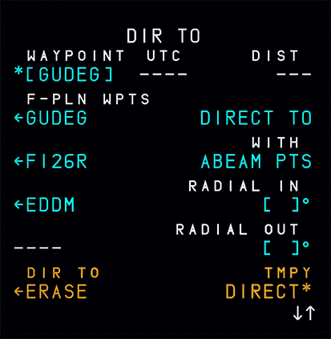
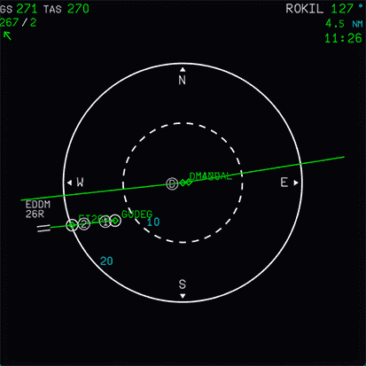

# Discontinuities

## What are Discontinuities?

The flight plan might contain so called discontinuities. These are breaks in the flight plan and often separate two flight plan sections like the SID and first in-route waypoint or the STAR and the APPR. They are also often inserted when the flight plan is modified.

There are basically two types of discontinuities:

- Discontinuities between two waypoints in the flight plan
- Discontinuities after a MANUAL leg (Manual Termination)

## Discontinuities Between Waypoints

These discontinuities can and should be cleared from the flight plan by using the CLR key on the MCDU and selecting the LSK left of the discontinuity.

!!! info "Normal Discontinuity in the MCDU F-PLN Page"
     

If the discontinuity is not deleted and the aircraft overflies the waypoint before the discontinuity, the NAV mode automatically reverts to the HDG (TRK) mode. The pilot then needs to use DIR TO to fly to the next waypoint.

## Discontinuities After MANUAL Leg

Sometimes discontinuities are also part of a procedure to indicate that manual guidance is required (mostly directed by ATC). The preceding legs are called MANUAL legs (Manual Termination leg).

A MANUAL leg stays on a constant TRK or HDG and has no termination point.

The core principle of a MANUAL leg is that air traffic control (ATC)  will give the flight crew headings (vectors) or a direct-to instruction to guide the aircraft to the planned approach path.

If no ATC is available (or when using MSFS ATC) the user must use heading mode (Selected HDG) or direct to (DIR TO) to guide the aircraft to an appropriate intercept course for the approach.

!!! info "Discontinuities after MANUAL legs cannot be cleared from the flight plan."
    {width=45% loading=lazy}

!!! info "DIR TO to next waypoint or Selected HDG"
    {align=left width=45% loading=lazy}
    {align=right width=45% loading=lazy}

If the aircraft is flying into a MANUAL leg, NAV mode remains engaged and predictions assume that the aircraft will fly a direct leg from its present position to the next waypoint.

### Illustrations for MANUAL Legs

!!! info "Conceptual principle of a MANUAL leg"
    {loading=lazy}

!!! info "Example chart with Manual leg"
    {loading=lazy}
    {loading=lazy}
    *Copyright © 2021 Navigraph / Jeppesen 
    "Navigraph Charts are intended for flight simulation use only, not for navigational use."*

!!! info "Manual leg in ND Plan Mode and in ARC Mode""
    {align=left width=45% loading=lazy}
    {align=right width=45% loading=lazy}

