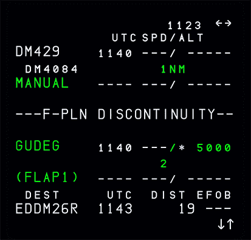
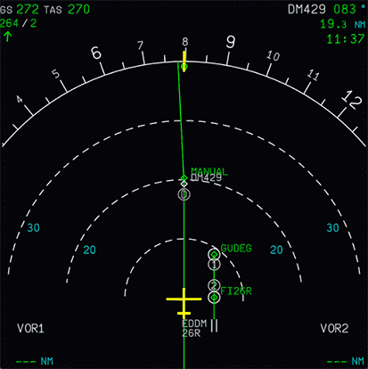

---
search:
    boost: 2
---

# Discontinuities

## What are Discontinuities?

Discontinuities are breaks in the flight plan and often separate two flight plan sections, like the SID and first in-route waypoint or the STAR and the APPR. They are also often inserted when the flight plan is modified.

There are basically two types of discontinuities:

- Discontinuities between two waypoints in the flight plan
- Discontinuities after a MANUAL leg (Manual Termination)

## Discontinuities Between Waypoints

!!! warning ""
    Based on the [special cases](#special-cases) below these discontinuities **should not** be cleared from the flight plan in normal operations.

Typically, you will notice a discontinuity in the following instances:

- Between the SID and the rest of your route.
- Between the STAR and the selected approach.

!!! tip ""
    Approaches that are radar vectored without a MANUAL will also have a discontinuity by design. Please be aware of these approaches and follow the principles outlined 
    further below.

Ideally, the NAV mode automatically reverts to the HDG (TRK) mode and pilots should follow ATC guidance (if on network) or use the DIR TO function to proceed to the next 
waypoint on your flight plan.

[Learn How to Use Direct Feature](direct.md){.md-button}

!!! info "Normal Discontinuity in the MCDU F-PLN Page"
     

### Discontinuity After Deleting Waypoints

If you delete a waypoint manually, a discontinuity will be inserted instead. This discontinuity can be deleted to connect the route back together.

## Discontinuities After MANUAL Leg

Sometimes discontinuities are also part of a procedure to indicate that manual guidance is required (mostly directed by ATC). The preceding legs are called MANUAL legs (Manual Termination leg).

A MANUAL leg stays on a constant TRK or HDG and has no termination point.

The core principle of a MANUAL leg is that air traffic control (ATC) will give the flight crew headings (vectors) or a direct-to instruction to guide the aircraft to the planned approach path.

If no ATC is available (or when using MSFS ATC) the user must use heading mode (Selected HDG) or direct to (DIR TO) to guide the aircraft to an appropriate intercept course for the approach.

[Learn How to Use Direct Feature](direct.md){.md-button}

!!! info "Discontinuities after MANUAL legs cannot be cleared from the flight plan."
    {width=45% loading=lazy}

!!! info "DIR TO to next waypoint or Selected HDG"
    !!! block ""
        {width=47% loading=lazy}
        {width=48% loading=lazy}

If the aircraft is flying into a MANUAL leg, NAV mode remains engaged and predictions assume that the aircraft will fly a direct leg from its present position to the next waypoint.

### Illustrations for MANUAL Legs

!!! info "Conceptual principle of a MANUAL leg"
    {loading=lazy}

!!! info "Example chart with Manual leg"
    {loading=lazy}
    {loading=lazy}
    *Copyright © 2021 Navigraph / Jeppesen 
    "Navigraph Charts are intended for flight simulation use only, not for navigational use."*

!!! info "Manual leg in ND Plan Mode and in ARC Mode"
    !!! block ""
        {width=48% loading=lazy}
        {width=48% loading=lazy}
    !!! warning "MANUAL label to be removed!"
        The MANUAL label on the ND will be removed in a future version, as it is not displayed in the real aircraft.

## Special Cases

!!! warning "SID and En-route F-PLN Discontinuity"
    **In most cases**, a discontinuity between the SID and your route is something that doesn't happen in real life.
    
    In these rare exceptions, it would be okay to CLR the discontinuity - 
    **provided you fully understand your routing and can identify that it would not cause any en-route issues**.

    !!! danger ""
        There are some important reasons why you shouldn't normally clear a discontinuity:

        - Narrow turn radii between the two waypoints, where the discontinuity is present, which could not realistically be flown by the plane
        - Different [leg types](leg-types.md), which are not compatible to be connected together

    Even if the waypoints form a direct line, it's not completely safe to remove a discontinuity unless you understand the above points.
