# Fix Info

## Overview

The MCDU FIX INFO pages are used to create waypoint intersections of the
flight plan with radial, radius, and abeam intercept points associated
with a waypoint.

These lines or circles are displayed on the ND and also used to compute intercept waypoints which are then added to the active flight plan.

The A32NX has implemented the display of these lines and circles on the ND.

!!! warning ""
    The computed intercept waypoints and ABEAM functionality are not yet implemented. This page will be updated as soon as these features are implemented.

## Use Cases

Fix info is a powerful supplemental tool for pilots to improve situational awareness and easier, more precise navigation.

### Common Use Cases

- Top of descent circle, to display the exact point on the lateral path when to start a descent into a specific fix.
- ILS localizer extension line, to easier identify where the localizer beam should be in extension from the runway.
- VOR intercepting.
- Go Around procedure aid.

### Examples of FIX INFO Intercept Waypoints

In the example below we assume a flight plan route passing WP1, WP2 and WP3 with the flight route shown as a line.

A reference fix (REF FIX) named EGKK is used to show the three different methods of creating intercept waypoints.

- Radial:
    - A Radial is a line from the REF FIX at a specific angle as known from common VOR navigation.
- Radius:
    - A Radius is a circle of a certain radius around the REF FIX.
- Abeam:
    - An Abeam is a line from the REF FIX onto the flight path meeting the flight path at a 90° angle.

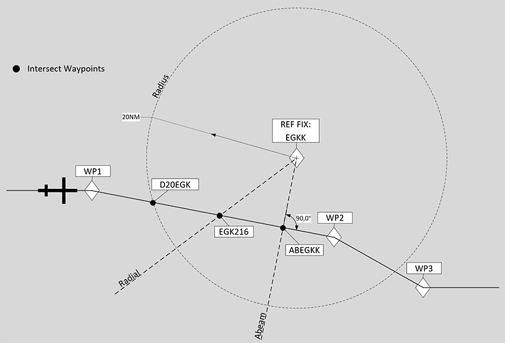

After entering a radial, radius or abeam the FMS calculates if an intersection with the flight path is possible and provides the option to create a waypoint into the flight plan.

!!! warning ""
    Be aware this is not implemented in the current version of the A32NX yet.

These waypoints will be named systematically with the type of interception and the REF FIX name.

In our example we get three different intercept waypoints which can be added to the flight plan.

- D20EGK:
    - Radius intercept waypoint at the intersection of a circle with radius 20 around the REF FIX EGKK with the current flight path.
- EGK216:
    - Radial intercept waypoint at the intersection of a radial line from the REF FIX EGKK at a 240° angle.
- ABEGKK:
    - Abeam intercept waypoint at the intersection of the perpendicular line from the REF FIX EGKK onto the flight plan.

## Step by Step Guide

### 1) Where is the FIX INFO page?

You will find the option to select the FIX INFO page on the top most waypoint of your active flight plan.

For this go to the MCDU F-PLN page and select the top most waypoint with the left LSK (line select key).

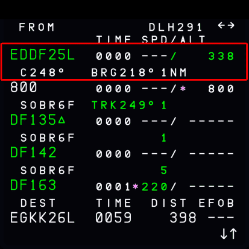{loading=lazy}

This brings up the lateral revision page for this waypoint and also displays the FIX INFO page option. Press the right LSK next to `FIX INFO`

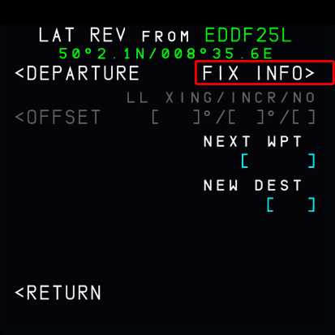{loading=lazy}

### 2) Enter a Navigation Fix

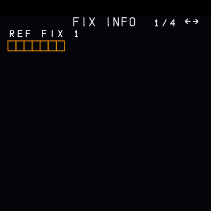{loading=lazy}

### 3) Enter Radial or Radius

{loading=lazy}

With radius 63NM around the waypoint ABTUM:

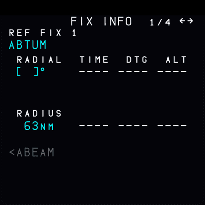{loading=lazy}

### 4) Additional Fix Info Pages

You can define up to 4 different fixes by selecting the horizontal slew navigation button to go to the next page.

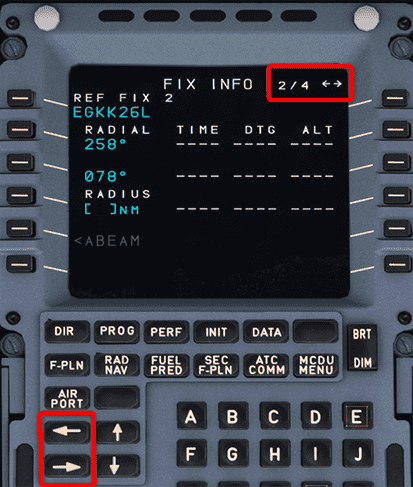{loading=lazy}

## Examples

### Top of Descent Circle

FL340 with arrival TEBRA2G into Gatwick EGKK.

A descent is required at 63NM before ABTUM as calculated by the flyPad Top of Descent calculator.

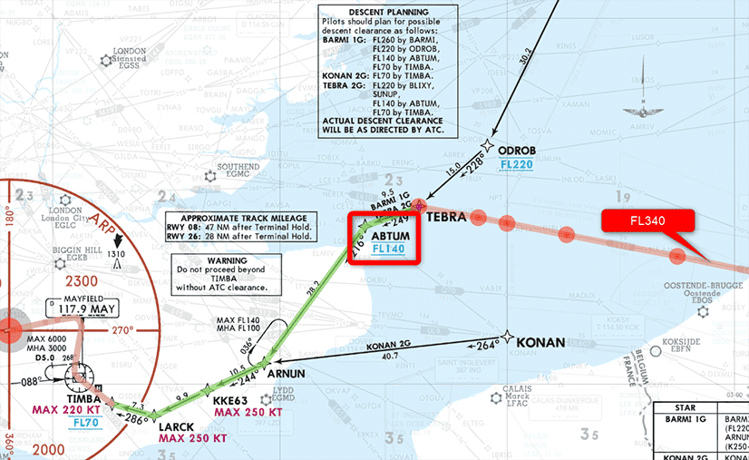{loading=lazy}
 *Copyright © 2021 Navigraph / Jeppesen 
"Navigraph Charts are intended for flight simulation use only, not for navigational use."*

!!! block ""
    {loading=lazy width=48%}
    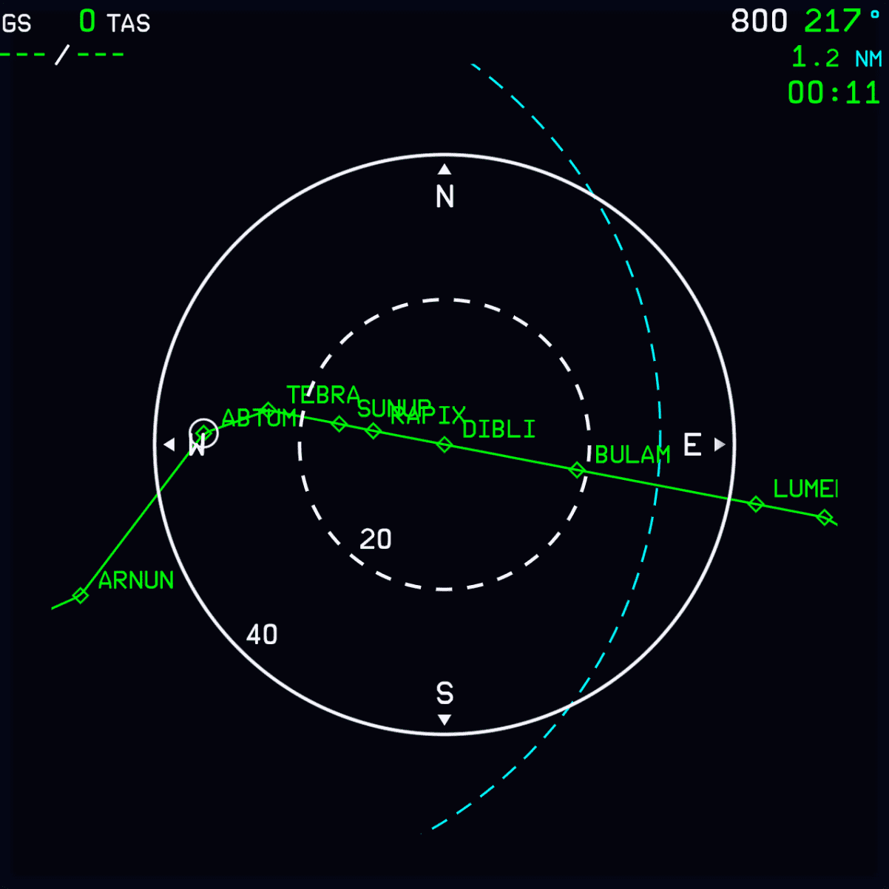{loading=lazy width=48%}

### ILS Localizer Extension Line

To visualize the ILS localizer for the approach the runway fix can be used to display a radial line corresponding to the ILS track course.

!!! block ""
    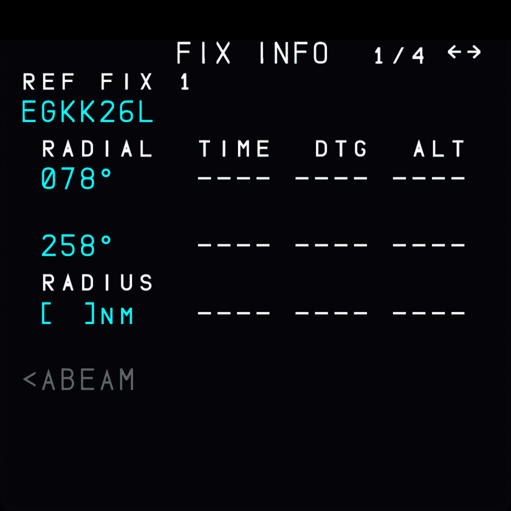{loading=lazy width=48%}
    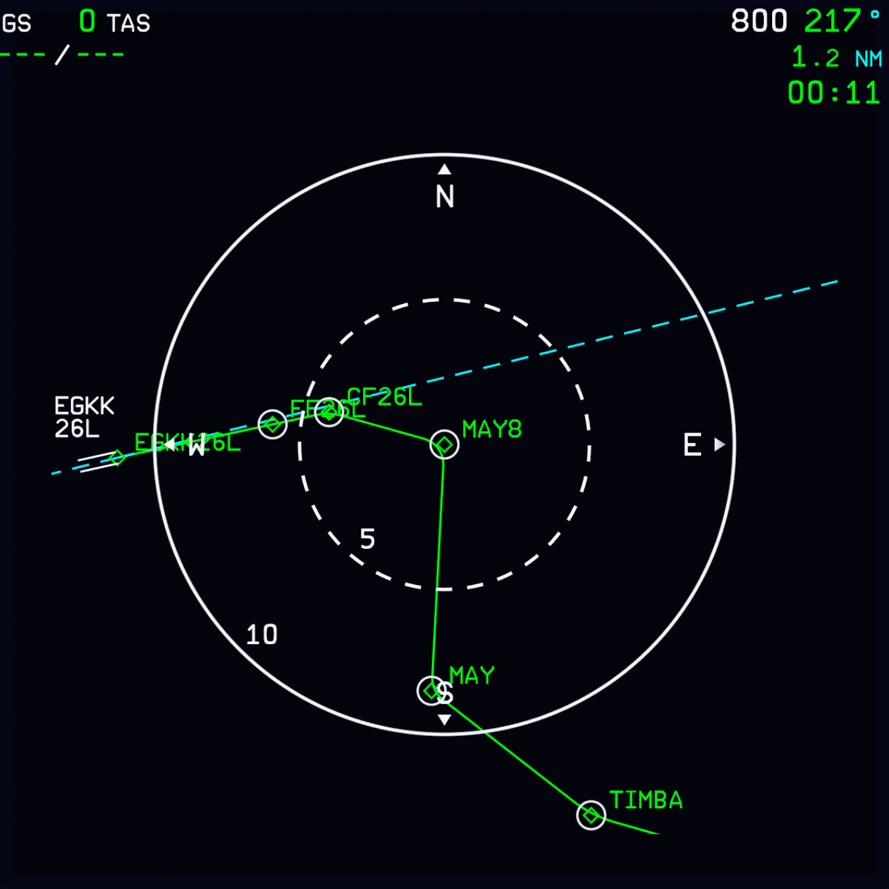{loading=lazy width=48%}

### VOR Intercept in SID

In this scenario we have a departure on 36R in KMCO (Orlando) with the ORLANDO 4 DEPARTURE SID (ORLA4). This departure expects ATC to assign headings after departure to intercept the filed/assigned route.

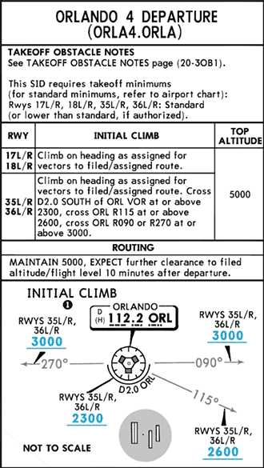
 *Copyright © 2021 Navigraph / Jeppesen 
"Navigraph Charts are intended for flight simulation use only, not for navigational use."*

As you can read in the Initial Climb description for 36R we need to meet certain altitudes at different positions in relation to the ORL VOR.

- Cross ORL D2.0 south of ORL at or above 2.300ft
- Cross ORL R115 at or above 2.600ft
- Cross ORL R090/R270 at or above 3.000ft

To visualize these points we can use the fix info page to define a 2NM distance circle and 2 lines for R155 and R090/270 on the ND.

!!! block ""
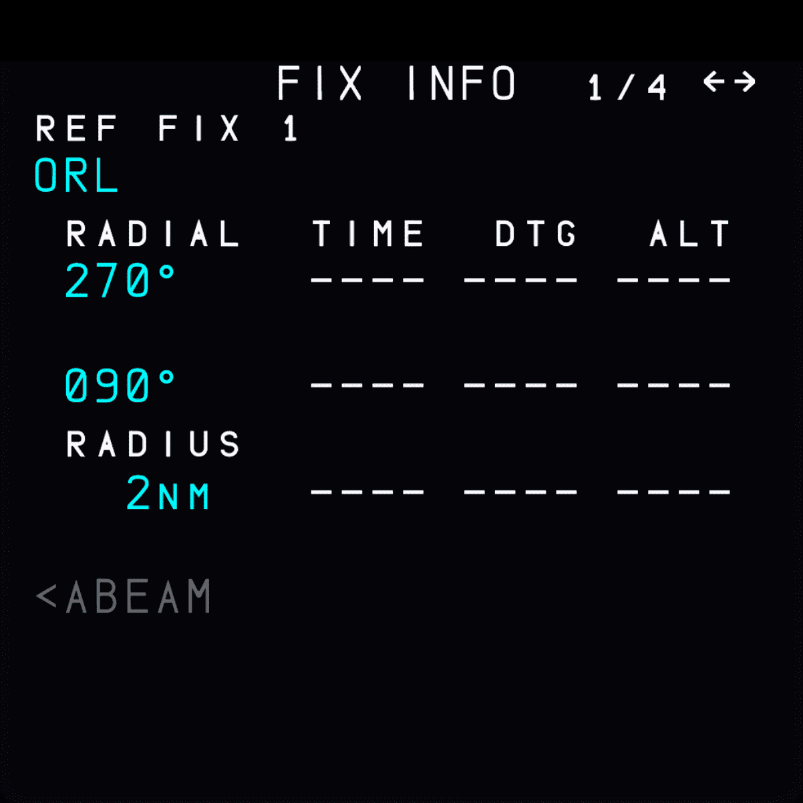{loading=lazy width=48%}
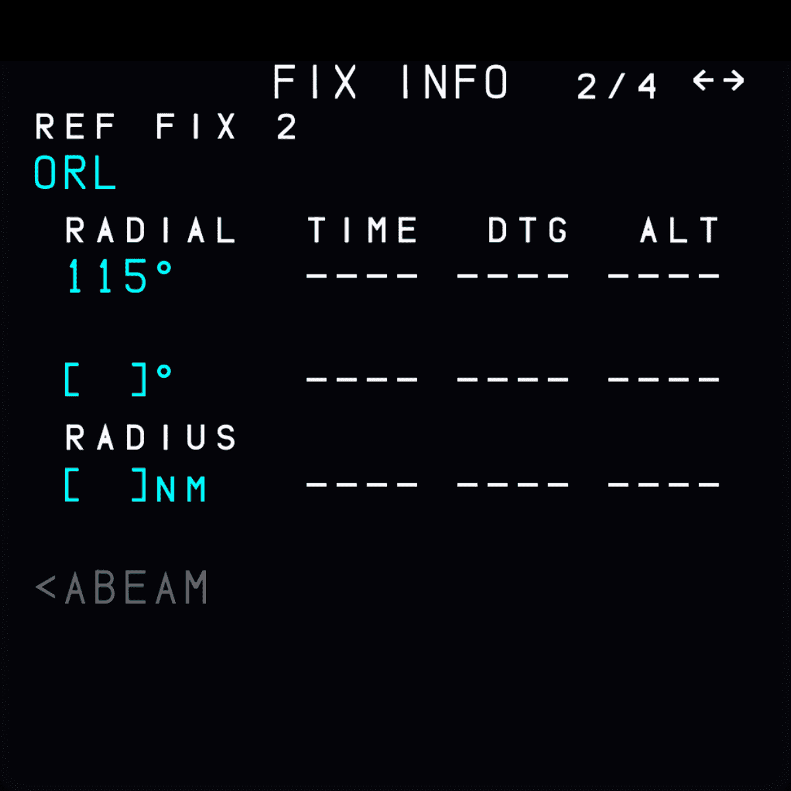{loading=lazy width=48%}

!!! block ""
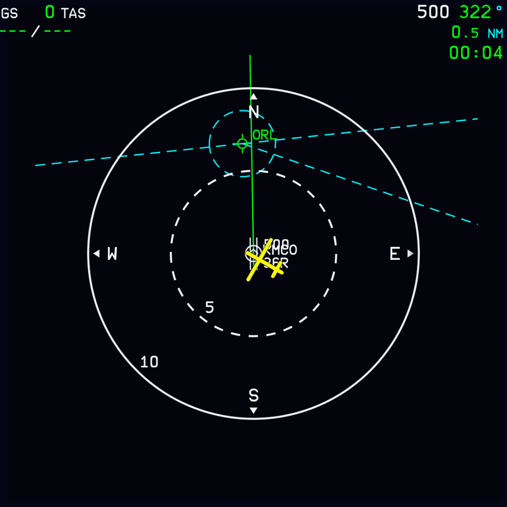{loading=lazy width=48%}
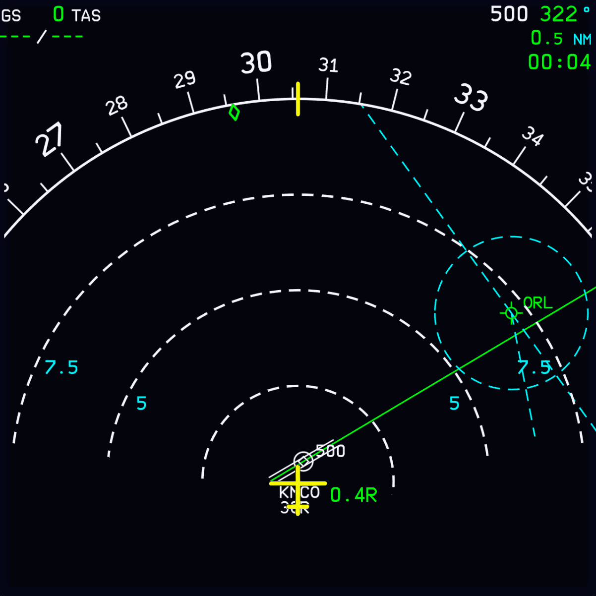{loading=lazy width=48%}

## 320 Sim Pilot Video

<iframe width="790" height="447" src="https://www.youtube-nocookie.com/embed/dHZZ2ukxU9Y" title="YouTube video player" frameborder="0" allow="accelerometer; autoplay; clipboard-write; encrypted-media; gyroscope; picture-in-picture" allowfullscreen></iframe>

