# Holds

!!! warning "Not available in the Stable Version"

## Overview

Holding patterns, as they are officially known, can be used as a delaying tactic for airborne aircraft. Typically holding patterns have a racetrack pattern that can easily be spotted on flight trackers. All holds are made up out of segments, the segments are shown in the figure below. 

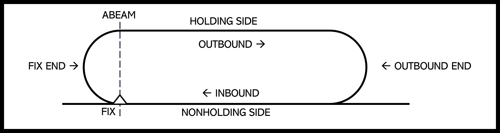

### Why Hold?
Holds are always used to delay aircraft near a navigational fix in certain airspace. There are a lot of reasons airplanes might need to hold, some more common examples are:

- Bad weather passing over the airport
- Traffic
- To lose energy in the plane (altitude or speed)
- To burn of fuel

Sometimes holds are used because of topographical constraints, Innsbruck-Kranebitten International Airport (LOWI) is a good example of such constraint because is situated in a vally as can be seen in the picture below.

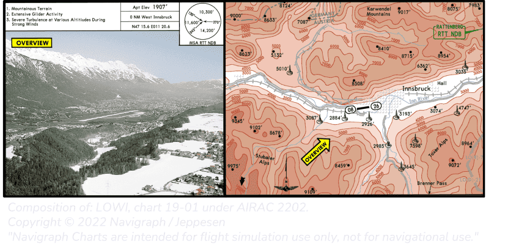

### Preparing the hold
Aircraft can technically hold at any waypoint, if given permission by ATC in advance. Holds that are published on aviation charts are called published holds. For the purpose of this guide we will only take a published hold into consideration. Holds can be spotted on charts in 2 ways where both options can be applied on the same chart. For example look at the chart below. 

Waypoints with published holds can be spotted by a racetrack pattern or a white H in a black box drawn in a chart. Holds displayed by the white H in the black box will always be accompanied by a visual racetrack patern in a diagram on the side of the chart. 

Now that you know where to hold, you should know how to set up the hold. To do this you will need to find information on the chart and move it into the FMS. The main information you need to have is:

1. Name of the fix/waypoint
2. Inbound course
3. Turning direction
4. Length of the legs, eather in time or distance*
5. Maximum airspeed*

*There are standards for length of legs and airspeeds that have to be respected if no other information is present on the chart. The standards are published in [Hold Standards](##Hold-Standards).

 
 The inbound course/heading or the reciprocal of the hold is always depicted on the chart.

 Below you will find samples of different holds with red dots placed where the information is located.  

!!! info "Example charts to aquire hold information"

    === "1"

        Lorum ipsum

        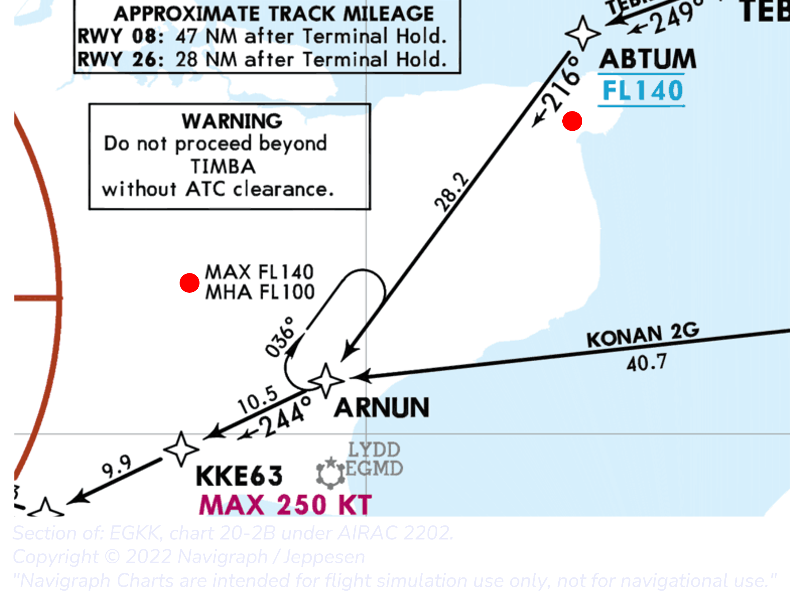

        | Fix           | Inbound course   |Turning direction   |Leg distance   |Max speed   |Max alt|Min Alt (MHA)  |
        | -----------   | -----------      |-----------         |  -----------  | --------   | ---   |-----          |
        | ARNUM         | 216°              |Right               | STD           | STD        |FL140  | FL100         |
      

        

    === "2"

        Lorum ipsum

        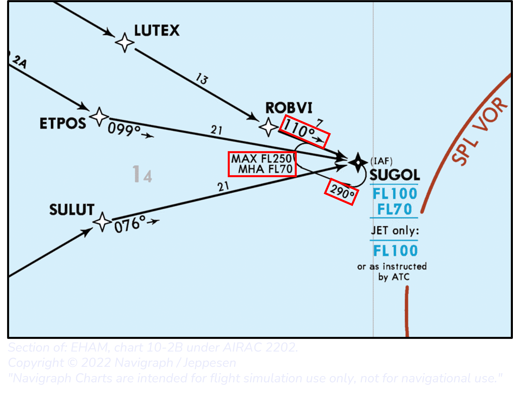

        | Fix           | Inbound course   |Turning direction   |Leg distance   |Max speed   |Max alt|Min Alt (MHA)  |
        | -----------   | -----------      |-----------         |  -----------  | --------   | ---   |-----          |
        | SUGOL         | 110°              |Right               | STD           | STD        |FL250  | FL70          |
        
    === "3"

        Lorum ipsum

        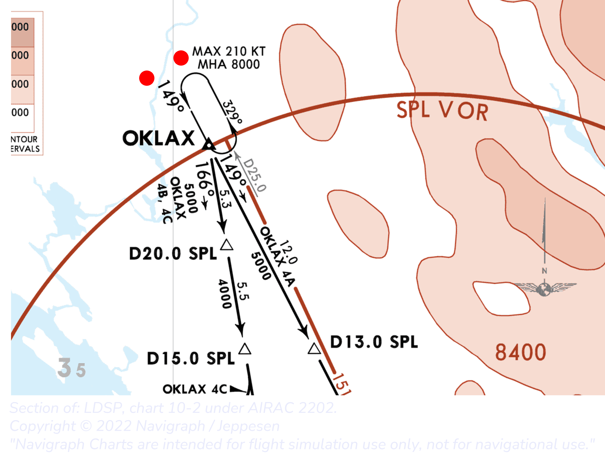

        | Fix           | Inbound course   |Turning direction   |Leg distance   |Max speed   |Max alt|Min Alt (MHA)  |
        | -----------   | -----------      |-----------         |  -----------  | --------   | ---   |-----          |
        | OKLAX         | 149°              |Left                | STD           | 210KT      |STD    | 8000FT        |

    === "4"

        Lorum ipsum

        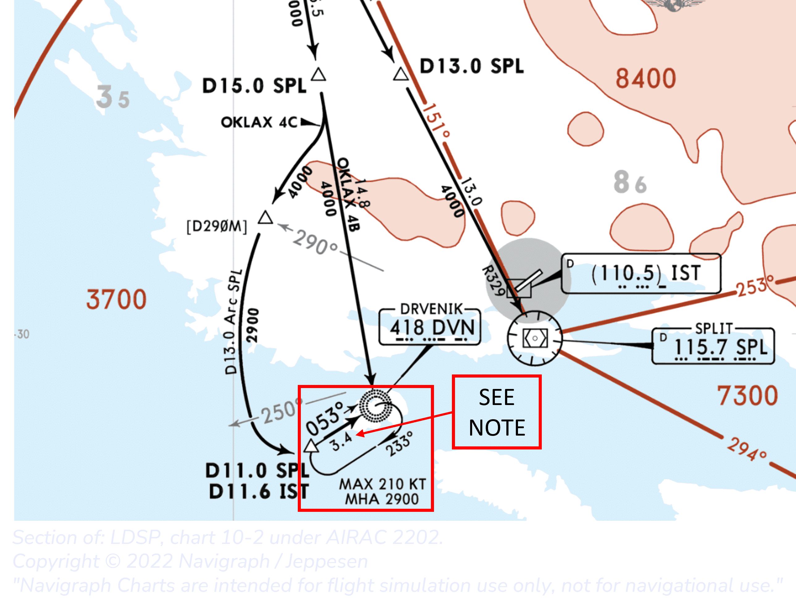

        | Fix           | Inbound course   |Turning direction   |Leg distance   |Max speed   |Max alt|Min Alt (MHA)  |
        | -----------   | -----------      |-----------         |  -----------  | --------   | ---   |-----          |
        | DVN           | 053°              |Right               | STD           | 210KT      |-      | 2900FT        |
    
    === "5"

        Lorum ipsum

        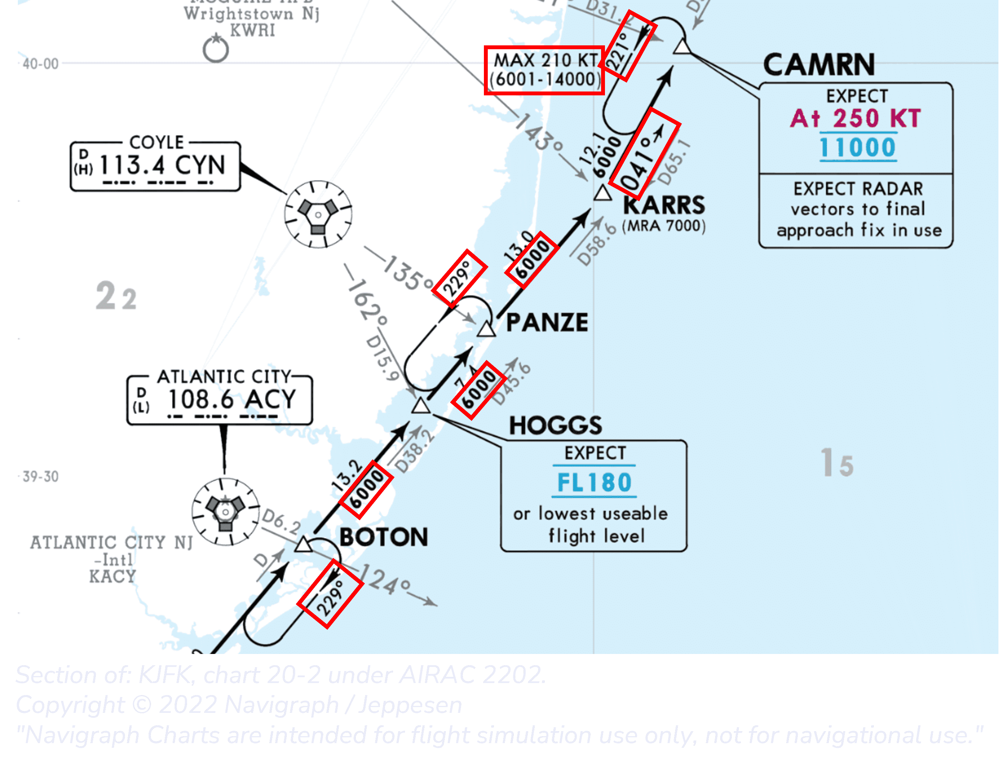

        | Fix           | Inbound course   |Turning direction   |Leg distance   |Max speed   |Max alt|Min Alt (MHA)  |
        | -----------   | -----------      |-----------         |  -----------  | --------   | ---   |-----          |
        | BOTON         | *049°             |Right               | STD           | STD        |-      | 6000FT        |
        | PANZE         | *049°             |Left                | STD           | STD        |-      | 6000FT        |
        | CAMRN         | 041°              |Left                | STD           | 210KT      |14000FT| 6001FT        |
        
        The inbound course can be calulated by subtracting or adding 180 to the reciprocal.

    === "6"

        Lorum ipsum

        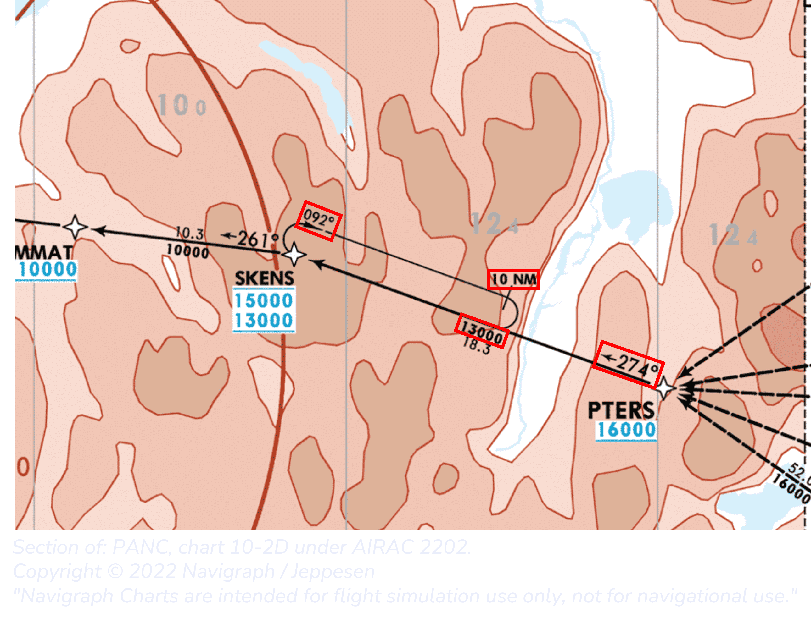

        | Fix           | Inbound course   |Turning direction   |Leg distance   |Max speed   |Max alt|Min Alt (MHA)  |
        | -----------   | -----------      |-----------         |  -----------  | --------   | ---   |-----          |
        | SKENS         | 274°              |Right               | 10NM          | STD        |-      |13000FT        |

    === "7"

        Lorum ipsum

        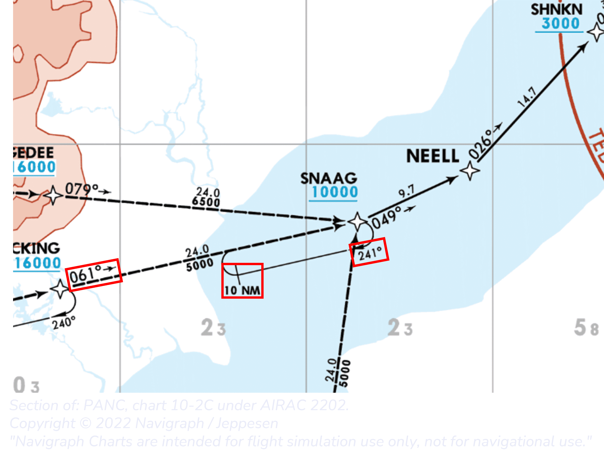

        | Fix           | Inbound course   |Turning direction   |Leg distance   |Max speed   |Max alt|Min Alt (MHA)  |
        | -----------   | -----------      |-----------         |  -----------  | --------   | ---   |-----          |
        | SNAAG         | 061°              |Right               | 10NM          | STD        |-      |-              |

    === "8"

        Lorum ipsum

        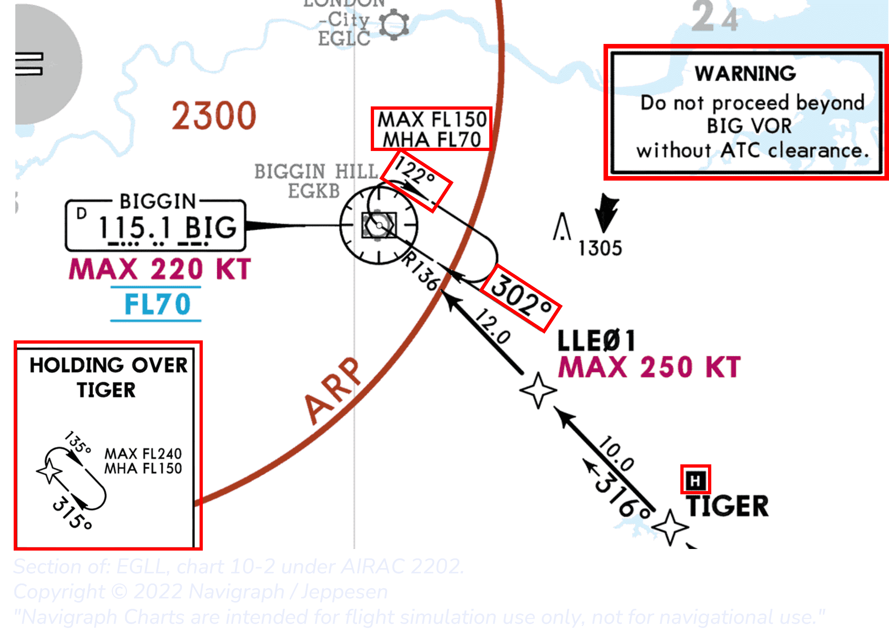

        | Fix           | Inbound course   |Turning direction   |Leg distance   |Max speed   |Max alt|Min Alt (MHA)  |
        | -----------   | -----------      |-----------         |  -----------  | --------   | ---   |-----          |
        | TIGER         | 315°              |Right               | STD           | STD        |FL240  | FL150         |
        | BIG           | 302°              |Right               | STD           | STD        |FL150  | FL70          |
    
    === "9"

        Lorum ipsum

        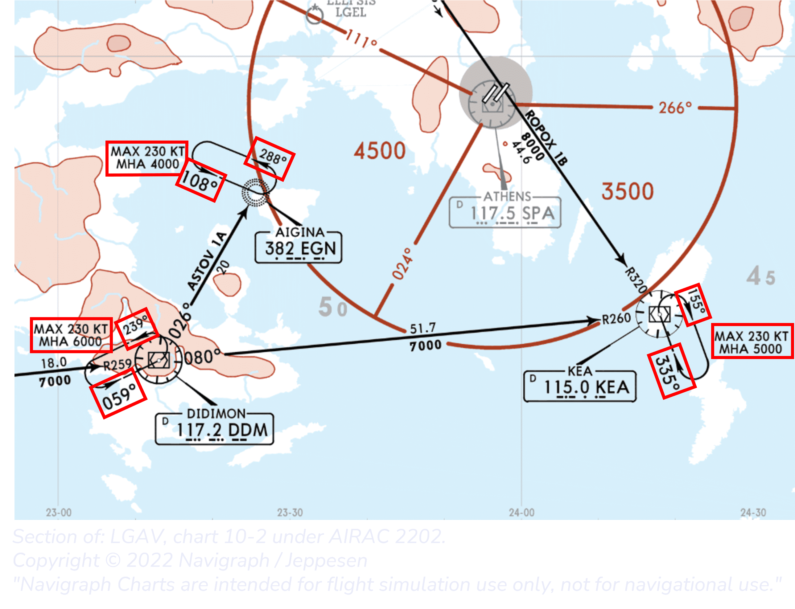

        |Fix            | Inbound course   |Turning direction   |Leg distance   |Max speed   |Max alt|Min Alt (MHA)  |
        | -----------   | -----------      |-----------         |  -----------  | --------   | ---   |-----          |
        | DDM           | 059°              |Left                | STD           | 230KT      |-      | 6000FT        |
        | EGN           | 108°              |Left                | STD           | 230KT      |-      | 4000FT        |
        | KEA           | 335°              |Right               | STD           | 230KT      |-      | 5000FT        |

    === "10"

        Lorum ipsum

        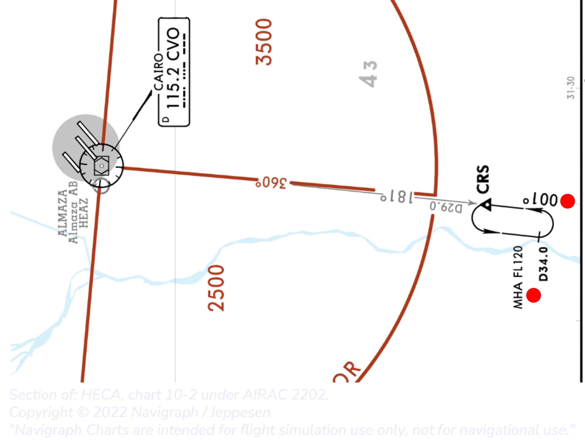

        |Fix            | Inbound course   |Turning direction   |Leg distance   |Max speed   |Max alt|Min Alt (MHA)  |
        | -----------   | -----------      |-----------         |  -----------  | --------   | ---   |-----          |
        | CRS           | 001°              |Left                |Until CVO VOR reads 34.0 NM|STD|-   | FL120         |
     
## Hold Standards

STD leg distance is defined by the FAA to be:

| Altitude (MSL)    | Leg distance  |
|---------------    |---------------|
| MHA - 14000FT     | 1 minute      |
| 14001FT and above | 1.5 minutes   |

STD Max hold speed is defined by the FAA to be:

| Altitude (MSL)    | Airspeed (KIAS) |
|---------------    |-----------------|
| MHA - 6000FT      | 200             |
| 6001FT - 14000FT  | 230             |
| 14001FT and above | 265             |

### Entering the hold
Now that all information of the hold is known it is time to create a hold in the FMS via the MCDU. A step by step guide to hold at SKENS as with example chart 6 (above) is provided below.

!!! info "Programming the hold"

    === "1"

        Find the waypoint in the F-PLN page on the MCDU. Select the corresponding line. In this case the 3rd from the top, SKENS, and push the left line selector key (LSK) for SKENS.
    
    === "2"

        In this page select the 3rd LSK to enter the hold section for the SKENS waypoint.

    === "3"

        Notice the title of the page is called COMPUTED HOLD at SKENS. 
        
        Computed means that this is information provided from the simulator. This can be wrong, old AIRAC for example, and can be edited. 

    === "4"

        As can be seen by the bigger symbols, the inbound course 274 is inserted in the FMS
        
        Note that the title has changeed to HOLD and a REVERT TO COMPUTED appeared.  REVERT TO COMPUTED will erase all custom set settings and revert back to the computed settings.

    === "5"

        As can be seen in the chart in example 6 above, the hold has a leg length of 10NM. To enter this in the FMS type /10 in the MCDU and select LSK3 to feed it in the TIME/DIST box. 
        The time needed to complete the leg is also re-calculated and is 3.3 minutes in this case. 

        If leg distance is constrained by time (as it is for a standard hold) this can be set by typing for example 1.5 in the MCDU and feeding it in the TIME/DIST box. Also now, the leg distance will automatically be re-calculated.

    === "6"

        !!! warning "Not yet implemented"

        In the bottom section of the MCDU screen 'Last exit' can be found. The section compromises of a UTC and FUEL reading. Last exit gives information on how long the airplane can safely stay in the hold while still having the fuel for the rest of the approach, to go around, divert and the final reserve fuel. The UTC and FUEL will give you the time and the minium fuel respectively needed when leaving the hold. 

    === "7"

        If the inbound course, turning direction and leg distance are set correctly press the 6th LSK on the right to insert the hold into the Flight plan. 

        Notice the white curved arrow in the ND. In this case it is turned to the right, however, if a left turn hold is selected the arrow would turn to the left.   
        Also notice how the hold waypoint now appears for an additional time in the flight plan. This is needed for the FMS to calculate a good exit path when leaving the hold. 

    === "8"

        

    === "9"

    === "10"

    === "11"
    
    === "12"

### Leaving the hold
