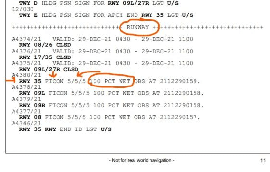

# Landing Calculations

This page provides additional information when utilizing the flyPadOS3 landing calculator.

## Example Data

Below you can find an example of runway details and how to identify it to input data into the respective fields.

#### Example Chart:

{loading=lazy}

*Copyright © 2021 Navigraph / Jeppesen 
"Navigraph Charts are intended for flight simulation use only, not for navigational use."*

#### Example 1

This runway can be used for landing with the given circumstances and full flaps in all braking configurations (low, medium, max manual).

{loading=lazy}

#### Example 2

This runway's landing distance available is long enough to be used for landing with full flaps and with max manual braking.
Be aware that there might be other restrictions that prohibit landing of an A320neo on this airport/runway.

{loading=lazy}

#### Example 3

This runway can not be used for landing with the given circumstances. It is similar to Example 2 but has a higher weight and therefore higher approach speed.

{loading=lazy}

## RWY Conditions

!!! danger "TODO"
    - Add matrix
    - Add additional information
    - Consider extra page

For runways that are not dry, a field condition report (or FICON) is included in the NOTAMs for that airport. See this example for a SimBrief prepared OFP for KPIT-KPHL.

!!! block ""
    {align=left width=60%}

    This is a screenshot for the runways at the arrival airport. 

    It provides runway condition codes (the numbers X/X/X) for each third of the specified runway as well as a text description of the surface condition and the time of the report.

As for the condition codes, a dry runway is a 6 and would never be reported unless portions of the runway were codes less than 6. The lowest of the 3 reported codes should be used (unless you are certain that you would be not using the last third of the runway, for example).

For our landing perf calculator:

- 5 is Good
- 4 is Good-Medium
- 3 is medium
- 2 is Medium-Poor
- 1 is Poor