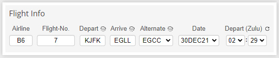
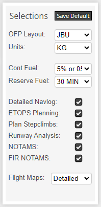
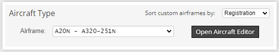
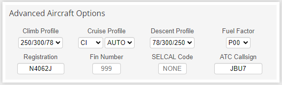
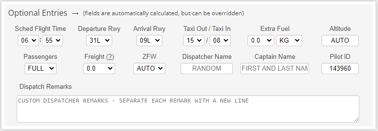
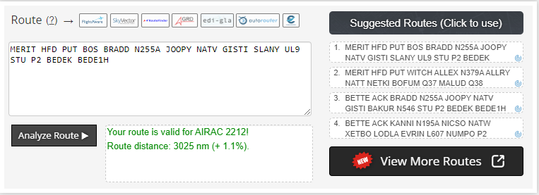
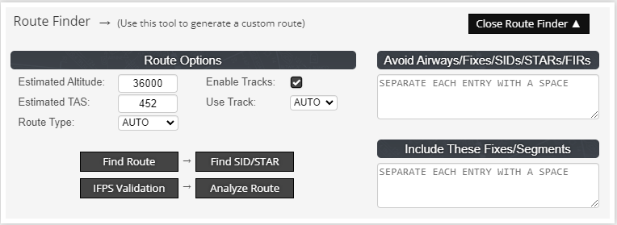

# Advanced Flightplanning with Simbrief

## Overview

This tutorial will cover the Simbrief flight plannign system and how to properly use it.

Every succesful flight starts with a succesful planning. To have a succesful flight, you will need to have a proper understanding of the flight planning system and know-how how to use it.

To make it easier to read, this guide is split up in parts that are identical to the parts of the Simbrief system.

## Flight Info

{loading=lazy}

### Airline

The Airline entry is the IATA code of the airline, e.g. B6 for JetBlue.

### Flight-No.

The Flight-No entry is the number of the flight, e.g. 7. Together with the Airline entry, this will make up the flightnumber of the flight. In this case, that is B67 (JetBlue flight 7).

### Depart/Arrive

These entries are the main bit of your flight. From where do you want to fly? Where do you want to fly to? This can be entered in either IATA or ICAO format, as the system automatically changes an entered IATA indentifier format to the ICAO format. The departure for this tutorial is KJFK, which can also be entered as JFK. The arrival for this tutorial is EGLL, which can be entered as LHR.

### Alternate

We will talk about that in the part [Alternate Airports](#alternate-airports).

### Date

The date in Simbrief is the Date of Flight (DOF); the date you will depart at.

### Depart (Zulu)

This is the time, in UTC, that you estimate to go off-blocks. Together with the date, the system will calculate from this time forward what, for example, the winds will most likely be and adjust the planning to these factors.

## Selections

{loading=lazy}

### OFP Layout

The OFP Layout is usually airline-specific. So to get the most realistic flightplans, you should change the OFP layout to the airline you are flying; EZY for any easyJet ops, BAW for British Airways ops, et cetera.

### Units

Via this option you can choose the planning unit. The two options are LBS (Pounds) or KG (Kilograms). When set to KG, all weights in the OFP will be in metric (kilograms or metric tons). When set to LBS, all weights in the OFP will be imperial (pounds or imperial tons).

### Cont Fuel (Contingency Fuel)

The contingency fuel is the fuel that is used for en-route diversion to another field.

### Reserve Fuel

This is the Reserve Fuel, also known as Final Reserve Fuel. This is the fuel that should always be in the tanks. When you get below this amount, you must land as soon as possible. The ICAO minimum is 30 minutes of Reserve Fuel.

## Aircraft Type

{loading=lazy}

This selection has two real options. You can either use a plane from your fleet, or you can choose a preset and change the aircraft config after you chose.

When you choose a preset instead of a plane from your fleet, you will have limited customisation options.

## Advanced Aircraft Options

{loading=lazy}

### Aircraft Preset

### Saved Airframe/My Fleet

When adding a plane to [your fleet](https://www.simbrief.com/system/dispatch.php?newfleet=1), you can change everything in the config of that specific registration.

Starting with the some notes you might want to add, continueing via registration and engine type, equipement and the passenger-capacity, down to standard weights of the aircraft, the passengers and their bagage.

!!! info "Cargo vs Bagage"
    Cargo and bagage are two different things. Cargo is wat does not belong to a person on board, while the bagage doen belong to a person on board and may only be allowed to depart with the flight when the owner is indeed in board. Cargo can only go in the cargo holds in the belly of the aircraft, while bagage can go either in the cargo holds in the belly of the aircraft and in the overhead hold.

## Optional Entries

{loading=lazy}

### Dispatch Remarks

## Route

{loading=lazy}

## Route Finder

{loading=lazy}

### Find Route

### Find SID/STAR

### IFPS Validation (Europe)

### Analyze Route

## Alternate Airports

{loading=lazy}

### Destination Alternates

### Takeoff Alternate

### Enroute Alternate

## ETOPS Scenario

{loading=lazy}