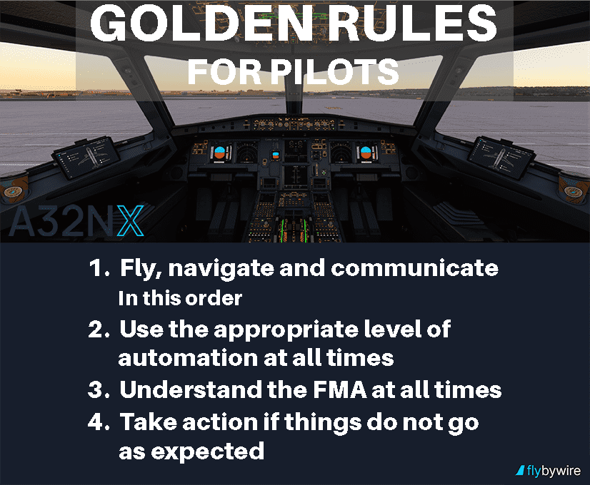

# Abnormal Laws in the A320
## Alternate Law

Alternate Law is activated when the plane loses certain computers, avionics, or sensors. You can tell Alternate Law is in effect by the ECAM message: "ALTN LAW" and associated messages detailing the failure that led to Alternate Law becoming active.

On the PFD, indications for protective limits are replaced by an amber "x" indication when the associated system is unavailable.

### Failure Cases

Following failures will lead to the activation of [Alternate Law with reduced protection](#alternate-law-with-reduced-protection):

- Failure of 2 ADRs (self-detected)
- Failure of both ELACs
- Failure of one elevator
- Failure of one sidestick
- Failure of 2 IRs (self detected)
- Loss of ELAC 1 **and** either green or yellow hydraulic system 
- Loss of ELAC 2 **and** the blue hydraulic system
- Loss of all spoilers
- Loss of all three SECs
- Jam of THS

Following failures will lead to the activation of [Alternate Law with reduced protection and mechanical yaw control](#alternate-law-with-reduced-protection):

- Failure of 2 ADRs (Failure of second ADR not self-detected **and** disagreement related to calculated airspeed (CAS) or Mach speed)
- Failure of the green and yellow hydraulic system

!!! info "Self Detection"
    All flight systems are continuously monitored by the flight computers, when a peripheral system detects a fault it will inform the flight computers or shut down (self detected failure). 
    Some faults can not be detected by the peripheral system itself because it can only see its own data. 
    The flight computer can compare the data across systems, when detecting an abnormality it ignores the corresponding system. 
    
    This is known as a "non-self-detected failure".     

Following failures will lead to the activation of [Alternate Law without protection](#alternate-law-without-protection)

- Failure of all three ADRs
- Failure of both SFCC Slat Channels 
- Failure of the green and blue hydraulic system

!!! warning "Approach and Landing with Alternate Law"
    When deploying the Landing Gear under Alternate Law **and** the Autopilot is disconnected
    the controls switch directly to [Direct Law](#direct-law), this is done to provide necessary force feedback to the pilot as the "flare" mode that usually provides feedback to the sidestick is inoperable in Alternate Law.
    
    Loss of all protections on final approach should be anticipated, and the flight crew should prepare to take over pitch trimming for landing.  

Following failures will lead to the activation of [Direct Law](#direct-law)

- Failure of all three IRs

#### Special Failure Conditions
Some failure conditions are caused by a combination of factors and can cause abnormal failure modes, some may allow recovery to a more stable state:

- When the plane is in "Emergency Electrical Configuration (On Batteries)" Alternate Law with reduced protections is active, although yaw control is switched to the mechanical backup, after emergency power becomes available, resetting FAC 1 allows recovery to alternate control over yaw.
- When 2 IRs fail with the second not being self detected, the flight crew has to identify and switch off the faulty IR before resetting **both** ELAC 1 and 2, the plane will recover to Alternate Law with reduced protection.
- When the Radio Altimeters fail with Gear down **or** the plane is in CONF 2 and the LGCIUs have a data disagreement, Direct Law will be used. Abnormal from Direct Law Yaw Control will be kept in alternate.
- Failure of the yaw damper or both FACs will cause Alternate Law to be displayed on the ECAM but all protections are retained and no switch to Direct Law will be made on landing.

!!! info ""
    Currently failure of yaw damper isn't implemented completely in the A32NX so a failure will lead to the activation of [Alternate Law with reduced protection and mechanical yaw control](#alternate-law-with-reduced-protection)
### Alternate Law with Reduced Protection
This is the standard fallback mode.

- Autopilot may be lost, depending on he type of failure that has accured, AP may not have disengaged or may be reengaged.
- Pitch control is still translated via load demand orders, however most protections for pitch have been lost.
- Load Factor Protection is available, over stressing the airframe should not be possible.
- Autotrim is available.
- Stall/&alpha;~floor~ and Overspeed/V~MO~ Protections are unavailable.
- Speed stability is enabled, this function pushes the nose down when the airspeed gets too low (about 5kts before reaching V~SW~) and pulls the nose up when speed is getting too high.
- Speed Stability is **no** protection, its commands are overruled by the sidestick, it's only used to maintain a safe speed when the pilot is not actively monitoring the speed.
- Stall and over speed **are** possible in Alternate Law, audio warnings should be taken seriously, and the plane stabilized immediately.
- Roll control is in direct mode, bank angle protection and turn coordination are lost.
- Yaw control is provided with yaw dampening available.

!!! info "Load Demand"
    With fly-by-wire flight controls, in flight the sidestick usually doesn't affect the flight controls directly, instead being translated into a load demand order that tells the flight computers to change the current flight situation, the computers then generate commands for the avionics to achieve the necessary movement introduced.
    This also inhibits unsafe flight conditions like stalls, inverted flight or exceeding of the load limit (G Limit), provided the aircraft is in [Normal Law](overview.md).

### Alternate Law without Protection
This fallback mode is triggered when multiple flight-critical redundant systems have failed:

- Pitch control is still translated via load demand orders, Speed Stability is lost. 
- Roll control is in direct mode, bank angle protection and turn coordination are lost.
- Yaw control is provided with yaw dampening available.

### Abnormal Alternate Law
Unlike normal Alternate Law, Abnormal Alternate Law (also known as Abnormal Attitude Law) is activated when the plane is far outside the normal flight envelope and reaches abnormal attitudes (even when in Normal Law).

Abnormal Law is triggered when one of the following conditions is met:

- Bank angle above 125°
- Pitch attitude above 50° up or 30° down
- Speed below 60 - 90 kt (exact value dependent on pitch)
- Speed above 440 kt / Mach above 0.91
- AOA above 30° - 40° or below - 10°

Abnormal Alt. Law is meant to give the pilot the necessary control authority to recover the plane.

In Abnormal, Autotrim is turned off and roll control is switched to Direct Law, under which 4 spoilers are used for control instead of 2.

When the plane has recovered, autotrim is enabled again, pitch and yaw control remain in alternate. This means flight controls will be **degraded** for the rest of the flight.

### Flying without Normal Law
When encountering an issue with Normal Law and subsequently having to fly the plane in Alternate Law, the flight crew has
to subsidize all the systems that are suddenly unavailable. The highest priority should be taking control of the airplane since the Autopilot
likely disconnected.

Refer to the ECAM for information about the failure and current flight situation, warnings displayed will give you constraints like maximum speed which should be followed to stay
in a safe flight condition.

Telling which Law your plane is in can help:

- ECAM Warning "ALTN LAW: PROT LOST" means Alternate Law in general, use the ECAM "STS" page and displayed warnings to tell if protections are reduced or completely lost. 
- ECAM Warning "ALTN LAW: PROT LOST" **and**  amber "USE MAN PITCH TRIM" warning in the PFD means Direct Law

After ensuring a stable flight profile, the flight crew begins working the issue with the help of ECAM. In the first step, the issue is
diagnosed by finding the related system. If displayed work the ECAM Actions, if successful you may [recover to Normal Law](#recovering-to-normal-law).

If not, the decision on how to proceed is dependent on many factors, primarily what sort of failure you're experiencing and what stage of flight you're in. The "STS" Page in the ECAM can help find out what systems are working or not.
Should the "LAND ASAP" ECAM Warning be displayed, the plane has to be landed as quickly and safely as possible; Otherwise it's your call as the captain to decide,
diverting, returning or pressing on, in any case, the rest of the flight will take full concentration and a lot of airmanship.

After working the issue, you can try turning the Autopilot back on, flight crews usually try to get the Autopilot working again to free up the "Pilot Flying" for other tasks on the flight deck.
!!! warning "Real Life and Online ATC Considerations"
    It is the sole responsibility of the pilot to conduct proper flight planning and execution. It is not sufficient 
    to solely rely on the automatic aircraft guidance and indications. All indications and guidance need to be 
    monitored and reconfirmed by the flight crew at all times.

    This is especially true for Auto Flight, where the flight crew must monitor all instruments and the flight in
    general constantly, and they must be able to take over the flight manually at any moment.
    Always remember Airbus' Golden Rules:

    

### Recovering to Normal Law
Recovering to Normal Law is not guaranteed and may not be possible depending on the type of failure.
In general, when the failure that caused Alternate Law is fixed, Normal Law should be operational again. 
To rectify issues with the plane, work through the ECAM Actions and refer to the "STS" ECAM Page. 

## Direct Law
This mode is the lowest level of fly-by-wire controlling. Multiple failures have occurred.

- Pitch control is direct. This means inputs on the sidestick are directly translated to movement of the relevant avionics, the behavior of the plane changes drastically.
- Autotrim and Speed Stability are lost.
- Roll control is in direct mode, bank angle protection and turn coordination are lost.
- Yaw control is provided with yaw dampening available.
