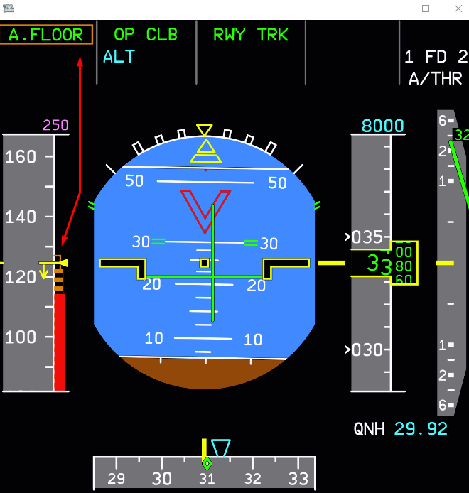
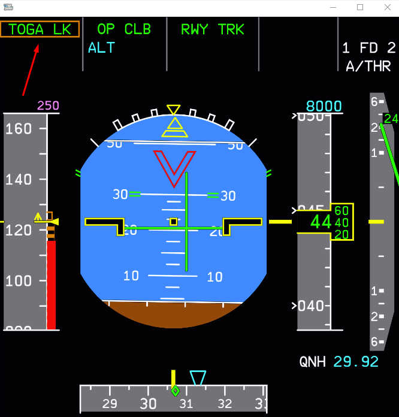

# Alpha Floor and TOGA LK

## Overview

Alpha floor protection is a safety feature of the envelope protection system designed for low speed protection in Normal Law (aircraft fully operational).

This feature is part of our custom autopilot and autothrust system - available in all versions of the A32NX.

## Identifying A.FLOOR

### Trigger Conditions

When the angle of attack and airspeed of the aircraft reaches the alpha floor protection range indicated by the amber and black band on the PFD speed page. Simply put, A.FlOOR will trigger when approaching a stall in the aircraft's current configuration.

!!! danger "Reactivation of autopilot will not be possible when in A.FLOOR conditions"

### FMA Indications

When A.FLOOR protection is active this will be indicated in the left most FMA on the PFD in green with a flashing amber box around it.

{width=80% loading=lazy}

### Resolving A.FLOOR

To recover from the A.FLOOR condition and prevent further stall conditions, manually pitch the nose downwards to increase your speed and to reduce the angle of attack. When angle of attack is sufficiently reduced and the aircraft speed is out of the alpha protection range you can safely switch autopilot back on.

==Note: In most situations the A.FLOOR condition will be followed by a TOGA LK FMA indication on the PFD.==

---

## TOGA LK

This indication typically appears after triggering A.FLOOR protection where TOGA (take off go around) thrust has been set automatically and "locked". This autothurst mode will be kept active until the crew has safely resolved the previous A.FLOOR condition.

{width=80% loading=lazy}

### Resolving TOGA LK

Resolution of TOGA LK is quite simple and accomplished in a few easy steps.

1. Disconnect the autothrust on the flight control unit [(FCU)](../../../pilots-corner/a32nx-briefing/flight-deck/glareshield/fcu.md).
2. Set the new position for the thrust levers (or return to CLB detent).
3. Reactivate autothrust.

After these steps are complete you should be able to resume your flight normally with autothrust and autopilot enabled.
