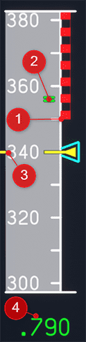

# Normal Law Protections in the A320

The A320 has various flight envelope protections which protect the aircraft from entering certain critical situations while Normal Law is active.

The guides in this section shall cover some of the main envelope protections of the A320's Normal Law.

??? info "Control Laws"
    The fly-by-wire principle of the A320 uses several "Laws" on how to control the flight control surfaces in relation to the pilot's input to side stick.

    - Normal Law:
        - normal conditions even after single failure of sensors, electrical system, hydraulic system or flight control computer
    - Alternate Law:
        - activated after certain double (or triple) failures
    - Direct Law:
        - Mainly after double or triple IRS failure
    - Mechanical Backup (after loss of all electrical power):
        - Trim wheel
        - Rudder pedals

    The different laws will support different types of protections and change the relationship between pilot's stick input and flight control interfaces.

##  Envelope Protections Overview:

- [Overspeed Protection](#overspeed-protection)
- [Angle of Attack Protection](#angle-of-attack-protection)
- [Manoeuvre Protection](#manoeuvre-protection)
- [Attitude Protection](#attitude-protection)
- [Windshear Protection](#windshear-protection)
- [Low Energy Protection](#low-energy-protection)

## Overspeed Protection

This protections aims to protect the aircraft from overspeed situation exceeding the V~mo~ or M~mo~ speeds (maximum operating speeds in knots or mach).

See also [V-Speeds](../..//beginner-guide/abbreviations.md#v-speeds)

### Indication and warnings

The overspeed limits are shown on the speed band on the PFD as a black and red strip and a pair of green lines.

!!! block ""
    {loading=lazy align=left width=12%}

    - 1: V~max~ = Lowest of V~mo~, M~mo~, V~LE~, V~FE~
    - 2: V~mo~ + 6kt or M~mo~ + 0.01 Overspeed Protection becomes active
    - 3: Current IAS (In Air Speed)
    - 4: Current Mach speed

Overspeed Protection triggers the following warnings

- Continuous repetitive chime
- Master warning light
- Overspeed red message on ECAM
- Red and black strip along the PFD scale

### Protective Actions

- Automatic AP disconnection
- When V~mo~ + 6kt or M~mo~ + 0.01 is reached a positive load factor demand is automatically applied (pitch up action)
- When full nose-down stick is maintained speed is limited to around V~mo~ + 16kt and M~mo~ + 0.04 (pilot nose-down authority is reduced)

### Recommended Action to Recover

!!! bug "TODO: PILOT INPUT"

- Increase pitch
- Reduce thrust and/or activate A/THR

## Angle of Attack Protection

The Angle of Attack Protection in the A320 is in simple terms a protection against a too high angle of attack and in consequence stalling the aircraft.

??? info "Angle of Attack"
    "The Angle of Attack is the angle at which relative wind meets an Aerofoil. It is the angle formed by the Chord of the aerofoil and the direction of the relative wind or the vector representing the relative motion between the aircraft and the atmosphere."

    Based on the article [Angle of Attack (AOA)](https://skybrary.aero/articles/angle-attack-aoa){target=new}, Source: www.skybrary.aero.

The angle of attack is commonly called &alpha; (alpha) which we  will use in the following sections.

### Indication and warnings

!!! block ""
    {loading=lazy align=left width=15%}

    - 1: Green Dot Speed is the best lift-to-drag ratio speed in the clean configuration.
    - 2: V~LS~ is minimal selectable speed providing an appropriate margin to the stall speed. The autopilot will not go below this speed if autothrust is active.
    - 3: Selected speed in the FCU
    - 4: &alpha;~prot~ limit
        - this speed is maintained when side stick is neutral
        - if sidestick if deflected aft this will eventually activate &alpha;~floor~ protection. See below.
    - 5: &alpha;~max~ is the speed with the maximum angle of attack (AoA) without the aircraft stalling
        - this speed is maintained when side stick is deflected fully aft

!!! block ""
    {loading=lazy align=left width=15%}

    If the &alpha;~floor~ (A.FLOOR) protection is triggered the Autothrust FMA shows this symbol with a flashing amber border.

### Protective Actions

- Automatic AP disconnection / AP cannot be activated
- If &alpha; becomes greater than &alpha;~prot~ then angel of attack wiull become will become proportional to stick deflection. Autotrim will stop which results in a nose-down tendency.
- If &alpha; reaches &alpha;~floor~ the autothrust system will apply go-around thrust.
- &alpha;~max~ cannot be exceeded even with the pilot pulling the stick full backward. In other words the cannot be stalled in Normal Law by the pilot's pitch up stick input.

### Recommended Action to Recover

- Push sidestick forward to reduce pitch and gain speed.

- If in A.FLOOR (&alpha;~floor~) protection see this guide: [A.FLOOR and TOGA LK](afloor.md)

## Manoeuvre Protection

Manoeuvre Protection, also called Load Factor Protection, enables immediate PF reaction, by pulling the sidestick to full aft without any risk of overstressing the aircraft.

The load factor limit is:

- -1.0 to +2.5g load factor for clean configuration
- 0 to +2.0g positive load factor for other configurations

### Indication and warnings

!!! block ""
    {loading=lazy align=left}

    The lower ECAM displays the load factor (G LOAD) in amber, when the value is above 1.4g or below 0.7g for more than 2s.

## Attitude Protection

Attitude Protection is meant to complement AOA and high speed protection in extreme conditions and in windshear.

For this it limits:

- Bank angle:
    - limited to 33° stick released
    - limited to 67° stick fully deflected

- Pitch angle:
    - limited to 30° nose up
    - limited to 15° nose down

If these limits are approached, the aircraft pitch and roll rate decrease and stop at the limit.

### Indication and warnings

!!! block ""
    {loading=lazy align=left width=45%}

    {loading=lazy align=right width=45%}

- 1: Bank limit indicator at 67°
- 2: Pitch down limit indicator at -15°
- 3: Pitch up limit indicator at 30°

## Windshear Protection

Windshear Protection is available during take off and approach phases when:

- at takeoff 3s after lift off up to 1.300ft RA
- at landing from 1.300ft RA to 50ft RA
- as least CONF 1

### Indication and warnings

‐ Visual “WINDSHEAR” red message displayed on both PFDs for a minimum of 15s.
‐ Aural synthetic voice announcing “WINDSHEAR” three times.

### Recommended Action to Recover

- Flight Director pitch order based on the speed reference system (SRS).
- Pilot must set TOGa thrust immediately and follow the FD pitch order to execute optimum escape maneuver.

## Low Energy Protection

If the aircraft’s energy level is going below a threshold an aural low-energy “SPEED SPEED SPEED” alert warns the pilot to increase thrust, in order to regain a positive flight path angle through pitch control.

It is available in Configuration 2, 3, and FULL. The FAC computes the energy level with the following inputs:

- Aircraft configuration
- Horizontal deceleration rate
- Flight path angle.

The aural alert is inhibited when:

- TOGA is selected, or
- Below 100 ft RA, or
- Above 2 000 ft RA, or
- Alpha-floor, or
- the ground proximity warning system alert is triggered, or
- in alternate or direct law, or
- if both radio altimeters fail.

During deceleration, the low-energy aural alert is triggered before alpha floor (unless alpha floor is triggered by stick deflection). The amount of time between the two alerts depends on the deceleration rate.

