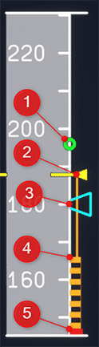
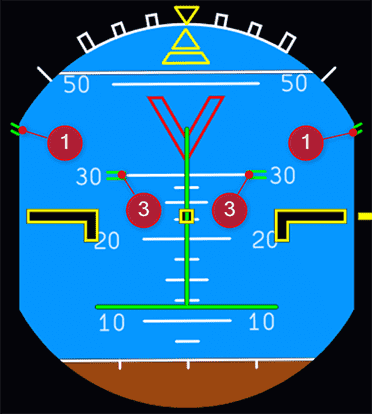

# Normal Law Protections in the A320

The A320 has various flight envelope protections which protect the aircraft from entering certain critical situations while Normal Law is active.

The guides in this section shall cover some of the main envelope protections of the A320's Normal Law.

??? info "Control Laws"
    The fly-by-wire principle of the A320 uses several "Laws" on how to control the flight control surfaces in relation to the pilot's input to side stick.

    - Normal Law:
        - normal conditions even after single failure of sensors, electrical system, hydraulic system or flight control computer
    - Alternate Law:
        - activated after certain double (or triple) failures
    - Direct Law:
        - Mainly after double or triple IRS failure
    - Mechanical Backup (after loss of all electrical power):
        - Trim wheel
        - Rudder pedals

    The different laws will support different types of protections and change the relationship between pilot's stick input and flight control interfaces.

##  Envelope Protections Overview:

- [High Speed Protection](#high-speed-protection)
- [High Angle of Attack Protection](#high-angle-of-attack-protection)
- [Alpha Floor Protection](#alpha-floor-protection)
- [Load Factor Protection](#load-factor-protection)
- [Pitch Attitude Protection](#pitch-attitude-protection)
- [Bank Angle Protection](#bank-angle-protection)
- [Windshear Protection](#windshear-protection)
- [Low Energy Protection](#low-energy-protection)

## High Speed Protection

High Speed Protection (HSP) aims to protect the aircraft from overspeed situations and activates latest when VMO+6kt or MMO+0.015 speeds (maximum operating speeds in knots or mach) are reached.

See also [V-Speeds](../..//beginner-guide/abbreviations.md#v-speeds)

### Engagement Conditions

HSP is activated at or above VMO or MMO speeds (maximum operating speeds in knots or mach), depending on flight conditions.

### Disengagement Conditions

HSP is deactivated when speed is reduced below VMO/MMO.

### Indication and warnings

The overspeed limits are shown on the speed band on the PFD as a black and red strip and a pair of green lines.

!!! block ""
    {loading=lazy align=left width=12%}

    - 1: VMAX = Lowest of VMO, MMO, VLE, VFE
    - 2: VMO + 6kt or MMO + 0.01 Overspeed Protection becomes active
    - 3: Actual Airspeed Reference Line
    - 4: Current Mach speed

High Speed Protection is usually accompanied by the Overspeed Warnings:

- Continuous repetitive chime
- Master warning light
- Overspeed red message on ECAM
- Red and black strip along the PFD scale

### Protective Actions

- Automatic AP disconnection (VMO + 15kt or MMO + 0.04)
- When VMO + 6kt or MMO + 0.01 is reached a positive load factor demand is automatically applied (pitch up action)
- When full nose-down stick is maintained speed is limited to around VMO + 16kt and MMO + 0.04 (pilot nose-down authority is reduced)
- When sidestick is released at HSP activation, the airplane will slightly overshoot VMO/MMO and fly back towards the envelope.
- When sidestick is released the aircraft's bank angle will return to 0° (instead of 33° outside of HSP)
- Bank angle limit is reduced from 67° to 40°
- Pitch trim is frozen

### Recommended Action to Recover

- Extend Speed Brake
- Increase pitch
- Reduce thrust and/or activate A/THR

## High Angle of Attack Protection

The Angle of Attack Protection protects against stalling the aircraft.

??? info "Angle of Attack"
    "The Angle of Attack is the angle at which relative wind meets an Aerofoil. It is the angle formed by the Chord of the aerofoil and the direction of the relative wind or the vector representing the relative motion between the aircraft and the atmosphere."

    Based on the article [Angle of Attack (AOA)](https://skybrary.aero/articles/angle-attack-aoa){target=new}, Source: www.skybrary.aero.

The angle of attack is commonly called &alpha; (alpha) which we  will use in the following sections.

### Engagement Conditions

The High Angle of Attack Protection is engaged when:

- Current angle of attack ia greater than &alpha;~prot~ (in Normal Law) when above 100ft RA
- Below 100 ft RA during the landing, when &alpha;~max~ is reached

### Indications and Warnings

!!! block ""
    {loading=lazy align=left width=15%}

    - 1: Green Dot Speed is the best lift-to-drag ratio speed in the clean configuration.
    - 2: VLS is the lowest selectable speed and provides an appropriate margin to the stall speed. The autopilot will not go below this speed if autothrust is active.
    - 3: Selected speed in the FCU
    - 4: &alpha;~prot~ limit
        - this speed is maintained when side stick is neutral
        - if sidestick if deflected aft this will eventually activate &alpha;~floor~ A/THR protection - see [Alpha Floor Protection](#alpha-floor-protection)
    - 5: &alpha;~max~ is the speed with the maximum angle of attack (AoA) the aircraft will allow
        - this speed is maintained when side stick is deflected fully aft
        - it has a small margin before reaching the stall AoA

### Protective Actions

- Automatic AP disconnection
- If &alpha; becomes greater than &alpha;~prot~ then angle of attack will become proportional to stick deflection. Autotrim will stop which results in a nose-down tendency.
- If &alpha; reaches &alpha;~floor~ the autothrust system will apply go-around thrust. See [Alpha Floor Protection](#alpha-floor-protection).
- &alpha;~max~ cannot be exceeded even with the pilot pulling the stick full backward. In other words the aircraft cannot be stalled in Normal Law by the pilot's pitch up stick input.
- Bank angle limit is reduced from 67° to 45°

### Recommended Action to Recover

- Push sidestick forward to reduce pitch and gain speed.

- If Alpha Floor Protection (&alpha;~floor~) is activated see next chapter [Alpha Floor Protection](#alpha-floor-protection)

## Alpha Floor Protection

The Alpha Floor Protection automatically sets TOGA thrust when a very high angle of attack is reached.

### Engagement Conditions

Alpha Floor Protection **engages** after lift-off until 100ft RA before landing, when:

- &alpha; is >&alpha;~floor~
    - 9.5° in CONFIG 0, 15° in CONFIG 1 and 2, 14° in CONFIG 3, 13° in CONFIG FULL
- Sidestick deflection is >14° when either
    - [High Angle of Attack Protection](#high-angle-of-attack-protection) is active, or
    - the [Attitude Protection](#attitude-protection) for pitch is active.

!!! warning "The above values for &alpha;~floor~ and sidestick deflection are not modelled realistically in Microsoft Flight Simulator."

Alpha Floor Protection is **inhibited**, when:

- speed is above 0.6 Mach
- TCAS mode is engaged

### Indications and Warnings

!!! block ""
    {loading=lazy align=left width=15%}

    If the &alpha;~floor~ (A.FLOOR) protection is triggered the Autothrust FMA shows this symbol with a flashing amber border.

### Protective Actions

Alpha Floor Protection signals the autothrust system to set TOGA thrust. Thrust lever positions are ignored.

As &alpha;~floor~ also implies &alpha;~prot~ see [High Angle of Attack Protection](#high-angle-of-attack-protection) for additional actions.

### Recommended Action to Recover

See our specific guide on how to recover from A.FLOOR: [A.FLOOR and TOGA LK](afloor.md)

## Load Factor Protection

Manoeuvre Protection, also called Manoeuvre Protection, enables immediate PF reaction, by pulling the sidestick to full aft without any risk of overstressing the aircraft.

The load factor limit is:

- -1.0 to +2.5g load factor for clean configuration
- 0 to +2.0g positive load factor for other configurations

### Indication and warnings

!!! block ""
    {loading=lazy align=left}

    The lower ECAM displays the load factor (G LOAD) in amber, when the value is above 1.4g or below 0.7g for more than 2s.

## Pitch Attitude Protection

To protect the aircraft from excessive pitch attitudes this protection limits pitch angels in the following ways:

- Nose up limited to 30° in CONF 0 to 3
    - Progressively reduced to 25 ° at low speed
- Nose up limited to 25° in CONF FULL
    - Progressively reduced to 20 ° at low speed
- Limited to 15° nose down

If these limits are approached, the aircraft's pitch rate decreases and will stop at the limit.

The flight director bars disappear when pitch exceeds 25° up or 13° down. They appear again when pitch returns to 22° up or 10° down.

Pitch Attitude Protection supports high speed protection, high load factor protection, and high AOA protection.

### PFD Attitude Indicators

!!! block ""
    {loading=lazy align=left width=45%}

    {loading=lazy align=right width=45%}

- 1: Bank limit indicator at 67°
- 2: Pitch down limit indicator at -15°
- 3: Pitch up limit indicator at 30°

## Bank Angle Protection

Bank angle during normal conditions is limited at 67° if the pilots holds the sidestick fully deflected laterally.

If the sidestick is neutral and the bank angle is no greater than 33°, the system will hold that bank angle.

If the bank angle was greater than 33° and the sidestick is released to neutral the system reduces the bank angle automatically to 33° and holds it there.

If these limits are approached, the aircraft's roll rate decreases and will stop at the limit.

If [High Angle of Attack Protection](#high-angle-of-attack-protection) is active the bank angle is limited to 45°.

If [High Speed Protection](#high-speed-protection) is active the bank angle is limited to 40° and will roll back to 0° when the sidestick is released to neutral.

The autopilot disconnects and the flight director bars disappear when bank angle exceeds 45°. They appear again when bank angle is less than 40°.

See [PFD Attitude Indicators](#pfd-attitude-indicators).

## Windshear Protection

!!! warning "Not yet available in the A32NX on Microsoft Flight Simulator"

Windshear Protection is available during take off and approach phases when:

- at takeoff 3s after lift off up to 1.300ft RA
- at landing from 1.300ft RA to 50ft RA
- as least CONF 1

### Indication and warnings

- Visual “WINDSHEAR” red message displayed on both PFDs for a minimum of 15s.
- Aural synthetic voice announcing “WINDSHEAR” three times.

### Recommended Action to Recover

- Flight Director pitch order based on the speed reference system (SRS).
- Pilot must set TOGa thrust immediately and follow the FD pitch order to execute optimum escape maneuver.

## Low Energy Protection

!!! warning "Not yet available in the A32NX on Microsoft Flight Simulator"

If the aircraft’s energy level is going below a threshold an aural low-energy “SPEED SPEED SPEED” alert warns the pilot to increase thrust, in order to regain a positive flight path angle through pitch control.

It is available in Configuration 2, 3, and FULL. The FAC computes the energy level with the following inputs:

- Aircraft configuration
- Horizontal deceleration rate
- Flight path angle.

The aural alert is inhibited when:

- TOGA is selected, or
- Below 100 ft RA, or
- Above 2 000 ft RA, or
- Alpha-floor, or
- the ground proximity warning system alert is triggered, or
- in alternate or direct law, or
- if both radio altimeters fail.

During deceleration, the low-energy aural alert is triggered before alpha floor (unless alpha floor is triggered by stick deflection). The amount of time between the two alerts depends on the deceleration rate.

