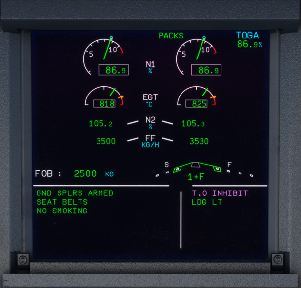

# Rejected Takeoff in the A320

The term rejected takeoff (also known as RTO) refers to incidents in which an aircraft's pilots elect to abort their departure before reaching a critical speed. This critical speed is known as 'V1', and this refers to the maximum speed an aircraft can reach on its takeoff roll and then be brought to a stop whilst remaining within the ASDA (Accelerate-Stop Distance Available). If the aircraft reaches this speed and the Pilot Flying has not yet taken action to stop the plane, the takeoff must be continued unless the airplane is unsafe to fly.  

When the aircraft speed is at or above 100 kts, it may become hazardous to reject a takeoff, therefore a takeoff is split into 3 phases:  

- Below 100 kts  
- Above 100 kts and below V1  
- Above V1  

!!! attention

    If the takeoff is rejected below 72 kts, spoilers & autobrakes will not activate, therefore full manual braking would be required in addition to the other stop actions listed in the rejected takeoff procedure.  

Jump to [Rejected Takeoff Procedure](#rejected-takeoff-procedure)

## What Happens During a Rejected Takeoff in Real Life?

The decision to reject the takeoff and the stop action is made by the Captain, it is therefore recommended that the Captain keeps his hand on the thrust levers until the aircraft reaches V1, whether he is Pilot Flying (PF) or Pilot Not Flying (PNF).

As soon as the Captain decides to abort, he calls “STOP”, takes over control of the aircraft, and performs the stop actions.

## Reasons for a Rejected Takeoff  

It is not possible to list all the factors that could lead to the decision to reject the takeoff. However, in order to help the Captain make a decision, the ECAM inhibits warnings that are not essential from 80 kt to 1500 ft (or 2 min after lift-off, whichever occurs first). When this occurs, a magenta T.O INHIBIT memo is displayed in the Upper ECAM (E/WD).

- Below 100 kts:  
    - Any ECAM warning/caution should prompt the Captain to seriously consider discontinuing the takeoff
- Above 100 kts and below V1:  
    - Fire warning or severe damage
    - Sudden loss of engine thrust
    - Any red ECAM warning
    - Any amber ECAM caution listed below:
        - F/CTL SIDESTICK FAULT
        - ENG FAIL
        - ENG REVERSE FAULT
        - ENG REVERSE UNLOCKED
        - ENG 1(2) THR LEVER FAULT
- Above V1:  
    - Malfunctions or conditions that give unambiguous indications that the aircraft will not fly safely

## Rejected Takeoff Procedure  

!!! note

      We have modified and condensed the rejected takeoff procedure to enable a single pilot to perform for simulation purposes. In real life operations, the procedures are split between the Captain and FO. 

---

[//]: # (Backup Text Below)

[//]: # ("STOP"......................................................ANNOUNCE  )

[//]: # (THRUST LEVERS..................................................IDLE  )

[//]: # (REVERSE THRUST.....................................MAX AVAIL  )

[//]: # (REVERSERS................................CHECK/ANNOUNCE  )

[//]: # (DECELERATION..........................CHECK/ANNOUNCE  )

[//]: # (AUDIO WARNINGS.........................................CANCEL  )

[//]: # ()
[//]: # (**AIRCRAFT STOPPED**  )

[//]: # ()
[//]: # (REVERSERS...................................................STOWED  )

[//]: # (THRUST LEVERS..................................................IDLE  )

[//]: # (ATC...................................................................NOTIFY  )

[//]: # (PARKING BRAKE.....................................................ON  )

[//]: # (CABIN CREW.....................................................ALERT  )

[//]: # (ECAM ACTIONS..........................................PERFORM  )

---

!!! note 

    - Full reverse thrust may be used until coming to a complete stop. But, if there is enough runway available at the end of the deceleration, it is preferable to reduce reverse thrust when passing 70 kts.
    - If the brake response from the autobrake does not seem appropriate for the runway condition, FULL manual braking should be applied and maintained. IF IN DOUBT, TAKE OVER MANUALLY.
