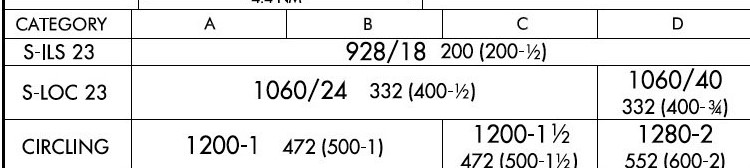
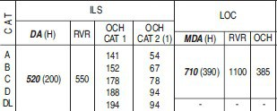

# Types of Approaches

---

## Different Approaches Available

To land any aircraft, the first step is to start an approach that will bring you to a position where you can see the runway. There are a multitude of different approaches, divided into three terms, precision, non-precision and approach with vertical guidance.

Depending on what equipment the airfield has, what the aircraft is capable of, what the pilot is certified to do and the weather that is on the airfield will determine which of these approaches you will do. Here are some of the more common ones you may see in an airliner.

### ^^Precision Approaches \(PA\)^^

A precision approach will give you full guidance, both vertically and laterally, to guide you down to a point where you can see the runway. This information can come from a set of radio beacons on the ground, satellite information or from a controller.

| Approach Type                     | Equipment Used                                | Used For                                                         |
| :-------------:                   | :--------------:                              | :--------:                                                       |
| Instrument Landing System \(ILS\) | A localiser and glideslope radio beacon       | Most precise available, the most common for airliner operations. |
| GBAS Landing System \(GLS\)       | GPS Satellite systems and ground transmitters | A new alternative to ILS, for difficult approaches               |
| Precision Approach Radar \(PAR\)  | A radar dish and a controller                 | Commonly as a backup, or at military airfields                   |

 Lucash, <a href="https://creativecommons.org/licenses/by-sa/3.0">CC BY-SA 3.0</a>, via Wikimedia Commons

***

#### ILS

 ILS DiagramSimplified, U.S. Dept. of Transportation, Federal Aviation Administration, Public domain, via Wikimedia Commons

Using a localiser beacon at the end of the runway, and a glideslope beacon at the side, the aircraft is guided along two radio signals to the touchdown point. These can be accurate enough to position the aircraft all the way down to touchdown and steer it along the runway. The pilots need to tune the ILS frequency into their aircraft's radio navigation system to receive the correct signals.

#### GLS

Like an ILS, but instead of using a set of radio beacons, the aircraft is guided by being fed information from a set of ground stations, which are in turn fed details about the position of the aircraft through GPS satellites.

Not common, but as they do not need radio signals that go out in straight lines, the station can guide the aircraft around curves and turns to avoid terrain and built up/sensitive areas. Only some aircraft are equipped to do GLS and is only an option on the A320 family.

#### PAR

This is an approach where a controller, with an advanced radar, steers you towards the runway while telling you corrections to your heading or altitude. To the pilot, the controller will give you corrections such as, “Left 2 degrees”, “Right 3 degrees”, “Slightly high, correcting”, to bring you towards the runway.

When all other systems fail, this system can be used as a backup to provide these kinds of approaches, and several large international airports will practice these to keep the controllers skills current. Military airfields commonly use them as they can be setup much quicker than an ILS for use in temporary airfields and only rely on a radar, which can be portable.

***

### ^^Non-Precision Approaches \(NPA\)^^

A non-precision approach officially can only give you lateral guidance to the point where you can see the runway. This is fed either to the pilots either using a single radio beacon or by satellite navigation, but these cannot tell you if you are too high or low. The only way is to use a table off an aviation chart that shows you at what altitude you need to be at certain distances.

| Approach Type                       | Equipment Used                                                       | Used For                                                                     |
| :-------------:                     | :--------------:                                                     | :--------:                                                                   |
| Localiser Only \(LOC\)              | A localiser that would be part of an ILS system normally             | Some airports only have localiser but also when ILS glideslopes have failed. |
| VOR-DME or VOR Only                 | A VOR beacon with/without a distance from a DME                      | Old style approaches, where ILS cannot be used.                              |
| NDB-DME or NDB Only                 | A NDB beacon with/without a distance from a DME                      | Old style approaches, where an ILS cannot be used                            |
| LNAV Only                           | GPS or the aircraft's position inside the flight management computers | Approaches where there are no radio beacons in the area                      |
| Approach Surveillance Radar \(ASR\) | A radar dish and a controller   (No altitude compared to PAR)     | Commonly as a backup, or at military airfields.                              |
| Visual                              | Pilots eyeball!                                                      | Where there is no issue with the weather and the runway is already in sight  |

These approaches are all flown traditionally with just a beacon pointer, a localiser giving left/right corrections, or a controller giving rough headings. With a helpful co-pilot who will be using the altitude table to check if you are high or low, you keep correcting down towards the runway. As the term non-precision hints, these approaches are nowhere near as accurate as a precision approach and as such can require quite good weather to be able to attempt them. VOR and NDB beacons are slowly disappearing due to maintenance costs and the more useful APV approaches being made available.

***

### ^^Approaches with Vertical Guidance \(APV\)^^

A newer kind of approach, that uses both lateral and vertical guidance from sources such as GPS satellites, and does not require the use of radio beacons at all. At the time of writing, these approaches were not yet classed as precision, as they do not quite have the accuracy required but are constantly getting better with each new design. They are now flown very similarly to an ILS and do not require much input from the pilots.

| Approach Type   | Equipment Used                                                       | Used For                                                                      |
| :-------------: | :--------------:                                                     | :--------:                                                                    |
| RNP/RNAV        | Satellite GPS systems and the aircraft's on board positioning system | Approaches where there are no radio beacons in the area                       |
| RNP-AR          | Satellite GPS systems and the aircraft's onboard positioning system  | As per RNP/RNAV but allow curved approaches with margins as little as 0.1 NM. |

***

## The Different Categories of ILS

!!! info "MDA and DA"
    Due to differences between established regulations by EUROCONTROL and the FAA it is critical that pilots use and understand the difference between Minimum Descent Alittude (MDA) and Decision Altitude (DA) where appropriate. This ensures that there is no discrepancy between which minimum to use for the type of approach planned.

    While the information provided below can suffice as a guideline it is always best to understand the minimums posted on the approach plate as your minimum criteria.

    [Read More Here](#minimums-and-mdadh)

With the ILS system, there are several categories that have different requirements from the pilots, the aircraft, the weather and the airport equipment. They are known as CAT, short for category, and are listed as both roman numerals and Latin numbers:

| ILS Category                          | Autoland Required  \(in the Airbus\)           | Weather  \(Normally\)                           | MDA/DA or DH           |
| :-------------:                       | :--------------:                                  | :-----------:                                      | :----------:        |
| CAT I                                 | No  \(May also be unsafe due to interference\) | Cloud base above 200ft  Visibility 550m         | MDA/DA                 |
| CAT I LTS  \(Lower Than Standard\) | Yes                                               | Cloud base above 200ft  Visibility 400m or 450m | MDA/DA                 |
| CAT II                                | Yes                                               | Cloud base above 100ft  Visibility 300m         | DH                  |
| CAT IIIA                              | Yes                                               | Cloud base above 100ft  Visibility 200m         | DH                  |
| CAT IIIB                              | Yes \(2 Autopilots\)                              | Cloud base above 50ft  Visibility 75m           | DH  \(can be 0\) |
| CAT IIIC                              | Yes \(2 Autopilots\)                              | Cloud base above 0ft  Visibility 0m             | DH  \(can be 0\) |

As the weather gets progressively worse, the higher the category you need to use, which in turn
requires more advanced equipment both on the airfield and in the cockpit. To be able to do this,
pilots are required to retrain on low visibility operations every year.

The CAT IIIC can be performed without ever seeing anything at all but this is not in practice yet
as there has not been a system designed for the aircraft to be able to leave the runway and go to
the parking stands completely blind. The A320 family are capable of everything including CAT IIIC.

 MichaelDiederich CC BY-SA 3.0

---

## Minimums and MDA/DH

So, you have picked your approach and are flying towards the runway, but how close can you get before you decide it is a bad idea and to try again somewhere else? This is where the minimums come into effect. These are fixed values that decide how low you can go on the approach, and when you get to this altitude, you cannot go any lower until you can see the runway.

|                Minimum Type                 |                Defined As                |               Approaches Used In               |
|:-------------------------------------------:|:----------------------------------------:|:----------------------------------------------:|
|    MDA  \(Minimum Descent Altitude\)     |      Altitude Above Mean Sea Level       | LOC, LDA, SDF, VOR   NDB, LNAV, ASR, Visual |
|         DA  (Decision Altitude)          | Barometric Altitude Above Mean Sea Level | CAT I ILS   LNAV / VNAV, LPV, RNP, PAR, GLS |
| DH/RA  \(Decision Height/Radio Altitude) |    Radio Altitude Above Ground Level     |       CAT II ILS   CAT III A/B/C ILS        |

These are defined in feet, \(or meters if that airspace uses meter altitudes\) and can be found at the bottom of the aeronautical chart that is published for that approach. Each approach to each airport will have a separate value, changing due to obstacles, terrain, and other things that may get in the way while descending towards the runway.

!!! info "Expanded Information from FAA Instrument Procedure Handbook"
    Chapter 4: Approaches in the FAA IPH provides more context on the definition of the different types of minimums.
    
    **MDA** - the lowest altitude, expressed in feet MSL, to which descent is authorized on final approach or during circle-to land maneuvering in execution of a standard instrument approach procedure (SIAP) where no electronic glideslope is provided.

    **DA** - a specified altitude in the precision approach at which a missed approach must be initiated if the required visual reference to continue the approach has not been established.

    **DH** - with respect to the operation of aircraft, means the height at which a decision must be made during an ILS, MLS, or PAR IAP to either continue the approach or to execute a missed approach. CAT II and III approach DHs are referenced to AGL and measured with a radio altimeter.

    Source: [FAA IPH - FAA-H-8083-16B; Chapter 4](https://www.faa.gov/regulations_policies/handbooks_manuals/aviation/instrument_procedures_handbook/media/FAA-H-8083-16B_Chapter_4.pdf){target=new}
    
    [Download FAA IPH](https://www.faa.gov/regulations_policies/handbooks_manuals/aviation/instrument_procedures_handbook/){.md-button target=new}

***

### ^^Aircraft Approach Categories^^

Now depending on the aircraft you are flying, depends on the minimums you are allowed to use. These are grouped together by the approach speed of your aircraft, while in normal landing configuration at the maximum landing weight that it is certified to do.

* The higher the maximum weight approach speed means:
* The higher category is required, which means:
* The higher minimums are used.

| Aircraft Category | Approach Speeds  | Typical Aircraft                 |
| :-------------:   | :--------------: | :-----------:                    |
| A                 | < 91 knots       | C172 PA28 SR22 DC3               |
| B                 | 91 - 120 knots   | ATR72 C17 S340 TBM850            |
| C                 | 121 - 140 knots  | A320 A380 737 MD80               |
| D                 | 141 - 165 knots  | A340 A350 747 777 787 MD11       |
| E                 | 166 - 210 knots  | Concorde and specialist military |

***

### ^^MDA/DH on a Chart^^

ILS_RWY_23_KBUF.jpg: The original uploader was Centpacrr at English Wikipedia. Derivative work: Atmoz, Public domain, via Wikimedia Commons

In the above example, which is for the ILS or LOC/DME for Runway 23 at Buffalo Airport, NY in the USA, this chart uses a format designed by the Federal Aviation Administration (FAA) of the USA. Each chart designer unfortunately has slight differences compared to each other, but the basics are usually the same. So, for the above approach:

|                             | MDA  (ft)    | Visibility   (in 100s of ft (USA)) | Visibility  (m) | Height above the ground  (ft) |
| -------------:              | :-------------: | :--------------:                      | :-----------:      | :-----------:                    |
| ILS CAT I RW23              | 928             | 1800                                  | 550                | 200                              |
| LOC RW23  (Category ABC) | 1060            | 2400                                  | 730                | 332                              |
| LOC RW23  (Category D)   | 1060            | 4000                                  | 1220               | 332                              |

 N.b. The brackets in the above image are used by the FAA for military operations, nothing to worry about in an airliner!

In this example, for Paris Charles De Gaulle Airport, ILS or LOC/DME for runway 26L:

SIA, CC BY-SA 4.0 <https://creativecommons.org/licenses/by-sa/4.0>, via Wikimedia Commons

|                | MDA  (ft)     | Visibility  (m) | Height above the ground  (ft) |
| -------------: | :--------------: | :-----------:      | :-----------:                    |
| ILS CAT I R26L | 520              | 550                | 200                              |
| LOC 23         | 710              | 1100               | 390                              |

As this chart is now designed differently, it has described the MDA as a DA for the ILS. Now this is just a difference between charts and countries, some use one terminology over the other. Also to note is the inclusion of OCH values. These are the obstacle clearance heights of all possible objects on the approach path, so if you descend below this, then there is a possibility of a collision. These OCH values are not used by the pilots in an approach but are used by the professional bodies who design the approaches as to what the minimums values should be.

***

## Autoland

Autolands are, unlike what the media might want everyone to think, not used all that frequently! The only time it is fully used is in conditions of bad weather, where the clouds are too low or the visibility not far enough to continue to do a normal manual approach. Special rules must be in place to prevent any interference with the aircraft, as this is a precise manoeuvre with not much room for error.

### ^^Rules at Airfield^^

To fly an Autoland, the approach you are flying must be a CAT II ILS or higher. This means that only certain airfields can perform these, where the localiser and glideslopes have been certified as accurate enough to guide the aircraft to a successful landing. An airfield with anything such as an offset ILS, where the ILS is not aligned with the runway, will not be able to offer an Autoland approach.

The airfield must also be in Low Visibility Procedures (LVPs). This aims to reduce the chance of anything interfering with the ILS signals by reducing the amount of vehicles and aircraft near the runway at any time. Special holding points that are further back from the runway are used, and an ILS critical area is established. The image below is a form of LVP ILS holding point.

 Claudius Henrichs, CC BY-SA 4.0 <https://creativecommons.org/licenses/by-sa/4.0>, via Wikimedia Commons

No vehicles or aircraft are allowed into this area while an Autoland is being made. This has the knock-on effect of slowing down operations at an airfield, as the normal rate of landings is now not allowed to reduce interference. From personal experience, an A380 vacating the runway at 90 degrees was enough to force an A320’s autopilot to disconnect as the ILS signal was lost, which is something you do not want to happen when you cannot see anything!

### ^^Rules on the Aircraft^^

The aircraft must first be certified as capable of doing an Autoland and have all the equipment functioning that it was certified with. Many systems used must have a backup, especially for the very low visibility approaches such as CAT IIIB/C, including dual autopilots. If any of these systems fail, the aircraft is normally reduced in its landing capability to a lower Category of ILS. The Airbus has an extra Red warning light in front of the pilot’s eyesight which flashes if any Autoland equipment fails while the aircraft is performing an Autoland. Depending on when this happens, this can force the pilots to do a go-around to prevent an accident.

 UR-SDV (GFDL <http://www.gnu.org/copyleft/fdl.html> or GFDL <http://www.gnu.org/copyleft/fdl.html>), via Wikimedia Commons

Another rule onboard is the banning of the use of personal electronic devices (PEDs). This is required to prevent any sort of interference with the onboard equipment on the aircraft as it is that sensitive to radio signals. Normal approaches do not require this level of protection, so many airlines now allow the use of devices during all phases of flight. As testing all possible devices that a passenger could possibly bring on board is a bit impractical, a complete ban is enforced to cover all potential issues. Nowadays, some aircraft have removed the No Smoking sign and replaced it with a No Electronic Devices sign to account for the change in times. A prerecorded public announcement is usually played and the flight attendants will check for devices being used before the approach is made.

 Norwegian, CC BY 3.0 <https://creativecommons.org/licenses/by/3.0>, via Wikimedia Commons

### ^^Rules for the Pilots^^

Pilots must be certified to commence autolands and are regularly tested in simulators to keep them in check. Most airlines require their pilots to do emergency exercises while recertifying their Autoland qualification, including with engine problems and Autoland failures. At the author’s airline, the captain is also required to be the pilot flying during an Autoland, with the first officer calling out changes to the aircraft state and monitoring the performance of the aircraft for any deviation.

In the Airbus, a Quick Reference Handbook (QRH) is carried in the cockpit which includes, as well as emergency procedures, a list of equipment and guidebook briefing to complete an Autoland approach. With the possibility of being so low to the ground without being able to see, in the last stages of an Autoland approach the crew are focused and nonimportant radio calls are ignored to prevent distractions.

The Airbus will have several Flight Mode Annunciators (FMAs) display during an Autoland:

| FMA             | Description                                                                                 |
| :-------------: | :--------------:                                                                            |
| LAND            | Appears at 350ft AGL and locks in the final guidance                                        |
| FLARE           | At or below 40ft AGL, and flares the aircraft for landing                                   |
| ROLLOUT         | On touchdown, keeps the aircraft straight on the runway until the autopilot is disconnected |
