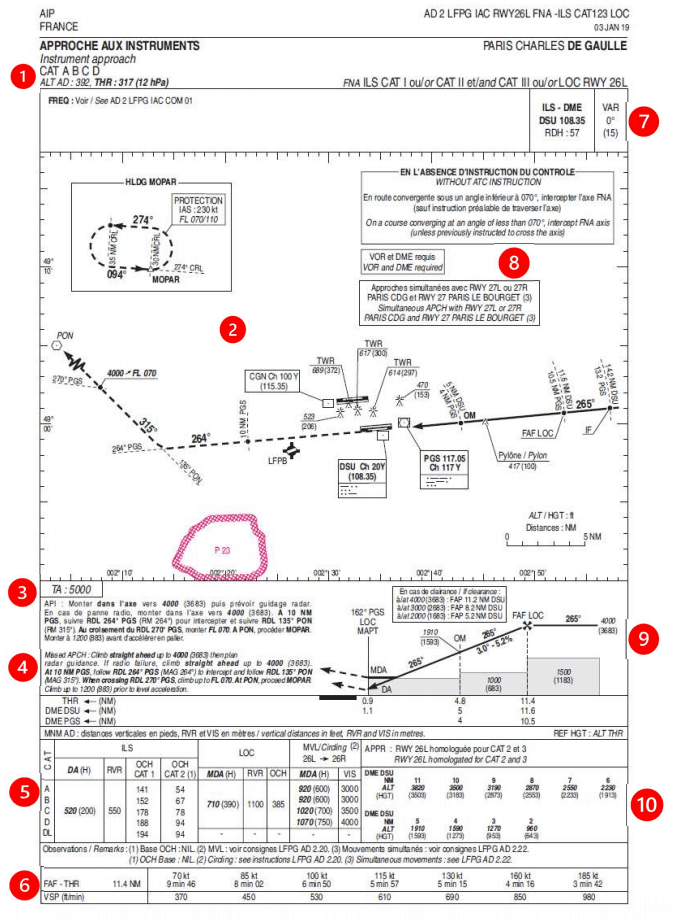
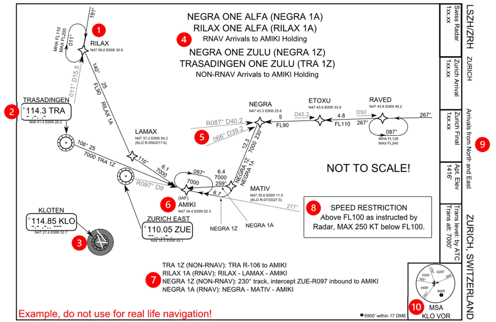
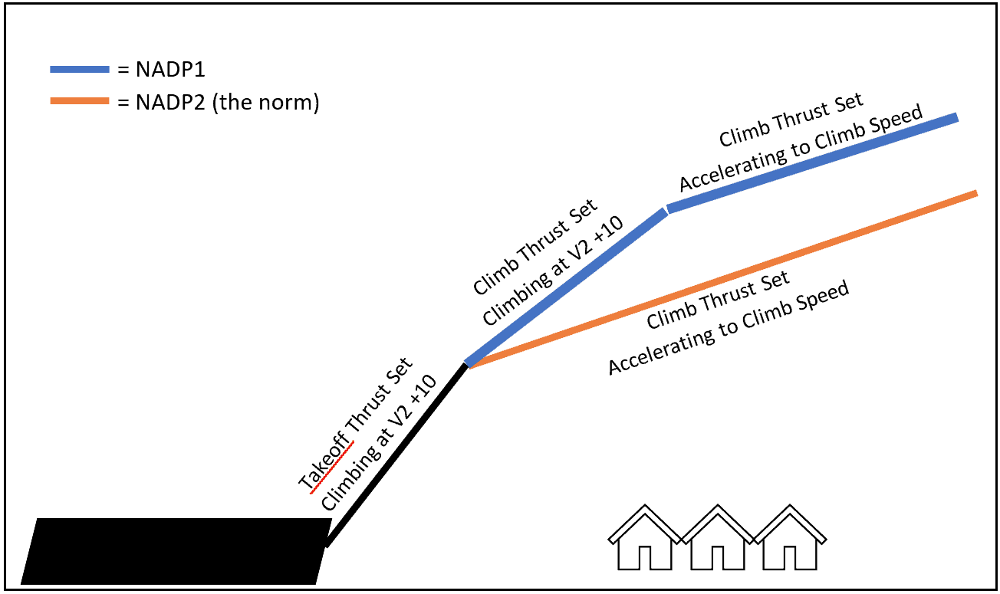

# Navigation

---

## Reading a Chart

### ^^Chart Sample 1^^

!!! info "Reading Chart Sample 1"

    === "1"

        The category of aircraft allowed to do this approach \(A, B, C & D\).

        The altitude of the airfield (392ft) and altitude of the runway touchdown (317ft)

    === "2"

        A top-down picture of the approach (solid line), go-around (dotted line), dangerous airspace (red area), the airport layout and obstacles nearby.

        A box in the top-left corner showing local holding waypoints (MOPAR) with speed limits (230 knots) and altitude limits (between FL070 and FL110).

    === "3"

        The transition altitude (5000ft).

    === "4"

        The missed approach described in text form.

    === "5"

        The minimums box for this approach.

    === "6"

        A box describing, depending on your groundspeed, how long it will take you to get to the runway from the first point you start to descend and what vertical speed is expected.

    === "7"

        The ILS frequency (108.35), its identifier (DSU) and that is has a DME linked to it.   The magnetic variation of the area (0 degrees).

    === "8"

        Special notes for this approach that may be different than normal.

    === "9"

        A side-on view of the approach, with starting altitude (4000ft), inbound course (265 degrees), slope of the glideslope (3.0) and distances to the runway for several points along the bottom.

    === "10"

        A distance-altitude check box, where the altitude you should be at for different distances is described. This is useful to check in case there are any issues with any of the radio beacons you are using.

 SIA, CC BY-SA 4.0 <https://creativecommons.org/licenses/by-sa/4.0>, via Wikimedia Commons

!!! info "NOTE"
    All approach charts, no matter the designer, will have this information provided to you as a bare minimum.

    However, the layout may be significantly different, so a quick 5 minutes to look at the chart can make all the difference before starting an approach.

***

### ^^Chart Sample 2^^

!!! info "Reading Chart Sample 2"

    === "1"

        One of the starting waypoints of the arrival (RILAX), including a holding pattern with Minimum Holding Altitude (FL110) and Maximum (FL200).

    === "2"

        A radio beacon used on this arrival (Trasadingen VOR), with its identifier (TRA), frequency (114.3) and Morse code (-.-..-).

    === "3"

        The airfield that this approach is designed for (Zurich), with the runway layout and an on-airfield radio beacon (Kloten VOR).

    === "4"

        The names of the arrivals and where they terminate (AMIKI).

    === "5"

        The location of the waypoint (NEGRA) defined by radio beacons (TRA & KLO), by the distance and direction from each of them (track 087 at 40.2 nautical miles/track 066 at 39.2 nautical miles).

    === "6"

        The initial approach fix or IAF (AMIKI), which is normally where the arrival will end and the approach chart will start from.

    === "7"

        A text description of the route for each arrival.

    === "8"

        Special notes for this arrival that may be different than normal.

    === "9"

        A box with ATC frequency information, the airport altitude (1416 feet) and the transition level and altitude (by ATC/7000ft).

    === "10"

        The minimum safe altitude (MSA), which below this you are in danger of hitting terrain. This is traditionally based on a 25 nautical mile ring around a VOR beacon (KLO), and different segments are split up by tracks into the beacon.

 El-mejor, CC BY-SA 3.0 <https://creativecommons.org/licenses/by-sa/3.0>, via Wikimedia Commons

***

## SIDs and STARS

As much as an airway might be the highway/motorway of the sky, SIDs and STARs are the roads that lead you to and from it. An airport will have multiple SID/STARs for each runway, which will take you a different direction usually to a waypoint which connects to an airway. The airport will publish a chart for each SID and STAR, which should be checked by the pilots and followed unless cleared to do otherwise.

### ^^SID (Standard Instrument Departure)^^

These are the roads away from the airport, navigating around obstacles while keeping the aircraft safe from others with altitudes. Usually, an IFR clearance that you receive on the ground will have a SID or some form of departure instruction, which will depart you from the runway in use and connect onto the rest of your flight plan.

 By Alexrk2 - own work, usingDigitale Topographische Karte 1:250.000, © GeoBasis-DE / BKG 2016 (GeoNutzV)Strategic noise maps (DF 4 and DF 8), European Environment
AgencyMinimum Noise Routing (SID), opennav.com, CC BY-SA 3.0, https://commons.wikimedia.org/w/index.php?curid=51978317

In the above image, you can see all the possible SID routes out of Munich Airport (EDDM). Although the diagram is a noise map, you can see that all routes have a common part to start with when they leave the runway, until they start turning away to their respective waypoints. This means that the noise of departing aircraft is confined to a particular area as best as possible, hopefully away from built up areas.

### ^^STAR (Standard Terminal Arrival Route)^^

Where a SID is the route out of an airport, the STAR is the way in. Extremely similar in design to the SID, this will route you down from the end of an airway normally, until ending at the start of the approach for the runway you are landing on. A STAR will have a route that also keeps it clear of obstacles/terrain etc. and give hard altitudes for the pilot to descend to when cleared. Some of these charts will also have holding patterns listed on them for controllers to keep aircraft out of the way to wait until the flow of traffic allows them to land.

***

## LNAV and VNAV

With the advent of more complex autopilots and reference systems inside aircraft, aircraft systems are now much more capable of knowing their position in three dimensions. From earlier technology such as the CIVA INS, to the complex fully automated RNP approaches without any radio guidance that we have now, the terms LNAV and VNAV have become commonplace within the airliner world.

### ^^LNAV (Lateral Navigation)^^

The earliest form of navigation would involve a compass and looking out of the cockpit windows for landmarks, or possibly setting a heading and correcting for weather over distance.

 By 港湾協会第九回通常総会富山準備委員会 - 港湾協会第九回通常総会富山準備委員会編、『富山県の産業と港湾』、1936年（昭和11年）5月、港湾協会第九回通常総会
富山準備委員会, Public Domain, https://commons.wikimedia.org/w/index.php?curid=49569993

LNAV allows for the aircraft to navigate across the world using fixed points in space, such as waypoints or radio beacons. These are defined using a latitude and longitude which are compared, in basic terms, against the aircraft’s known latitude and longitude to allow navigation towards them.

To know of the position of the aircraft, the Inertial Reference Systems (IRS) are aligned while the aircraft is stationary at the gate which sets a baseline position. This is then updated during flight using tracks and distances from radio beacons or has GPS data fed to it to keep accurate. Without these, as IRS systems are not perfect, the position becomes a guess, and the aircraft will slowly drift off route. This was a particular problem crossing the ocean on older aircraft, where there are no radio beacons and GPS was not invented yet, resulting in the aircraft being possibly miles off course when it eventually arrived overhead land.

### ^^Vertical Navigation^^

VNAV allows for an aircraft to climb and descend using a calculated path to optimise the flight.  It will maintain restrictions on SIDs and STARs, plan the ToD (Top of Descent) and minimise fuel burn while still allowing for the aircraft to get into a position to land. For VNAV to work correctly, the aircraft’s computer systems must be correctly set with the correct weights, route, weather and performance information.

With a good database inside the MCDU, the Airbus family can fly an entire SID or STAR with no interaction from the pilots, if the data has been checked beforehand. Speed and altitude restrictions are followed to match the chart information.

The Airbus Flight Management will try to calculate a 3-degree path from the start of the runway you are landing on, working backwards through your flight plan to achieve all the restrictions until it arrives at your current cruising altitude. This will generate a point on the Navigation Display for the top of descent where if the altitude is set lower than the cruising level, and you push for DES, then the aircraft will follow the 3-degree path. The altitude always needs to be set lower than your current altitude, as the Airbus will stop at whatever is set in the FCU i.e., it will not carry on with the VNAV path. Unlike the Boeing fleet, the Airbus will also not automatically descend at ToD and requires a descent mode to be selected.

***

## Noise Abatement (NADP1 vs 2)

To reduce the noise effects on local residents, some airports require the use of noise abatement procedures to help keep the noise levels down. On the airport, the reduction of the use of the APU and using more external power helps, plus the requirement to ban the use of anything more than idle reverse on landing unless the aircraft performance needs it. The big change that prevents a lot of noise is the use of NADP. These Noise Abatement Departure Procedures
change the way aircraft climb out from the airport to help keep noise levels down at buildings that are directly under the flightpath.

NADP1 requires you to climb to your thrust reduction altitude, but instead of accelerating at the same time, you hold the speed until you get to a higher acceleration altitude. This means that over the same distance, you will be higher than the normal procedure, also known as NADP2. And being higher over the buildings means you will generate less noise.

Airports will describe in their airfield documents which departure you should be doing, but the standard method of NADP2 is probably in 80/90% of airports across the world. Common example airports with NADP1 are Paris LFPG, San Francisco KSFO on certain runways and
Geneva LSGG.

 Credit - Shomas Pilot on Discord

***
