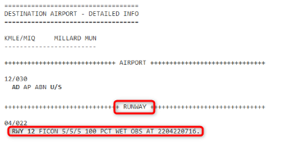

# Runways Conditions

The runway condition codes are provided in the ATIS or NOTAM report in the field condition report (FICON) section. 
It is important to note that not all states or countries have implemented FICONs and the report does not need to be 
generated if the runway is dry. The flight crew should always use all available weather information to determine 
what code to use for planning.

!!! tip "RWY Condition Codes"
    These will be in the form `X/Y/Z`, where X is the code for the first third of the runway length, Y is the code for the middle third of the runway length, and Z is the code for the last third of the runway length. See the [Runway Correlation Matrix](#runway-correlation-matrix) below for additional information.

    For our landing perf calculator:

    - 5 is Good
    - 4 is Good-Medium
    - 3 is Medium
    - 2 is Medium-Poor
    - 1 is Poor

    Codes are not required to be given when the runway is dry, so if no code is given, and there is no weather 
    information to the contrary, you can assume the runway is dry. Remember to use all available weather 
    information to make a determination of what code to use.

You should use the lowest code for the section of runway you will be using for landing. Normally, all runway sections should be considered, unless you are sure that your landing distance will allow you to stop or use a runway turnoff before the last third of the runway. For example, if the code is 5/3/3, you should use a code of 3 (Medium) for your landing distance calculation.

!!! block ""
    {align=left width=50%}

    It provides runway condition codes (the numbers X/X/X) for each third of the specified runway as well as a text description of the surface condition and the time of the report.

## Runway Correlation Matrix

| Runway  Condition Code |  Braking Action  | Representative  Surface Condition                    | Maximum Allowable  Crosswind for Landing |
|:--------------------------:|:----------------:|:---------------------------------------------------------|:--------------------------------------------:|
|             6              |       Dry        | Dry                                                      |                   38 Knots                   |
|             5              |       Good       | Wet  Up to 3mm (1/8") Snow or Slush                  |                   38 Knots                   |
|             4              | Good  Medium | Compacted Snow at or below -15°C                         |                   29 Knots                   |
|             3              |      Medium      | More than 3mm (1/8") Snow  Compacted Snow above 15°C |                   25 Knots                   |
|             2              | Medium  Poor | More than 3mm (1/8") Standing Water or Slush             |                   20 Knots                   |
|             1              |       Poor       | Ice                                                      |                   15 Knots                   |
