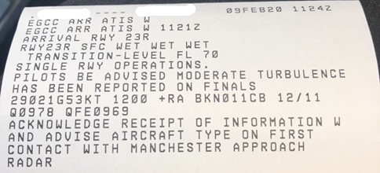

# Reading METARs/TAFs/ATIS
---

## METAR

These are weather reports created by an on-airport weather station and tend to be released every 30 minutes for most airports around the world. These have a standard layout as:

<sub>AIRPORT ID - DATE/TIME - WIND - VISIBILITY - WEATHER - CLOUD - TEMP/DEWPOINT - QNH - REMARKS

!!! info "Metar Decoding"

    === "AIRPORT ID"

        It always starts with the airport ID as the 4 letter ICAO code

        * EGLL = Heathrow UK
        * KDEN = Denver, USA etc.

    === "DATE/TIME"

        Then follows the Date and Time in the format of DDTTTTZ. So, the date in two digits, followed by the Zulu (UTC) time in four digits. The time is always referenced in Zulu no matter what time zone you are in. For example: 032050Z = The 3rd day of that month, 20:50Z or 8:50PM UTC time. If this is followed with AUTO, it means that the weather station is publishing the METARs without any intervention or checks by a human controller.

    === "WIND"

        The wind field is written as direction in degrees true followed by the strength in knots. So 36011KT is a wind of 11 knots coming from 360 degrees (north). Some countries still use meters per second (MPS) which will replace the KT so you know which measure is in use. A G can also be added for gusts, e.g. 36011G28KT.

        The letters VRB can replace the direction to say it is blowing in a variable direction. After the wind, there can be two directions with a V in between if a strong variable wind is blowing. 240V350 means the wind is varying between 240 degrees and 350 degrees.

    === "VISIBILITY"

        The visibility field comes next, with prevailing distance in meters in four digits and goes up to 9999 if it is greater than 10km visibility. Some countries use statute miles which will be labelled SM.

        If there is a minimum visibility in a certain direction, this will come next as the same format as the prevailing distance but with a direction afterwards in letters, for example 1500NW will mean that in the northwest direction it is down to 1500m.

        RVR is the final option, which shows the distance you can see down a runway in meters. It will be in the format of the runway designator/meters, and can have a D, N or U to show its decreasing, staying the same or going up, such as R28L/1000D.

    === "WEATHER"

        The weather field can have multiple codes written in it, to describe the current conditions.

        These can be mixed, with the max of one from each column at a time. For Example:

        ```
        -TSRA = Light Thunderstorms and Rain  
        +SHSN = Heavy Showers of Snow
        VCFC = Vicinity Funnel Cloud
        ```

        | First is Intensity | Second is Description | Third is the Weather |
        | -------------: | --------------: | -----------: |
        | Light (-) | Patches (**BC**) | Mist (**BR**) |
        | Moderate \( \) | Blowing (**BL**) | Dust Storm (**DS**) |
        | Heavy (+) | Drifting (**DR**) | Dust (**DU**) |
        | Vicinity (**VC**) | Freezing (**FZ**) | Drizzle (**DZ**) |
        | | Shallow (**MI**) | Funnel Cloud (**FC**) |
        | | Partial (**PR**) | Fog (**FG**) |
        | | Showers (**SH**) | Smoke (**FU**) |
        | | Thunderstorm (**TS**) | Hail > 5mm (**GR**) |
        | | | Small Hail (**GS**) |
        | | | Haze (**HZ**) |
        | | | Ice Crystals (**IC**) |
        | | | Ice Pellets (**PL**) |
        | | | Dust Devils (**PO**) |
        | | | Rain (**RA**) |
        | | | Sand (**SA**) |
        | | | Snow Grains (**SG**) |
        | | | Snow (**SN**) |
        | | | Squalls (**SQ**) |
        | | | Sandstorm (**SS**) |
        | | | Unknown (**UP**) |
        | | | Volcanic Ash (**VA**) |

    === "CLOUD"

        These can be described in a few ways, but with the cloud coverage followed by the height above the airfield in hundreds of feet. Multiple of these can be used at once to show layers.

        **Special Case - CAVOK**

        CAVOK, meaning ceiling and visibility okay, can replace all the visibility, weather and cloud fields if:

        * The visibility is greater than 10KM (written as 9999)
        * No CB or TCU reported
        * No cloud below 5000ft or the highest minimum safe altitude in the area
        * No significant weather

        This is for a clear, calm day with nothing to worry about in terms of weather and is what most pilots flying smaller aircraft look forward to seeing on the METAR report.

        | | Means | Example | Which Means |
        | :-------------: | :-------------- | -----------: | :----------- |
        | FEW | Few clouds (1/8-2/8 of the sky covered) | FEW005 | Few clouds at 500ft |
        | SCT | Scattered clouds (3/8-4/8 covered) | SCT010 | Scattered clouds at 1000ft |
        | BKN | Broken clouds (5/8-7/8 covered) | BKN020 | Broken clouds at 2000ft |
        | OVC | Overcast (completely covered) | OVC050 | Overcast at 5000ft |
        | CB | Cumulonimbus | FEW007CB | Few Cumulonimbus at 700ft |
        | TCU | Towering Cumulus | SCT012TCU | Scattered TCUs at 1200ft |
        | VV | Vertical Visibility (can't see a cloud base) | VV002 | Can see approx. 200ft up |
        | NSC | No significant cloud | NSC | Nothing to report |

    === "TEMP/DEWPOINT"

        Next is the temperature and dewpoint written as TT/DD. This is always in Celsius and can be listed with an M before each figure to indicate minus. For example, 02/M03 means 2° Celsius with a dewpoint of -3° Celsius

    === "QNH"

        The QNH is next, listed as four digits, started by either a Q for hPA or an A for in.Hg.

    === "REMARKS"

        And finally remarks. These can be quite extensive, especially in the USA, but common ones to keep your eyes out for are:

        | | Means | Example | Which Means |
        | :-------------: | :-------------- | -----------: | :----------- |
        | RE | Recent | RETS | Recent Thunderstorm |
        | WS | Windshear reported | WS RW12 | Windshear on Runway 12 |
        | TEMPO | Temporarily | TEMPO SHRA | Temporarily showers of rain |
        | BECMG | Becoming | BECMG CAVOK | Becoming CAVOK |
        | FM | From | FM 1530 RA | From 15:30Z rain |
        | TL | Until | TL 1630 | Until 15:30Z weather changes |
        | NOSIG | No significant weather | NOSIG | No significant weather to report |
        | NSC | No significant cloud <br>(can also replace the cloud field) | NSC | No Cloud to report |

        Things such as runway friction in contaminated conditions, military colour codes, temperature variations etc. can be labelled in the remarks too but this would be quite extensive to list them all and the ones above are the most common you will see.

### ^^METAR Examples Decoded^^

`EGLL 031150Z AUTO 26004KT 9999 FEW026 OVC035 08/07 Q0994`

London Heathrow, UK, weather recorded on the 3rd day of the month at 11:50Z time. Automatic observation by the weather station. Wind 260 degrees at 4 knots. Visibility 9999m (greater than 10km). Few clouds at 2600ft above the airfield, overcast clouds at 3500ft above the airfield. Temperature 8°C, dewpoint 7°C. QNH 994 hPa.

`LFPG 031130Z 21018KT 9999 FEW020 BKN024 BKN034 12/08 Q0997 TEMPO 25025G40KT 3000 SHRA FEW015CB SCT020TCU`

Paris Charles de Gaulle, France, weather recorded on the 3rd day of the month at 11:30Z time. Wind 210 degrees at 18 knots. Visibility 9999m (greater than 10km). Few clouds at 2000ft above the airfield, broken clouds at 2400ft above the airfield, broken clouds at 3400ft above the airfield. Temperature 12°C, dewpoint 8°C. QNH 997 hPa. Temporarily wind 250 degrees at 25 knots gusting 40 knots, 3000m visibility in showers of rain, few cumulonimbus clouds at 1500ft and scattered towering cumulus at 2000ft.

`VHHH 031130Z 10010KT CAVOK 20/11 Q1021 NOSIG`

Hong Kong International, weather recorded on the 3rd day of the month at 11:30Z time. Wind 100 degrees at 10 knots. Ceiling and visibility okay. Temperature 20°C, dewpoint 11°C. QNH 1021 hPA. No significant weather

`KJFK 031151Z 32012KT 9SM -SN OVC070 M01/M05 A2948 RMK AO2 SNE14B45 SLP981 4/011 P0000 60000 70002 T10111050 11006 21017 53013`

New York JFK, USA, weather recorded on the 3rd day of the month at 11:51Z time. Wind 320 degrees at 12 knots. Visibility 9 statute miles. Light snow. Overcast clouds at 7000ft. Temperature -1°C, dewpoint -5°C. QNH 29.48inHg. (This is then followed by remarks about the snow conditions and temperature variations, too much detail for this guide).

`EGCC 031120Z VRB2KT 1500 200SW R23R/150D R23L/100N FG VV000 8/8 Q1030`

Manchester, UK, weather recorded on the 3rd day of the month at 11:20Z time. Wind variable at 2 knots. 1500m prevailing visibility, 200m visibility to the south-west. Runway 23R has a visibility of 150m and decreasing, Runway 23L has a visibility if 100m but unchanging. Fog. Vertical visibility of 0, (cannot see upwards due to the fog). Temperature and dewpoint both 8°C. QNH 1030hPa.

***

## TAF (Terminal Area Forecast)

A TAF is a forecast of the weather that is going to be at that airport for a length of time. It follows a similar format as the METAR in using the same weather codes but has the addition of timespans and probabilities.

The timespans are written as date/hour, in the format DDTT/DDTT, so 0312/0409 will mean the timespan is from 12Z on the 3rd until 09Z on the 4th.

The probabilities are either 30% or 40%, 30 meaning unlikely and 40 meaning likely. These are written as PROB30 or PROB40. No idea why its these figures, just always has been!

### ^^TAF Example Decoded^^

`EGLL 031100Z 0312/0418 29010KT 9999 BKN024 PROB30 TEMPO 0312/0313 6000 RA BKN012 BECMG 0318/0321 21008KT PROB30 TEMPO 0403/0410 3000 BR BKN003 TEMPO 0410/0418 7000 -RA BKN008 PROB30 TEMPO 0415/0418 3000 RADZ BKN003`

London Heathrow, UK, TAF created at 1100Z on the 3rd day of the month.

Between 12Z on the 3rd until 18Z on the 4th, weather is primarily, wind 290 degrees 10 knots, visibility greater than 10km and broken clouds at 2400ft.

Probability of 30%, temporarily between 12Z and 13Z on the 3rd, 6000m visibility in moderate rain, clouds broken at 1200ft.

Weather changing and becoming, between 18Z and 21Z on the 3rd, wind 210 degrees 8 knots.

Probability of 30%, temporarily between 03Z and 10Z on the 4th, 3000m visibility in mist, clouds broken at 300ft.

Temporarily between 10Z and 18Z on the 4th, 7000m visibility in light rain, clouds broken at 800ft.

Probability of 30%, temporarily between 15Z and 18Z on the 4th, 3000m in rain and drizzle with clouds at 300ft.

What does this all mean to us though? The weather at Heathrow for the next 24 hours or so is going to be a bit wet, with short bursts of rain bringing the visibility and cloud down, that is about it really!


<sub> Sheba_Also 43,000 photos, CC BY-SA 2.0 <https://creativecommons.org/licenses/by-sa/2.0>, via Wikimedia Commons

***

## ATIS (Automatic Terminal Information Service)

Now using the METAR or TAF is good for seeing what is happening at an airport throughout the day or generally as a guide, but it does not tell us much about what is happening at the airport at the time when we want to land.

This is where the ATIS comes in, which is a message transmitted over a specific radio frequency that gives a spoken reading of the current weather and useful information on the airfield such as the runways in use or if any taxiways are closed. These are always started and ended with a letter, “Information Charlie”, which is told to the departure or approach controllers when you first speak to them to confirm that you have listened to the latest ATIS information. This message changes after so many minutes depending on the airport's updating frequency, and when it does, the next letter in the alphabet is then used at the start and end of the new message.

Now to make things easier, Digital ATIS is starting to be used throughout the world, which allows for the aircraft to print out a text version of the ATIS from a distance beyond the range of the radio frequency. This means that the workload in the cockpit is much less, as some ATIS radios can only be received in the descent. Here is an example of a DATIS:



<sub> Credit - Shomas Pilot on Discord "I guess you can see why I saved this one"

As you can see, this is information W, Whiskey for Manchester, UK EGCC. The weather information is written out in a METAR like format, but with the addition of a QFE as well.

The extra airfield information starting from the top on this particular ATIS is:

* The arrival runway (23R)
* The runway state (Wet at the start, middle and end)
* The transition level (FL70)
* That single runway operations are in effect
* That moderate turbulence has been reported (due to the 53kt wind!)
* And to acknowledge the information and tell them your aircraft type when you first contact the approach controller
