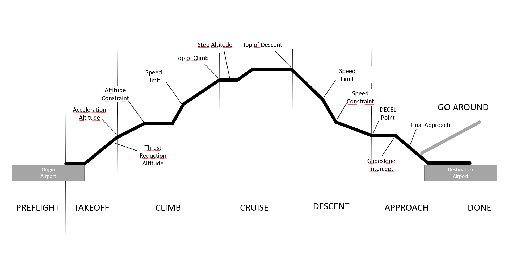

# Airbus Flight Phases

Current Airbus flight management systems (FMS) define a set of flight phases each flight will sequence through.

It is important to understand these flight phases as they have an impact on planning a flight as well as on the lateral
and vertical guidance of the aircraft.

The most prominent place, where these phases become visible are the FMS PERF pages where all phases, apart from
PREFLIGHT and DONE, have their own page.

## PREFLIGHT Phase

During the PREFLIGHT phase the pilot initializes the Flight Management Guidance Computer (FMGC) and sets up various
systems in the aircraft.

Flight planning and performance planning happen during this phase.

## TAKEOFF Phase

The TAKEOFF phase starts when applying take off thrust (FLX or TOGA) and extends until reaching the acceleration
altitude.

Autopilot can be engaged at 100 ft above ground or 5 seconds after takeoff, whichever is later.

At thrust reduction altitude, the thrust levers are normally set in the climb thrust detent (CL detent). The FMGC is in
managed mode at this point, guiding the aircraft vertically and laterally along the flight plan.

## CLIMB Phase

The CLIMB phase extends from the acceleration altitude to the top of climb (ToC) cruise flight level (displayed and
modifiable on the FMS PROG page).

The FMS guides the aircraft and commands acceleration when above the terminal area speed restriction altitude.

The system observes speed/altitude constraints that have been entered in the flight plan.

When all managed modes have been selected and confirmed, the FMS gives speed, altitude, and lateral guidance during
climb.

## CRUISE Phase

The CRUISE phase extends from the top of climb (ToC) point to the top of descent (ToD) point.

It may also include intermediate climbs as well as en route descents. At anytime, the pilot can define a step climb to
determine the cost and time savings of flying at a different flight level. Step climbs and descents are entered on the
FMS STEP ALTS page, which is accessed from a waypoint in the FMS F-PLN page.

The FMS transitions to the descent phase when a subsequent descent is initiated within 200 NM of the destination and no
preplanned step descent exists in front of the aircraft.

## DESCENT Phase

The DESCENT phase starts at the Top-of-Descent point (which is less than 200 NM from the destination) by pushing the
ALT knob for a managed descent or pulling the ALT knob for an open (selected) descent from the cruise altitude.

The pilot is required to confirm and initiate all descents from cruise altitude by pushing or pulling the ALT knob on
the FCU. The managed descent does not occur until the pilot initiates the descent following clearance from ATC.

## APPROACH Phase

The APPROACH phase starts when the pilot activates and confirms the approach on the PERF descent page, or when the
approach deceleration pseudo waypoint (DECEL) is passed and the aircraft is below 9500 ft AGL in managed flight.

## GO-AROUND Phase

The GO-AROUND phase is activated when the thrust levers are moved to the TOGA position while in the APPROACH phase. The
FMS then guides the aircraft through the missed approach procedure.

To return to the APPROACH flight phase, activate and confirm the APPROACH phase on the PERF GO-AROUND page.

## DONE Phase

The DONE phase is activated after the aircraft has been on the ground for at least 30 seconds or all engines are shut
down.

During the done phase, the FMS clears the active flight plan in preparation for reinitialization.
