# Descent Planning and Descent

This guide will explain the correct procedures to plan and fly a descent
from cruise altitude through STAR and Instrument Approach up to the final approach.

The actual final approach (ILS approach) will be covered by a separate chapter.

!!! warning "Disclaimer"
    The level of detail in this guide is meant to get a FlyByWire A320neo
    beginner safely from cruise level down to the ILS glideslope.

    A *beginner* is defined as someone familiar with flying a GA aircraft
    or different types of airliners. Aviation terminology and know-how is
    a requirement to fly any airliner even in Microsoft Flight Simulator.

    Also you will find many great videos on YouTube on how to fly the FlyByWire A32NX.<br/>
    Check out the FlyByWire YouTube Channel as well: [FlyByWire on YouTube](https://www.youtube.com/c/FlyByWireSimulations/playlists)

---

## Prerequisites

Aircraft is in `CRUISE` state and phase as per previous chapters

[Download FlyByWire Checklist](../../assets/FBW_A32NX_CHECKLIST.pdf){ .md-button }

## Chapters / Phases

This guide will cover these phases:

1. [Descent and Approach Planning](#1-descent-and-approach-planning)
2. [Starting the Descent](#2-starting-the-descent)
3. [Flying the STAR and Approach](#3-flying-the-star-and-approach)
4. [Intercepting ILS](#4-intercepting-ils)

---

## Base Knowledge: Route, Star and Approach

- __Basics__<br/>
  As we have learned in previous chapters a flight route begins with an origin airport and a SID to safely guide the aircraft away from the airport to the first waypoint on their actual route. Similar to a SID the arrival to an airport is done via a STAR (Standard Terminal Arrival Route) and an IAP (Instrument Approach, often APPR) to safely bring the aircraft into a position to land on the destination airport safely and with as little ATC communication as possible.

- __STAR__<br/>
  A Standard Terminal Arrival Route (STAR) ensures safe and efficient traffic from the last en-route waypoint to the initial approach fix (IAF) of the Instrument Approach (IAP). It separates aircraft, avoids conflicts and helps with noise abatement through specific routing, levels/altitudes, speed restrictions and checkpoints often with holding areas.

    One main objective is, to do this with a minimum of communication between the ATC controller and the pilot. As the STAR is part of the flight plan a pilot can simply continue from the normal route into the STAR if ATC has not given any other instructions. Sometimes ATC might give an explicit clearance for the STAR or change the STAR to manage traffic and landing situation (different runways, etc.).

    Often a STAR contains a clearance point which mustn't be passed without explicit clearance by ATC. If clearance is not given then a holding must be flown as described in the charts.

    Please also have a look at our airliner guide's SIDs and STAR section [SIDs and STARS](../airliner-flying-guide/navigation.md#sids-and-stars)

    Find a good overview over charts in our airliner guide: [Reading a Chart](../airliner-flying-guide/navigation.md#reading-a-chart)

- __Approach__<br/>
  The Instrument Approach (IAP or APPR) has similar objectives as a SID or STAR - safely bring an aircraft into a position to land while ensuring separation between multiple aircraft, avoiding terrain, support with noise abatement, etc.

    IAP are often designed for handling maximum traffic in even bad weather conditions. With only little traffic and good weather it is quite common that ATC instructs the pilot to leave the approach route by giving the pilot heading vectors for a more direct route to the Final Approach Fix (FAF, also called final approach point).

    When flying with Online ATC (VATSIM, IVAO, PilotEdge, ...) expect being vectored to the FAF quite often.

    Understand important ILS approach chart features here: [Approach Chart](../airliner-flying-guide/navigation.md#chart-sample-1)

- __ILS__<br/>
  The Instrument Landing System (ILS) is one of several modern forms of helping an aircraft during its final approach to land even in non-optimal weather situations. ILS uses a localizer for lateral guidance and a glideslope for vertical guidance from the Final Approach Fix down to a minimum at which the pilot needs to perform the final landing sequence visually.

    Modern airlines like the A320 are even able to use the ILS to land fully automatically as long as the runway's ILS supports it.

    Understand important ILS approach chart features here: [Approach Chart](../airliner-flying-guide/navigation.md#chart-sample-1)

!!! info "Microsoft Flight Simulator and navigation charts"
    Although Microsoft Flight Simulator allows some flight planning through the user interface it is highly recommended to use navigational charts when flying airliners. MSFS' flight planning does not provide sufficient information to correctly fly a STAR or an approach.

    There are several good sources for charts - free or subscription based. A good free solution is [Chartfox](https://chartfox.org/) which only requires a free VATSIM account. One of the most known subscription based sources for charts is [Navigraph](https://navigraph.com/home). It is planned to integrate both solutions into the FlyByWire A32NX flyPad in the future.

    Also, often a simple internet search will do the trick: Search for "&lt;airport icao code&gt; charts": E.g., "EDDM charts"

---

### 1. Descent and Approach Planning

!!! warning "Pilot's responsibility"
    It is the sole responsibility of the pilot to conduct proper flight planning and especially proper descent planning. It is not at all ATC's task to do descent planning for pilots by giving descent instructions. On the other hand ATC often actually gives descent instructions, especially on common routes, as they want the aircraft in their responsibility to be at certain altitudes when approaching the destination airport. Nevertheless pilots must know when approaching their top of decent and if necessary need to pro-actively request clearance to descend from ATC.

    Good descent and approach planning is the foundation for a successful landing. It has to be done early during the flight or even before the flight.

**Situation:**

- Aircraft is in `CRUISE` state and phase as per previous chapters.
- Distance to destination is ~200NM (on a short flight start as early as possible and maybe even before the flight).

#### Important Data Points for Descent Planning:

- **Cruise Flight Level:** The higher we fly the earlier we need to start descending. Also for short flights a too high cruising altitude can make it impossible to actually descend to the destination airport in time. Therefore verify your flight plan if overall distance and flight level make sense.
- **Flight Plan Constraints:** STARs often have flight level (FL) or altitude constraints which we must adhere to. We must plan our descent so we can meet these altitude constraints even when they themselves are still far away from the destination airport.
- **Speed**: STARs also regularly have speed constraints which we need to take into consideration as slowing down will cost time and is hard to do while descending. If we start our descent too late we might not be able to slow down in time as required by a constraint.
- **Aircraft capability and passenger comfort:** Although not a big concern in the A320neo, general aircraft capabilities and passenger comfort also come into play. Descending with -4000ft/min is no fun for a passenger.

#### Step-by-step Guide for Descent Planning:

1. Read the STAR chart and determine if there are altitude and/or speed constraints which we need to consider.
2. Consider the STAR and APPR route as optional and do not count on them to be flown and available for descending. ATC might want to vector us to a different runway or at least shortcut our approach. But they won't be able to if we are still too high for the final approach.
3. Determine the first constraint you need to meet. This could be a STAR waypoint with an altitude constraint, the Final Approach Fix altitude or even the airport (or runway) elevation itself.
4. Calculate the required distance needed to descend to that waypoint with a standard descent angle of 3°. We can use the FlyByWire flyPad in the cockpit or a simple rule of thumb calculation (details below).
5. Use the MCDU PROG page's DIST function to read out the current distance to this waypoint. It is also possible to use the MCDU flight plan page, maps or the NDs distance rings to help determining the current distance.

    {loading=lazy width=45% align=left}

    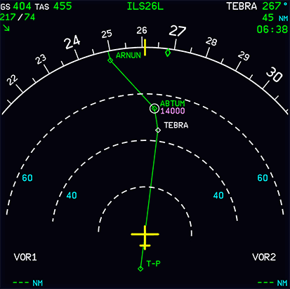{loading=lazy width=45% align=right}

??? tip "FIX INFO in Development Version"
    ##### Fix Info Distance Ring

    Also a great aid for knowing when to descend is the new FIX INFO feature available in the Development Version.

    You can add a ring around a waypoint or fix with a specified distance. As we need 57NM for our descent from FL320 to FL140 at ABTUM we can set the fix distance ring to 57NM.

    Now we can easily see or TOD (top of descent) on the ND.

    !!! block ""

        {loading=lazy width=45% align=left}

        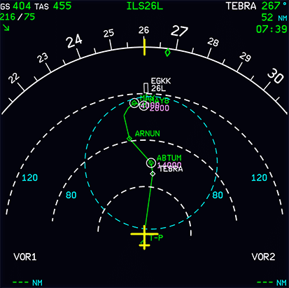{loading=lazy width=45% align=right}

    The MCDU FIX INFO page can be access by selecting the first waypoint on the F-PLN page and pressing LSK 1L "FIX INFO".

    See our feature guide [Fix Info](../advanced-guides/flight-planning/fixinfo.md) for how to use this function.

    !!! warning "Available in the Development version!"

#### How to Calculate the Required Distance for Descent

**Example data:**

- Flight to EGKK via STAR TEBRA 2G.
- Flight level FL320.
- STAR constraint at waypoint ABTUM "at FL140".

**Example chart:**

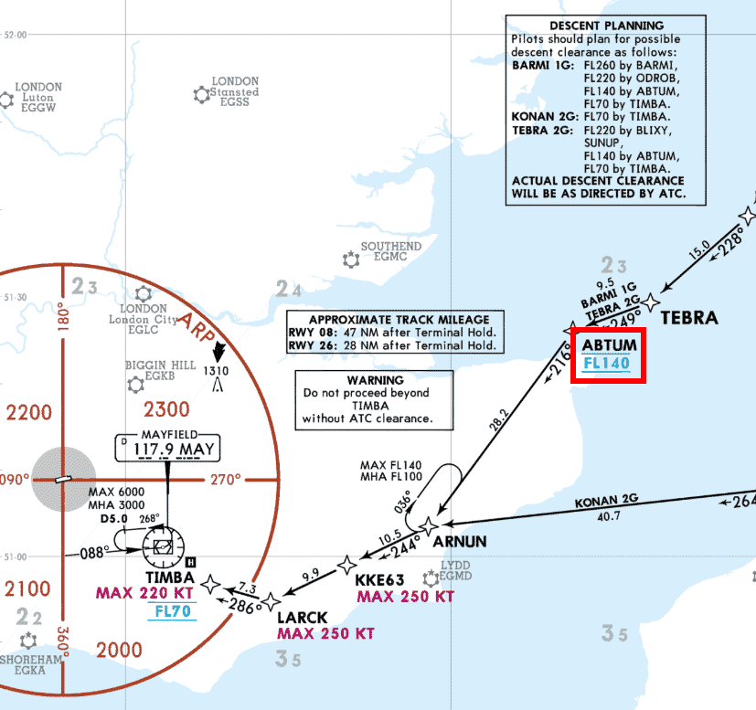{loading=lazy}<br/>
<sub>*Copyright © 2021 Navigraph / Jeppesen<br/>
"Navigraph Charts are intended for flight simulation use only, not for navigational use."*

**Using the flyPad:**

Standard calculation with 3° descent path:
{loading=lazy}

Calculation with a specific distance to calculate the required descent velocity (V/S):


**Using "Rule of Thumb":**

```
Distance = "Altitude difference" * 3 / 1000 + margin**

Altitude difference: 32000 - 14000 = 18000
Times 3:             18000 * 3 = 54000
Divided by 1000:     54000 / 1000 = 54
Plus margin (~10%):  59 NM
```

Margin can be lower for headwind and larger for tailwind. Some pilots also change the margin to compensate for slowing down while descending.

As can be seen on the chart there will be a further descent to TIMBA at FL70 and after that (not visible on the chart above) there will be a descent to the final approach which will be at 2000ft at the Final Approach Fix FF26L.

The same methodology/calculation as our initial descent can be applied to these descents as well but they require less planning as they are usually designed in a way that an aircraft with a 3° descent angle can make these descents with ease.

ATC will quite often instruct certain altitudes within the STAR and APPR which deviate from the STAR and APPR charts. Please expect such instructions at any time.

#### Advanced Arrival Planning

!!! warning "Important Notice"
    The following is a more advanced process for planning our arrival. It is obviously important when we want to have a more realistic experience but in Microsoft Flight Simulator you can skip this part for now. <br/>
    Also this process is best done with an Online ATC service as the built-in MSFS ATC does not provide the necessary information at the right time.

Before we descend we should also reconfirm our destination runway and input or update our destination data into the MCDU PERF APPR page.
This is typically done about 50NM before the starting the descent.

!!! info "Honeywell MCDU and PERF APPR Page"
    It is important to note that when entering a value in the `TRANS ALT` field on this page that the flight crew reference the appropriate `TRANS LVL`. In this spec of the MCDU, Honeywell has not yet corrected the field to reflect `TRANS LVL` as the value required.

    As a quick reminder, when descending from cruise the flight crew is moving from a "Flight Level" to a local altimeter for arrival which is where the `TRANS LVL` value is derived from. 

{loading=lazy}

We can obtain this data from the destination airport's ATIS information and the airport charts.

From ATIS we get: `QNH`, `TEMP`, `MAG WIND` and `TRANS LVL` - if not refer to the approach chart.

ATIS Example:
```
GATWICK INFORMATION K TIME 2020, RUNWAY IN USE 26L
TRANSITION LEVEL FL70, SURFACE WIND 260,7 KNOTS
CAVOK TEMPERATURE +16, DEW POINT +12, QNH 1018,
ACKNOWLEDGE RECEIPT OF INFORMATION K AND ADVISE AIRCRAFT
TYPE ON FIRST CONTACT
```

From the chart we get `Trans level` and `BARO` (=DA or MDA) or `RADIO` (=RA or DH). 

- CAT I ILS uses DA or MDA and is entered into the `BARO` field.
- CAT II/III ILS use RA or DH which is put in the `RADIO` field.
- `BARO` is based on barometric altitude whereas `RADIO` is based on radio altitude (distance to ground).

For more information on the different types of minimums see the [Minimums and MDA/DH](../airliner-flying-guide/approaches.md#minimums-and-mdadh) section on the [Approaches](../airliner-flying-guide/approaches.md) page in the airliner flying guide.

!!! tip "Trans level: By ATC"
    In the particular example below the `Trans level` field states `By ATC`. If you are not flying on a network such as Vatsim or IVAO you can try the following things:

    - Search online for the real life D-ATIS at your arrival airport (much like the ATIS example above).
    - Use the `Trans ALT` + 1000 ft.
        - **Development Version:** If you have imported your flight plan via our simBrief integration this value would be autopopulated for you.  

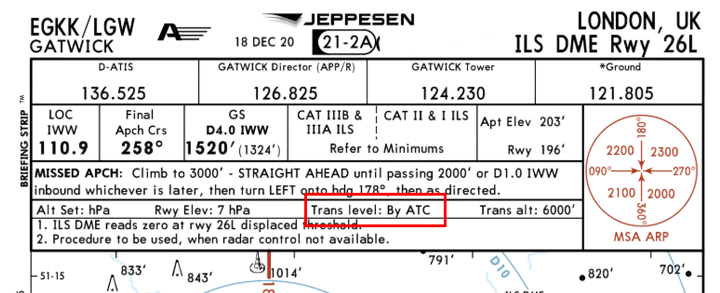{loading=lazy}<br/>
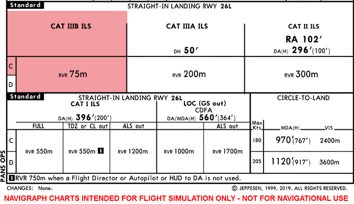{loading=lazy}<br/>
<sub>*Copyright © 2021 Navigraph / Jeppesen*

The A320neo is capable of a CAT IIIB ILS approach and has an approach category of "C" - see the red area on the chart. (see [Wikipedia Aircraft approach category](https://en.wikipedia.org/wiki/Aircraft_approach_category){target=new})

In this chart for EGKK 26L ILS there is no DH for CAT IIIB defined - so we can enter "NO" or "NO DH" into the `RADIO` field.

If we are using Microsoft Flight Simulator without any Online ATC services (VATSIM, IVAO, PilotEdge, ...), and using the MSFS built-in ATC, you usually can't request ATIS information for the destination airport at this point. MSFS ATC makes ATIS only available once close to the destination airport.

If we are flying with Online ATC you can request ATIS via the `MCDU-ATSU-AOC` page or your Online ATC network's client at this time.

We can in any case request the METAR weather information for the destination airport via the same page.

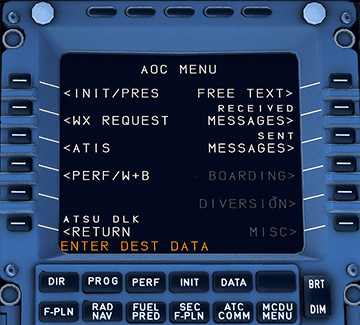{loading=lazy}

If we used Simbrief for flight planning we can also see METAR information on the flyPad after importing the Simbrief plan to the flyPad.

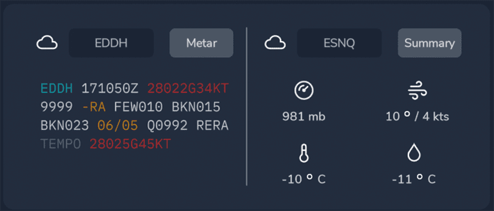{loading=lazy}

Once we have confirmed the destination runway and the destination data we are set for the approach and we can continue focus on the descent.

This concludes *Descent and Approach Planning*.

---

### 2. Starting the Descent

**Situation:**

- Aircraft is in `CRUISE` state and phase as per previous chapters.
- Descent and approach planning is done.
- First descent point (altitude at certain waypoint) is identified.
- Distance to descent point is calculated, which is called TOD (top of descent).

A few minutes before we reach our calculated descent point (TOD) we request clearance for descent from ATC if not already given a descent instruction before.

**Do NOT start the decent without clearance from ATC.**

!!! info "TOD marker A320"
    The FlyByWire A32NX has not implemented the TOD (top of descent) marker on the `ND` yet. Usually the A320 has a downward pointing arrow at the TOD to support the pilot with the decision when to descent. Ultimately it is still the pilot's responsibility to calculate and validate the TOD.

When clearance is given we can start our descent to the flight level or altitude ATC has given us.

For descending we set the new flight level or altitude in the `FCU` with the `altitude selector`. We can then either push the selector for Managed Altitude Mode (constraints are respected, also know as VNAV) or pull the selector for `Selected Altitude Mode` (constraints are ignored). You can also use the `V/S selector` to set a specific descent vertical velocity. Pull the `V/S selector` to start the descent.

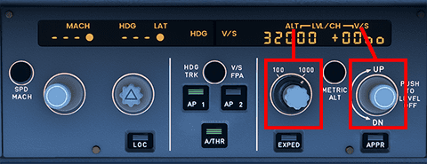{loading=lazy}

ATC typically will not clear us to our final target altitude directly but will give us several step descents down to our required altitude.

Also ATC will often still expect us to respect the STAR's constraints although they might have given us a lower clearance. We should then only descent to the constraint's altitude.

<!-- TODO: update when vertical nav is available -->
!!! info "VNAV in the FlyByWire A32NX"
    The scenario that we are cleared to a lower altitude or flight level with altitude constraints above the clearance is an ideal scenario for the called so "VNAV" autopilot mode which would be activated by using "`Managed Altitude Mode`" (pushing the `ALT selector`). The autopilot will automatically level off at the constraint and continue descending when the constraint is no longer valid.

    Unfortunately the current version of the FlyByWire A32NX does not yet support VNAV. This is planned to be implemented in one of the next versions.

We repeat the process until we have reached our desired final approach altitude.

!!! info "Airline SOPs"
    Some airline's SOPs (standard operating procedures) might have a different order for the following steps.

#### At 10,000ft Procedure

- `LAND` lights selector: SET
    - `LAND` lights may be switched ON, according to the airline policy/regulatory recommendations
    - Landing lights on the A320neo cause drag as they are extended from under the wings
- `SEAT BELTS` switch: ON
- `EFIS` Option push button: `CSTR` on both sides
- `LS` push button: As required
    - Select `LS`, if an ILS, GLS or LOC approach is intended
    - The PFD displays the LOC and glide scales and deviation symbol, if there is a valid /LS or GLS signal.
    - Check that the /LS/GLS identification is displayed on the PFD.
- `RAD NAVAIDS` (`RNAV` page on MCDU): Selected/Identified
    - Ensure that appropriate radio NAVA/OS are tuned and identified.
        - Currently the FlyByWire A32NX does not auto tune NAVAIDS
    - For NDB approaches, manually select the reference NAVAID.

#### Approach Checklist

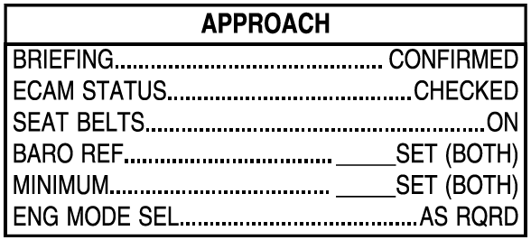{loading=lazy width=40%}

#### Cabin Crew

In real life the cabin crew will be asked to prepare the cabin for landing at some point during the descent. The exact moment and process might differ between airlines but most seem to do this when the Seatbelt Signs are turned on (typically at the latest at 10,000ft).

The Cabin Crew will notify the pilots either by a "Cabin Ready" button (A320neo) or by a call to the cockpit (A320ceo) once they are ready and strapped in themselves. Typically we will be in final approach by that time.

This concludes *Starting the Descent*.

---

### 3. Flying the STAR and Approach

**Situation:**

- Aircraft is in `DES` phase.
- Descent has started (we are after TOD).
- We have not yet reached the first waypoint of the STAR.
- `MCDU PERF APPR` page is filled (beginner can skip this - see chapter [Advanced arrival planning](#advanced-arrival-planning)).

Flying the STAR and Approach is very similar to any other part of the route within the flight plan. Apart from descending and adhering to constraints the lateral flight path just follows the programmed route.<br/>
 Let the __Autopilot__ do this for you and just adjust altitude and speed according to the charts or the ATC instructions.

!!! info "Passing 10,000ft"
    If we are passing 10,000ft within the STAR remember the [At 10,000ft Procedure](#at-10000ft-procedure) and the [Approach Checklist](#approach-checklist) from the previous chapter.

At some point during the descent and when close enough to the airport we will be instructed by ATC to contact ATC Approach for the airport we are flying into.

Be prepared for ATC instructions to deviate laterally from the STAR or Approach route to separate from other aircraft or to shortcut the approach when there is little traffic. ATC will then typically give you new heading instructions (heading vectors) and will guide you the rest of the STAR and Approach with additional heading instructions up until intercepting the ILS localizer.

**Example for shortcuts:**

ROKIL STAR/Transition EDDM (Munich) 26R - it is only in times with a lot of traffic that we would have to fly the whole downwind part of this transition.

{loading=lazy}<br/>
<sub>*Copyright © 2021 Navigraph / Jeppesen<br/>
"Navigraph Charts are intended for flight simulation use only, not for navigational use."*

---

### 4. Intercepting ILS

**Situation:**

- Aircraft is in `DES` phase.
- Aircraft is setup for flight <10,000ft (`seat belt signs` on, `landing lights` on, etc.).
- We are either within the IAP (Instrument Approach) and at the correct altitude and speed or at a heading vector, altitude and speed instructed by ATC.

At the end of the Instrument Approach (or by ATC vectoring) we will be on a path to the Final Approach Fix and/or intercepting the ILS localizer and eventually the ILS glidescope.

To intercept the ILS we need to be on the correct altitude and should not have an approach angle larger than 30°.

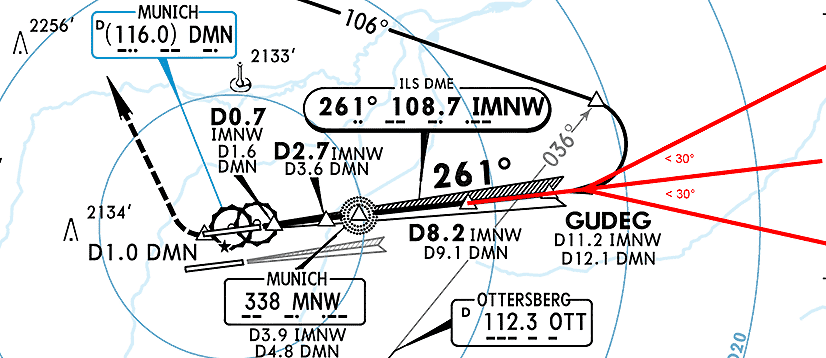{loading=lazy}<br>
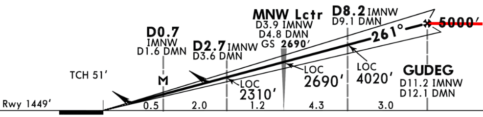{loading=lazy}<br/>
<sub>*Copyright © 2021 Navigraph / Jeppesen<br/>
"Navigraph Charts are intended for flight simulation use only, not for navigational use."*

More details regarding the ILS approach and landing in the next chapter.

This concludes *Intercepting ILS*.

Continue with [Final Approach and Landing](landing.md)
