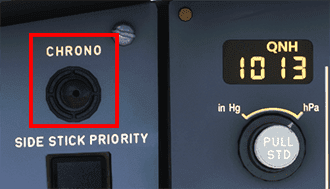
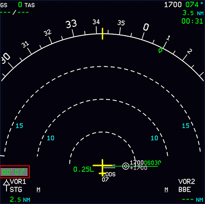
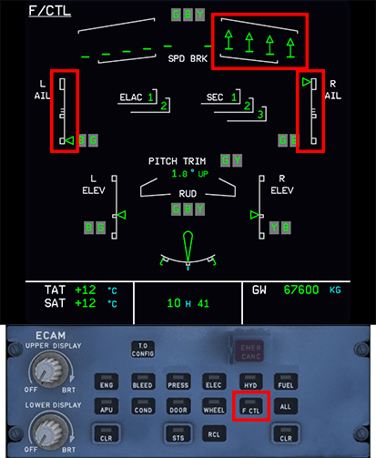
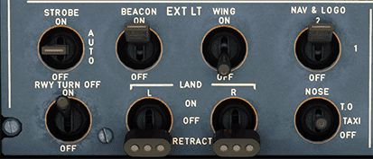
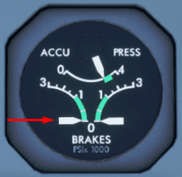
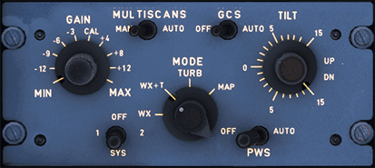
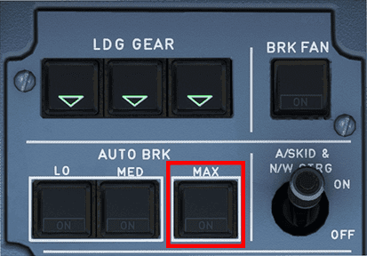

# Engine Start and Taxi

This guide will explain the correct procedures to accomplish a pushback with engine start and perform a safe taxi to the departure runway.

!!! warning "Disclaimer"
    The level of detail in this guide is meant to get a FlyByWire A320neo beginner safely from the terminal to the runway hold short point.

    A *beginner* is defined as someone familiar with flying a GA aircraft
    or different types of airliners. Aviation terminology and know-how is
    a requirement to fly any airliner even in Microsoft Flight Simulator.

    You will find many great videos on YouTube on how to fly the FlyByWire A32NX. 
    Check out the FlyByWire YouTube Channel as well: [FlyByWire on YouTube](https://www.youtube.com/c/FlyByWireSimulations/playlists)

---

## Prerequisites

- BEFORE START checklist completed
- IFR clearance obtained
- The aircraft is secure
- APU MASTER SW - `Set to ON` and the APU is available
- Beacon light - `Set to ON`

At this time we may request for clearance to push and start from ATC.

[Download FlyByWire Checklist](../../assets/FBW_A32NX_CHECKLIST.pdf){ .md-button }

---

## Chapters / Phases

This guide will cover these chapters:

1. [Pushback](#pushback)
2. [Engine Start](#engine-start)
3. [After Engine Start](#after-engine-start)
4. [Flight Controls Check](#flight-controls-check)
5. [Taxi](#taxi)
6. [General Resources](#general-resources)

---

## Pushback

There are several options available to you in MSFS to achieve a successful pushback.

- The flyPad (EFB) ground control screen
- MSFS built in ATC pushback controls
- Third party pushback addons

### Before Pushback

Once all passengers have boarded and secured we are ready to begin pushback.

Ensure:

- All doors to the aircraft are armed and secure.
- EXT power has been disconnected.
- APU BLEED - `Set to ON`

### Pushback Clearance

For this guide we will assume you are parked at gate 10 at EGFF (Cardiff).

Contact ground ATC and inform them you are ready for push and start. If you are on a network such as VATSIM, a typical response from ground would give you clearance for your request and a direction to face (or any direction). At EGFF you could expect the following push and start clearance from ground:

"** Your Aircraft Callsign**, ground. You are clear to push and start onto Alpha 3 facing east."

At this point we may begin pushback away from the terminal onto the taxiway Alpha 3.

{loading=lazy}
Copyright © 2021 Navigraph / Jeppesen 
"Navigraph Charts are intended for flight simulation use only, not for navigational use."

---

### How to Pushback

The FlyByWire A32NX has a ground operations page on its built-in flyPad EFB (Electronic Flight Bag). This page allows to control the pushback of the aircraft and other useful ground operations such as calling the jetway, baggage or catering, etc.

Although Microsoft Flight Simulator also has some pushback functionality built into the default ATC service this guide will only cover the A32NX pushback functionality.

{loading=lazy}

!!! block ""
    {loading=lazy align=left width=30%}
    
    After we received clearance to pushback we will call the pushback tug by pressing the `Call Tug` button on the flyPad.

    If a pushback tug is available at this gate or stand it will then start attaching itself to the nose wheel.

    !!! warning ""
        Some airports / gates / stands do not show a tug. This functionality still works and you can push back as if a tug is attached. It looks like an invisible tug is pushing the aircraft.

After the tug is attached to the nose wheel we can start pushing back by using the control buttons or the rudder and 
elevator controls.

See the flyPad documentation for more details: [flyPad Pushback](../../fbw-a32nx/feature-guides/flypados3/ground.md#pushback)

---

## Engine Start

Once we are clear of the terminal and/or the ground crew has notified the flight crew it is clear to start engines, we can proceed with the following steps.

Start the chronometer above the ND to help monitor the start up time of the engines.

{loading=lazy}

!!! info "Using the Chronometer"
    The chrono button has three states depending on how many times you have pushed the button:

    1. First Push - Starts the timer on the ND
    2. Second Push - Stops the timer on the ND
    3. Third Push - Removes the timer from the ND

    Time is represented as *minutes*' *seconds*" i.e. 04'41" equates to 4 minutes and 41 seconds.

    **Use Cases**

    There are a few different reasons pilots use the chronometer on the ND:

    - Engine startup times.
    - Duration of flight.
    - Certain procedures such as a visual pattern or circling approach.

    Location on the ND:

    

For this guide will begin by starting engine 2.

!!! info ""
    **Differing airline SOP may have a different engine start order**

!!! note "Note: Bleed Air"
    The A320neo needs pressurized air to start the engines. This pressurized air is usually generated by the APU for the start of the engines. This is called bleed air as it is a byproduct of a running jet engine where pressurized air is taken from the engine to be used on other systems.

    **To start the engines, you need to have the APU available and the APU Bleed ON.**

    In real life you can start the second engine with bleed air (X-Bleed) from the first engine. This is not yet implemented in the A32NX. It would usually not be used at the gate as the APU would be running anyway but it is used during single engine taxi when the second engine is started while rolling to the runway.

    Also, in very rare cases the gate or a mobile ground unit has pressurized air to be connected to the aircraft so the first engine can be started without APU. This is usually done when the APU is INOP. Microsoft Flight Simulator does not provide this option.

=== "Start Engine 2"
    1. Set the `ENG` mode selector to `IGN/START`
        - Flight crew should hear the packs turn off.
        - The lower ECAM should automatically display the engine parameters screen.
    2. Set `ENG 2` Master to the ON position.
        - Pay attention to the ECAMs and note engine parameters as ENG 2 starts up.
        - The engine should take roughly 1 minute to complete its start up sequence - use the chronometer started earlier to time this.

    Engine 2 will have successfully started when the following applies (at ISA sea level):

    - N1 is at roughly 19%
    - N1 reported `AVAIL`  
    - N2 is at roughly 68%
    - EGT settles at about 520°C
    - FF is at roughly 290 kg/h

=== "Start Engine 1"
    1. Set `ENG 1` Master to the ON position.
        - Pay attention to the ECAMs and note engine parameters as ENG 1 starts up.
        - The engine should take roughly 1 minute to complete its start up sequence - use the chronometer we started earlier to time this.

    Engine 1 will have successfully started when the following applies (at ISA sea level):

    - N1 is at roughly 19%
    - N1 reported `AVAIL`  
    - N2 is at roughly 68%
    - EGT settles at about 520°C
    - FF is at roughly 290 kg/h

---

## After Engine Start

Complete the after start flow:

- Set the `ENG` mode selector to `NORM`
- FLAPS - `Set`
    - As defined in the MCDU Preparation guide.
    - Note: If taxiing in icing conditions with rain, slush or snow:
        - Maintain the flaps retracted until the aircraft reaches the holding point of the takeoff run. This action prevents contamination of the slats/flaps mechanism.
- GROUND SPOILERS - `Arm`
- APU BLEED - `Set to OFF`
- APU MASTER SW - `Set to OFF`
- ANTI ICE - `As required`
    - Consider when temperatures are less than 10C and visible moisture.
- PITCH TRIM - `Check`
- RUDDER TRIM - `Zero`

{loading=lazy}

Perform the AFTER START checklist.

!!! info "Setting Pitch Trim Advice"
    While setting the pitch trim is standard operating procedure, a precisely set trim value on the trim wheel is not critical. As long as your center of gravity (CG) is within CG limits, any trim setting within the green band will provide for a safe takeoff in the A320neo. Appropriate trim settings can be found at the bottom of our [checklist](../../assets/FBW_A32NX_CHECKLIST.pdf).

    There is a rotation law in the NEO that gives you a consistent rotation rate for any given stick input regardless of other conditions. Upon liftoff, the autotrim becomes active.

    ---

    !!! block ""
        {loading=lazy width=50% align=left}

        For this flight take a look at your throttle quadrant and look for the trim markings closest to the throttle levers. Based on the [Preparing the MCDU](preparing-mcdu.md) section we have a general estimate of 30.5 for our CG.

        The FlyByWire checklist's trim section at the bottom indicates we would need to set a nose up trim of about 0.2.

    !!! warning "The CG scale available in the Asobo's model of the flight deck not entirely accurate for the A320neo."

---

## Flight Controls Check

Airlines may perform the flight controls check at different points depending on their SOP. Most notably the common instances are:

- After completing the AFTER START checklist and before taxi.
- During taxi out.

### Performing a Flight Controls Check

Using the ECAM control panel press the `F/CTL` button to switch the lower ECAM to the flight controls. Ensure all flight controls are displayed in green.

The `F/CTL` ECAM page displays a white scale and green index for the following positions:

- Left and right ailerons position
- Left and right elevator position

Fully deflect the sidestick in all directions and observe that the full range of motion is reflected on the ECAM page. Note the upward arrows in the `SPD BRK` area when moving the ailerons and ensure those are displayed when deflecting the side stick.

Move the rudders and pay attention to the rudder symbol to ensure it moves all the way to the left or right.

**Sidestick right full deflection:**

{loading=lazy}

---

## Taxi

!!! info "Taxi Speed + Engine Thrust"
    The A32NX is perfectly capable taxiing with idle thrust and even gradually accelerate. In certain situations it may be required to provide some thrust to begin rolling.

    Standard behavior is to allow the aircraft to reach 30kts and apply brakes to 10kts. Repeat as necessary.

Having charts or diagrams of the airport you are currently in will help you navigate efficiently and safely. There are many resources and applications available online that are either free or paid which you can utilize.

For additional information on signs and markings on the ground please see [General Resources](#general-resources) below.

### Taxi Clearance

After having successfully started the engines we can contact ATC to request taxi clearance. As per our routing in the [Preparing MCDU Guide](preparing-mcdu.md) we should be expecting a takeoff from runway 30. As such a sample taxi clearance may be as follows:

"**Your Aircraft Callsign**, ground. Runway 30, taxi via Alpha, hold short of 30 on Alpha 2."

Referencing the airport chart below, the aircraft should be sitting on the Alpha taxiway near the Alpha 3 holding point. Luckily today our clearance is quite simple and we only have to taxi straight ahead and hold at Alpha 2.

{loading=lazy}
Copyright © 2021 Navigraph / Jeppesen 
"Navigraph Charts are intended for flight simulation use only, not for navigational use."

Make sure to pay attention to any warnings or notices on the respective taxi chart beforehand so you are aware of any important information while performing your taxi.

Once we have the routing from ATC and have read back the taxi clearance, we are now free to taxi to the runway.

### Moving the Aircraft

Exterior Lights:

- RWY TURN OFF - `Set to ON`
- NOSE - `Set to Taxi`

{loading=lazy}

Before Moving Safety Check:

- Verify the ground crew is safely away.
- Look to the left and right to ensure clearance from other aircraft or vehicles.
- Release the parking brake.
- Brakes pressure - `Check at Zero`

At this point the aircraft may start rolling. Depending on the weight of the aircraft we may need to add a little power to the engines to get going. Increase power to roughly ~25-30% N1. Be mindful that we are not blasting N1 towards or around the terminal.

- Leave a bit of thrust on and perform a quick brake check to ensure hydraulics and brakes are fully functioning.
    - We don't need to come to a complete stop but merely check the brake pressure status when performing the brake check.
- If an arc is shown above the brake temperature on the WHEEL SD page on the lower ECAM, turn the brake fans on.

If it is required to perform a sharp turn immediately we may need more than ~25-30% N1 and should set the thrust accordingly. Try not to perform the brake check while in a turn as we don't want to come a complete stop while turning.

### During Taxi

While underway to the runway perform the following as part of the taxi flow:

- Use the tiller or rudder pedals to steer the aircraft.
    - See [Nose Wheel and Tiller Operation](../../fbw-a32nx/feature-guides/nw-tiller.md)
- Perform a [flight controls check](#flight-controls-check) (if you haven't already).
- Verify the ATC clearance for departure.

It is important to verify and confirm the information in the MCDU as we taxi. This is increasingly important if the ATC clearance changes enroute to the runway.

#### **Takeoff Data/Conditions**

*In case of a runway or takeoff data change, perform the following:*

- FINAL TAKEOFF DATA - `Confirm or Recompute`
- FMS TAKEOFF DATA - `Check/Revise as RQRD`
- REVISED FMS TAKEOFF DATA - `Crosscheck`
- F-PLN (RUNWAY) - `Revise`
- FLAPS lever - `As Appropriate` *Select takeoff position*
- V1, VR, V2 - `Reinsert`
- FLX TO temperature - `Reinsert`

#### **AFS/Flight Instruments**

Perform the following:

- F-PLN (SID, TRANS) - `Revise or Check`
    - Check to ensure that the ATC clearance agrees with the flight plan if we are departing using NAV mode.
- INITIAL CLIMB SPEED AND SPEED LIMIT - `Modify or Check`
- CLEARED ALTITUDE ON FCU - `Set`
- HDG ON FCU - `If Required, Preset`
    - If ATC requires a specific heading after takeoff, preset the heading on the FCU. NAV mode will be disarmed and RWY TRK mode will keep the aircraft on the runway track.

This is the FCU (more details are provided in the [Take off, Climb, and Cruise Guide](takeoff-climb-cruise.md)):
{loading=lazy}

- BOTH FD (*flight directors*) - `Check on`
- PFD/ND - `Check`
- TAKEOFF BRIEFING - `Confirm`
- RADAR (if required) - `On`

    The current implementation of the weather radar in MSFS will show precipitation along the route. Additional functions are unavailable at this time however we should set the Radar to Sys 1 if required for departure.

- PREDICTIVE WINDSHEAR SYSTEM - `Auto`

    Currently this only clears the warning on the ECAM and does not provide a function in the sim. We should perform this action regardless.

The weather panel is located on the bottom left of the lower pedestal and looks like the following:

{loading=lazy}

- ATC code/mode - `Confirm/Set for Takeoff`
- TERR ON ND - `As RQRD`
- AUTO BRK MAX pb-sw - `On`

{loading=lazy}

!!! info "Getting Ready for Take off"
    At this point in the guide you should have performed many of the essential flow items before you line up at the runway. The next guide [Take off, Climb, and Cruise](takeoff-climb-cruise.md) will instruct you on performing your final checks and before take off checklist.

**For additional information:** See the sections below for extended taxi information and visit the [General Resources Section](#general-resources) on this page to help you understand the different signs and elements found on the ground at an airport.

---

#### Speed While Taxiing

Pay attention to the ground speed (visible on the ND) while taxiing.

- **Straight Line**

    Anything up to 30kts is reasonable, but some airports may carry their own local restrictions that should be noted. This is not an absolute rule and is usually typical SOP for airlines in a straight line.

- **90° (Sharp) Turns**

    A good speed would be around 10kts. This provides safety for the flight crew as they perform their safety demonstration/checks.

- **Regular Turns**

    Around 15kts is an acceptable speed with a similar concept to providing safety as described above.

#### Handy Tips While Taxiing

- **Maintaining Center Line**

    We can use the grey vertical bar in between the PFD and ND as a reference point and keep the taxi line in between the two screens.

- **Turning**

    Using the same bar mentioned above try to "over steer" (keep the nose wheel slightly ahead of the line while we turn). This helps keep the aircraft centered while performing a turn.

    Slow down while turning!

#### Crossing a Runway

When approved to cross a runway (active or not) perform the following actions:

- Look out the windows and visually ensure that there are no visible aircraft to the left and right.
- Turn on extra lights to ensure the aircraft is visible when crossing:
    - Strobe lights - `Set to ON`
- Inform ATC we have vacated the runway if required.

!!! warning
    Never cross a runway without express permission from ATC and providing a read back of said instructions. Always ensure maximum safety when crossing.

---

## General Resources

This section provides you with information on understanding the different signs and markings you may see while taxiing at the airport.

### Airport Signage and Markings

!!! info "Scenery / Accuracy Issues"
    Please be aware that the default scenery or 3rd party sceneries may not be entirely accurate with the posted signage on the ground. However, this guide will explain how to read and understand them.

#### FAA Quick Reference Guide

The FAA has a handy guide available for download that contains images of all the pertinent signs you may encounter, their purpose, and location at the airport.

[Download FAA Guide](https://www.faa.gov/airports/runway_safety/publications/media/QuickReferenceGuideProof8.pdf){ .md-button }

---

There are two types of signage at airports - operational guidance signs and mandatory instruction signs.

#### Operational Guidance Signs

^^Location Signs^^

- These signs are yellow text on a black background. Typically, indicates a specific taxiway or runway your aircraft is on or entering.

^^Direction/Runway Exit Signs^^

- Black text on a yellow background. These will have an arrow indicating direction to turn which helps pilots identify what taxiways they are approaching or runway exits towards a specified runway.

    {loading=lazy}

^^Stop Bar Signs^^

- White text on a blue background. These are non-standard signs that may appear at some airports usually indicating which taxiway a stop bar is positioned. Airports usually use more conventional traffic signs you may see on the road such a regular stop sign. See the [FAA Guide](#faa-quick-reference-guide) for samples.

    {loading=lazy}

#### Mandatory Instruction Signs

^^Runway Signs^^

- White text on a red background. These signs inform pilots that a runway intersection is ahead.

^^Holding Position Signs / Markings^^

There are typically three very important holding position signs / markings that appear on the ground at airports. At various airports that operate with low visibility these positions are also paired with a line of red lights across a taxiway to help visually indicate the holding positions.

1. Runway Holding Position
    - Two sets of solid yellow lines and two sets of dashed yellow lines indicate a holding position for a runway ahead. These **must never be crossed** without express permission from ATC.

        {loading=lazy}

         "Holding position markings pattern A ahead of a crossing runway" by Claudius Henrichs [CC BY-SA 2.0](https://creativecommons.org/licenses/by-sa/2.0)

2. Taxiway Holding Position
    - Single dashed yellow line. If this is present along your taxi route it will indicate a position that ground control may request you stop and hold short prior to another taxiway.

        { loading=lazy style="width:320px;height:79px" }

3. ILS Critical Area
    - Solid yellow lines that look like a railroad or ladder. These are another form of hold short point but indicate a critical area where your aircraft would violate the ILS approach airspace while on the ground.

        {loading=lazy}

---

### Taxiway Lighting

Taxiway lighting helps the flight crew and ground crew navigate the airport at night or in low visibility and stop at the appropriate locations as given by ATC.

There are usually two types of lighting on taxiways - centerline and edge. Depending on the airport operator the lightning may differ if the airport operates in low visibility conditions.

- Centerline lighting is green on the principal taxiways located along the taxiway centerline. These lights can alternate between green and yellow when a taxiway crosses a runway or highlight a "lead-off" taxiway from a runway to join a taxiway.
- Edge lighting is typically blue and characteristically appears at the edges of a taxiway. Spacing can range from 50 - 200ft apart usually condensing in distance when approaching an intersection.

{loading=lazy}

John Murphy, [CC BY-SA 2.0](https://creativecommons.org/licenses/by-sa/2.0)

This concludes the *Taxi*.

Continue with [Takeoff, climb and cruise](takeoff-climb-cruise.md)

