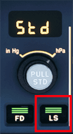
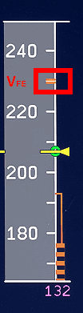
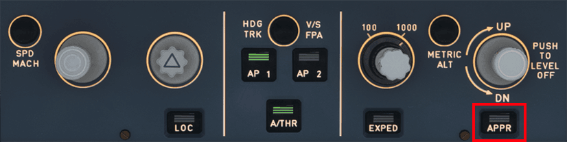
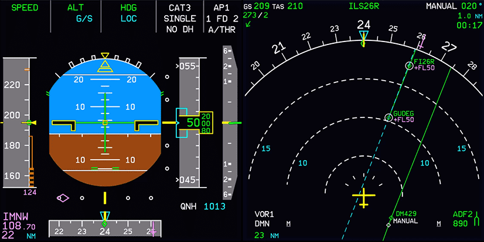
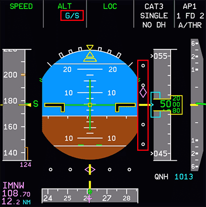
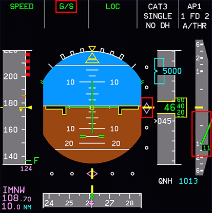
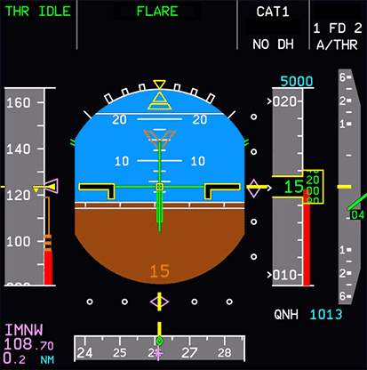
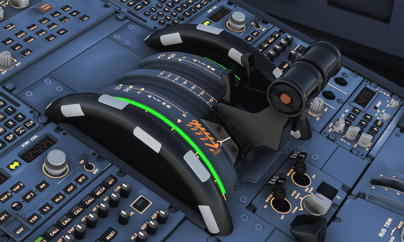
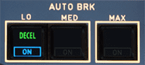

# Approach and ILS Landing

This guide will explain the correct procedures to fly a final approach and conduct an ILS landing.

!!! warning "Disclaimer"
    The level of detail in this guide is meant to get a FlyByWire A320neo
    beginner currently on approach to intercept the ILS and land the aircraft safely on the runway.

    A *beginner* is defined as someone familiar with flying a GA aircraft
    or different types of airliners. Aviation terminology and know-how is
    a requirement to fly any airliner even in Microsoft Flight Simulator.

    You will also find many great videos on YouTube on how to land the FlyByWire A32NX. 
    Check out the FlyByWire YouTube Channel as well: [FlyByWire on YouTube](https://www.youtube.com/c/FlyByWireSimulations/playlists)

---

## Prerequisites

Aircraft is on approach shortly before intercepting the ILS and is still in phase and state `DES` as per previous chapters.

[Download FlyByWire Checklist](../../assets/FBW_A32NX_CHECKLIST.pdf){ .md-button }

## Chapters / Phases

This guide will cover these phases:

1. [Intercepting the ILS Localizer](#1-intercepting-the-ils-localizer)
2. [Intercepting the ILS Glideslope](#2-intercepting-the-ils-glideslope)
3. [Preparation and Checklist for Landing](#3-preparation-and-checklist-for-landing)
4. [Landing](#4-landing)
5. [Vacate Runway](#5-vacate-runway)

---

## 1. Intercepting the ILS Localizer

**Situation:**

- Aircraft is in `DES` phase.
- Aircraft is setup for flight <10,000ft (`seat belt signs` on, `landing lights` on, etc.).
- We are within the IAP (Instrument Approach) and either:
    - at the altitude and speed from the chart (Final Approach Fix altitude and 250 knots if there are no other speed restrictions on the chart).
    - or we are at a heading vector, altitude and speed instructed by ATC.

At the end of the Instrument Approach (or by ATC vectoring) we will be on a path to the Final Approach Fix and/or a path to intercept the ILS localizer and eventually the ILS glideslope.

As a last instruction from ATC Approach we usually are instructed to contact Tower ATC when fully established on the ILS localizer.

To intercept the ILS Localizer we follow these steps:

- Verify that the correct ILS frequency is tuned in the `MCDU-RNAV` page. We find the correct frequency on the approach chart. 

    === "Check ILS frequency"

        {align=left width=45%}
        
        {align=right width=45%}

- Turn on the `ILS localizer and glideslope scales` with the `LS` button on the glareshield if not already done before.

    === "Turn on ILS scales"
        {loading=lazy align=left}
        {align=right width=75%}

- Make sure we are on the correct altitude (5,000ft in this example) and we should not have an approach angle larger than 30°. 

    {loading=lazy} 
    {loading=lazy}

- Optional: Turn on `ROSE LS Mode` for the `ND` (can also be on F.O.'s side). The ROSE LS Mode shows the deviation from the localizer approach heading path.

    {loading=lazy}

- Activate the `APPR` phase in the `MCDU-PERF` page. This is usually automatically done by the aircraft at a certain point during the approach, but we make sure that at this point at the latest it is activated. In `APPR` phase the `Autopilot` together with "Managed Speed Mode" reliefs the pilot of a lot of stress by managing the speed according to flaps setting automatically (S-Speed after `FLAPS 1`, F-Speed after `FLAPS 2`, V~app~ after landing flap selection).

    {loading=lazy }

- Set `SPEED` to `Managed Speed Mode` (push the `Speed Selector`). The aircraft should now decelerate to `green dot` speed.
- Set `FLAPS` to 1 at about V~FE~ -15 knots (but never before speed is below V~FE~) for the first slat/flap configuration (`CONF1`). The aircraft will then decelerate further to prepare for the next flaps configuration. Our target is to be in CONF 1 and at S-speed by the time you need to set flaps 2 (CONFIG 2) before the glideslope intercept (S-speed will be slow enough to set flaps 2).

    {loading=lazy}

- Turn on `APPR` in the `FCU` to command the aircraft to intercept the ILS localizer. The aircraft will keep the current heading until the localizer is captured and guides the aircraft towards the runway. The `lateral ILS localizer scale` shows the `deviation marker` moving towards the middle of the `lateral deviation scale`. Also the lateral `FMA` shows `LOC` in blue (armed).

    {loading=lazy}

    {loading=lazy}

??? note "What is the blue dashed line?"
    You might ask what the blue dashed line is. It is part of the new FIX INFO feature available only in the Development version for the time being. It allows to draw distance rings or radial lines from navigation fixes. For this illustration it helps us to visualize the localizer signal path at 261° into the runway which we are going to capture with the APPR mode.

!!! warning "Arming APPR"
    Using `APPR` also arms the glideslope descent (G/S) and the aircraft will descend as soon as it captures the ILS glideslope signal.
    Do not descend without ATC clearance and only when directly on the ILS localizer path as only then obstacle clearance is guaranteed.
    To help with this you can use the `LOC` button first (only localizer capture) and when cleared for approach press `APPR`

- When we are established on the ILS localizer (the lateral `FMA` shows `LOC` in green) we will contact Tower ATC and report that we are established on the ILS localizer (including call sign and runway).

    {loading=lazy}

Tower ATC will then give us clearance for ILS approach for the target runway. This clears us to descend on the ILS glideslope.

**Do not descent without explicit clearance from ATC.**

This concludes *Intercepting the ILS Localizer*

---

## 2. Intercepting the ILS Glideslope

**Situation:**

- Aircraft is in `APPR` phase
- Aircraft is established on ILS localizer
- Configuration is `CONF1` at S-Speed (`FLAPS 1`)

After ATC has given us clearance for ILS approach we can also start descending using the ILS glideslope.

Check that the `APPR` button is activated on the `FCU` to arm the ILS glideslope descent mode.

The vertical `FMA` now shows `G/S` (glideslope) in blue.

{loading=lazy }

 This is a good time to set `Flaps 2` (check that the speed is below the V~FE~ for the next flap setting) as slowing down once we are descending along the glideslope can be difficult. We need the drag from the flaps if we do not want to let the gear down too early (which also would help us slowing down). 

!!! info ""
    There is different guidance when to set `FLAPS 2` at different airlines or Airbus. But for beginners we recommend to go to `FLAPS 2` before starting the glideslope descent. Airbus guidance for example is `FLAPS 2` during glideslope descent at about 2,000ft which only works if speed is already reduced enough.

!!! info "ATC instructed approach speed"
    The A320 `Autothrust` will manage speed during approach automatically and will reduce speed further with each flap setting. In real live and also when flying with Online ATC like VATSIM we need to expect that ATC instructs us to stay at a certain speed (e.g. 160 knots until 5 NM to the runway). In this case we would use `Selected Speed Mode` (select a speed in the `FCU` and pull the knob) until the instructed distance to the runway where we would then go back to `Managed Speed Mode` and drop the gear then as well as setting flaps to 3 and flaps to full - see below.

The aircraft will start descending when the deviation marker is in the middle (we have captured the ILS glideslope). The vertical `FMA` will now display `G/S` in green.

{loading=lazy }

We are now descending along the glideslope. The radio altimeter comes alive at 2,500ft above the ground to display the actual precise height above ground.

{loading=lazy }

This concludes *Intercepting the ILS Glideslope*

---

## 3. Preparation and Checklist for Landing

**Situation:**

- Aircraft is established on ILS localizer and glideslope
- Flaps are set to 2

At this point we would prepare the aircraft for a possible missed approach and go-around by setting the go-around altitude in the FCU (see *MISSED APCH* procedure in the charts). We skip this for this beginner guide.

To set us up for the final approach we do the following steps:

- `Gear down`: Sometime between 2,500ft and 1,500ft , typically around 5-6NM from runway.
- Turn on `RWY TURN OFF` lights and set `NOSE` light to `T.O`.
- Set `FLAPS 3` and shortly after `FLAPS FULL` (always check speed before setting flaps otherwise you might end up in an overspeed situation).
- Going `FLAPS FULL` will reduce our speed to V~app~.
- Arm `Autobrakes` (`Low` when dry, `Med` in rain or snow or a short runway).
- Arm `Speedbrake` by pulling up the `Speedbrake` lever (Speedbrake must be retracted to arm).

**We need to be fully setup and stable at 1,000ft above the ground.**

{loading=lazy}

{loading=lazy }

#### Cabin Crew

In real life the cabin crew will have been asked to prepare the cabin for landing during the descent. The exact moment and process might differ between airlines but most seem to do this when the `Seatbelt Signs` are turned on during descent (typically at the latest at 10,000ft).

The Cabin Crew will notify the pilots either by a "Cabin Ready" button (A320neo) or by a call to the cockpit (A320ceo) once they are ready and strapped-in themselves.

In the Microsoft Flight Simulator we simulate this by pressing the `CALLS ALL` button on the left of the overhead panel. This will set the "Cabin Ready" status as shown in the ECAM and there will be a short announcement playing "Cabin Crew take your seats for landing".

{loading=lazy }

Complete the **Landing Checklist**

{loading=lazy width=50%}

For the landing we have our hand on the thrust levers for a potential go-around so we can quickly push the levers forward into `TO GA`. 
**We do not move the levers until the last seconds before landing.**

This concludes *Preparation and Checklist for Landing*

---

## 4. Landing

**Situation:**

- Aircraft is fully setup for landing as per previous chapters.
- Configuration is `FLAPS FULL`.
- Aircraft is at about 1,000ft above the ground.
- Wind is calm (no crosswind for this beginner guide).

Although the A320 can do an automatic landing (**Autoland**) we will do  a manual landing as this is more common and also more fun.

We MUST get landing clearance from ATC before we actually are allowed to land. Without landing clearance we must do a go-around (not part of this beginner guide) before touching the runway. Usually ATC will have given us clearance at this point. Late clearance is rare and communicated to us beforehand.

Next we turn the **Autopilot** `OFF` at about 500ft above the ground by pressing the `AP1` button on the `FCU`. We leave the **Autothrust** on so we don't have to worry about thrust and speed at all (Leaving **Autothrust** on for landing is common for the Airbus).

{loading=lazy}

Now look out at the PAPIs which guide us vertically down to the correct touchdown point.  We want two white lights and 2 red lights.

{loading=lazy}

See also [Wikipedia:PAPI](https://en.wikipedia.org/wiki/Precision_approach_path_indicator)

We correct our pitch only very carefully when too high (3-4 white) or too low (3-4 red). We don't need a lot of input to the sidestick to correct.

We aim for the middle of the touchdown zone which is marked by the touchdown zone markers.

{loading=lazy}

Also we try to aim for the center line of the runway in a way that it points directly under us.

{loading=lazy}

Correct your final heading and bank very carefully. We should not need to correct much at this point.

!!!info "Crosswind landings"
    Crosswind landings are beyond the scope of this beginner guide. There are many good tutorials for crosswind landings in the A320 on Youtube.

 Once over the runway threshold we look towards the end of the runway to better judge our pitch especially for the so called **Flare**.

!!!info "Flare"
    The flare follows the final approach phase and precedes the touchdown and roll-out phases of landing. In the flare, the nose of the plane is raised, slowing the descent rate and therefore, creating a softer touchdown, and the proper attitude is set for touchdown. \[...\] In the case of tricycle gear-equipped aircraft, the attitude is set to touchdown on the main (rear) landing gear. (source: [Wikipedia: Landing flare](https://en.wikipedia.org/wiki/Landing_flare))

 At the runway threshold we should be about 50ft above ground and prepare to set the thrust levers to idle and flare.

 {loading=lazy}

At about 30ft we start our flare by pulling back on the sidestick carefully. We only need a few degrees in positive pitch and hold the aircraft there. Too much flare will cause the aircraft to float down the runway, too little will cause a harder landing.

At about 10-20ft we pull back the thrust levers to idle (the aircraft also sounds the callout "retard retard ...") so the we are at idle thrust **before** we touch the ground.

{loading=lazy }

We hold the attitude of the aircraft until it settles on the ground. **Do not push the sidestick forward (nose down) once flared.** We let the aircraft settle to the runway while holding the pitch.

**Practice this!!**

On touchdown of the main gear the `Speed Brakes` will deploy automatically (we have armed them earlier) and we pull the thrust levers into the reverse position.

{loading=lazy}

We let the front gear settle gently on the runway (don't slam it down) and hold the center line of the runway while we are reducing speed. The speed reduction should be monitored on the `PFD` speed band and the speed trend arrow.

The `Autobrakes` should now have activated and started to further decelerate the aircraft. This can be checked by the `Autobrake` annunciators.

{loading=lazy}
{loading=lazy}

The upper ECAM should now show the engines in reverse mode (`REV`) and
 the lower ECAM shows the `Speed Brakes` (spoiler) deployed. Also you should notice that the brakes actually get hotter.

!!! block ""

    {loading=lazy align=left width=45%}

    {loading=lazy align=right width=45%}

At about 60knots we put the thrust levers back to idle and at about 40 knots we release the `Autobrakes` by braking manually which deactivates the `Autobrake`.

This concludes *Landing*

---

## 5. Vacate Runway

**Situation:**

- Aircraft has landed and is still on the center line of the runway.
- Speed is < 40 knots.

We look for the next runway exit and slow down to about 15 knots before we start turning off the runway.

We continue rolling forward until we passed the runway entry marker with the **full length** of our aircraft.

{loading=lazy}

We can now safely stop the aircraft and do our "After Landing" checklist.

If ATC did not already contact us on the ground we would contact them now to let them now we have vacated the runway. They will give us taxi instructions so we can continue taxiing to our gate once we have completed the after landing tasks.

!!!info "After landing tasks in simulation"
    In real live the A320 will have two pilots which can actually do things in parallel. Talking to ATC, taxing the aircraft and do the after landing tasks. In the simulation we are typically alone so it is absolutely ok to stop once we have fully vacated the runway and do these things one after the other. Talking to ATC and getting taxi instruction, do the after landing tasks and checklist, taxiing to gate.

This concludes *Vacate Runway*

Continue with [After Landing Steps](after-landing.md)
