# Powering Down

This guide will explain the correct procedures to power down the aircraft when at the gate after arriving at the destination and taxi to the designated gate.

Obviously this is not strictly required in a simulator but for interested sim pilots this might be an interesting process for a more realistic experience.

!!! warning "Disclaimer"
    The level of detail in this guide is meant to help a FlyByWire A320neo
    beginner to correctly shut down the aircraft.

    A *beginner* is defined as someone familiar with flying a GA aircraft
    or different types of airliners. Aviation terminology and know-how is
    a requirement to fly any airliner even in Microsoft Flight Simulator.

    Check out the FlyByWire YouTube Channel as well: [FlyByWire on YouTube](https://www.youtube.com/c/FlyByWireSimulations/playlists){target=new}

    You will find many great videos on YouTube on how to fly the FlyByWire A32NX. 

---

## Prerequisites

- Aircraft is at the gate after landing and taxi as per previous chapters.

[Download FlyByWire Checklist](../../assets/FBW_A32NX_CHECKLIST.pdf){ .md-button }

## Chapters / Phases

This guide will cover these phases:

1. [Parking at the Gate](#1-parking-at-the-gate)
2. [Disembarking Passengers and Baggage](#2-disembarking-passengers-and-baggage)
3. [Securing the Aircraft](#3-securing-the-aircraft)

---

## Preface
Shutting down and securing an aircraft is an important part of the overall procedure. Obviously less important in a simulator as the next flight will have the aircraft start in a cold and dark state again.

If we want to actually do a turn around and start a new flight directly the procedure will be a little different as we would not turn off certain systems and at some point simply start with the preparation of the aircraft procedure again.

## 1. Parking at the Gate

**Situation**

- We arrived at the designated gate after taxiing from the runway where we landed.
- Aircraft is in taxi state as per previous chapters.
- Engines are still running.
- Lights are still in taxi configuration (`RWY TURN OFF` set to on and `NOSE` is to taxi, `LAND`-ing lights are off).
- `APU` has been turned on during taxi and is `AVAIL`, `APU BLEED` is off.
- **After Landing** checklist is completed.

**At the gate:**

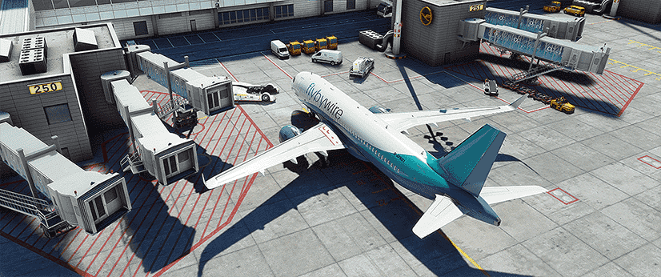{loading=lazy}

**Steps after arriving at the gate:**

- Set parking brake (`PARK BRK`).

    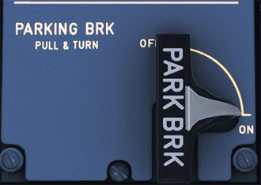{loading=lazy}

- `NOSE TAXI` and `RWY TURN OFF` lights are usually turned off even before we turn into the gate to not blind the ground personnel. This of course is only done if enough lighting is available to safely park into the gate. Turn them off if they were used to assist in parking.

    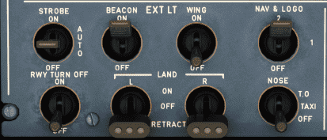{loading=lazy}

- Turn on `APU BLEED` before we turn off the engines.

    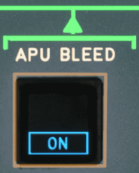{loading=lazy width=20%}

- Shut down the engines by setting the `ENG 1` and `ENG 2` master switches to off.

    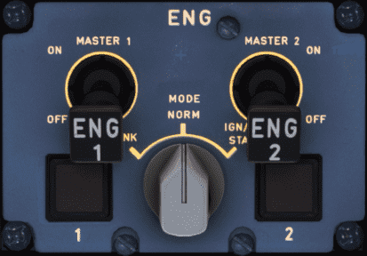{loading=lazy }

- Wait until `N1` is below 5%.

    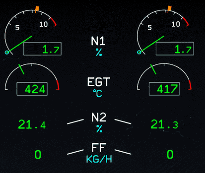{loading=lazy width=50%}

- Turn off `Seat Belt` sign.

    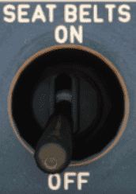{loading=lazy width=20%}

- Turn off `BEACON` (leave `NAV & LOGO` on as long as the aircraft has power from external or APU, `STROBES` can remain on AUTO).

    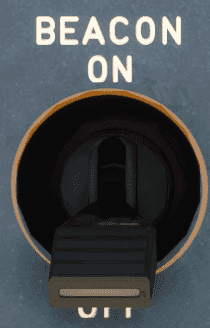{width=20%}

- Complete **Parking** checklist.

    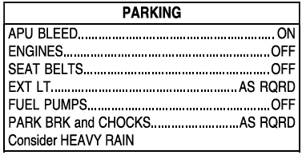{loading=lazy width=50%}

If external power is available the ground crew would have connected it by now and we can turn on `EXT PWR`. Turning off the APU depends on the turn around time. For a shutdown we do this after the passengers have disembarked to still have airflow in the cabin. See last chapter.

This concludes *Parking at the Gate*.

## 2. Disembarking Passengers and Baggage

**Situation:**

- **Parking** checklist is completed.

In real life there are many things that begin automatically after parking at the gate. The jetway is connected to the aircraft, doors are opened, passengers disembark, cargo is unloaded, etc. The pilots don't have to do much to trigger these steps.

In the simulator though we would have to trigger them by ourselves. For this we use the FlyByWire flyPad's ground functionality or the Microsoft Flight Simulator's built-in ATC to start these procedures. There are also some nice add-on tools out there which help with this.

Taking care of passengers and luggage with the FlyByWire flyPad:

- Go to the flyPad (view can be activated by `Ctrl+0`).
- Connect the jetway (PAX).
- Call cargo/baggage (Baggage).

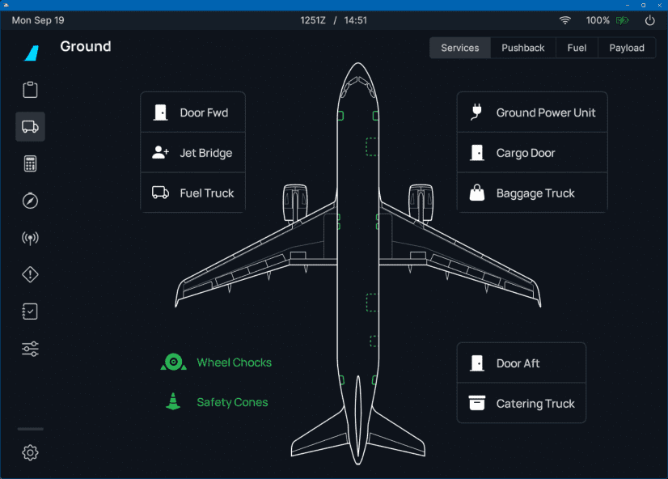{loading=lazy}

Obviously this would take a while in real life and we would not be able to shut down the aircraft before everybody is disembarked.

For a turn around we would start preparing the aircraft for the next flight and the cabin crew would coordinate everything from disembarking the passengers, cleaning and resetting the cabin.

After refuelling the pilot would signal the cabin crew that they could let the new passengers board the aircraft once the cabin is ready.

This concludes *Disembarking Passengers and Baggage*.

## 3. Securing the Aircraft

**Situation:**

- **Parking** checklist is completed.
- Aircraft is empty (no passengers or cargo).
- Cabin is cleaned and ready for shutdown.

**To secure the aircraft we follow these steps: **

- Turn off all fuel pumps.

    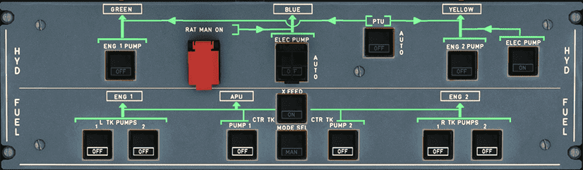{loading=lazy width=80%}

- Turn off the `ADIRS`.

    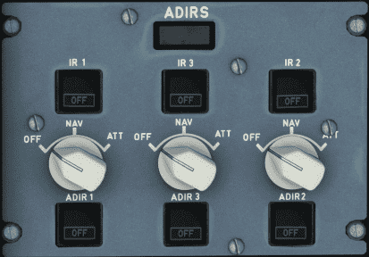{loading=lazy }

- Turn off `OXYGEN`.

    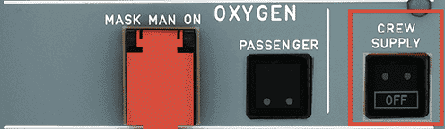{loading=lazy}

- Turn off `APU BLEED`.

    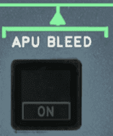{loading=lazy width=20%}

- Turn off emergency exit lights `EMER EXIT LT` and no smoking lights `NO SMOKING`.

    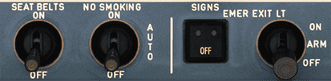{loading=lazy}

- Optional or depending on airline SOPs: Reset air conditioning, lighting and screen brightness.
- Turn off `APU MASTER` (expect the APU to still be AVAIL for a few minutes if you also had APU Bleed on shortly before as it needs a cool down period).

    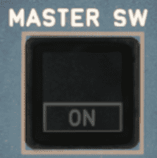{loading=lazy width=20%}

- Wait 2 minutes for the APU FLAP door to close before you turn off power as this needs either APU or external power.
- Turn off `EXT PWR` if it has been turned on before

    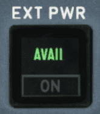{loading=lazy width=20%}

- Turn off `NAV & LOGO` lights (as aircraft no longer has power).

    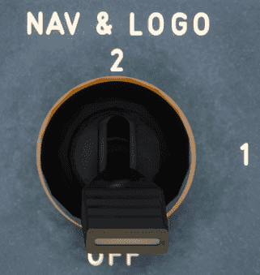{loading=lazy width=20%}

- Turn off `BAT 1` and `BAT 2`.

    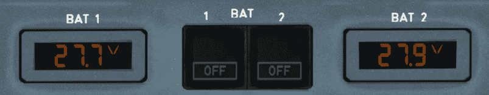{loading=lazy width=70%}

Now the aircraft is back in a cold and dark state.

This concludes *Securing the Aircraft*

