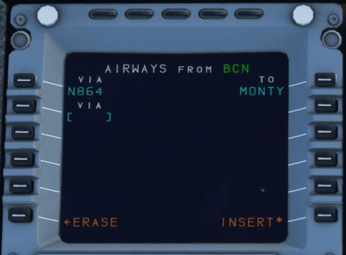
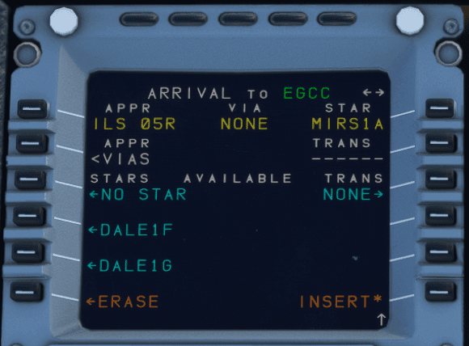

# Preparing the MCDU

This guide will help you prepare the MCDU in the A32NX for your departure. It includes a simple route that you can use to follow along easily and replicate in the simulator.

!!! warning "Disclaimer"
    The level of detail in this guide is meant to provide a FlyByWire A320neo beginner the ability to adequately program the MCDU to conduct and complete a flight.

    A *beginner* is defined as someone familiar with flying a GA aircraft
    or different types of airliners. Aviation terminology and know-how is
    a requirement to fly any airliner even in Microsoft Flight Simulator.

    You will find many great videos on YouTube on how to fly the FlyByWire A32NX. 
    Check out the FlyByWire YouTube Channel as well: [FlyByWire on YouTube](https://www.youtube.com/c/FlyByWireSimulations/playlists){target=new}

The simBrief route used in this guide

[Download simBrief OFP](../assets/beginner-guide/mcdu/sample-ofp.pdf){ .md-button }

---

## Prerequisites

Below are a few Prerequisites before programming the MCDU.

Visit [Starting the Aircraft](starting-the-aircraft.md) to learn more.

* Make sure the aircraft is powered up.
    * External Power OR APU
* Make sure the ADIRS are set to NAV.
* Have a valid flight plan.
* Ensure IFR clearance has been obtained.

!!! info "Requesting IFR Clearance"
    Before departing for the flight, we must obtain an IFR clearance from ATC. The clearance may be obtained from clearance delivery or another specific frequency, depending on the airport and available services.

    If you are not flying on network and are using the built in ATC menu, simply find the appropriate selection in the menu and request for IFR clearance.

    Clearances will usually provide the following information below. As a pilot you would need to read back the clearance correctly or acknowledge it if using the built in ATC menu.

    - Cleared to the destination via specified route in the filed flight plan.
    - Initial cleared altitude after departure.
    - Assigned SID for departure OR radar vectors
    - Assigned departing runway.
    - Transponder/squawk code.
    - Departure frequency.

    Additional reading material: [The CRAFT mnemonic](https://en.wikipedia.org/wiki/CRAFT_(aviation))

---

## Chapters / Phases

This guide will cover the following topics:

1. [Understanding the MCDU](#understanding-the-mcdu)
2. [MCDU Programming](#mcdu-programming)
    - [**^^D^^**ATA](#data)
    - [**^^I^^**NIT A](#init-a)
    - [**^^F^^**LIGHT PLAN](#flight-plan)
    - [**^^S^^**ECONDARY FLIGHT PLAN](#secondary-flight-plan)
    - [**^^R^^**AD NAV](#rad-nav)
    - [**^^I^^**NIT FUEL PRED](#init-fuel-pred)
    - [**^^P^^**ERF](#perf)
3. [A32NX simBrief Integration](#a32nx-simbrief-integration)

---

## Understanding the MCDU

During the course of this guide we will be referring to a few key terms which are defined below.

### Line Select Key (LSK)

`LSK` for short. These keys are on the left and right hand side of the MCDU screen. They are highlighted in the image below.

* Left hand keys are referenced (in descending order) as `LSK1L - LSK6L`.
* Right hand keys are referenced (in descending order) as `LSK1R - LSK6R`.

{loading=lazy}

### Slew Keys

These keys are referenced below.

{loading=lazy}

!!! info

    === "Horizontal Slew Keys"

        These keys scroll between certain pages i.e. `INIT A` and `INIT FUEL PRED` when the INIT page is selected. 

    === "Vertical Slew Keys"

        These keys scroll vertically on certain pages i.e. `F-PLN` page. 

---

## MCDU Programming

**D.I.F.S.R.I.P.**

Pilots commonly use the acronym above when programming the MCDU. It represents the following flow on the MCDU:

- [**^^D^^**ATA](#data)
- [**^^I^^**NIT A](#init-a)
- [**^^F^^**LIGHT PLAN](#flight-plan)
- [**^^S^^**ECONDARY FLIGHT PLAN](#secondary-flight-plan)
- [**^^R^^**AD NAV](#rad-nav)
- [**^^I^^**NIT FUEL PRED](#init-fuel-pred)
- [**^^P^^**ERF](#perf)

The simBrief route used in this guide - [Available Here](../assets/beginner-guide/mcdu/sample-ofp.pdf)

---

### **^^D^^**ATA

This MCDU page provides various data for the pilots. It has two pages (accessed by using the horizontal slew keys). It will not be used for this tutorial.

DATA includes the pages below:

* Position Monitor
* IRS Monitor
* GPS Monitor
* A/C Status
* Closest Airports
* Equitime Point
* Waypoints
* NavAids
* Runways
* Routes

### **^^I^^**NIT A

^^FROM/TO Field^^

  * Using the keypad type in `EGFF/EGCC`
  * Once this is in the scratch pad press LSK1R.
  * This following screen would show "company routes". Since there are none stored select `Return` using LSK6L.

{loading=lazy}

^^FLT NBR^^

* Using the keypad type in `EZY123` and press LSK3L. Feel free to use your own flight number here!
* If you have the Free Text module enabled for your flight, this will enable other users flying the A32NX to send you messages. This will not be covered in this guide.

^^COST INDEX^^

{loading=lazy}

The cost index can be found in the image above.

* Using the keypad type in `44`
* Press LSK5L.

^^CRZ FL/TEMP^^

{loading=lazy}

Input the desired cruise flight level in this field. On our OFP this is listed as `0220` or `FL220`.

* Using the keypad type in `220`
* Press LSK6L

This will input FL220 and the temperature as well.

### **^^F^^**LIGHT PLAN

Upon loading the flight plan page there will be three entries. Departure airport, `(DECEL)`, and arrival airport.

Our route for this flight can be found on the 2nd page of the OFP

!!! info "Routing Disclaimer"
    Note, that waypoints, STARs, and SIDs may be called differently due to different nav-databases or different AIRAC cycles between simBrief and the simulator.

{loading=lazy}

`EGFF/30 BCN1A BCN N864 MONTY MIRSI1A EGCC/05R`

^^Inputting a SID^^

!!! info "SID"
    Standard Instrument Departure Route

    These are procedures that are defined and published that takes a flight from the take-off phase to the enroute phase.

    Also see: [SIDS and STARS](../airliner-flying-guide/navigation.md#sids-and-stars)

To program the Standard Instrument Departure (SID):

* Press LSK1L or EGFF (the departure airport)
* Select `DEPARTURE` shown next to LSK1L
* Select the runway we are departing from. In this case `30` using LSK3L
* On the list of SIDs select the `BCN1A` departure

The MCDU should now show at the top of the screen in yellow what is selected for our departure from EGFF.

{loading=lazy}

* Press `INSERT` using LSK6R to program this into the flight plan.

Our flight plan should now have the associated waypoints for the `BCN1A` SID. We can scroll through the flight plan using the vertical slew keys. The SID terminates at `BCN` and this is where we can begin to fill out the rest of the flight plan.

!!! info "BCN1A ILS Frequency"
    When selecting a departure SID that pairs with a LOC/ILS frequency, the respective frequency will be auto-populated in RADNAV provided it is available from the navdata.

^^Enroute Flight Plan^^

* Press the LSK that matches the location of `BCN` on the MCDU screen.
* Select `AIRWAYS` using LSK5R.
* Using the keypad type in `N864` *(the airway)* and press LSK1L.
* Using the keypad type in `MONTY` *(waypoint)* and press LSK1R.
    * Remember: Airways are on the left and waypoints are on the right.

{loading=lazy}

^^Planning the Arrival^^

For the purposes of this guide we will preplan our arrival into EGCC via the `MIRSI1A` STAR into 05R.

!!! info "STAR"
    Standard Terminal Arrival Route

    Similar to the SID, these are procedures that are defined and published that takes a flight from the last point in a route *(in our case `MONTY`)* to the first point in the approach or the initial approach fix (IAF).

    Also see: [SIDS and STARS](../airliner-flying-guide/navigation.md#sids-and-stars)

Find `EGCC` in green in flight plan OR select `EGCC` in white under `DEST` using the corresponding LSK.

* Select `ARRIVAL` using LSK1R
    * We will be shown the approaches available designated by `Type` `Rwy`.
    * For this guide we will shoot for an ILS to keep it simple.
* Use the vertical slew keys to find `ILS05R` and select it using the corresponding LSK.
* Again use the vertical slew keys to find the STAR for this flight `MIRSI1A` and select it using the corresponding LSK.
* We won't have any vias for this flight. Select `NO VIAS` using LSK2L. On the following page we can choose transitions if available, but for this flight we don't.
    * *Note:* Due to the default MSFS flight plan manager we maybe directed to proceed via the `MCT` waypoint anyways for the arrival.
* Insert this STAR into the flight plan using LSK6R.

{loading=lazy}

Verify the flight plan by using the vertical slew keys to scroll through it.

!!! info "Discontinuity"
    #### Discontinuity

    The flight plan might contain so called discontinuities. These are breaks in the flight plan and often separate two flight plan sections like the SID and first in-route waypoint or the STAR and the APPR. They are also often inserted when the flight plan is modified.

    Sometimes discontinuities are also part of a procedure to indicate that manual input is required (mostly clearance by ATC). The preceding legs are called MANUAL legs.

    See our detailed documentation for [Discontinuities](../advanced-guides/flight-planning/disco.md) to understand how to appropriately handle these when encountered on your 
    F-PLN page.

!!! info "Viewing Flight Plan on ND"
    We can also verify the route looks correct by selecting `Plan` on the EFIS control panel and watching the ND as we scroll through.

<!-- TODO: Update when Secondary F-PLAN is available -->
### **^^S^^**ECONDARY FLIGHT PLAN

This page will allow us to input a secondary flight plan. This page is currently inoperable in the A32NX. We will update this portion of the guide when it is usable.

### **^^R^^**AD NAV

On this page, we would set any frequencies or identifiers needed for the departure and subsequently later enroute those required for the arrival.

For the purposes of this guide we will be using frequencies in the RADNAV page.

If we would like to have additional navaids for the departure, we can input the runway localizer for runway centerline guidance on the PFD and the initial procedure turn, including the BRECON VOR (BCN) to verify the track enroute to BCN. This is a little bit more advanced than this guide allows for but we will cover how to input frequencies.

^^VOR^^

On this departure we have the BCN VOR with a frequency of `117.45`

* Using the keypad type in `117.45` and press LSK1L. This will auto populate the identifier of the VOR when within range.
* We can also set the desired course to track `031` and press LSK2L to input it.

^^Departure ILS^^

When selecting the SID earlier in the flight plan section, the A32NX should have auto-populated the ILS/LOC frequency. If it hasn't we can manually insert it for centerline guidance on take off.

Our departure runway is EGFF/30 (runway 30) which has a frequency of `110.7`. When inputting a frequency and we are in range of the ILS it will auto populate the indentifier and course. There is no need to fill these fields.

* Using the keypad type in `110.7` and press LSK3 to input it.

^^Arrival ILS^^

With an ILS or LOC approach selected, the arrival ILS frequency should be automatically tuned correctly whenever the aircraft is at climb phase or greater and within 250 NM of destination. **Ensure** that we verify the ILS frequency when we reach the arrival phase of the flight - see [Approach and Landing (ILS)](landing.md).

Remember our arrival airport/rwy is `EGCC/05R` with ILS05R having a frequency of `111.55`. When inputting a frequency and we are in range of the ILS it will auto populate the indentifier and course. There is no need to fill these fields.

* Using the keypad type in `111.55` and press LSK3 to input it.

{loading=lazy}

^^ADF^^

This works much in the same way as the examples above.

### **^^I^^**NIT FUEL PRED

To navigate to the `INIT FUEL PRED` page we first have to select the `INIT` button. Once on `INIT A` use the horizontal slew keys to switch the page to `INIT FUEL PRED`.

On this page, we can input our zero fuel weight (ZFW) and zero fuel weight center of gravity (ZFWCG).

!!! warning "Important Info"
    Fuel and payload have to be set in the aircraft (see link below) and passenger boarding has to be complete for the ZFW/ZFWCG to be correct.

    Please see our [Fuel and Weights Guide](../../fbw-a32nx/feature-guides/loading-fuel-weight.md) for more information.

The A32NX can auto populate this information.

* Press LSK1R to load in the calculated ZFW/ZFWCG into the scratch pad at the bottom of the MCDU.
* Press LSK1R a second time to input the above calculation into the MCDU. (The empty orange boxes should now be filled in by the scratch pad entry).

Now we can add our fuel on board (FOB). The amount we input in this field can be done in one of three ways:

* Indicated FOB on the upper ECAM.
* We can have the MCDU plan the amount of fuel required.
* The amount indicated in the OFP.

!!! info "Loading Fuel"

    Via the EFB - [Learn How](../../fbw-a32nx/feature-guides/flypados3/dispatch.md#fuel-page)

^^ECAM FOB^^

Look at the upper ECAM and note the FOB indicated. Let's say that amount is `3091 KG`. When inputting the block fuel into the MCDU it is referenced in "Tons" and we should round to the closest decimal point.

* Using the keypad type in `3.1` and press LSK2R.

^^MCDU Planning^^

We can choose to have the MCDU provide a recommended amount of fuel for the planned flight.

* Press LSK3R to compute an amount of fuel.

The `Block` field will be populated with a calculated fuel amount.

* Press LSK3R again to confirm the fuel.
* We should load this amount of fuel via the EFB or AOC option.

^^SimBrief OFP^^

We can use the planned block fuel stated on the OFP which in this case is `3091 KG`.

* Using the keypad type in `3.1` and press LSK2R
* We should load this amount of fuel via the EFB or AOC option.

{loading=lazy}

### **^^P^^**ERF

The performance page changes based on the relative stages of flight until we land the aircraft. When programming the MCDU on the ground we start on the take-off performance page.

For this flight we will be taking off with a `1+F` flaps configuration.

* Using the keypad type in `1` and press LSK3R

!!! info "THS Field MCDU"
    **Entry of the THS field is subject to airline SOP and may not be required.**

    ---

    The Trimmable Horizontal Stabiliser (THS) field is where we enter the stabilizer trim for takeoff based on the aircraft's takeoff CG (TOCG). Entering this value in the MCDU will trigger the ^^F/CTL PITCH TRIM/MCDU/CG DISAGREE^^ ECAM caution, if appropriate.

    If you have already entered your flaps configuration in the step above, applicable entries are formatted `/X.XDN` or `/X.XUP` representing a trim value and nose down or up respectively.

    Examples:

    - Nose down trim of 0.4 can be inputted as `/0.4DN`
    - Nose up trim of 1.5 can be inputted as `/1.5UP`

    {--

    **For the purposes of simulation** there are a couple methods to set the value of THS described below. We plan on adding a better visual representation of the TOCG at later time since loadsheets are not available.

    See the [After Engine Start](engine-start-taxi.md#after-engine-start) section to find the appropriate trim value and to physically set your trim.

    ---

    ^^ZFWCG^^

    While not *realistic or accurate*, you can insert a THS value based on the ZFWCG values found in the following areas in the MCDU:

    - Auto populated when entering information in the [INIT FUEL PRED](#init-fuel-pred) page
    - ZFWCG value on the [W&B page](../../fbw-a32nx/feature-guides/loading-fuel-weight.md#load-ofp-payload-info) in the AOC Menu.

    Make sure to update this value or set the correct trim once your engines have started.

    ---

    ^^After Engine Start^^
    
    Once the engines have been started, we can use the auto-calculated CG value (not the ZFWCG value) on the FUEL PRED page for determining the pitch trim setting. You can now update the THS setting (if you chose to input a THS value) in the take-off performance page and set the pitch trim using the trim wheel. Although the TOCG may be slightly different due to fuel being used for taxi, it will not change enough to require a change in pitch trim.

    --}

We can also choose to set a `FLEX TO TEMP` for the flight. The example we are using today is 60 degrees. (This will normally be calculated via a pilot's company EFB or other tools).

* Using the keypad type in `60` and press LSK4R

#### Flex Temp

!!! tip "What is Flex Temp?"
    Flex temp is entered into the MCDU enabling the computer to use the pilot specified air temperature to allow for take-off thrust that is less than TOGA but not less than CLB. This is a method of creating cost savings by increasing engine life resulting in reduced overhaul and fuel costs. This value is normally calculated via a pilot's company EFB or other tools.

    Unfortunately, A320neo performance data for FLEX temp performance calculators alongside other various tools are not publicly available and are guarded by Airbus. For the purposes of simulation, it's important to note the following:

    {==

    Flex temps are above ISA+29°C (44°C at sea level) and above current temp, but no higher than ISA+59°C (74°C at sea level). Usable Flex temps at sea level are from 45°C (or current OAT if it is higher) to 74°C.

    Additionally, a decent rule of thumb for simulation purposes is to use a lower number if heavy or on a short runway and higher for the opposite.

    ==}

Our SID chart mentions that the TRANS ALT for this departure is 6000ft.

* Using the keypad type in `6000` and press LSK4L

The A32NX can calculate the V-Speeds automatically. To do this simply:

* Press LSK1L to have the calculated V1 speed appear in the scratchpad.

* Press LSK1L again to have 130 inputted into the V1 speed.
* Repeat this procedure for VR and V2.

The performance page should now look like this:

---

## A32NX simBrief Integration

This section has been moved to our dedicated [simBrief Integration](../../fbw-a32nx/feature-guides/simbrief.md#importing-the-simbrief-ofp-to-the-fms-mcdu) feature guide.

---

After setting up the MCDU continue with [Engine Start and Taxi](engine-start-taxi.md)
