# Starting the Aircraft

This guide will assist you with starting your aircraft. It includes images to assist you with understanding the locations of all buttons and switches.

!!! warning "Disclaimer"
    The level of detail in this guide is meant to teach a FlyByWire A320neo beginner to start the aircraft correctly.

    A *beginner* is defined as someone familiar with flying a GA aircraft
    or different types of airliners. Aviation terminology and know-how is
    a requirement to fly any airliner even in Microsoft Flight Simulator.

    You will find many great videos on YouTube on how to fly the FlyByWire A32NX. 
    Check out the FlyByWire YouTube Channel as well: [FlyByWire on YouTube](https://www.youtube.com/c/FlyByWireSimulations/playlists)

---

## Chapters / Phases

This guide will cover these chapters in order:

1. [Overhead Panel](#overhead-panel)
2. [Main Panel](#main-panel)

## Prerequisites

Aircraft is in a cold and dark state at a gate.

[Download FlyByWire Checklist](../../assets/FBW_A32NX_CHECKLIST.pdf){ .md-button }

## Cockpit Preparation

To start off, we will begin by doing a few pre-checks in all areas of the cockpit to ensure the aircraft is in an normal position before turning on the batteries.

We begin by looking down at the [**bottom pedestal**](../a32nx-briefing/flight-deck/index.md).

- Place the [Parking Brake](../a32nx-briefing/flight-deck/pedestal/parking-brake.md) handle in the `ON` position
- Ensure the [Speed Brakes](../a32nx-briefing/flight-deck/pedestal/speedbrake.md) have been disarmed/retracted
- [Flaps](../a32nx-briefing/flight-deck/pedestal/flaps.md) are retracted
- [Weather Radar](../a32nx-briefing/flight-deck/pedestal/radar.md) is switched off
- [Engine Masters 1 and 2](../a32nx-briefing/flight-deck/pedestal/engine.md) are in the `OFF` position
- [Engine Mode](../a32nx-briefing/flight-deck/pedestal/engine.md) selector is set to `NORM`
- [Thrust Levers](../a32nx-briefing/flight-deck/pedestal/thrust-elev-trim.md) are idle

We then direct our attention to the **main panel** and make sure the following is set:

- [Gear Lever](../a32nx-briefing/flight-deck/front/autobrake-gear.md) is down

Then we look up at the **overhead panel**. Make sure the following are in the set position before moving on to starting the aircraft:

- [Wiper](../a32nx-briefing/flight-deck/ovhd/wipers.md) selectors are in the `OFF` position

---

## Overhead Panel

### Electrical section

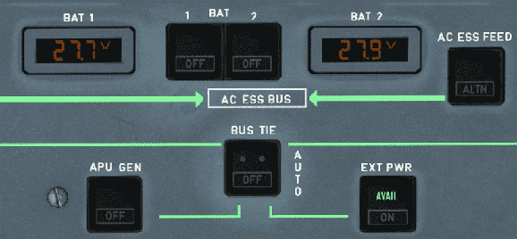{loading=lazy}

#### Batteries

We begin with turning on batteries `BAT 1 AND 2`. We will hear chimes indicating the batteries are on.

Batteries only power a small part of the aircraft. For the rest either ground power, APU or a running engine is required.

#### Ground Power

If ground power is available, we should see a green `AVAIL` light on the `EXT PWR` button. Push on this button to give power to the aircraft.

!!! note "Ground Power Not Available"
    Some gates or stands are not equipped with ground power. In Microsoft Flight Simulator this happens regularly at smaller airports. This is not a bug but a realistic situation. You can then either try to call a Ground Power Unit (GPU) if available at the airport or just use the APU as described in the next step.

#### APU

If ground power isn't available, we turn on the APU now.

To do this, we simply push on the APU `MASTER SW` and `START`. The APU should be on within one minute.

{loading=lazy}

!!! note "COVID SOP"
    !!! block ""
        {loading=lazy align=left width=20%}

        Many airlines require the air conditioning to be running prior to passengers entering the aircraft, and remain on until deboarding is complete to ensure proper air circulation. Therefore, turning on the APU even with ground power is now required, as the air conditioning packs need the APU Bleed air to function whenever the engines are not running. Especially if a ground air conditioning unit is not available.    

        Make sure to turn on APU Bleed on the overhead panel. 

!!! note "Engine Start"
    APU Bleed Air is required for starting the engines. See [Engine Start and Taxi](engine-start-taxi.md)

??? note "Real World APU and A/C Start Procedure"
    The above process is a simplified version of how real world airline start up the APU (documented in their SOP - Standard Operating Procedures).

    Here is a description of an actual real world procedure of a well known airline.

    - Check A/C Packs are OFF before powering the aircraft
    - Set APU MASTER switch to ON
    - Press APU START 
        - Some airlines still require the pilot to wait 3sec for the APU flap to open. This is no longer required in the A320neo as the startup sequence waits for the flap to be open automatically. 
    - Wait until APU START button shows "AVAIL" (or check on lower ECAM APU page)
    - Wait 1 min (use [CHRONO](../a32nx-briefing/flight-deck/glareshield/warning.md#2-chrono) to time this)
    - Set APU BLEED to ON      
    - Wait 1 min (use [CHRONO](../a32nx-briefing/flight-deck/glareshield/warning.md#2-chrono) to time this)
    - Set PACK 1 to ON (due of COVID many airlines require both A/C PACKS to be ON)
    
    The two waiting steps are to avoid any APU oil fumes to get into the air conditioning.  

### Crew Oxygen Supply

After powering the aircraft, we turn on the crew oxygen supply by pushing on the button, diminishing the white `OFF` light.

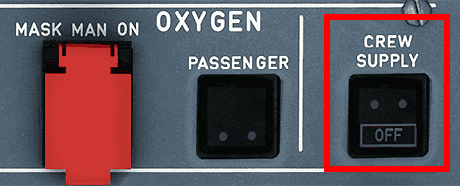{loading=lazy}

### ADIRS alignment

To align the Inertial Reference System (or IRS), we turn the 3 knobs to the `NAV` position. This will then start the IRS alignment for which we can view the progress on the ECAM display.

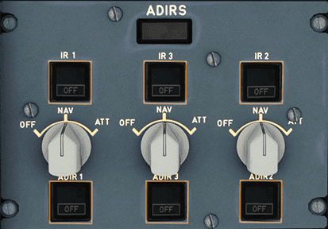{loading=lazy} 
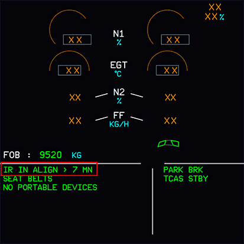{loading=lazy}

### Exterior Lighting

To indicate that the aircraft is powered from the exterior, we turn on the `NAV & LOGO` light.

Following this, we set the `STROBE` light to the `AUTO` position.

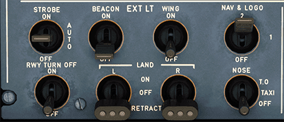{loading=lazy}

!!! tip
    Overview of [External Lighting configurations](../a32nx-briefing/flight-deck/ovhd/ext-lt.md#external-lighting-configuration)

### Interior Lighting

#### Cabin

We can turn on a few lights to help with visibility inside if it is too dark inside the cockpit.

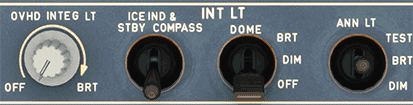{loading=lazy}

- The `DOME` light has 3 settings to choose from. We can set it into the `OFF` position, the `DIM` position, or even the `BRT` position.
- The `OVHD INTEG LT` will allow us to see the outlines of the overhead panel. Turning the knob will adjust its brightness.

#### Passenger Signs

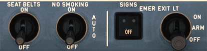

- Seat belts sign - `Set to ON`
- No smoking sign - `Set to AUTO`
- Arm the emergency exit lights - `Set to ARM`

!!! note "Real World Procedure"
    The Seat Belts sign is not turned on until fueling is complete.

### Cabin Pressure

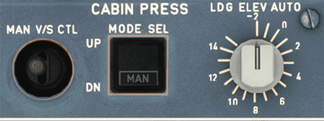{loading=lazy}

Looking up just a bit we find the `LDG ELEV` knob. This simply means the landing elevation which should be in the `AUTO` position.

### Cabin Temperature

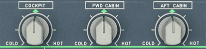{loading=lazy}

Managing the temperatures of the cabin is necessary as well. Simply rotate the 3 knobs as needed.

### Hydraulic and Fuel Section

Looking up at the **hydraulic panel**, we ensure that there are no white lights visible.

!!! warning "Fire Tests"
    To perform an APU and Engine fire test, hold down the `TEST` button for each of them for 5 seconds minimum to ensure the lights and aural warnings are working as expected. Checking the ECAM during the test will also show if the ECAM is performing as expected during a fire.

    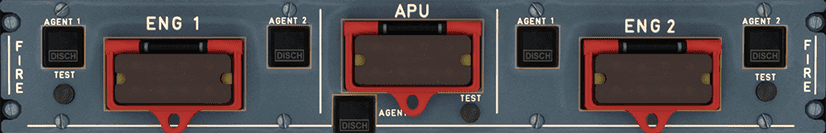

Just below the hydraulic panel, we find the **fuel panel**. Turn on all 6 fuel pumps until the white `OFF` light is no longer visible.

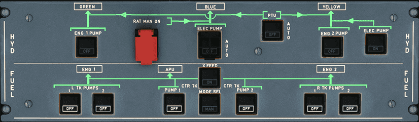{loading=lazy}

---

## Main Panel

### Displays

The brightness for each display can be adjusted to make them better readable.

For the PFD and ND, the knobs are in the same location. Look left (or right when in  first officer seat) of the PFD and find the brightness knobs for them. Simply turn both knobs as required.

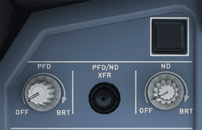{loading=lazy}

For the ECAM upper and lower display, look just in front of the throttles and find the brightness knobs. Just like the PFD and ND knobs, rotate them as required.

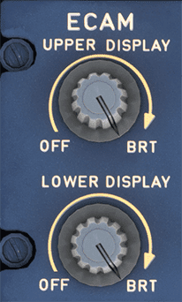{loading=lazy}

For the ISIS display brightness (just left of the upper ECAM), use the `+` and `-` buttons until the brightness is suitable. While we are at the ISIS display, set the current QNH.

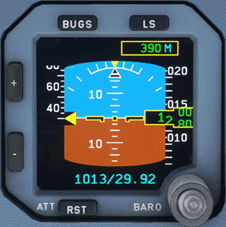{loading=lazy}

---

### Radio Panel

Looking down at the **radio panel**, set the `RMP 1` to the active **ATIS** frequency and set the standby frequency to the **ground** frequency.

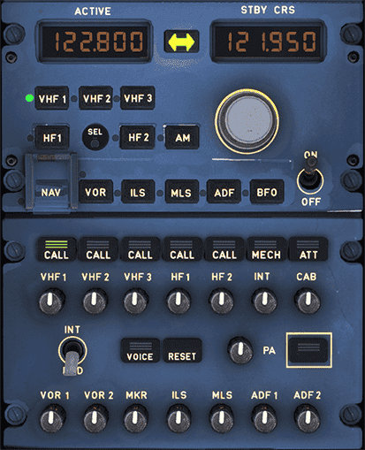{ loading=lazy}

After setting correct frequencies, locate the `BARO` reference on the **glareshield**. We can set the barometer to either `inHg` or `hPa` by turning the grey inner selector behind the knob. For this flight ensure that we are set to `QNH`. This can be changed by "pushing" on the BARO knob (the tooltip will have an upwards arrow).

!!! info "A note on QNH and QFE"
    Choosing between using QNH and QFE is a little beyond the scope of this guide. In most cases we will be flying using `QNH`.

    - **QNH:** Altimeter indicates height above sea level.

    - **QFE:** Altimeter indicates height above reference elevation in use (airfield or touchdown). This setting is usually tied to a procedure in use by the airfield, where when on the ground the altimeter will read 0.

Just below the barometer reference, turn on the `FD`. A green light indicates it has been turned on.

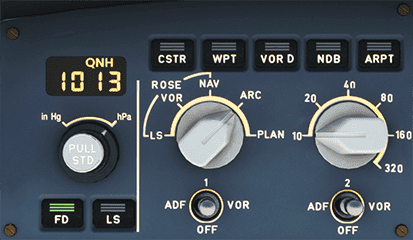{ loading=lazy}

### ECAM Fuel Page

Verify on the Upper ECAM that your aircraft has enough fuel for the flight.

If we do not have enough fuel for the flight we can refuel via the [flyPad EFB Fuel Page](../../fbw-a32nx/feature-guides/flypados3/dispatch.md#fuel-page) .

---

At this point we would have completed 5/7 task on the `Before Start` section on the FlyByWire A32NX checklist.

{loading=lazy}

This concludes the *Starting the Aircraft* guide.

Continue with [Preparing the MCDU](preparing-mcdu.md).

