# Takeoff, Climb and Cruise

This guide will explain the correct procedures to accomplish takeoff, climb and establish cruise altitude.

!!! warning "Disclaimer"
    The level of detail in this guide is meant to get a FlyByWire A320neo beginner safely up in the air and to cruise level under normal conditions while simplifying details which are not (yet) important for a beginner.

    A *beginner* is defined as someone familiar with flying a GA aircraft or different types of airliners. Aviation terminology and know-how is a requirement to fly any airliner even in Microsoft Flight Simulator.

    Further reading: [A320 Autoflight](https://www.smartcockpit.com/aircraft-ressources/A319-320-321-Autoflight.html){target=new} 
    Also you will find many great videos on YouTube on how to fly the FlyByWire A32NX. 
    Check out the FlyByWire YouTube Channel as well: [FlyByWire on YouTube](https://www.youtube.com/c/FlyByWireSimulations/playlists){target=new}

---

## MSFS Start from Gate or Runways

Microsoft Flight Simulator allows you to start your flight from cold & dark at a gate or directly from the runway with the aircraft ready for takeoff.

For this guide we assume you started cold & dark at the gate and taxied to the runway holding point as per the previous chapters of this beginner guide.

If you did start on the runway you can skip the first part (Lineup) and directly continue reading [Takeoff](#2-takeoff).

## Prerequisites

Aircraft is in TAXI state as per previous chapters

[Download FlyByWire Checklist](../../assets/FBW_A32NX_CHECKLIST.pdf){ .md-button }

## Chapters / Phases

This guide will cover these phases:

1. [Lineup](#1-lineup)
2. [Takeoff](#2-takeoff)
3. [Initial climb](#3-initial-climb)
4. [Climb](#4-climb)
5. [Cruise](#5-cruise)

---

## Base Knowledge About the Airbus A320 for Flight
This list is focussed on differences to other non-Airbus airliners a user
might be used to.

- __Fly-by-wire system__ 
Traditional mechanical and hydro-mechanical flight control systems use a series of levers, rods, cables, pulleys and more, which pilots move to adjust control surfaces to aerodynamic conditions. Their "hands on" design gives pilots a direct, tactile feel for how the aircraft is handling aerodynamic forces as they fly. On the other hand, mechanical systems are also complicated to operate, need constant monitoring, are heavy and bulky, and require frequent maintenance.

    In fly-by-wire systems when the pilot moves flight controls, those movements are converted into electronic signals, which are then interpreted by the aircraft's  Electrical Flight Control System (EFCS) to adjust actuators that move flight control surfaces. Computers also monitor sensors throughout the aircraft to make automatic adjustments that enhance the flight.

    Because fly-by-wire is electronic, it is much lighter and less bulky than mechanical controls, allowing increases in fuel efficiency and aircraft design flexibility, even in legacy aircraft. And to prevent flight critical failure, most fly-by-wire systems also have triple or quadruple redundancy back-ups built into them. [source: BAE Systems](https://www.baesystems.com/en-us/definition/what-are-fly-by-wire-systems){target=new}

     See also: [Fly-by-wire Wikipedia](https://en.wikipedia.org/wiki/Fly-by-wire){target=new}

- __Autotrim__ 
The A320 has a feature called "Autotrim", which makes it unnecessary to hold the sidestick or use the trim wheel for holding the current pitch. This system is always active, even when the __Autopilot__ is off (in Normal Law which means under normal circumstances with a fully functional aircraft).

- __Autothrust__ 
The A320 has __Autothrust__ which is similar to Autothrottle (e.g., in a Boeing), but it does not move the thrust levers. Basically the thrust levers are only moved by the pilot and never move on their own. The thrust levers act as a maximum allowed power setting for the autothrust system. During normal flight (after takeoff) the levers stay in the CL climb detent, and the Autothrust system will set engine power accordingly.

- __Autopilot__ 
The A320's __Autopilot__ system works a bit differently from other manufacturer's systems. The A320 FCU controls allow setting certain values and then push or pull the knobs. Pushing usually means automatic control (Managed Mode) and pulling will use the manually selected value (Selected Mode).

    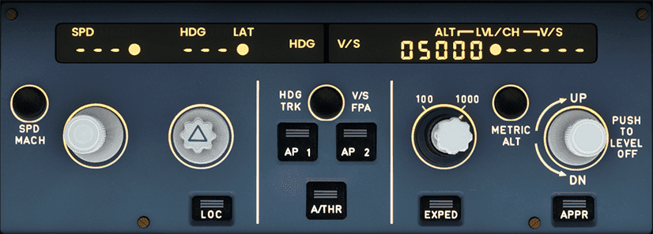{loading=lazy}

    !!!info "Microsoft Flight Simulator knobs"
        In Microsoft Flight Simulator pushing is clicking the knob "UP" and pulling is clicking the knob "DOWN" 
        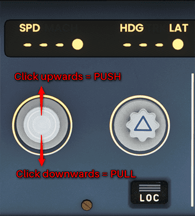{loading=lazy}

- __Flight phases__ 
The A320 uses flight phases to manage different parts of a flight. These are preflight, takeoff, climb, cruise, descent, approach, go around, done. They match the PERF pages in the MCDU (see [Preparing the MCDU](preparing-mcdu.md)).

- __Protections__ 
The A320 includes many protections for the pilot which make it nearly impossible to stall or overspeed the aircraft. It's beyond this beginner-guide to go into details (Normal law, Alternate Law, ...)

---

### 1. Lineup
**Situation:**

- ATC (Ground or Tower) has instructed us to hold at a runway holding point and wait until we are cleared to "line up" or "take off". 
- Aircraft is still in TAXI state (see previous chapters) and parking brakes are set.

{loading=lazy}

Typically, it is here at the latest that we are asked to switch to Tower ATC frequency for takeoff clearance.

While approaching the runway holding point or at the latest at the runway
holding point the **"Before takeoff checklist"** needs to be completed.

!!! info "Before takeoff checklist"
    { loading=lazy align=right width=30% }

    The "Before Takeoff" checklist is divided into two parts:

    - **"Down to the line"** (or "Above the line") means **before** "ATC Takeoff Clearance".
    - **"Below the line"** means **after** T.O. clearance (when lined up) but before starting the roll.

#### Preparation and "Down to the line" Checklist pre-T.O.-clearance

__*The following steps from TAXI setup need to be done and checked:*__

1. Check OVHD panel: APU off, no lights visible under normal circumstances 
  (exception: Pack 1+2 might be OFF if part of procedure)

    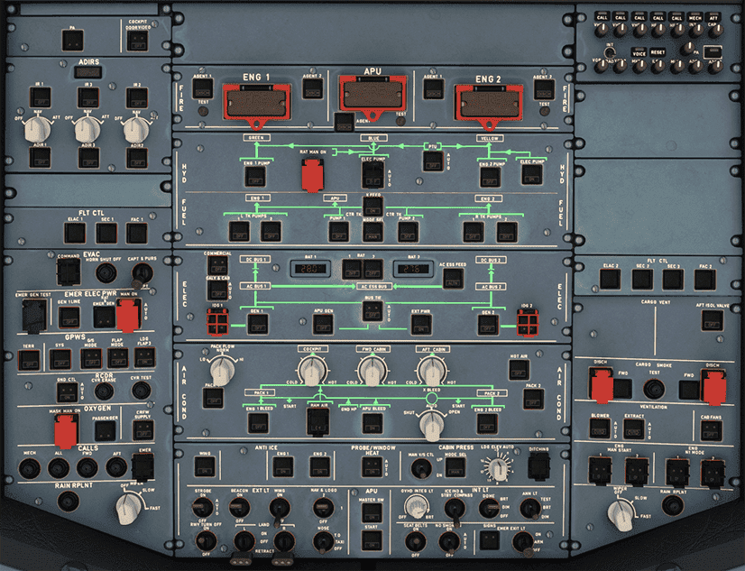{loading=lazy}

- Check Flight Controls

- Check Flight Instruments

    {loading=lazy}

- Check correct FLAPS setting (must be in line with PERF TAKE OFF page)

- Check V~1~, V~R~, V~2~ speeds and also, if required, FLX temperature setting (PERF TAKE OFF page)

- Check Squawk
  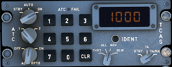{loading=lazy align=right width=45%}

    - check squawk ID number
    - Set to AUTO or On
    - Set ALT RPTG to ON

- Check COM frequency
    - Tip: set the standby frequency of `COM 1` to the Departure frequency to be able to quickly change after takeoff

- Check ECAM - no blue writing should be visible for these:

    !!! block ""

        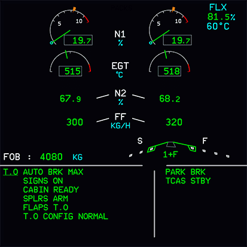{ loading=lazy align=right width=45% }

        - AUTO BRK MAX
            - SIGN ON
            - CABIN READY
            - SPLRS ARM
            - FLAPS TO
            - TO CONFIG NORMAL

        - Press T.O. Config button below the ECAM to check takeoff configuration

- Check radar panel:

    !!! block ""

        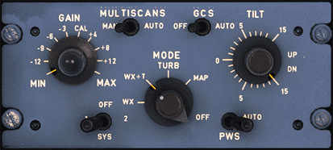{ loading=lazy align=right width=45%}

        - Set Weather Radar to Sys 1 to show weather on ND 
        - Check if Predictive Windshear Alerts (PWS) is set to AUTO (should have been set to AUTO during TAXI)

#### Entering Runway
Before we start rolling we visually check that no other aircraft is on final approach. We can also use TCAS on the ND to check for aircraft in the vicinity.

If everything is clear we release the parking brake and slowly roll onto the runway in the direction of takeoff and come to a stop on the runway's center line.

There is also a *rolling start* where we would not stop but directly apply thrust for takeoff once we are straight on the runway. But, as a beginner, a full stop is recommended, so we can double-check everything.

When we reached our starting point we stop and set the parking brakes.

{loading=lazy}

If we were only cleared to "line up" we wait here until we get clearance to *take off*.

This concludes *Lineup*.

---

### 2. Takeoff
**Situation:**

- Aircraft is on runway and fully setup for takeoff as per previous chapters.

#### Preparation and "Below the line" Checklist post-T.O.-clearance
After ATC (Tower) gives clearance to "line up" or "take off" we are allowed to enter the runway.

- To "line up" means that we roll onto the runway and stop at our starting point. We __MUST__ wait for ATC to give us "takeoff clearance" before we can continue.

- "Cleared for takeoff" means we are allowed to actually start the takeoff when aligned with the runway.

Shortly before we start our takeoff roll we do the following steps:

- Check `PACKS` as required 
  (some airlines take off with Packs `OFF` to allow more power to thrust and save fuel - not necessarily required)

- Turn on landing lights (`LAND`) and check if `STROBE` light is in `AUTO` or `ON`

    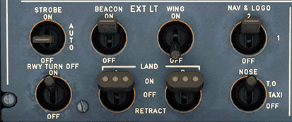{loading=lazy}

      The correct switch settings are:

      - `RWY TURN OFF` lt is `ON`
      -` NOSE` light is at `T.O.` (T.O. = takeoff)
      - `LAND` lights are both `ON`
      - `STROBE` is on `ON` or `AUTO`
      - `BEACON`, `NAV & LOGO` should have been on during taxi already
      - `WING` is `OFF`. It is usually only on for wing inspection and to detect ice accretion on the wing

!!! info "Lights at Takeoff"
    Setting the `RWY TURN OFF` light to `ON`, the `LAND` lights to `ON` and the `NOSE` light to `T.O.` minimizes bird strike hazard during takeoff.

- Check `ENG MODE SEL` as required (should be on `MODE NORM`)

- Set `TCAS` to `TA` or `TA/RA` and traffic to `ALL` or ABV

**A typical standard takeoff follows these steps:**

!!! info "Airline SOPs"
    Some airline's SOPs (standard operating procedures) might have a different order for these steps.

1. Release parking brake and hold down manual brakes.

- Apply thrust slowly to about 50% thrust until both engines are stabilized (N1 stays constant at around 50%) while still holding the brakes.

- Push sidestick forward half the way to put pressure on the front gear 

    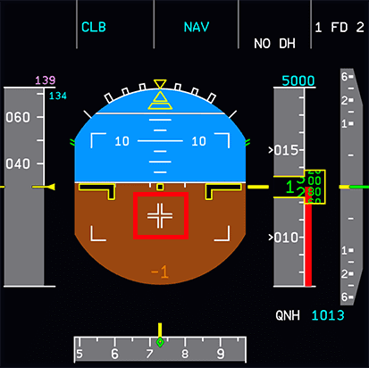{loading=lazy}

- Release brakes and apply `FLX/MCT` or `TO GA` power. 
  (depending on if have configured a FLEX temperature, and the runway is long enough for a `FLEX` start)

    {loading=lazy}

- The PFD Flight Mode Annunciator (FMA) now shows several things which we
  should check when aircraft starts rolling:

    {loading=lazy}

    From the left:

    - Thrust: set to MAN FLX +60
    - Vertical guidance:
        - Active (green): SRS (pitch guidance to maintain V~2~+10)
        - Armed (blue): CLB mode (is next after SRS is done)
    - Lateral guidance:
        - Active: RWY (automatic runway axis follow up through ILS use)
        - Armed: NAV (navigation guidance according to HDG knob)
    - __Autopilot__, Flight Director, Autothrust:
        - Autopilots are off
        - Flight Director 1 and 2 are ON
        - A/THR (Autothrust) is armed (not active yet)

    Vertical and lateral guidance are **only shown** via Flight Director as we have not turned on the __Autopilot__ yet and need to be followed manually by the pilot.

    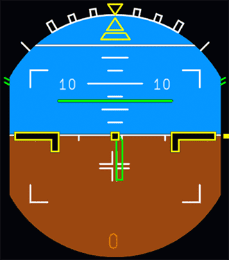{loading=lazy}

- Keep the aircraft on the center line while accelerating down the runway.

!!!info "V-Speeds"
    There are three important speeds for takeoff which we have configured earlier when programming the MCDU's PERF page for takeoff. These are shown on the PFD's speed tape.

    **V~1~**: The speed beyond which takeoff should no longer be aborted. V~1~ is depicted as a cyan "1" next to the speedband in the PFD.
    
    **V~R~**: Rotation speed. The speed at which the pilot begins to apply control inputs to cause the aircraft nose to pitch up, after which it will leave the ground. V~R~ is depicted as a cyan circle next to the speedband in the PFD.
    
    **V~2~**: Takeoff safety speed. The speed at which the aircraft may safely climb with one engine inoperative. V~2~ is depicted by a magenta triangle next to the speedband in the PFD.
    
    On a long enough runway V~1~ (depicted by "1") and V~R~ (depicted by "o") are often very close together and can't be clearly distinguished on the PFD speed tape.

- At about 80 knots slowly release the forward pressure on the sidestick until about 100 knots when the sidestick should be in neutral position.

- The throttle hand remains on the thrust levers until reaching V~1~ to be able to quickly abort the start. Remove the hand from the thrust levers at V~1~ to avoid accidentally aborting after V~1~.

- At V~R~ apply smooth positive backward stick movement on the sidestick and aim for a rotation rate (pitch rate) of 3 deg/sec for about 5 seconds (15°-18° pitch attitude). Once airborne follow the flight director's guidance for pitch attitude. 
  Tip: Count one-one thousand, two-one-thousand, etc. and hit 15 deg at five-one-thousand - practice this.

    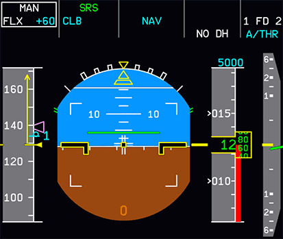{loading=lazy}

- Once we have confirmed "positive climb" we retract the landing gear.

    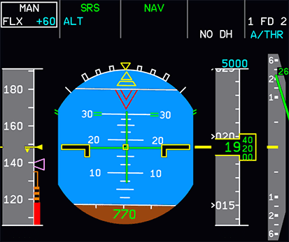{loading=lazy}.
    

- We confirm that the landing gear is up by looking at the landing gear annunciators, and the lower ECAM Wheels page.

    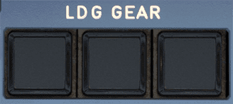{loading=lazy} 
    { loading=lazy}

This concludes *Takeoff*.

---

### 3. Initial Climb
**Situation:**

- Aircraft has left the ground and is climbing at about 15°.
- Gear is up.
- Thrust levers are in FLX MCT or TO GA detent.
- Flaps are still in T.O. position.

After takeoff the aircraft will use `FLX/MCT` or `TO GA` thrust until thrust reduction altitude is reached (typically ~1500ft above runway, this is part of the MCDU setup)

After reaching thrust reduction altitude the `PFD FMA` now shows a flashing *LVR CLB* message to instruct the pilot to move thrust levers to the `CL` detent.

**Pull the throttle back into the CL detent.**

{loading=lazy}

This activates the __Autothrust__ system (FMA shows `A/THR` in white now). In the A320 (and most Airbus models) we will not touch the thrust levers again before final approach and landing (under normal flight conditions).

The aircraft will now climb to the altitude selected in the FCU (in our case 5.000ft).

**Activate the __Autopilot__ at this point by pressing the AP1 button on the FCU.**

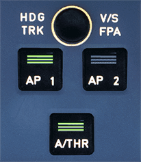{loading=lazy}

The FMA now shows AP1 in white in the upper right corner.

!!!info "FCU Autopilot Controls"
    The FCU (Flight Control Unit) shows three important values:

    - SPD "---" : means the __Autopilot__ is in Managed Speed mode (e.g. 250knots <10.000ft, 290kts above). If we pull the SPD knob we can select a speed which the __Autopilot__ will then apply.
    - HDG "---" : means the lateral navigation is in Managed HDG Mode and the __Autopilot__ follows the planned route. Dialing the HDG knob will let us select a heading and by pulling the knob we tell the __Autopilot__ to fly this heading (Selected Heading Mode). 
    - ALT "5000" : means the selected altitude is 5000ft 

**When reaching S-speed retract flaps.** 
S-speed is signified with an S next to the speed band in the `PFD`.

!!! info "Flaps during takeoff and climb"
    Depending on the start configuration there will be different markers next to the speedband in the `PFD` to show when to retract flaps:

    - `CONF-2` (Flaps position 2): At "F" and positive speed trend
    - `CONF-1+F` (Flaps position 1): At "S" and positive speed trend

    We always retract flaps by only one step at a time. So when we took off with `FLAPS 2` (`CONF-2`) we retract `FLAPS` at "F" to `FLAPS 1`. Then at "S" we retract them to `FLAPS 0`.

{loading=lazy}

The `TAXI` and `RWY TURN OFF` lights are automatically switched off when the landing gear is retracted. The flight crew should still move the switches to the `OFF` position as 
part of after take off flows. 

We do this in case the auto turn off has failed. This would mean the lights sitting on the front gear which are now within the gear housing will start increasing in temperature.

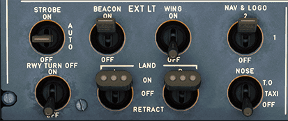{ loading=lazy width=60% }

Lastly we disarm the `SPEED BRAKE` and turn on the `PACKS` if we turned them off for takeoff.

**Now complete the "After takeoff checklist"**

1. Landing gear up
- Packs on
- Flaps retracted
- Check Baro setting: above transition altitude (defined in the `ECAM PERF` page) set it to `STD` by pulling the baro knob. A flashing baro value in the `PFD` will remind us in case we forgot.

{loading=lazy width=35%}

This is usually a good time to contact ATC Departure to check in with your current altitude. In most cases ATC will now give us a higher climb altitude. If we did not receive a higher altitude we have to level off at the previously cleared altitude (cleared by ATC or navigational charts). If we have the __Autopilot__ activated it will level off automatically at the Selected Altitude.

This concludes the *Initial Climb*.

---

### 4. Climb
**Situation:**

- Aircraft is climbing to or is at our initially cleared climb altitude.
- *After takeoff checklist* is completed.
- ATC has given us clearance for further climb.

**Dial the newly cleared altitude into the FCU. (e.g., 15.000ft) and push for managed climb (CLB) or pull for open climb (OP CLB)**

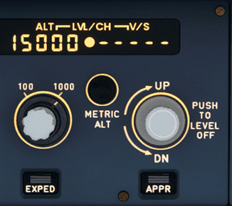{loading=lazy}

The aircraft will now continue climbing while managing thrust and pitch level. The __Autopilot__ ensures that the aircraft stays at the Selected or Managed Speed setting and climbs to the new altitude while managing thrust automatically.

The PFD's `FMA` now shows: 
{loading=lazy}

Thrust level is `THR CLB`, vertical mode is `CLB` (ALT mode armed), lateral mode is NAV.

Typically, the climb to the flight plan's cruise level (e.g., FL210) happens in several steps (step climbs). Each to be instructed and cleared by ATC.

**Passing 10,000ft** 
Turn off landing lights and when the aircraft is stable (weather, no turn, etc.) you can turn off the seatbelt signs. The aircraft will now accelerate to CLB speed (defined in `MCDU PERF CLB` page).

**Repeat the climb process above until cruise level (e.g. FL240) is reached.**

MCDU and PFD at cruise level:

This concludes the *Climb*.

---

### 5. Cruise
**Situation:**

- Aircraft has leveled off at planned cruise level.
- Speed is cruise speed as per ECAM PERF CRZ page.
- __Autopilot__ is ON.
- Speed is in Managed Mode.

This is usually the quietest time of the flight. It allows time to double-check the systems by going through all ECAM pages, etc.

Regular ATC frequency changes with altitude and position check-ins are common.

Here are some **typical activities** which might happen during cruise mostly on request from ATC or other circumstances like weather, traffic, etc.

- **Altitude change (also called flight level change)** 
  Like before during climb set your new altitude in the FCU and push the ALT knob. The aircraft will descent or climb to the new altitude automatically.

- **Course change with Selected Heading** (given or cleared by ATC) 
  Dial heading knob to the desired heading and pull knob for Selected Heading Mode. The aircraft will automatically change course to the new heading. If you want the aircraft to follow the planned route again you can push the knob for Managed Heading Mode.

- **Direct course to a waypoint (DIR TO)**  
  ATC regularly instructs us to go "direct to (waypoint) XYZ". Use the ECAM DIR page to select the waypoint from the plight plan's list of waypoints. In rare cases it is a waypoint not in the current flight plan then you can enter a new waypoint in the MCDU and put it into the upper left entry field. Select DIRECT* on the rght bottom to execute the change.

    { loading=lazy }

- **ATC requests specific speed ** 
  Sometimes ATC requests a specific speed to keep separation between aircraft. Pull the speed knob to switch to Selected Speed Mode. The current speed will be preselected. Dial to the desired speed. The aircraft will immediately begin to target the new speed by either increasing or decreasing thrust.

At some point (200-300NM from destination) we would start with descent-planning and setting up the aircraft for descent and approach.

Descent, Approach and Landing will be covered in later chapters of this beginner guide.

This concludes the *Cruise*.

Continue with [Descent Planning and Descent](descent.md)
