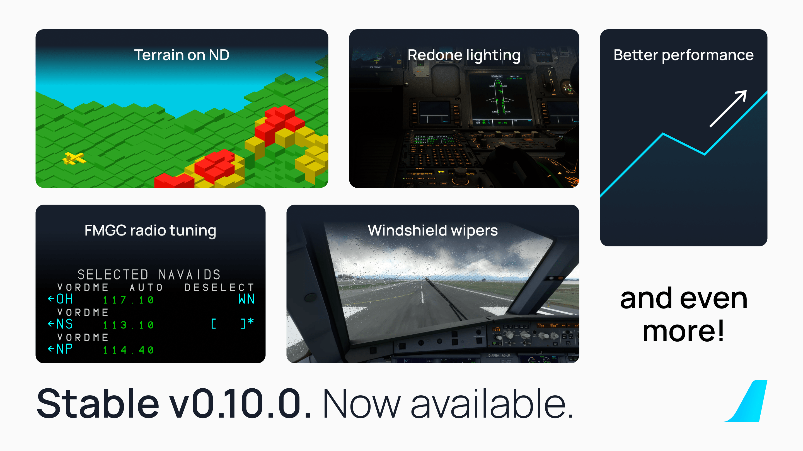

<link rel="stylesheet" href="../../stylesheets/toc-tables.css">

# Stable Release v0.10.1

This update contains some minor fixes to our previous stable release. Happy Flying!

For a full release changelog - [see here](#changelog)

## Previous Feature Releases

[See Previous Release - v0.10.0](v0100.md){.md-button}

{width=50% loading=lazy}

!!! tip "Recommended Settings"
    Before your first flight, please make sure to read our [Recommended Settings](../../aircraft/install/settings.md) guide.

    **Navigraph Airframe**

    The team at Navigraph have been kind enough to include our airframe as a selectable option on SimBrief. You no longer have to save our custom airframe to your account to use it. If we decide 
    to make any changes, it will be automatically updated in their system.

    [Guide Here](../fbw-a32nx/feature-guides/simbrief.md#simbrief-airframe){.md-button}

!!! warning "Important User Experience Changes"

    Please note the following changes.

    SimBridge is now required to use the following features:

    - Terrain on ND 
    - MCDU Remote Display
    - External Printer
    - Local Files feature
    - Company Routes

    [SimBridge Guides Here](../simbridge/index.md){.md-button}

    - Custom Flight Management System.
        - See the [Special Notes Section](../fbw-a32nx/feature-guides/cFMS.md#special-notes) on our custom FMS page for more details.
    - Weather is inoperable as we wait for Asobo implementations.
    - MSFS Built-in ATC and VFR maps are on limited support. [Guides Here](#)
    - [Discontinuities](../pilots-corner/advanced-guides/flight-planning/disco.md) may now appear in your flight plan — they are a feature and not a bug.
    - [Throttle calibration](../fbw-a32nx/feature-guides/flypados3/throttle-calibration.md) is **mandatory**.

!!! info ""
    Downloads available through our [installer](../../aircraft/install/installation.md).

    Please see our [Support Guide](../fbw-a32nx/support/index.md) and [Reported Issues](../fbw-a32nx/support/reported-issues.md).

## Changelog
- [ATSU] Hoppie Telex with \n now can be received @Maximilian-Reuter (Chaoz#3065)
- [EFB] Fixed SimBridge failing to connect if remote setting is enabled then disabled - @DevonDF (Devon#9451)
- [EFB] Optimized/fixed strobe handling in aircraft presets @frankkopp (Frank Kopp)
- [EIS] Added > character to the font - @KiloEchoVictor (Kevin)
- [FLIGHTMODEL/FUEL] Update of fuel system (center tank transfer and crossfeed) - @donstim (donbikes#4084), @tracernz (Mike), @Taz5150 (TazX [Z+2]#0405)
- [FMGC] No vapp addition without wind entry @tracernz (Mike)
- [FMS] Improved robustness of ILS selection - @tracernz (Mike)
- [FMS] TO SPEEDS TOO LOW uses FQI fuel quantity after engine start to avoid spurious warnings - @tracernz (Mike)
- [LIGHTS] Fixed trim decal emissive and floods - @FinalLightNL (FinalLight#2113)
- [ND] Fix ROSE VOR/LS conditions and ILS course - @tracernz (Mike)
- [SIM] fix(sim): only show nav radio tip once @tracernz (Mike)
