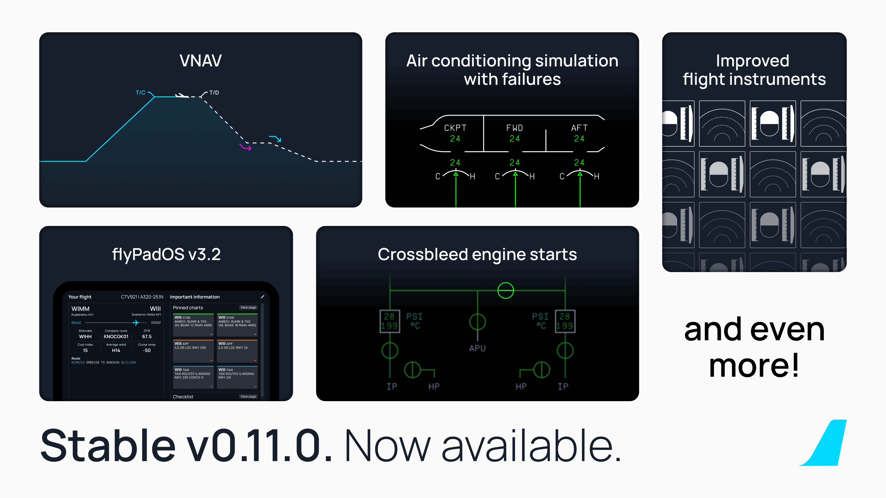

[//]: # (<link rel="stylesheet" href="../../stylesheets/toc-tables.css">)

# Stable Release v0.11.1

This update primarily addresses some minor issues that were present in our previous stable release. Specifically, we have resolved a problem when a runway is missing from the
base sim, but the navdata has been added externally (e.g. Navigraph).

Happy Flying!

For a full release changelog - [see here](#changelog)

## Previous Feature Releases

[See Previous Release - v0.11.0](v0110.md){.md-button}

{width=50% loading=lazy}

!!! tip "Recommended Settings"
    Before your first flight, please make sure to read our [Recommended Settings](../../aircraft/install/settings.md) guide.

    !!! warning "**Navigraph + SimBrief Integration**"
        The authentication process for Navigraph services (SimBrief included) has changed. Please see the following page for more information:

        [SimBrief Integration](../fbw-a32nx/feature-guides/simbrief.md){.md-button}

    **Navigraph Airframe**

    The team at Navigraph have been kind enough to include our airframe as a selectable option on SimBrief. You no longer have to save our custom airframe to your account to 
    use it. If we decide to make any changes, it will be automatically updated in their system.

    [Guide Here](../fbw-a32nx/feature-guides/simbrief.md#simbrief-airframe){.md-button}

!!! warning "Important User Experience Changes"

    Please note the following changes.

    SimBridge is now required to use the following features:

    - Terrain on ND 
    - MCDU Remote Display
    - External Printer
    - Local Files feature
    - Company Routes

    [SimBridge Guides Here](../simbridge/index.md){.md-button}

    - Custom Flight Management System.
        - See the [Special Notes Section](../fbw-a32nx/feature-guides/cFMS.md#special-notes) on our custom FMS page for more details.
    - Weather radar is inoperable as we wait for Asobo implementations.
    - MSFS Built-in ATC and VFR maps are partially supported. [Guides Here](../fbw-a32nx/feature-guides/flight-planning.md)
    - [Discontinuities](../pilots-corner/advanced-guides/flight-planning/disco.md) may now appear in your flight plan — they are a feature and not a bug.
    - [Throttle calibration](../fbw-a32nx/feature-guides/flypados3/throttle-calibration.md) is **mandatory**.

!!! info ""
    Downloads available through our [installer](../../aircraft/install/installation.md).

    Please see our [Support Guide](../fbw-a32nx/support/index.md) and [Reported Issues](../fbw-a32nx/support/reported-issues.md).

---

## Changelog

- [MCDU] Prevent MCDU crash if runway is undefined @Saschl
- [MISC] Fixed checklist fuel mode selector @JXNXH28
- [PFD] Show ILS frequency when LOC not received @tracernz