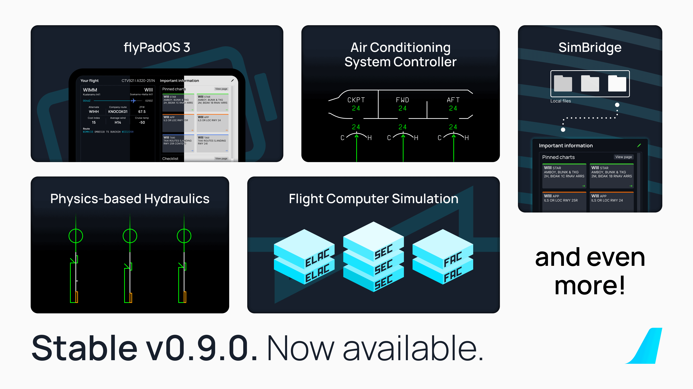

# Stable Release v0.9.1

We've released a small patch to fix the metadata found in MSFS content manager to properly reflect the stable 
version is installed. We've also contacted our ground staff to properly switch the INOP sticker to the correct colors.

All flights are now cleared for departure. Happy Flying!

## Previous Feature Releases

[See Previous Release - v0.9.0](v090.md){.md-button}

{width=50% loading=lazy}

For a full release changelog - [see here](#changelog).

!!! tip "Recommended Settings"
    Before your first flight please make sure to read our [Recommended Settings](../../aircraft/install/settings.md) guide.

!!! warning "Important User Experience Changes"

    Please note the following changes:

    - SimBridge is now required to use the MCDU Remote Display, external printer, and the new Local Files feature.

        [SimBridge Guides Here](../simbridge/index.md){.md-button}

    - Custom Flight Management System
        - See the [Special Notes Section](../fbw-a32nx/feature-guides/cFMS.md#special-notes) on our custom FMS page for details on the topics below:
            - Weather and Terrain are now inoperable as we wait for Asobo implementations.
            - MSFS Built-in ATC and VFR maps are on limited support.
    - [Discontinuities](../pilots-corner/advanced-guides/flight-planning/disco.md) may now appear in your flight plan — they are a feature and not a bug.
    - [Throttle calibration](../fbw-a32nx/feature-guides/flypados3/throttle-calibration.md) is mandatory.

!!! info ""
    Downloads available through our [installer](../../aircraft/install/installation.md).

    Please see our [Support Guide](../fbw-a32nx/support/index.md) and [Reported Issues](../fbw-a32nx/support/reported-issues.md).

---

## Changelog

- Fixed version metadata displayed in content manager
- Fixed wrong inop sticker shown in cockpit 