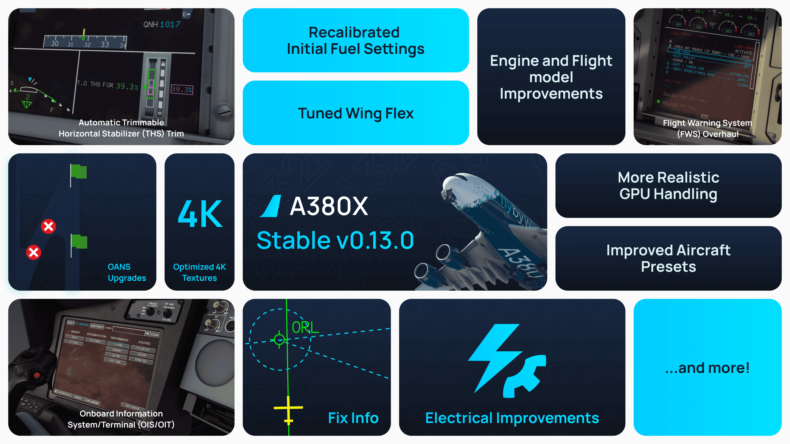

[//]: # (<link rel="stylesheet" href="../../stylesheets/toc-tables.css">)

# A380X Alpha Release v0.13.0

Welcome aboard the A380X v0.13.0 Alpha release, where we continue refining realism, systems behavior, and user experience. This release expands system fidelity, introduces new failure modes and enhances the Electronic Flight Bag. We’ve also optimized visual immersion with sharper textures, more realistic wingflex, and more precise hydraulic and engine behavior.

We have two options for you to choose in our installer.

- 4K Texture Option

    ---

    [System Requirements](../../aircraft/install/installation.md#estimated-system-requirements-for-a380x){.md-button}

    Includes our 4K downscaled cabin, cockpit and exterior textures. Choose this option for reduced stutters, better performance, with HIGH or lower texture resolution setting. 

    Additionally, if you intend to use the following:
  
    - Use frame generation
    - Virtual Reality (VR)
    - DX12 beta
    - or are otherwise limited by your graphics card VRAM amount.

- 8K Textures Option

    ---

    [System Requirements](../../aircraft/install/installation.md#estimated-system-requirements-for-a380x){.md-button}

    Includes our 8K full resolution cabin, cockpit and exterior textures. This is the full fidelity experience and our recommendation if your system is powerful enough to support it. Realistic and in high detail.

    - DX11 recommended
    - HIGH or lower texture resolution setting recommended
  

## Release Feature Highlights

- [x] **FCU Overhaul**

Baro knob actions now mirror real-world operation—push for STD, pull for BARO—and the new metric altitude button simplifies transition between units. QNH and altitude values display accurately during light tests, and LS auto-selection on LOC mode offers smoother approach captures.

- [x] **Electronic Flight Bag (EFB) Enhancements**

Cabin lighting controls have migrated into the EFB Quick Settings for intuitive access, while popup logic now requires telex consent to prevent inadvertent data transfer. 
    Additionally, the door logic fix ensures panels remain secured in flight.

- [x] **Flight Management System (FMS) & AFCS**

Layout fixes on PERF and T.O. pages improve readability, and differentiation of compatible approach vias streamlines planning. The autopilot has been tuned to better support 4x simulation rate, and improvements have been made to the TCAS simulation..

- [x] **Visual & Structural Enhancements**

Optimized 4K textures reduce memory overhead while adding crispness to the model. Cockpit ambient bounce lights and LOGO light functionality bring extra immersion. Wing flex adjustments provide natural tip-up bend during high-load maneuvers.

- [x] **Hydraulics, FADEC & Fuel Systems**

Pressurization failure messages now adhere to ECAM standards, and rudder trim functionality across SECs adds depth to control surfaces. Fuel recalibration and oil pressure table improvements result in more accurate engine behavior.

- [x] **Performance & UX Tweaks**

PFD and ND brightness knob behavior has been refined and cleaned up memory leaks. The V1 callout and T/D reached alerts bolster situational awareness during takeoff and descent.

### Bug Fixes

We've squashed plenty of bugs in this release, including doors auto-opening in flight, FMS window constraint issues, TCAS default status toggling, EWD checklist soft key 
activation, MFS Direct-To sequence edge-case errors, and more.

## Changelog

* [A380X/AFS] Fixed CP V/S knob push levelling off the aircraft when it should have no action - tracernz (Mike)
* [A380X/ANIM] Animation of flaps now from FPPU position. Interim fix for spoiler low end animation - Crocket63 (crocket)
* [A380X/AP] Improved support of simulation rate 4x - aguther (Andreas Guther)
* [A380X/CAMERA] Showcase & pilot view camera fixes - LunakisDev (LunakisLeaks)
* [A380X/EFB] Fixed being able to click on window open handle through the flyPad screen - 2hwk (2cas)
* [A380X/EFB] Fixed doors automatically opening in flight - saschl (saschl)
* [A380X/EFB] Moved cabin lighting from ambient light knob to EFB Quick Settings - 2hwk (2cas)
* [A380X/ENGINES] Corrected ENG4 throttle variable typo - rthom91 (Randy Thom)
* [A380X/ENG] Another adjustment to taxi thrust - donstim (donbikes)
* [A380X/ENG] Improve oil pressure lookup table - tracernz (Mike)
* [A380X/ENG] Improved engine fire behavior - overhead fire pushbuttons silence aural warning and unpowers FADEC - mjuhe (Miquel Juhe)
* [A380X/EWD] QoL: Add soft keys to EWD checklists, can be enabled via EFB - flogross89 (floridude)
* [A380X/FADEC] Add N1 fan protection measures (METOTS, KOZ) - flogross89 (floridude)
* [A380X/FCU] Add correct QFE label using the baro preselect display - heclak (Hecklak)
* [A380X/FCU] Added metric altitude button - tracernz (Mike)
* [A380X/FCU] Automatically select LS on LOC mode arming - BravoMike99 (bruno_pt99)
* [A380X/FCU] Baro knob now requires to be pushed to enter STD mode and pulled to enter BARO mode, as per the real thing - danestfanous (Daniel Estfanous)
* [A380X/FCU] Fix baro-preselect not recognising baro unit changes - tracernz (Mike)
* [A380X/FCU] Fix display of values on FCU during light test - heclak (Hecklak)
* [A380X/FCU] QNH and altitude displays now correctly show "8" values during light test - mattgogerly (Matt)
* [A380X/FLIGHT MODEL] Flight model update incl stall & auto-rotate fix for FS2020 & 2024 - donstim (donbikes) & saschl (saschl)
* [A380X/FLIGHTMODEL] Tweaked jetway connect position - C-Schaffhausen (Cedric)
* [A380X/FMS] Add selection of CLB/DES constraint if constraint type is unknown - flogross89 (floridude)
* [A380X/FMS] Fix VLS computation error for CONF 1, might have lead to FMS crashes during climb out - flogross89 (floridude)
* [A380X/FMS] Fixed handling of window altitude constraints, deletion of constraints, and formatting - tracernz (Mike)
* [A380X/FMS] Fixed layouting issue on FMS/ACTIVE/PERF/T.O page for some users - flogross89 (floridude)
* [A380X/FUEL] Recalibrated initial fuel settings - sschiphorst (Yahtzee94)
* [A380X/FWS] Add V1 callout - flogross89 (floridude)
* [A380X/FWS] Fix "NO ZFW OR ZFWCG DATA" ECAM alert after landing - flogross89 (floridude)
* [A380X/FWS] Fix green dot speed for high weights and altitudes, fix FMS speed target for GD > climb speed limit - flogross89 (floridude)
* [A380X/LIGHTS] Added cockpit ambient bounce lights - ImenesFBW (Imenes)
* [A380X/LIGHTS] Fix function of FCU brightness knobs - heclak (Hecklak)
* [A380X/LIGHTS] Implemented LOGO LT switch functionality - ImenesFBW (Imenes)
* [A380X/MFD] Add ATCCOM connect page - heclak (heclak)
* [A380X/MFD] Fix ETA and add TOD prediction in PERF page - BravoMike99 (bruno_pt99)
* [A380X/MFD] Fixed DIRECT TO selection of active waypoint does nothing - sognodelx (Sven Gross)
* [A380X/MFD] Limit keyboard inputs to keys present in the KCCU and remap comma to decimal dot - beheh (Benedict Etzel)
* [A380X/MFD] MFD/SURV: Fixed TCAS not switching status when using DEFAULT SETTINGS button - flogross89 (floridude)
* [A380X/MODEL] Optimized 4K textures - Repsol
* [A380X/OANS] Fix "BTV/FMS RWY DISAGREE" message for single-digit runway identifiers - flogross89 (floridude)
* [A380X/OVHD] Fix RCDR GND CTL button/logic - flogross89 (floridude)
* [A380X/PERF] Changed managed speeds to more realistic numbers - slightlyclueles (abnormaltoast)
* [A380X/PFD] Add LS button reminder - BravoMike99 (bruno_pt99)
* [A380X/PFD] Add T/D Reached PFD message - BravoMike99 (bruno_pt99)
* [A380X/PFD] Fix CP VV button turning on VV on both PFDs - heclak (Heclak)
* [A380X/PFD] Fix PFD DU / ND DU brightness knobs - MichelZ
* [A380X/PRESS] Add pressurization system failures ecam messages - mjuhe (Miquel Juhe)
* [A380X/PRIM] Fix max. spoiler deflection based on flap conf - flogross89 (floridude)
* [A380X/SD] Added correct ECP ALL button SD page cycling to the A380X - frankkopp (cdr_maverick)
* [A380X/SD] Fix engine fuel flow and fuel used on cruise page still use only ENG 1 + 2 LVars - heclak (heclak)
* [A380X/SURV] Fixed BTV setup from F/O side, and ROW issues at G/A with early THR RED - flogross89 (floridude)
* [A380X/TELEX] Added popup for telex consent - saschl (saschl) Maximilian-Reuter (_chaoz)
* [A380X/WING_FLEX] Reduced stiffness of wings for more tip up bend - Crocket63 (crocket)
* [A380X/WING_FLEX] Reduced stiffness of wings for more tip up bend - Crocket63 (crocket)
* [A380X] Add rudder trim functionality to SECs, add rudder trim indication to PFD, activate indication on SD/FCTL - flogross89 (floridude)
* [A380X] Various fixes in FMS and ECL - flogross89 (floridude)

### Other Changes

This section applies to all FlyByWire Products incorporating changes to the A32NX and A380X.

* [ATC/TCAS] Fixed TCAS failure on baro corrected altitude going invalid - tracernz (Mike)
* [ATC/TCAS] Fixed TCAS slant range computation - tracernz (Mike)
* [ATSU] Fixed issues with the ALL-CALLSIGNS recipient on Hoppie - CronixZero (CronixZero)
* [Clock] Fixed chrono not rolling over to 00:00 when reaching 99:59 - tracernz (Mike)
* [Clock] Fixed chrono not rolling over to 00:00 when reaching 99:59 - tracernz (Mike)
* [EFB/PERF] Harmonize takeoff and landing performance calculators - FoxtrotSierra6829 (FoxtrotSierra)
* [EFB] Added troubleshooting page, under about page, for advanced support - tracernz (Mike)
* [ELEC] Add power consumption for fuel pumps - Gurgel100 (Pascal)
* [ELEC] Improved elec system startup behaviour - Gurgel100 (Pascal)
* [FMS] Fix Pause at T/D not working in selected speed - BlueberryKing (BlueberryKing)
* [FMS] Fix T/D not showing in selected speed - BlueberryKing (BlueberryKing)
* [FMS] Fix existing T-P moving when inserting temporary flight plan - Benjozork (Benjamin Dupont)
* [FMS] Transition altitude/level and RNP now come from navdata in MSFS2024 - tracernz (Mike)
* [FMS] Use station declination for PBX/PBD waypoints - BlueberryKing (BlueberryKing)
* [GENERAL] Fixed issue in C++ WASM Framework that caused performance degradation in some WASM modules - frankkopp (cdr_maverick)
* [GENERAL] Mitigated issue with pop-ups (i.e. pause on TOD notification) being unable to be dismissed while camera is in freelook + ALT-TAB - 2hwk (2cas)
* [GPU] Improved handling of ground power for more immersive use - Maximilian-Reuter (chaoz)
* [HYD] Placeholder inhibit logic for electrical backup on ground - Crocket63 (crocket)
* [MISC] Replaced brake temperature simulation with physics based model of brakes - Gurgel100 (Pascal)
* [ND] Fix memory leak when using TERR ON ND - Nufflee (nufflee)
* [OANS] Display correct flags when IRS position is not available - Nufflee (nufflee)
* [RA] Add direct coupling and interrupted antenna cable failures to RAs - beheh (Benedict Etzel)
