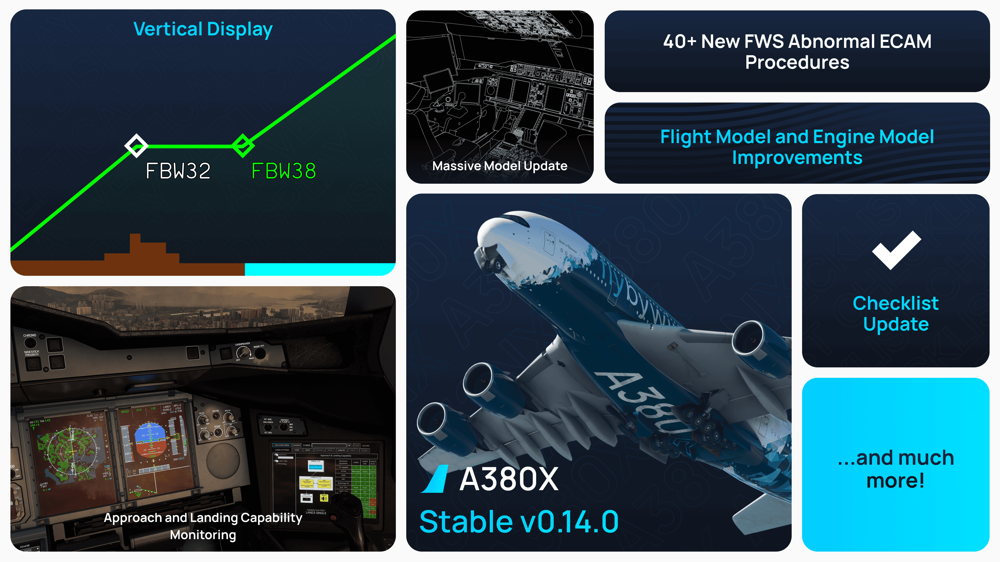

[//]: # (<link rel="stylesheet" href="../../stylesheets/toc-tables.css">)

# A380X Stable Release v0.14.0

!!! tip "Microsoft Flight Simulator 2024"
    The aircraft is now compatible with MSFS 2024. Please note that this is not a **Native 2024 Package**.

    Our latest update to the FlyByWire Installer will allow you to install the aircraft to the right location for Microsoft Flight Simulator (2020 and 2024). Please make sure you are on the latest FlyByWire Installer and report any 2024-specific issues through our usual support channels.

    Visit our installer documentation for more information.

    [Installer Documentation](../../tools/installer/index.md){.md-button target=new}

This release features a big fidelity upgrade for the A380X — with major advances across:

- [x] **FMS Enhancements**
- [x] **FWS & ECAM Overhaul**
- [x] **SURV & OANS Updates** 
- [x] **Flight Deck Displays PFD/SD/MFD**
- [x] **Model/Lighting Polish**

We’ve focused on accuracy, consistency with later avionics batches, and practical daily-ops improvements — **especially for MSFS 2024**.

We have two options for you to choose in our installer.

- **4K Texture Option**

    ---

    [System Requirements](../../aircraft/install/installation.md#estimated-system-requirements-for-a380x){.md-button}

    Includes our 4K downscaled cabin, cockpit and exterior textures. Choose this option for reduced stutters, better performance, with HIGH or lower texture resolution setting. 

    Additionally, if you intend to use the following:
  
    - Use frame generation
    - Virtual Reality (VR)
    - DX12 beta
    - or are otherwise limited by your graphics card VRAM amount.

- **8K Textures Option**

    ---

    [System Requirements](../../aircraft/install/installation.md#estimated-system-requirements-for-a380x){.md-button}

    Includes our 8K full resolution cabin, cockpit and exterior textures. This is the full fidelity experience and our recommendation if your system is powerful enough to support it. Realistic and in high detail.

    - DX11 recommended
    - HIGH or lower texture resolution setting recommended
  

!!! info ""
    Downloads available through our [installer](../../aircraft/install/installation.md).

    Please see our [Support Guide](../../aircraft/support/index.md) and [Reported Issues](../../aircraft/support/known-issues/index.md).

---

## Headline Features

### FWS / ECAM & Checklists
- **Abnormal Sensed Procedures** expanded (e.g., **PRIM** faults, **ENG SHUTDOWN**, timer-based items).
- **Abnormal Non-Sensed Procedures** added (e.g., **EMER DESCENT**, **EMER EVAC**).
- **Approach capability downgrade** behavior corrected, and **runway spawn** startup time disabled.

**Procedures Implemented:**

- **256** Abnormal Procedures
    - **246** Abnormal *Sensed* (“Faults”)
    - **10** Abnormal *Non-Sensed* (via **ABN PROC** button)
    - **5** Deferred Procedures
- **132** MEMOs
- **107** INOP SYS items
- **14** Normal Checklists

### FMS & Navigation
- **DCT on AIRWAYS** page; **step-climb max level** now uses **estimated GW**; improved **CR/FC** leg geometry and MSFS 2024 radio-nav edge cases.
- **Decision height handling** corrected with **NO DH / NODH / NONE / NO** options reflected on PFD.
- **RNP shown** on approach identifier for **RNP AR** procedures; vertical message positioning refined. 

### SURV / OANS / MFD / SD / PFD
- **SURV switching** enabled via **MFD SURV** page and **ECAM faults** for **TERR/GPWS**; **BTV message & chrono** restored on OANS.
- **MFD UI updates**: overlapping tab selectors (later avionics batch styling), **speed limit mod** on **VERT REV SPD**, **RETURN** button on **DATA/AIRPORT**, automatic clearing of **ENTER DEST DATA** prompt, better displays when no predictions/flightplan are available.
- **SD** visual/logic improvements (BLEED page, unit conversions, status area / ISA deviation), **CABIN ALT donut clamp**, **EWD attention-getting boxing** for abnormal engine parameters, **AUTO BRK** flashing on A32NX mirrored where applicable.
- **PFD**: rudder trim indication inhibited in air; flap position and AUTO BRK/FMA update logic fixes. 

### Model / Lighting / Interop
- Multiple cockpit and exterior polish items (backlighting, emissives, tray clickspots, mesh fixes), and **MSFS 2024 lighting** corrections; **sidestick priority PBs** now clickable.
- **RMP** gains comprehensive key event handling, standby mode and localvars for API users; **ATC freq** kept tuned on runway spawn (2024).

### GSX & EFB Fueling
- **GSX** sync for A380X refueling and cargo doors; improved **EFB Fuel** state label plus total/ETA display.

---

## Fixes & Improvements
- **APU BLEED pressure**, **BLEED page indications**, **ELEC ground servicing** distribution, and **baro range** increased to **745–1100 hPa** (shared ADR/EFIS baseline).
- **Tailwind TL** indication on APPR PERF, **THR RED** field, **VERT DEV** updates on APPR page, **VLS vs VAPP** behavior at CONF 3.
- **OIT (AVNCS side)** initial implementation incl. **flight log** and **COMPANY COM** inbox. 

---

## Known Issues

See [A380X Known Issues](../../aircraft/support/known-issues/known-issues-a380x.md). We keep this page current as reports come in.

### MSFS 2024 Compatibility

Lighting, jetway/stairs behavior, and runway-spawn logic have been tuned for MSFS 2024. Use our Installer to keep both A32NX and A380X aligned with sim updates.

---

## Changelog

This changelog lists updates relevant to the **A380x**, including shared systems that affect both FlyByWire aircraft.  
Items that apply exclusively to the A32NX have been omitted.

This changelog is inclusive of updates that apply to both FlyByWire Products in certain scenarios.

- [A380X/APU] Fix too low APU BLEED pressure during engine starts (fix by BBK) - @flogross89 (floridude)
- [A380X/CDS] Change autoland capability designation to Batch 7 standard (LAND instead of CAT) - @flogross89 (floridude)
- [A380X/CDS] Implement abnormal engine parameters amber attention getting box on the EWD - @BravoMike99 (bruno_pt99)
- [A380X/ECAM] Add ATA 52 (DOOR) ECAM procedures (initial implementation) - @Jonny23787 (Jonathan)
- [A380X/ECAM] Add FLAPS LEVER NOT ZERO ECAM message - @Jonny23787 (Jonathan)
- [A380X/ECAM] Improve ALL PRIMARY CABIN FANS FAULT - @Jonny23787 (Jonathan)
- [A380X/ECAM] Improved STROBE LT OFF memo behaviour - @Jonny23787 (Jonathan)
- [A380X/EIS] Fix malformed W glyph on the EIS display units - @tracernz (Mike)
- [A380X/ELEC] Fix electrical distribution for ground servicing mode - @Gurgel100 (Pascal)
- [A380X/EWD] ECL checkbox is the same color as the text color - @Bravomike99 (bruno_pt99)
- [A380X/FBW] Improve alternate law and direct law activation conditions and ECAM procedures - @flogross89 (floridude)
- [A380X/FCU] Fix selected speed initial target not being managed speed in non SRS - @BravoMike99 (bruno_pt99)
- [A380X/FCU] Reduce FCU texture size from 5120 to 2560 - @heclak (Heclak)
- [A380X/FCU] Update FCU font for QFE based on new references - @heclak (Heclak)
- [A380X/FG] Fix SRS disengagement conditions for eng 3&4 OEI - @flogross89 (floridude)
- [A380X/FG] Fix VLS increasing above VAPP for CONF 3 landings - @flogross89 (floridude)
- [A380X/FLIGHT and ENGINE MODELS] Fixed excessive descent rates and takeoff rotation issues, improved fuel burn - @donstim (donbikes)
- [A380X/FMC] Use the estimated gross weight to compute the max level for step climbs - @tracernz (Mike)
- [A380X/FMS] Add DCT capability to AIRWAYS page - @flogross89 (floridude)
- [A380X/FMS] Add NAV PRIMARY & NAV PRIMARY LOST scratchpad messages - @BravoMike99 (bruno_pt99)
- [A380X/FMS] Add TL indication for tailwind on APPR PERF - @Jonny23787 (Jonathan)
- [A380X/FMS] Add engine-out indications and behavior to FMS - @flogross89 (floridude)
- [A380X/FMS] Added CHECK MIN FUEL AT DEST & DEST EFOB BELOW MIN message with associated amber EFOB color on MFD pages - @BravoMike99 (bruno_pt99)
- [A380X/FMS] Fix THR RED field being dashed even though filled in - @flogross89 (floridude)
- [A380X/FMS] Fix decision height handling in FMS and PFD; Add NO DH/NODH/NONE/NO options - @flogross89 (floridude)
- [A380X/FMS] Fix speed margins being displayed in the wrong place for a Mach target - @BlueberryKing (BlueberryKing)
- [A380X/FWS] Add PRIM abnormal sensed procedures - @BravoMike99 (bruno_pt99)
- [A380X/FWS] Add several abnormal non-sensed procedures (EMER DESCENT, EMER EVAC, ...) - @flogross89 (floridude)
- [A380X/FWS] Added DEST EFOB & FMS SWTG memos - @BravoMike99 (bruno_pt99)
- [A380X/FWS] Disable startup time for runway spawns - @flogross89 (floridude)
- [A380X/FWS] Fix approach capability downgrade triple click - @flogross89 (floridude)
- [A380X/FWS] Fix cavalry charge for AP disconnect; Add improved triple click logic using FCDC signals - @flogross89 (floridude)
- [A380X/FWS] Implement ENG SHUTDOWN abnornal sensed & timer countdown to timed based items - @BravoMike99 (bruno_pt99)
- [A380X/Fuel] Enabled gravityfeeding and fixed crossfeed fuel usage from correct tanks - @Maximilian-Reuter (_chaoz_)
- [A380X/MFD] Add RETURN button to DATA/AIRPORT page - @Jonny23787 (Jonathan)
- [A380X/MFD] Add speed limit modification on VERT REV SPD page - @BravoMike99 (bruno_pt99)
- [A380X/MFD] Changed colors of TCAS modes to match correct colors in A380 FCOM - @fwillard (Finn)
- [A380X/MFD] Fix VERT DEV not updating in APPR page during descend phase - @heclak (Heclak)
- [A380X/MFD] Fixed ENTER DEST DATA message not clearing automatically - @BravoMike99 (bruno_pt99)
- [A380X/MFD] MFD F-PLN page data display improvements when no predictions or flightplan available - @BravoMike99 (bruno_pt99)
- [A380X/MFD] Visual update to reflect later avionics batches (overlapping tab selectors) - @flogross89 (floridude)
- [A380X/MODEL] Fixed CPT MFD DU knob animation not aligned to panel decal - @heclak (Heclak)
- [A380X/MODEL] Fixed RMP 1 keypad backlighting - @heclak (Heclak)
- [A380X/MODEL] Fixed animations and emissives of some ECAM buttons - @heclak (Heclak)
- [A380X/MODEL] Fixed black textures on side windshield windows - @heclak (Heclak)
- [A380X/MODEL] Fixed protuding mesh under right wing when spoilers are moved or wing is flexing - @heclak (Heclak)
- [A380X/MODEL] Improved CPT and FO tray clickspot and animation - @heclak (Heclak)
- [A380X/MODEL] Overhead maintenance panel backlighting is no longer controlled by integrated lighting - @heclak (Heclak)
- [A380X/MODEL] Removed unwanted mesh in front of main landing gear - @heclak (Heclak)
- [A380X/MODEL] Tweaked EFB positioning - @heclak (Heclak)
- [A380X/ND] Show RNP on approach identifier for RNP AR approaches - @BravoMike99 (bruno_pt99)
- [A380X/OANS] Fixed BTV message and chrono not appearing on OANS - @Jonny23787 (Jonathan)
- [A380X/OIS] Fix OOOI times logic, automatically power laptop for runway spawns - @flogross89 (floridude)
- [A380X/OIT] Add initial implementation of OIT AVNCS side, including flight log and inbox page for COMPANY COM app - @flogross89 (floridude)
- [A380X/OIT] Add systems info page for approach and landing capability equipment monitoring - @flogross89 (floridude)
- [A380X/PFD] Fix FMA to update current AUTO BRK selection during RTO and rollout - @Jonny23787 (Jonathan)
- [A380X/PFD] Fix green ARS indication appearing before flaps are in CONF 1+F - @BravoMike99(bruno_pt99)
- [A380X/PFD] Fix selected altitude not white when ROLLOUT engaged - @BravoMike99(bruno_pt99)
- [A380X/PFD] Fixed logic for the flap position display - @HarmanSingh48 (Harman)
- [A380X/PFD] Fixed missing red lines on altitude tape failure indications - @tracernz (Mike)
- [A380X/PFD] Ignore non-running engines in flight phase 2 for rudder trim indicator visibility - @flogross89 (floridude)
- [A380X/PFD] Inhibit rudder trim indication in the air - @Jonny23787 (Jonathan)
- [A380X/PRIM] Introduce required equipment monitoring for AUTOLAND capability - @flogross89 (floridude)
- [A380X/RMP] Added handling of all COM key events for API users - @tracernz (Mike)
- [A380X/RMP] Added localvars for RMP frequencies and state for API users - @tracernz (Mike)
- [A380X/RMP] Added standby mode handling for VHF3 - @tracernz (Mike)
- [A380X/RMP] Keep the ATC frequency tuned when spawning on the runway in MSFS2024 - @tracernz (Mike)
- [A380X/SD] Add clamp to CABIN ALT donut - @Jonny23787 (Jonathan)
- [A380X/SD] Add video page with 'NOT AVAIL' text - @dzoeteman (Deniz)
- [A380X/SD] Adjust BLEED page visuals and indications logic - @lukecologne (luke)
- [A380X/SD] Display GW, GW CG only when ZFW and ZFW CG are entered - @flogross89 (floridude)
- [A380X/SD] Fix BLEED indications for APU BLEED and cross bleeds; Add HP GND air supply triangle - @flogross89 (floridude)
- [A380X/SD] Fix unit conversion in SD permanent area - @flogross89 (floridude)
- [A380X/SURV] Enable SURV system switching via MFD SURV page; Add ECAM faults for TERR/GPWS - @flogross89 (floridude)
- [A380X/VD] Add vertical display (first implementation) - @flogross89 (floridude)
- [A380X] Add default CPT and FO seat positions to FLT files - @heclak (Heclak)
- [A380X] Autoflight: Add ROLLOUT fault (i.e. communication fault between NWS and PRIM) - @flogross89 (floridude)
- [A380X] Autoflight: Partially move approach and landing capability computation to FCDC - @flogross89 (floridude)
- [A380X] Enable mouse drag for knobs in lock mode - @heclak (Heclak)
- [A380X] Fix some knobs snapping back to start position when turned to max value - @heclak (Heclak)
- [A380X] Fix speedbrake handle not animating smoothly - @heclak (Heclak)
- [A380X] Fixed FO EFB and OIT display not working - @heclak (Heclak)
- [A380X] Fixed GND HF DATALINK switch stuck in ON state - @heclak (Heclak)
- [A380X] Fixed glareshield sidestick priority annuciators not showing in light test - @heclak (Heclak)
- [A380X] Fixed lighting issues in MSFS2024 - @heclak (Heclak)
- [A380X] Fixed pink textures in 2024 SU3 caused by invalid texture size - @heclak (Heclak)
- [A380X] Fixed wing taxi lights appearing black - @heclak (Heclak)
- [A380X] Improve logic and architecture for INOP SYS, LIMITATIONs and INFOs - @flogross89 (floridude)
- [A380X] Increased available baro correction range to 745-1100 hPa - @tracernz (Mike)
- [A380X] Sidestick pushbuttons on CPT and FO sidesticks are made clickable - @heclak (Heclak)
- [A380X] Various fixes in FMS and ECL - @flogross89 (floridude)
- [A380x/FWS]: Update normal checklists to newer Airbus standard and harmonize TO memo - @becas22 (bernardor96)
- [ADIRU] Added excess motion and outside latitude limit (> 82° N/S) faults - @tracernz (Mike)
- [ADIRU] Added quick re-align function - @tracernz (Mike)
- [ADIRU] Changed the IRS alignment times to actual enhanced align times - @tracernz (Mike)
- [ADR] Implement accurate altimetry computations - @tracernz (Mike)
- [ATSU] Fixed a case where "no active atc" is returned but station is online - @heclak (Heclak)
- [ATSU] Improved Hoppie ACARS connection protocol - @heclak (Heclak)
- [EFB/FUEL] Added total and ETA for A380X, improved state label on both aircraft - @Fragtality (Fragtality)
- [EFB] Fixed overflow on settings pages when the page is too long - @heclak (Heclak)
- [EFB] Renamed "Weight Unit" pin program to "US Units" to reflect it's actual effect and real-world name - @tracernz (Mike)
- [EFB] Split jetway and pax stairs button in MSFS2024 to fix jetways not connecting in MSFS2024 - @heclak (Heclak)
- [FMS] Fix fuel predictions in the FMS not matching the engine model - @BlueberryKing (BlueberryKing)
- [FMS] Fix pseudo waypoint transmission for F/O side when EFIS range different from CAPT side - @flogross89 (floridude)
- [FMS] Fixed a rare issue where airways failed to load - @tracernz (Mike)
- [FMS] Improve CR and FC leg geometry - @tracernz (Mike)
- [FMS] Make sure radials of CR/VR legs use the station declination as magvar - @BlueberryKing (BlueberryKing)
- [FMS] Use proper DME location for AF, CD, FD legs on MSFS2024 and add MSFS2020 fallback to improve AF legs - @tracernz (Mike)
- [GENERAL] Fixed inconsistency in the PED/NO SMOKING option when it hasn't been set - @tracernz (Mike)
- [GSX] Added automatic refuel start and cargo door synchronisation for A380X, external power available synchronisation for A380X/A32NX - @Fragtality (Fragtality)
- [MISC] Prevent long sim freezes in some scenarios in MSFS 2024 - @Benjozork (Benjamin Dupont)
- [MODEL] Inverted behavior of FADEC GND PWR PB - @Maximilian-Reuter (_chaoz_)
- [ND] Fix terrain display smearing issue - @flogross89 (floridude)
- [ND] Fixed TAS, GS & Wind data not taking source switching into account - @BravoMike99 (bruno_pt99)
- [ND] Improve vertical position of approach message - @BravoMike99 (bruno_pt99)
- [SD] Fix ISA deviation display conditions on status area - @flogross89 (floridude)
