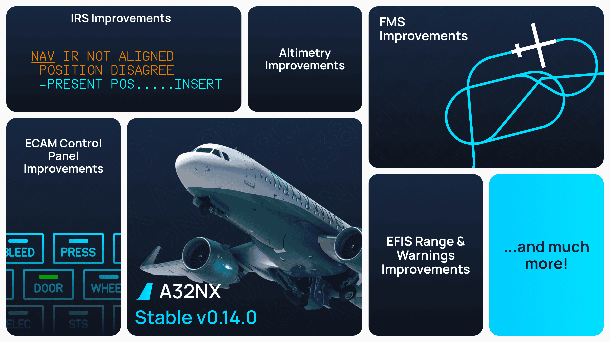

[//]: # (<link rel="stylesheet" href="../../stylesheets/toc-tables.css">)

# FS2024 A380X Stable Release v2024.1.0

<!--  -->

!!! tip "Microsoft Flight Simulator 2024"
    The aircraft is now officially compatible with MSFS 2024. Please note that this is not yet a **native 2024 package**.

    Our latest update to the FlyByWire Installer will allow you to install the aircraft to the right location for Microsoft Flight Simulator (2020 and 2024). Please make sure you are on the latest FlyByWire Installer and report any 2024-specific issues through our usual support channels.

    Visit our installer documentation for more information.

    [Installer Documentation](../../tools/installer/index.md){.md-button target=new}

This Stable release brings a significant systems improvement to the A380X.

**Highlights in this release include:**

- [x] Secondary Flight Plans
- [x] MSFS EFB Flight Plan Sync
- [x] FMS Improvements
- [x] FS2024 Flight Model Improvements
- [x] FWS Warnings and Logic Improvements
- [x] FAA/LIDO Charts and Cold Temperature Calculator
- [x] General polish and improvements across the 3D Artwork, EFB (flyPadOS), Systems, and Instruments

For a full release changelog - [see here](#changelog)

We have two options for you to choose in our installer.

- **4K Texture Option**

    ---

    [System Requirements](../../aircraft/install/installation.md#estimated-system-requirements-for-a380x){.md-button}

    Includes our 4K downscaled cabin, cockpit and exterior textures. Choose this option for reduced stutters, better performance, with HIGH or lower texture resolution setting. 

    Additionally, if you intend to use the following:
  
    - Use frame generation
    - Virtual Reality (VR)
    - DX12 beta
    - or are otherwise limited by your graphics card VRAM amount.

- **8K Textures Option**

    ---

    [System Requirements](../../aircraft/install/installation.md#estimated-system-requirements-for-a380x){.md-button}

    Includes our 8K full resolution cabin, cockpit and exterior textures. This is the full fidelity experience and our recommendation if your system is powerful enough to support it. Realistic and in high detail.

    - DX11 recommended
    - HIGH or lower texture resolution setting recommended
  

!!! info ""
    Downloads available through our [installer](../../aircraft/install/installation.md).

    Please see our [Support Guide](../../aircraft/support/index.md) and [Reported Issues](../../aircraft/support/known-issues/index.md).

---

## Headline Features

### Secondary Flight Plans

- Full support for secondary flight plans in the FMS and ND.

### MSFS EFB Flight Plan Sync

- Flight plans can be sent to or requested from the FMS in the MSFS EFB.

### FMS Improvements

- Added position monitor page.
- Added fuel penalty function.
- Updated various pages to new software batch layout.
- Support for the US units pin program.
- Added ability to edit VNAV descent speed.

### FS2024 Flight Model Improvements

- Reworked flight model accounting for FS2020/2024 differences and general improvement.
- Fixed MSFS2024 specific fuel system issues.

### FWS Warnings and Logic Improvements

- Improved logic accuracy for many warnings, memos, procedures, and outputs for other systems.
- Added many new warnings.
- Added 6 new procedures.

### FAA/LIDO Charts and Cold Temperature Calculator

- Added FS2024 FAA and LIDO charts to the EFB.
- Added a cold temperature altitude correction calculator to the EFB.

---

## Changelog

This changelog lists updates relevant to the **A380X**, including shared systems that affect both FlyByWire aircraft.  
Items that apply exclusively to the A32NX have been omitted.

- [OVHD] Implement FAULT light flickering during self-test sequence of PRIM, SEC, ELAC, FAC - @flogross89 (floridude)
- [A380X/MFD] Add = sign the MFD font - @JulKem (JulK)
- [A380X/MODEL] Add ability to hide EFB model via a clickspot - @heclak (Heclak)
- [A380X/MODEL] Fix cargo air cond temp knob animation out of range - @heclak (Heclak)
- [A380X/MODEL] Fix RMP Voice volume knob animations - @heclak (Heclak)
- [A380X/MODEL] Fix RAD NAV STBY button on RMP 2 not lighting up - @heclak (Heclak)
- [A380X/MODEL] Texture size optimization for display albedos - @heclak (Heclak)
- [A380X/MODEL] Fix RAT blur texture size not power of two - @heclak (Heclak)
- [A380X/OIT] Fix tooltips for OIT switches - @heclak (Heclak)
- [A380X] Fix PFD F RELIEF indication and SD status area ISA visibility - @flogross89 (floridude)
- [A380X/MFD] Implement Position Monitor page - @BravoMike99 (bruno_pt99)
- [A380X/MFD] Only show "RETURN" button on PERF & POS NAVAIDS if acessed via INIT page keys - @BravoMike99 (bruno_pt99)
- [FMS] Fixed climb phase not activating if vertical mode is changed below acceleration height - @BravoMike99 (bruno_pt99)
- [A380X/FWS] Add FCDC, SLAT/FLAP SYS, FWS+FCDC, FWS+CPIOM faults - @flogross89 (floridude)
- [A380X/SD] Improve STS page: Add deferred procedures, page switching, MORE page, improve performance - @flogross89 (floridude)
- [A32NX/A380X] Properly handle `PARKING_BRAKE_ON` and `PARKING_BRAKE_OFF` key events - @tracernz (Mike)
- [A380X/PFD] Increase PFD trim wheel rotation speed - @lukecologne (luke)
- [A380X/FWS] Add FCTL and OVERSPEED abnormal sensed procedures - @Jonny23787 (Jonathan)
- [A380X/SFCC] Improved slats/flaps cruise baulk trigger and display - @FozzieHi (fozzie), @lukecologne (luke)
- [A380X/EWD] Add "THR LK" and "A.FLOOR" indications - @BravoMike99 (bruno_pt99)
- [A380X/PFD] Add "MOVE THR LEVERS" message in case of thrust lock - @BravoMike99 (bruno_pt99)
- [A380X/FWS] Add ENG THRUST LOCKED & AUTO FLT A/THR LIMITED abnormal sensed procedures - @BravoMike99 (bruno_pt99)
- [ATSU] Fix certain aerodromes ATIS letter not being retrieved correctly - @clc0609 (Coby)
- [A380X/FUEL SYSTEM] Fuel system update - @donstim (donbikes) & @Maximilian-Reuter (\_chaoz_)
- [A380X] Fix aircraft resting on nose in aircraft selection window in 2024 - @heclak (Heclak)
- [FMS] Fixed pseudo waypoints symbols being offset after a direct to - @BlueberryKing (BlueberryKing)
- [ATSU] Add support for BeyondATC and SayIntentions AI ACARS - @saschl
- [A380X/MODEL] Add animation for thrust reverser levers - @heclak (Heclak)
- [EFB] Navigraph login link is now clickable - @tracernz (Mike)
- [FMS] Remove altitude restriction for approach phase activation when overflying DECEL waypoint . @BravoMike99 (bruno_pt99)
- [FMS] Implement MSFS 2024 EFB route sync - @Benjozork (Benjamin Dupont)
- [FMS] Use localizer station declination for true courses on approach legs - @BlueberryKing (BlueberryKing)
- [A380X/FMS] Add FUEL PENALTY function - @BravoMike99 (bruno_pt99)
- [A380X/MFD] Update DATA/STATUS page with newer software layout - @BravoMike99 (bruno_pt99)
- [A380X/MFD] Add initial implementation of D-ATIS page in ATCCOM - @heclak (Heclak)
- [A380X/FUEL SYSTEM] Fixed inner tank transfer not starting in certain circumstances - @donstim (donbikes)
- [FMS] Fixed an issue where the LNAV could crash after enabling the alternate flightplan - @tracernz (Mike)
- [A380X/FWS] Add EXCESS RESIDUAL DIFF PRESS and INHIBITED BY DOORS procedures - @Jonny23787 (Jonathan)
- [FMS] Fixed incorrect course for enroute holds and direct tos - @tracernz (Mike)
- [FMS] Show true bearings correctly in various FMS pages on the MCDU/MFD - @tracernz (Mike)
- [A380X/FWS] Improve various ABN SENSED procedure accuracy - @Jonny23787 (Jonathan)
- [A380X/FWS] Fixed overspeed VFE blue and selectable - @matze-tech (matze2346)
- [A380X/FUEL] Add first FQMS fuel measuring implementation - @Gurgel100 (Pascal)
- [FUEL] Fix fuel getting consumed when in Active Pause or Pause at T/D - @Maximilian-Reuter (\_chaoz_)
- [A380X/RMP] Fixed interphone volume knob light not illuminating when selected on - @matze-tech (matze2346)
- [A380X/OVHD] Fixed auto seat belt logic - @FlyByTim (FlyByTim)
- [A380X/FWS] Fixed seat belt/ground spoiler inhibition logic - @FlyByTim (FlyByTim)
- [A380X/FWS] Fix SD page flicker when using ALL button - @matze-tech (matze2346)
- [A380X/RMP] Fix light bleed on RMP audio knobs - @heclak (Heclak)
- [A380X/MFD] Fix CPNY F-PLN REQUEST button disabled when airport ICAO not found in failed Simbrief import - @heclak (Heclak)
- [A380X/RMP] Fix FO RMP integrated lights not working - @heclak (Heclak)
- [A380X/FMS] Add secondary flight plans to A380X - @flogross89 (floridude), @BravoMike99 (bruno_pt99)
- [A380X/FMS] Allow edition of vnav descent speed - @BravoMike99 (bruno_pt99)
- [A380X/FMS] Allow "INSERT NEXT WPT" revision at the flightplan origin - @BravoMike99 (bruno_pt99)
- [A380X/OVHD] Fix GND CTL Pushbutton activating REMOTE C/B CTL - @BravoMike99 (bruno_pt99)
- [A380X/MODEL] Unlink CKPT DOOR LCKG SYS and OXYGEN RESET buttons - @Jonny23787 (Jonathan)
- [A380X/MODEL] Match animation speed of GND HYD buttons to other overhead buttons - @Jonny23787 (Jonathan)
- [A380X/MFD] Added support for the US Units option - MikioDK (Mikio), @tracernz (Mike)
- [A380X/MFD] Add details to "FORMAT ERROR" and "ENTRY OUT OF RANGE" messages - @BravoMike99 (bruno_pt99)
- [A380X/MFD] Fixed GA THR RED, ACCEL & EO not respecting arrival transition altitude - @BravoMike99 (bruno_pt99)
- [A380X/Fuel] Only try to equalize feedtanks when each is below transfer limit - @Maximilian-Reuter (\_chaoz_)
- [A380X/MFD] Added IMMEDIATE EXIT/RESUME HOLD button to the F-PLN page - @BravoMike99 (bruno_pt99)
- [FMS] Add lateral discontinuity ahead fms message - @BravoMike99 (bruno_pt99)
- [A380X/PFD] Add "APPR 1" on LS button press if no capability computed by systems - @BravoMike99 (bruno_pt99)
- [A380X/FLIGHT MODEL] Fight model update  - @donstim (donbikes)
- [FMS] Fixed an issue where waypoints around lateral discontinuities and at enroute/procedure boundaries were sometimes not sent to the ND - @tracernz (Mike)
- [FMS] Fixed an issue where the WPT overlay on the ND showed terminal waypoints in enroute range - @tracernz (Mike)
- [A380X/FG] Fixed autopilot managed speed target not limited by characteristic speeds outside of approach - @BravoMike99 (bruno_pt99)
- [A380X/FLIGHT MODEL] Fixes drag level for MSFS 2024 native version - @donstim (donbikes)
- [A380X/FUEL SYSTEM] Fixes unbalanced fuel transfer when transfer not active for all feed tanks - @donstim (donbikes)
- [A380X/MFD] Fix SURV page radio buttons not matching the actual state of the TCAS system - @heclak (Heclak)
- [A380X/MFD] Fix TAKEOFF PERF page radio buttons not syncing correctly when both MFDs are used - @heclak (Heclak)
- [A380X/MFD] Fixed PERF APPR QNH entries in inHg being displayed as hPa - @Daboss57 (Daboss57)
- [EFB] Add FAA and LIDO charts supplied by MSFS2024 - @tracernz (Mike)
- [EFB] Added a cold temperature correction calculator - @tracernz (Mike)

## Cockpit API Changelog

This changelog covers simulator-facing interfaces used by home cockpits, hardware integrations, and external tools.
Input Events are the stable cockpit API and should be preferred over Local Variables wherever an Input Event is
available.

### Breaking Changes

Nil.

### Compatibility additions

No intercepted standard key events were removed. `PARKING_BRAKES_ON` and `PARKING_BRAKES_OFF` are newly handled on both
aircraft and explicitly set the parking-brake lever on or off. Existing `PARKING_BRAKES` toggle and `PARKING_BRAKE_SET`
handling remains available.

### Deprecations

The legacy FCU, FMA, autopilot, and autothrust Local Variables listed in the Deprecated section of
`fbw-a32nx/docs/a320-simvars.md` remain available for compatibility in 2024.1, but are not stable cockpit API. New
integrations should not introduce dependencies on them.
