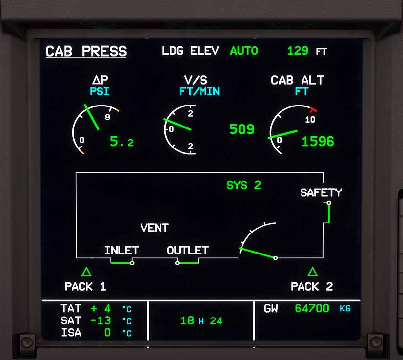
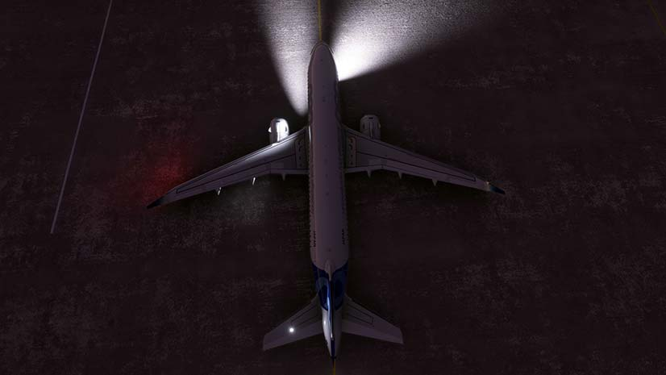
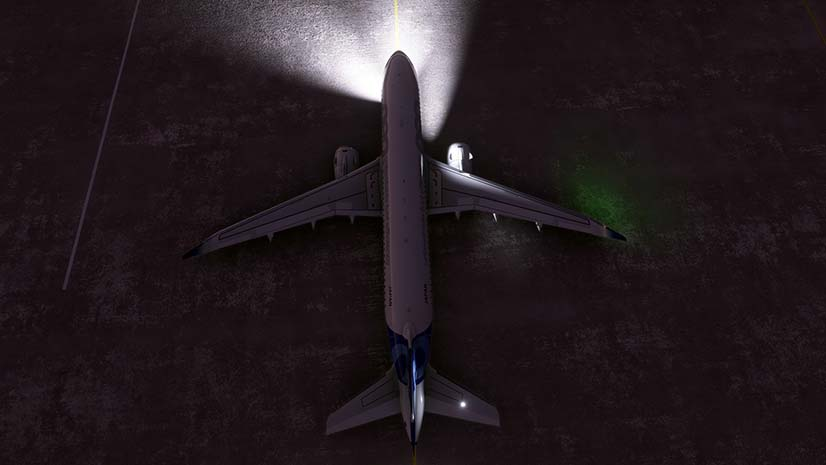
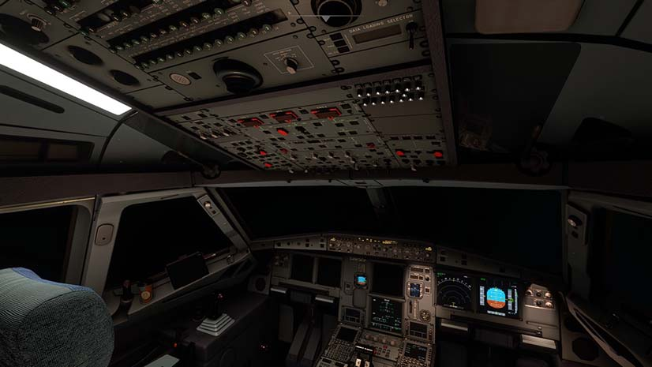
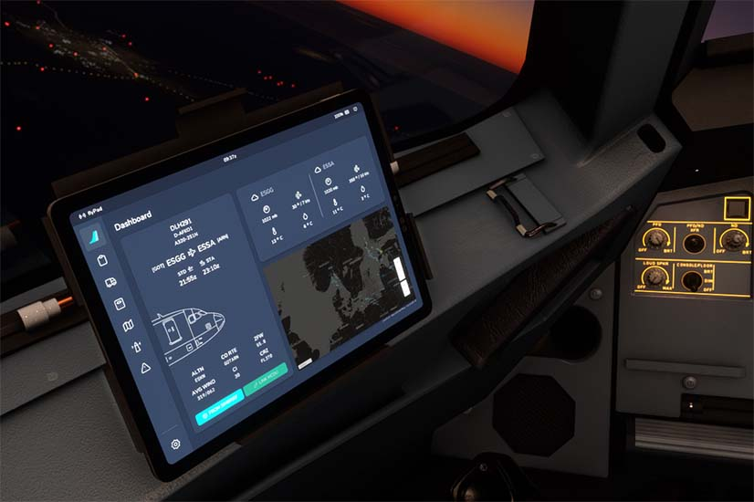
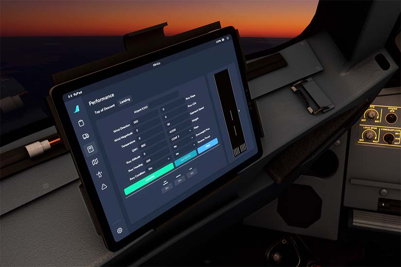
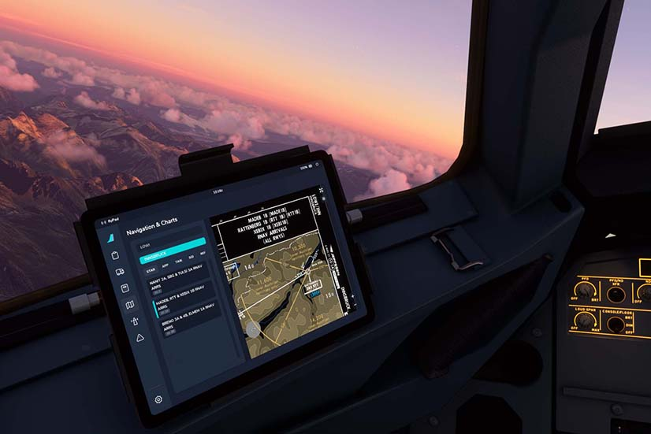
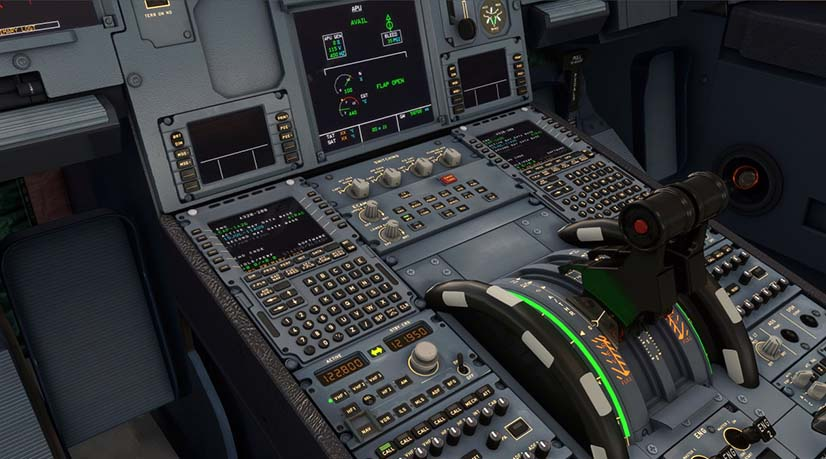
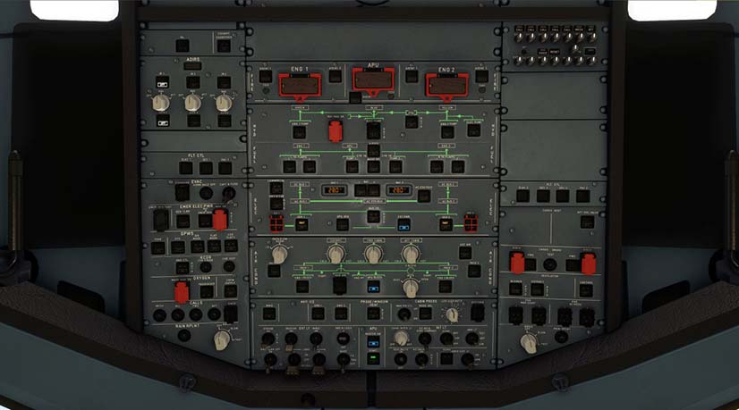

# Stable Release v0.7.0

FlyByWire Simulations Stable v0.7.0 is our largest release to date featuring entirely custom systems developed and tested meticulously with our pilot staff and QA team.

This release now includes these major features:

- Entirely custom fly-by-wire, autopilot and autothrust systems, written from the ground up to incredible accuracy.
- Reworked flight model using real-world data, adapted to our custom flight systems.
- Custom LEAP 1A-26 engine performance model.
- Entirely custom automatic pressurisation, hydraulic and ADIRS systems.
- Significant overhaul to avionics system, including more accurate symbology and improved frame rates.
- flyPadOS 2: New layout, Navigraph charts, landing performance calculator, aircraft configuration options.
- Entirely reworked cockpit texturing, with realistic amounts of wear for an A320neo.
- Improved soundscape - entirely custom sound pack with 100% custom samples.

...and much more!

For a full release changelog - [see here](#changelog)

!!! info ""
    Downloads available through our [installer](../fbw-a32nx/installation.md) or [website](https://flybywiresim.com/a32nx/#download).

    Please see our [Support Guide](../fbw-a32nx/support/index.md) and [Reported Issues](../fbw-a32nx/support/reported-issues.md).

## Quick Links

1. [Custom Fly-by-Wire Autopilot and Autothrust System](#custom-fly-by-wire-autopilot-and-autothrust-system)
2. [Custom Engine Model](#custom-engine-model)
3. [Custom Systems](#custom-systems)
4. [Overhauled Avionics System](#overhauled-avionics-system)
5. [EFB flyPadOS v2](#efb-flypados-v2)
6. [Reworked Cockpit Textures](#reworked-cockpit-textures)
7. [Improved Soundscape](#improved-soundscape)

---

## Custom Fly-by-Wire Autopilot and Autothrust System

These systems have been built from the ground up to provide a robust realistic experience throughout all stages of flight. You can now enjoy expert handling of the A32NX when utilizing the autopilot with better climb performance, flight dynamics, and accurate FMA indications on our redesigned PFD.

Additionally, we have also included several features of note:

- Dual AP autoland
- Alpha Floor protections
- Automatic SPD/MACH switching
- Fly-By-Wire Normal Law
    - C* law with proper limits (+2.5g/-1.0g in clean, +2.0g/0.0g with flaps)
    - Auto-Trim
    - Flare law
    - Rotation law (with optional tailstrike protection)
    - Yaw damper
    - Roll limits
- Reworked managed speed management
- ILS auto-tuning for departure and improved for approach

!!! warning "Take Note"
    For now only normal law is supported at the moment.

    Throttle detent calibration is now required - [Read Here](../fbw-a32nx/feature-guides/flypados3/throttle-calibration.md)

## Custom Engine Model

The engine model now supports a realistic cold engine start-up process based on the primary parameters spooling the engines as a function of pressure and temperature. We have implemented custom EGT and fuel flow logic additionally adapting the engine IDLE N1 to be based on the environment conditions of the aircraft in the simulator.

Our engine model supports the above custom autopilot and fly-by-wire system.

## Custom Systems

Our team has been hard at work creating realistic simulations of various systems in the A32NX.

### Pressurization

Initial implementation of the automatic mode for the pressurisation system. This brings a first simulation of the CPC and outflow valve, while managing cabin pressure and rate using engine parameters and landing field elevation.

{width=80% loading=lazy}

### Hydraulics

Major steps have been taken to bring an accurate hydraulics system to the A32NX. This has allowed for more realistic braking action both manually and with the custom autobrake to provide for better dynamic deceleration targets of the real A320neo. These hydraulics have also been connected to our electrical system.

For a great overview of this implementation check out 320 Sim Pilot's video:

<iframe width="560" height="315" src="https://www.youtube-nocookie.com/embed/7uV27k8FsNQ" title="YouTube video player" frameborder="0" allow="accelerometer; autoplay; clipboard-write; encrypted-media; gyroscope; picture-in-picture" allowfullscreen></iframe>

### ADIRS System

We have created an advanced ADIRS implementation that allows for separated ADIRUs allowing for improved functionality in the A32NX. Previously having only one ADIRU aligned would allow the PFD and ND on both sides to fully work. This system now allows for ADR and IR systems to be pushed OFF to disconnect the output and the resulting information is reflective on both the PFD and ND.

See our Developer Series video for more information:

<iframe width="560" height="315" src="https://www.youtube-nocookie.com/embed/5YCc_tafGgs" title="YouTube video player" frameborder="0" allow="accelerometer; autoplay; clipboard-write; encrypted-media; gyroscope; picture-in-picture" allowfullscreen></iframe>

### Electrical System

One of our largest custom systems is the electrical system. Each individual aircraft light, display unit, and windscreen wiper is now accurately powered by the correct electrical bus. If some electrical systems is lost or the flight crew turned them off the A32NX will react accordingly - even keeping the engines running when all electrical systems are lost.

You can see some examples below of how the aircraft lights and systems react when certain electrical systems are not working properly.

**Exterior Lights**

{loading=lazy}

{loading=lazy}

**Interior Lights and Avionics**

{loading=lazy}

## Overhauled Avionics System

The overhaul encompasses both features and increased performance reliability for improved frame rates. We've added realistic symbology and functionality to the avionics including:

- Baro setting flashing
- VOR/ADF needles on the ILS arc display
- True to spec pixelation on avionics
- Auto-brightness
- BRG/DIST on the MCDU

As a convenience feature, keyboard input is now available on the MCDU - [Guide Here](../fbw-a32nx/feature-guides/mcdu-keyboard.md).

## EFB flyPadOS v2

Major improvements have gone into the flyPad onboard the A32NX. This update provides an entirely overhauled UI for all the features you are already accustomed to, creating a more refined experience and improved usability. The settings page has been reworked and many features ported over from the MCDU.

We also introduced two new major features with this version:

- Landing performance calculator.
- Navigraph charts integration built in.

{loading=lazy}

{loading=lazy}

{loading=lazy}

## Reworked Cockpit Textures

As we work towards creating our own A320neo model we have completed an overhaul of the cockpit textures in the A32NX. There is now visible wear and tear across the entire flight deck creating the feel of a real world cockpit.

{loading=lazy}

{loading=lazy}

## Improved Soundscape

Our sound engineer continuously tweaks and improves the digital soundscape from both within the flight deck and on the outside. Using real world references and verified by our pilot staff the A32NX now provides an immersive experience throughout the power up sequence, engine start, flight, cockpit interaction and aircraft shutdown.

We are happy to note that we have replaced all remaining Asobo sounds.

---

<link rel="stylesheet" href="/../stylesheets/release-notes.css">

## Changelog

This is a curated list of changes roughly grouped by [ATA chapters](https://en.wikipedia.org/wiki/ATA_100){target=new}.

&starf; represent new features and functions. 
Other lines represent improvements, bug fixes or other changes.

### ATA 21: Air Conditioning / Pressurization / Ventilation

- &starf; First implementation of automatic pressurization system  - @MJuhe (Miquel)

### ATA 22: Auto Flight - Flight Management

- &starf; Added ISA DEV to ECAM  - @BlueberryKing (BlueberryKing#6641)
- &starf; Added hydraulics page on SD  - @RichardPilbery (tricky_dicky[Z+0]#3571)
- &starf; Added clear scratchpad on CLR held down  - @tracernz (Mike) and @MisterChocker (Leon)
- &starf; ILS auto-tuning for departure and improved for approach  - @tracernz (Mike)
- &starf; Implement BRG/DIST function on PROG page  - @tracernz (Mike)
- &starf; MCDU accepts direct keyboard input (enabled by new option in A32NX Realism Settings).  - @2hwk (2Cas#1022)
- Add REFUELG message to upper ECAM when refuelling via fuel page on EFB  - @sidnov (sidnov#8337)
- Autoswitch ECAM pages use proper FWC phase logic  - @2hwk (2Cas#1022)
- Change flight control page to use hydraulic simulation vars  - @lukecologne (luke)
- Convert Cruise page to React  - @RichardPilbery (tricky_dicky[Z+0]#3571)
- ENG oil temperature amber while below takeoff minimum  - @tracernz (Mike)
- Fix REFUELG message being shown on ECAM even when refueling is complete  - @BlueberryKing (BlueberryKing#6641)
- Implement amber REV message while reverser doors are in transit.  - @BlueberryKing (BlueberryKing#6641)
- Improved alternating of igniters  - @joseph-tobin (joseph#1001)
- Refactor flight control page to use React  - @RichardPilbery (tricky_dicky#3571)
- Rewrite fuel page for React  - @Benjozork (Benjamin Dupont) and @RichardPilbery (tricky_dicky[Z+0]#3571)
- Corrected EMER CANC ECAM button emissive behavior  - @ImenesFBW (Imenes)
- Add hard sign to temp field on PERF APPR, remove FLS/FINAL APP, adjust alignment  - @tracernz (Mike)
- DEST EFOB and ALT DEST EFOB amber coloring fixed  - @erso44 (Ersin Karakilic)
- Disallow ATIS request when no airport is specified  - @ExampleWasTaken (ExampleWasTaken#0886)
- Do not show duplicate names page with 1 option, fix return key  - @tracernz (Mike)
- Fix max page number on duplicate waypoint selection  - @tracernz (Mike)
- Fixed entry of in.Hg baro settings ending in zero  - @tracernz(Mike)
- Fixed input and display issues on PERF/W&B and INIT pages  - @felixharnstrom (Felix Härnström)
- Fixed performance page refresh on flight phase transition  - @MisterChocker (Leon)
- Fixed sometimes bad error message on crz fl entry  - @MisterChocker (Leon)
- Fixed tropo entry validation  - @MisterChocker (Leon)
- Improve robustness of Lat/Lon & P-B/P-B input parsing  - @tracernz (Mike)
- Progress page only shows GPS Primary when it should  - @Username23-23 (NONAmr2433 #8777)
- Remove some settings from MCDU the are now in the FlyPad  - @tracernz (Mike)
- Removed invalid chars from- and updated AOC TELEX warning message  - @ExampleWasTaken (ExampleWasTaken#0886)
- Show max distance of 9999 NM on duplicate waypoint selection  - @tracernz (Mike)

### ATA 22: Auto Flight - Flight Guidance

- &starf; New custom fly-by-wire system  - @aguther (Andreas Guther)
- &starf; New custom autopilot system  - @aguther (Andreas Guther)
- &starf; New custom autothrust system  - @aguther (Andreas Guther)
- &starf; Added triple click and FMA mode reversion logic  - @aguther (Andreas Guther)
- &starf; New high angle of attack and high speed protection  - @lukecologne (luke), @aguther (Andreas Guther)
- Improved managed speed and V2 validity  - @aguther (Andreas Guther)
- Automatically arm NAV on ground when flight plan becomes available  - @aguther (Andreas Guther)
- Fixed and improved mode transitions related to LAND modes  - @aguther (Andreas Guther)
- Improved OP CLB/DES, CLB/DES speed hold characteristics  - @aguther (Andreas Guther)
- Improved V/S and FPA speed protection mode  - @aguther (Andreas Guther)
- Improved disengage conditions for ROLL OUT and when excessive pitch or roll attitude  - @aguther (Andreas Guther)
- Fixed potential engagement of reverse thrust in flight  - @aguther (Andreas Guther)
- Adapted take-off A/THR engagement and added thrust lever not set warning  - @aguther (Andreas Guther)
- Fixed incorrect THR LK activation when A/THR disconnect buttons have been used  - @aguther (Andreas Guther)
- Fixed permanent A/THR disconnect (15s press) not being able to activate with 3D button on thrust levers  - @aguther (Andreas Guther)
- Support flight director off take-off procedure  - @aguther (Andreas Guther)
- Improved ROLL OUT and G/S laws  - @aguther (Andreas Guther)
- Adapt pitch attitude protection for configuration  - @aguther (Andreas Guther)
- Added visual aileron droop and anti-droop  - @aguther (Andreas Guther)
- Elevator trim wheels no longer move when stop is reached  - @aguther (Andreas Guther)
- Improved ground spoiler logic  - @aguther (Andreas Guther)
- Inhibit alpha floor and protection law for 10 s after flight start / plane reload  - @aguther (Andreas Guther)
- Realistic rudder pedals animation only following pilot input or trim  - @aguther (Andreas Guther)
- Realistic rudder trim deflection and reset rate  - @aguther (Andreas Guther)
- Added LVAR for selected speed and only fill active LVAR for VS or FPA mode
- Added more custom events that can be triggered via SimConnect to control the FCU  - @aguther (Andreas Guther)
- Automatically connect flight directors when FCU is powered on  - @aguther (Andreas Guther)
- Fix FCU DISPLAY AC1 BUS power.  - @bouveng (Johan Bouveng)
- Init FCU with SPD 100 kn, HDG = 0° and ALT 100 ft  - @aguther (Andreas Guther)
- Added VS descent phase initiation  - @MisterChocker (Leon)
- Added reset of fmgc variables  - @MisterChocker (Leon)

### ATA 23: Communications

- Enabled LED indicators when testing ANN lights  - @ImenesFBW (Imenes)

### ATA 24: Electrical

- &starf; Add ground service electrical buses  - @davidwalschots (David Walschots)
- &starf; All external and internal lights are powered by the correct electrical bus.  - @davidwalschots (David Walschots)
- &starf; Button and indication lights are powered by the correct electrical bus  - @davidwalschots (David Walschots)
- &starf; EMER ELEC PWR overhead MAN ON push button triggers emergency generator start (RAT not yet simulated)  - @davidwalschots (David Walschots)
- &starf; Engines keep running when electrical systems are lost  - @davidwalschots (David Walschots)
- &starf; Equipment such as wipers and display units are powered by the correct electrical bus  - @davidwalschots (David Walschots)
- ENG FIRE push button deactivates IDG  - @davidwalschots (David Walschots)
- Improve electrical system implementation to allow for implementing advanced scenarios  - @davidwalschots (David Walschots)
- Pushing the GEN 1 LINE push button to OFF opens the GEN 1 contactor  - @davidwalschots (David Walschots)
- RAT & EMER GEN fault light illuminates when applicable  - @davidwalschots (David Walschots)
- The BCL commands the BAT contactor be closed when the BAT push button is moved from OFF to AUTO  - @davidwalschots (David Walschots)
- When turning the BAT pb to AUTO, the battery charge limiter has a 1 second startup delay  - @davidwalschots (David Walschots)

<!--### Equipment-->
<!--### Fire Protection-->
<!--### Flight Controls-->
<!--### Fuel-->

### ATA 29: Hydraulic

- &starf; Brakes are now connected to hydraulic system  - @crocket63 (crocket)
- &starf; Connected hydraulics element to electrical buses.  - @crocket6 (crocket)
- &starf; New custom auto brakes replace default one  - @crocket63 (crocket)
- Added basic LGCIU implementation with per wheel weight on wheels sensors  - @Crocket63 (crocket)
- Blue electric pump override button changed to momentary latched  - @Crocket63 (crocket)
- First building block, more to come. Hydraulics do not impact the sim YET.  - @crocket6 (crocket)
- Fixed autobrake inputs response for rotating knob type controllers  - @Crocket63 (crocket)
- Fixed catering door movement wrongly starting the yellow elec pump  - @crocket63 (crocket)
- Switched hydraulics to new engine model simvars  - @Crocket63 (crocket)
- Updated fix for autobrake rotating knob type controllers  - @Crocket63 (crocket)

<!--### Ice and Rain Protection-->

### ATA 31: Indicating/Recording Systems

- &starf; Add pixelated screens  - @bouveng (Johan Bouveng)
- &starf; Chrono auto-brightness  - @sidnov (Sid)
- &starf; Add VOR/ADF needles to ILS arc display  - @tracernz (Mike)
- &starf; Add baro setting flash when passing TA/TL  - @lukecologne (luke)
- Fix Self-Test no longer triggers when spawning from an in-flight state i.e. cruise/landing/takeoff on runway  - @2hwk (2Cas#1022)
- Improved pixelated screens, only appears when camera is close to displays  - @2hwk (2Cas#1022)
- RMP backlight, ATC and RTPI font color and backlight  - @marcman86 (marcman86#4907)
- Fix pushing of MASTER WARN and MASTER CAUT not disabling aural warnings  - @davidwalschots (David Walschots)
- Improved logic for chronometer operations  - @sidnov (Sid)
- Fix Behaviour of TAS and Wind Info displayed inflight and on Take-Off  - @ChruutvoLuzi (ChruutvoLuzi#8902)
- ND Waypoint Icon Size, Icon Outlines, Airplane Icon Color and Outline  - @marcman86 (marcman86#4907)
- TCAS symbols correctly display in 10, 20, 40nm ARC/ROSE views + bug fixes  - @2hwk (2Cas#1022)
- CVR ground test auto-resets on first engine start  - @tracernz (Mike)
- Reimplemented and improved PFD in react  - @lukecologne (lukecologne#1156)
- Fix Cockpit Door Video Toggle  - @sidnov (Sid)

### ATA 32: Landing Gear

- &starf; Autobrake can be armed via keybindings  - @Saschl (saschl#9432)

### ATA 33: Lights

- &starf; Add OVHD ANN LT DIM functionality  - @bouveng (Johan Bouveng)
- Added workaround for missing lighting definitions in Asobo templates  - @cloudynetwork (Peter Joseph)
- Correct Korry button labels  - @tracernz (Mike), @tyler58546 (tyler58546)
- New potentiometer for lights, emissives and screens.  - @bouveng (Johan Bouveng)

### ATA 34: Navigation

- &starf; ADR1, ADR3, or ADR2 can be pushed OFF to disconnect output of ADR information from that particular ADIRU  - @davidwalschots (David Walschots)
- &starf; IR1, IR3, or IR2 can be pushed OFF to disconnect output of IR information from that particular ADIRU  - @davidwalschots (David Walschots)
- &starf; Simple ATT mode implementation (does not yet include HDG entry)  - @davidwalschots (David Walschots)
- Add on delay for ON BAT light  - @tracernz (Mike)
- Fix ADIRUs not aligned starting on runway  - @davidwalschots (David Walschots)
- GPS PRIMARY LOST is only indicated when none of the IRs are aligned or ON  - @davidwalschots (David Walschots)
- SAT, TAT, and ISA indications depend on the selected ADR (1 or 3)  - @davidwalschots (David Walschots)
- Switching panel's ATT HDG and AIR DATA knobs functionality  - @davidwalschots (David Walschots)
- The longest instead of the shortest remaining alignment time is displayed on the upper ECAM  - @davidwalschots (David Walschots)
- Upper ECAM shows IR x IN ATT ALIGN when any ADIRU is in ATT mode alignment   - @davidwalschots (David Walschots)
- Wind, TAS, and GS indications depend on availability of IR and ADR data  - @davidwalschots (David Walschots)
- Display units only run their self-test when unpowered over 10 seconds  - @davidwalschots (David Walschots)

### ATA 34: Surveillance

- &starf; Implement automatic brightness adjustment for standby instrument  - @BlueberryKing (BlueberryKing#6641)
- &starf; Standby instrument brightness buttons can now be held down rather than pressed to -/+ brightness  - @2hwk (2Cas#1022)
- Fix "retard" callout so it plays at less than 20 ft radio altitude with autopilot off  - @donstim (donbikes#4084)

<!--### Oxygen-->
<!--### Pneumatic-->
<!--### Water / Waste-->
<!--### Maintenance System-->

### ATA 46: Information Systems

- &starf; Add flypad themed simbrief maps to EFB/OFP  - @bouveng (Johan Bouveng)
- &starf; Added throttle calibration for autothrust system  - @Saschl (saschl#9432)
- Reworked airport handling on AOC Weather Request Page  - @MisterChocker (Leon)
- Add tabbed settings page to EFB  - @ErickSharp (Erick [Z-6]#6484)
- Disabled LINK MCDU button on dashboard page  - @ExampleWasTaken (ExampleWasTaken#0886)
- Fix fuel tank capacity values  - @donstim (donbikes#4084)
- Persist sound and EFB settings correctly  - @tracernz (Mike)

<!--### APU-->
<!--### Doors-->
<!--### Cockpit Windows-->

### ATA 72: Engines

- &starf; Adapt engine IDLE N1 based on environmental conditions  - @Taz5150 (TazX [Z+2]#0405), @aguther (Andreas Guther)
- &starf; New engine model with custom EGT and fuel flow logic  - @Taz5150 (TazX [Z+2]#0405)
- &starf; Cold Engine start-up model (primary parameters)  - @Taz5150 (TazX [Z+2]#0405)
- Fixed fuel consumption model  - @Taz5150 (TazX [Z+2]#0405)
- Fixed fuel flow being 0 at Start-up   - @Taz5150 (TazX [Z+2]#0405)
- Fix "fuel used. Fuel used is reset to zero when an engine is restarted on the gound. - john P Maguire#9027

### 3D Model / Sound / Textures / Animations

- &starf; Implement an early version of closed vs open cockpit door sounds  - @hotshotp (boris#8008)
- &starf; Added CVR test sound  - @hotshotp (Boris)
- &starf; Added blue and yellow electric hydraulic pump sounds  - @hotshotp (Boris)
- &starf; Add APU exhaust heat blur effect  - @wpine215 (Iceman)
- Added 3D brake gauge  - @tyler58546 (tyler58546), @DarkOfNova (DarkOfNova)
- Fixed EVAC button animation  - @tyler58546 (tyler58546)
- Change ECAM button lights to white  - @tracernz (Mike)
- Fix no-smoking/no-PED switch animation  - @tracernz (Mike)
- Reverse thrust animation no longer proportional to thrust lever position  - @tracernz (Mike)
- Un-mirror sharklet textures  - @tracernz (Mike)
- Correct EVAC button behaviours  - @tracernz (Mike)
- Fix invisible fault emissive decal on centre fuel pump 2  - @tracernz (Mike)
- Add separate RTPI font file  - @sidnov (Sid)
- Replace all remaining Asobo sounds  - @hotshotp (boris#8008)
- Added custom FCU and GPWS, push-button sounds @ImenesFBW - (Imenes)
- Added glareshield chrono button sound  - @ImenesFBW (Imenes)
- Further improved ambience and engine sounds  - @hotshotp (Boris)
- Improved engine startup sound and added wiper sounds  - @hotshotp (Boris)
- Improved engine startup, idle sounds, and cabin wind  - @hotshotp (Boris)
- Improved engine, ground roll, and ambience sounds  - @hotshotp (Boris)
- Added a white dot to the test button and corrected DISCH alignment on the fire panel  - @ImenesFBW (Imenes)
- Improved cockpit textures and screen reflections  - @MoreRightRudder (Mike), @tyler58546 (tyler58546)
- Upscaled the existing FBW livery to 8K  - @FoxinTale (Aubrey)

### Miscellaneous

- &starf; Failures are supported  - @davidwalschots (David Walschots)
- &starf; Force usage of modern flight model  - @aguther (Andreas Guther)
- &starf; Added separated flaps position for 1 and 1+F  - @donstim (donbikes#4084), @aguther (Andreas Guther)
- &starf; Added Notification to user via popup + notification when settings change requires aircraft reload.  - @2hwk (2Cas#1022)
- Aircraft can only be fueled when on ground  - @erso44 (Ersin Karakilic)
- Added missing Fuel Pumps checkpoint  - @sidnov (sidnov#8337)
- Adds new parameters introduced by SU4  - @donstim (donbikes#4084)
- Fix flap transition bounce  - @donstim (donbikes#4084)
- Increased gear drag, reduced flap drag  - @donstim (donbikes#4084)
- Custom spoiler logic and realistic impact on flight model  - @donstim (donbikes#4084), @aguther (Andreas Guther)
- Fixed excessive weather vaning stability  - @donstim (donbikes#4084)
- New flight model adapted to new engine model  - @donstim (donbikes#4084)
- Added JP, FI, SE, NO and NL language support for tooltips.  - @kpotschi (MelodyConnor)
- Added annunciator lights to interactive checklist  - @oim1 (oim)
- Change back to airliner hud in external view for SU5  - @donstim (donbikes#4084)
- Seatbelt sign state can be toggled via external events  - @Saschl (saschl#9432)
- Sync settings across instruments  - @tracernz (Mike)
- Workaround for altitude issues of MSFS  - @aguther (Andreas Guther)
- Removed unused material to fix potential crash to desktop  - @aguther (Andreas Guther)
- Swap EFIS WPT and VOR D buttons  - @tracernz (Mike)

---

