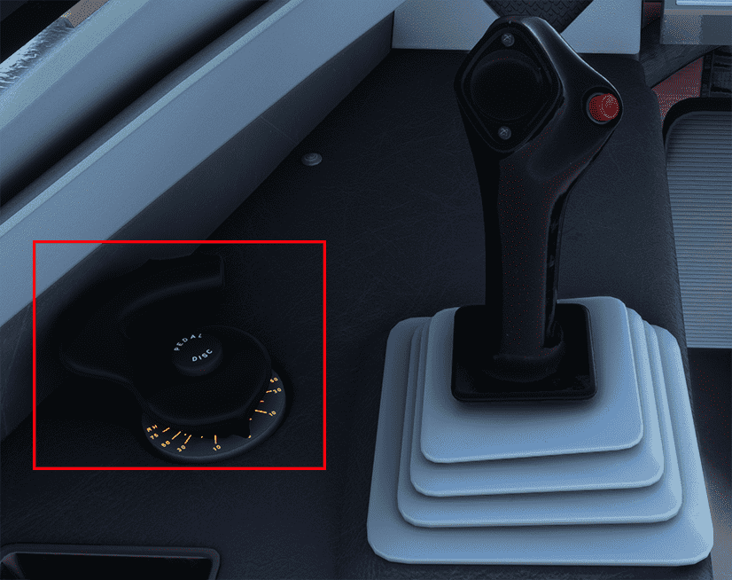

# Stable Release v0.8.0

<link rel="stylesheet" href="../../stylesheets/toc-tables.css">

It has been a long road to our latest stable release. We are happy to introduce some long-awaited features, stunning visual elements, and more realistic simulations of various A320neo systems.

FBW pilots, "Cleared for Takeoff"!

This release now includes these major features:

- [x] Custom Flight Management System with Huge Improvements to LNAV Capability
- [x] Hydraulics Overhaul
    - [x] **NEW** Separated Tiller 
- [x] CPDLC Hoppie ACARS
- [x] TCAS 7.1 and AP/FD TCAS
- [x] Cockpit Textures
- [x] MCDU Web Interface
- [x] Display Typeface Improvements
- [x] AP, FBW, and A/THR Improvements
- [x] Various System Improvements and Optimizations

For a full release changelog - [see here](#changelog)

!!! tip "Recommended Settings"
    Before your first flight please make sure to read our [Recommended Settings](../fbw-a32nx/settings.md) guide.

!!! warning "Important User Experience Changes"
    
    Please note the following changes:

    - Custom Flight Management System
        - See the [Special Notes Section](../fbw-a32nx/feature-guides/cFMS.md#special-notes) on our custom FMS page for details on the topics below:
            - Weather and Terrain are now inoperable as we wait for Asobo implementations.
            - MSFS Built-in ATC and VFR maps are on limited support.
    - [Discontinuities](../pilots-corner/advanced-guides/flight-planning/disco.md) may now appear in your flight plan — they are a feature and not a bug.
    - [Throttle calibration](../fbw-a32nx/feature-guides/flypados3/throttle-calibration.md) is mandatory.
    - We have disabled all assistance and AI features to prevent compatibility issues with A32NX custom systems.
        - You may manually enable some AI features through MSFS settings accessible when pressing `ESC`. To see what settings are available - [see here](../fbw-a32nx/settings.md#deactivate-msfs-assistance-features).

!!! info ""
    Downloads available through our [installer](../fbw-a32nx/installation.md).

    Please see our [Support Guide](../fbw-a32nx/support/index.md) and [Reported Issues](../fbw-a32nx/support/reported-issues.md).

---

## Quick Links

|                                 Feature Shortcuts                                 |
|:---------------------------------------------------------------------------------:|
|        [Custom Flight Management System](#custom-flight-management-system)        |
|                             [Hydraulics](#hydraulics)                             |
|                       [Separated Tiller](#separated-tiller)                       |
|                     [CPDLC Hoppie ACARS](#cpdlc-hoppie-acars)                     |
|                                   [TCAS](#tcas)                                   |
|                       [Cockpit Textures](#cockpit-textures)                       |
|                     [MCDU Web Interface](#mcdu-web-interface)                     |
| [Various Improvements and Optimizations](#various-improvements-and-optimizations) |

---

## Custom Flight Management System

A crucial part of every IFR flight is planning your route, departures, and arrivals. Our new custom flight management focuses on bringing the system architecture even closer to 
how the real A320 handles FMS data and the interactions.

We have completed major improvements to the LNAV portion of the custom FMS. This in turn allows the FMS to have full authority on drawing the flight plan. With a wide
support for various procedure leg types, the plane should fly paths that are more accurate to real life lateral SID/STAR constraints encoded in the navdata, better
flight path prediction, and *finally* programmable holds!

Additionally, we have also included the following features:

- [Fix Info](../pilots-corner/advanced-guides/flight-planning/fixinfo.md) to create waypoint intersections in your flight plan.
- [Stored Waypoints](../pilots-corner/advanced-guides/data-management.md) to enter and store up to 99 custom waypoints.
- [Discontinuities](../pilots-corner/advanced-guides/flight-planning/disco.md) are inserted into the F-PLN accordingly.

[Custom FMS Documentation](../fbw-a32nx/feature-guides/cFMS.md){.md-button}

{loading=lazy}

{loading=lazy}

## Hydraulics

A large amount of work has been done to create and implement a realistic simulation of various hydraulic systems in the A32NX. This update features all control surfaces hydraulic control loop (visual and hydraulic only), leak measurement valves, a physics based PTU model, emergency hydraulic motor/generator simulation supplied by RAT (no 3D model yet), and even our first iteration of the custom bleed system, impacting hydraulic reservoir pressurisation. 

You may even notice the aileron droop when the aircraft is unpowered at the gate. In addition, heavy winds on the ground can now displace the rudder visually when the aircraft is unpowered. This is because the aerodynamic model can now affect moving parts.

As part of the hydraulic update, we have also made ground handling much more realistic and have finally implemented steering via the [tiller](#separated-tiller).

!!! tip "Deep Dive"
    Check out our dedicated [Hydraulics Development Update NOTAM](https://flybywiresim.com/notams/hydraulics-update-2022/){target=new} that explains a lot of these changes in detail.

### Separated Tiller

Previously, most users opted to use the rudder axis to steer the aircraft on the ground. Now, nose wheel steering can be accomplished via the tiller! It is used to turn the nose wheel during taxi up to 75° to the left or right, giving users a more realistic taxi experience in the simulator.

{loading=lazy}

[Nose Wheel Tiller Operation Guide](../fbw-a32nx/feature-guides/nw-tiller.md){.md-button}

## CPDLC Hoppie ACARS

Trying to get a non-urgent message on a VATSIM/IVAO but there are too many critical instructions on frequency? Use our CPDLC implementation! While this is a constant "in 
development" feature, it currently supports both networks for relaying two-way data-linked messages as an alternative to voice communications.

This entire implementation is a realistic realisation of the ATS 623 standard.

{loading=lazy}

[Hoppie ACARS Operation Guide](../fbw-a32nx/feature-guides/hoppie.md){.md-button}

## TCAS

Our implementation of the Traffic Collision Avoidance System (TCAS) is based on TCAS 7.1, a first among all Airbus simulation addons. This includes the AP/FD TCAS feature that 
provides vertical guidance as part of the Auto Flight System (AFS).

The A32NX can detect TCAS TAs and provide autopilot guided TCAS RA manoeuvres on both VATSIM/IVAO networks and the live traffic feature in MSFS. *It does not support MSFS 
multiplayer*.

[TCAS Guide](../pilots-corner/advanced-guides/flight-guidance/tcas.md){.md-button}

## Cockpit Textures

We have carefully crafted new textures in the virtual cockpit representative of a well used A320neo while still reflective of its relatively young age in the Airbus family.

## MCDU Web Interface

You can now use the MCDU externally through a browser on your PC on your mobile device on your home networks! Feel like setting up your flight on your iPad while sitting on your couch? Well, you can do that now!

{loading=lazy}

[MCDU Web Interface Guide](../fbw-a32nx/feature-guides/web-mcdu.md){.md-button}

## Display Typeface Improvements

Systems modelling is important, but we dare not abandon the quest for visual accuracy. We have spent countless hours creating custom typefaces to ensure that each system you 
interact with has accurate typography and fonts.

!!! tip "Deep Dive"
    Our [Features and Projects NOTAM](https://flybywiresim.com/notams/features-and-projects/){target=new} discusses the methodology behind developing the typefaces for the A32NX.

## AP, FBW, and A/THR Improvements

Our commitment to realism and accuracy means that the work is never finished! We have ensured that these systems are more robust in handling various conditions in different
phases of flight. Please see our curated list below for new features and improved/fixed systems.

!!! tip "Deep Dive"
    To learn about the development process of these systems, check out our [Systems NOTAM](https://flybywiresim.com/notams/systems_notam-2022-02/){target=new} published in
    February.

### AP

#### New
- TCAS modes
- Autoland capability for runways with special terrain profile (KSEA 16R)
- Option to use calculated ILS signal
- Allow deactivation of A. FLOOR by disconnecting ATHR
- Load factor and roll rate limits are now applied per law
- Added ALT being armed on ground when CLB is not armed

#### Improved / Fixed
- Improved LOC*, LOC, G/S*, G/S, FLARE, ROLLOUT laws
- Improved speed protection of V/S, FPA, ALT*
- Improved conditions of ALT*, ALT
- Improved conditions of ALT CST*, ALT CST
- Improved HDG and TRACK law for small changes in course
- Improved engagement of OP CLB/DES modes (in coordination with ATHR)
- Improved SRS engagement conditions
- Removed V/S sub mode for CLB, OP CLB and DES when change is less than 1200 ft
- Improved SPD/MACH law

### ATHR

#### New
- Thrust limits redone
- Added distinct retard mode for Autoland (that uses a different N1 rate than THR IDLE)
- FLX thrust is now limiting CLB on entry, realistic transition to default CLB after take-off

#### Improved / Fixed
- Improved SPEED law that uses load-factor and improves scenarios with low N1 when flying transition from descend to level off
- Improved THR CLB and THR IDLE modes
- Improved SOFT ALT mode
- Improved accuracy to achieve N1 target (N1 control base loop)

### FBW

#### New
- Reworked roll law
- Reworked yaw law for side slip control and turn coordination
- Pitch attitude and load factor limits are now also applied in High-AoA protection

#### Improved / Fixed
- Improved pitch law
  - Increased pitch rate of C* law
  - Improved normal law flight path stability when speed is increased or decreased
- Improved stability in turbulent weather
- Improved FLARE mode (manual flight)

## Various Improvements and Optimizations

We have improved almost every aspect of the A32NX from our previous release (v0.7.0). Features you already enjoy such as the flyPadOS 2 have seen changes and improvements to UI 
elements and how the data is handled. We have modeled cabin temperature control and simulation while also improving the pack flow model. Our external lighting systems have been
improved to have better logic, ambience, and are synced in their behaviors.

We have been able to edit aspects of the A320neo model. While not a complete overhaul, we've been able to add new texturing, decal and livery improvements for livery creators, heat
effect changes on the engines, and even landing lights that retract fully and independently. We have also finally allowed the first officer to use the flyPad.

{loading=lazy}

Our new PFD includes EIS S14 features with improved behaviour in numerous aspects. We have also made it lighter on frames, improving performance in the simulator.

As there are too many features to outline here, please check out our full changelog below for more information.

## Changelog

- [ADIRS] Improve ADR SSM behaviour, add missing data to the IR - @luke (lukecologne#1156)
- [ADIRS] Use heading as track at low ground speeds - @beheh (Benedict Etzel)
- [AP/FBW] Improved behavior in cruise when using high sim rate with roll performance - @aguther (Andreas Guther) and @IbrahimK42 (IbrahimK42)
- [API] DOME light switch did not move when set to "dim" via SimConnect - @pre-martin (Martin)
- [AP] Added Autoland capability for special terrain profiles, i.e. KSEA 16R - @aguther (Andreas Guther)
- [AP] Added TCAS modes for Autopilot and Flight Director guidance - @aguther (Andreas Guther)
- [AP] Added support for event AUTOPILOT_DISENGAGE_SET to disengage AP - @aguther (Andreas Guther)
- [AP] Added support for events AP_MACH_INC/DEC and AP_ALT_INC/DEC - @aguther (Andreas Guther)
- [AP] Added support for other default events to basically push/pull all FCU buttons - @aguther (Andreas Guther)
- [AP] Added time delay to ALT condition - @aguther (Andreas Guther)
- [AP] Allow V/S push and pull during ALT CPT - @aguther (Andreas Guther)
- [AP] Corrected guidance for OP DES, CLB and DES for small flight level changes - @aguther (Andreas Guther)
- [AP] Do not disengage SRS on RTO, engage it only in FLX detent when FLX is configured - @aguther (Andreas Guther)
- [AP] Fix DES not being armed in ALT CST and altitude constraint changing to FCU altitude - @aguther (Andreas Guther)
- [AP] Fix G/S condition - @aguther (Andreas Guther)
- [AP] Fix Target Altitude to be set in all FM requested modes - @IbrahimK42 (IbrahimK42)
- [AP] Fix: adjustment of vertical speed limitation in SPD/MACH law - @IbrahimK42 (IbrahimK42)
- [AP] Fixed CLB not engaging correctly on take-off - @aguther (Andreas Guther)
- [AP] Fixed V/S, FPA or ALT* speed protection to engage too early on high altitudes - @aguther (Andreas Guther)
- [AP] Fixed VMAX speed protection for several modes not working properly - @aguther (Andreas Guther)
- [AP] Fixed missing HDG sync on FD/AP engagement when FD and AP have been off - @aguther (Andreas Guther)
- [AP] Furhter improved FLARE law for various conditions - @aguther (Andreas Guther)
- [AP] Further improved ALT CST* and ALT CST conditions - @aguther (Andreas Guther)
- [AP] Improved ALT engage conditions (now +/- 40 ft and 0.8 s) - @aguther (Andreas Guther)
- [AP] Improved HDG/TRK law on small changes - @aguther (Andreas Guther)
- [AP] Improved LOC ALGIN and ROLL OUT during Autoland - @aguther (Andreas Guther)
- [AP] Improved LOC ALIGN law - @aguther (Andreas Guther)
- [AP] Improved LOC law and condition - @aguther (Andreas Guther)
- [AP] Improved LOC* law - @aguther (Andreas Guther)
- [AP] Improved ROLL OUT law - @aguther (Andreas Guther)
- [AP] Improved SPD/MACH law model - @IbrahimK42 (IbrahimK42)
- [AP] Improved SPD/MACH law to be more robust in edge cases - @IbrahimK42 (IbrahimK42)
- [AP] Improved V/PATH law - lukecologne (luke)
- [AP] Improved flight director guidance
- [AP] Improved roll law transition from flight to ground mode during Autoland - @aguther (Andreas Guther)
- [AP] Inhibit ALT* for 3 s after changing FCU altitude - @aguther (Andreas Guther)
- [AP] Reduced speed margin of speed protection to 5 kn - @aguther (Andreas Guther)
- [AP] Separated and improved Nz used by different autopilot laws - @aguther (Andreas Guther)
- [AP] Soft Altitude mode uses now FMGC flight phase to detect cruise situation
- [AP] improved G/S law - @aguther (Andreas Guther)
- [ARCH] Support ARINC 429 communication between aircraft components - @davidwalschots (David Walschots)
- [ATC] Implement ident button and fix auto mode - @tracernz (Mike)
- [ATHR/ENGINE] Improved CLB thrust limit for improved FLEX N1 numbers - @aguther (Andreas Guther)
- [ATHR] Added switch to use externally defined thrust limits and separated thrust limits into own model - @aguther ( Andreas Guther)
- [ATHR] Adjustment of ATHR SPD/MACH gains - @IbrahimK42 (IbrahimK42)
- [ATHR] Fix ATHR Alt Soft Mode - @IbrahimK42 (IbrahimK42)
- [ATHR] Fix ATHR Speed Undershoot - @IbrahimK42 (IbrahimK42)
- [ATHR] Fix Speed/Mach Idle transition in strong headwind - @IbrahimK42 (IbrahimK42)
- [ATHR] Fixed ATHR being armed in flight when TOGA applied without GA condition - @aguther (Andreas Guther)
- [ATHR] Improved thrust limits, FLX limits now CLB when entered into FMGC - @aguther (Andreas Guther)
- [ATHR] Improvement of ATHR laws - @IbrahimK42(IbrahimK42), @aguther (Andreas Guther)
- [ATHR] Increase spool up/down speed for THR IDLE and THR CLB to better match real plane - @aguther (Andreas Guther)
- [ATSU] Add PDC/CPDLC communication via Hoppie - @svengcz (Sven Czarnian)
- [ATSU] Don't include airport as a waypoint in route uplink - @tracernz (Mike)
- [ATSU] Import lat/lon waypoints correctly from SimBrief - @tracernz (Mike)
- [ATSU] Use https for SimBrief - @tracernz (Mike)
- [AUTOTHRUST] Added configuration option to allow change of key increment size - @aguther (Andreas Guther)
- [BLEED] Attached hydraulic reservoirs to both engine bleed systems - @Gurgel100 (Pascal)
- [BLEED] Converted bleed system to use mass flow instead of volume flow - @Gurgel100 (Pascal)
- [BLEED] Fix potential NaN calculations for fast flows - @Crocket63
- [BLEED] Replace default bleed system - @BlueberryKing (BlueberryKing)
- [CLK/ND] Fixed/Improved chrono & ET behavior on time shift - @vkrizan (Viliam)
- [CLK] Added simvars for Clock CHR and ET - @ssewell (Shane Sewell)
- [COND] Add cabin temperature simulation and control - @mjuhe (Miquel Juhe)
- [COND] Improve air conditioning pack flow model - @mjuhe (Miquel Juhe)
- [COND] More accurately define air conditioning knob rotations - @rare-potato(Rare Potato#9693)
- [DUs] Override MSFS menu animation setting for display units - @tracernz (Mike)
- [ECAM] Add pack abnormally off warnings - @tracernz (Mike)
- [ECAM] Converted ECAM SD cabin pressure page to React - @RichardPilbery (tricky_dicky#3571)
- [ECAM] Fixed gross weight being shown without engines running - @BlueberryKing (BlueberryKing)
- [ECAM] Fixed misaligned items on ecam memos - @tyler58546 (tyler58546)
- [ECAM] Revised fuel page to match neo - @RichardPilbery (tricky_dicky#3571)
- [EFB/UI] Override in-game fuel UI and fuel initialization - @Taz5150 (TazX [Z+2]#0405)
- [EFB] Add first officer flypad - @tracernz (Mike)
- [EFB] Added Datalink simulation rate - @svengcz (Sven Czarnian)
- [EFB] Added Hoppie configuration to ATSU/ATC page - @svengcz (Sven Czarnian)
- [EFB] Added Reset to Defaults button to EFB throttle calibration page - @frankkopp (Cdr_Maverick#6475)
- [EFB] Added in-flight refueling capabilities - @Taz5150 (TazX [Z+2]#0405)
- [EFB] Added setting for colored METAR in EFB weather widget - @frankkopp (Frank Kopp)
- [EFB] Colored raw Metar in EFB weather widget - @frankkopp (Frank Kopp)
- [EFB] EFB Setting to enable MCDU Server connection to avoid too many connection attempts - @frankkopp (Frank Kopp)
- [EFB] Fix FAA TAF option - @tracernz (Mike)
- [EFB] Fix Metar parser error - @brainshot (brainshot) @frankkopp (Frank Kopp)
- [EFB] Fixed landing performance calculator clear button and wind magnitude, made small ui improvements - @ghitier ( Guillaume H.)
- [EFB] Moved setting for MCDU keyboard input into the EFB - @2hwk (2Cas#1022)
- [EFB] Neatened up failure buttons on failure page - @nathanmayall (AbsoluteNath#9406)
- [EFB] OFP supports all formats - @tracernz (Mike)
- [EICAS] Fixed issue where CRUISE page was viewable on ground. - @patmack14 (Patrick Macken)
- [ELEC] Fix emergency elec on init in flight wrongly triggering the RAT - @Crocket63
- [ENGINE/ MODEL] Implement engine shutdown and realistic engine animation - @Taz5150 (TazX [Z+2]#0405)
- [ENGINE] Correctly adapt fuel burn with sim rate - @aguther (Andreas Guther)
- [ENGINE] Overall improvement of thrust limits - @Taz5150 (TazX [Z+2]#0405)
- [ENGINE] Refactor FADEC and fuel consumption code (comments, variable nomenclature and overall clean-up) - @Taz5150 ( TazX [Z+2]#0405)
- [EWD] Rewritten EWD in React - @RichardPilbery (tricky_dicky#3571) & @beheh (Benedict Etzel)
- [EWD] Rewritten logic for FWC into React - @RichardPilbery (tricky_dicky#3571) & @beheh (Benedict Etzel)
- [FBW/AP/ATHR] Added local variables to enable logging of flight controls and/or throttle events - @aguther (Andreas Guther)
- [FBW/AP/ATHR] Only enable client data section when a model runs externally - @aguther (Andreas Guther)
- [FBW] Fix Rudder Trim Signal - @IbrahimK42 (IbrahimK42)
- [FBW] Fix: do not compensate ground spoilers in C* law - @aguther (Andreas Guther)
- [FBW] Improved normal law (flight path stability when speed changed, pitch rates) - @aguther (Andreas Guther)
- [FBW] Improved roll stability in turbulence or with performance issues - @IbrahimK42 (IbrahimK42) and @aguther ( Andreas Guther)
- [FBW] Improved sideslip controller - @IbrahimK42 (IbrahimK42)
- [FBW] Improved speed dependent roll law model - @IbrahimK42 (IbrahimK42)
- [FBW] Improved turn coodination in manual flight - @aguther (Andreas Guther)
- [FBW] Intermediate support for aileron keyboard events - @aguther (Andreas Guther)
- [FBW] Reduced rotation law maximum pitch rate from 12°/s to 8°/s - @aguther (Andreas Guther)
- [FBW] Roll normal law is no longer using elasticity table - @IbrahimK42 (IbrahimK42)
- [FCU] Autopilot button integ light brightness corrected - @tracernz (Mike)
- [FCU] FCU backlight is fed from proper bus - @tracernz (Mike)
- [FDR] Added additional data to the FDR - @aguther (Andreas Guther)
- [FDR] Added additional values to help debug in some cases - @aguther (Andreas Guther)
- [FLIGHT MODEL] Fixed station locations and loads consistent with real A320 W&B manual - @ghosh9691
- [FLIGHT MODEL] Fixes co-pilot not being shown in external view - @donstim (donbikes#4084)
- [FLIGHT MODEL] Updated OEW/dry operating weight, max payload, station weights - @sidnov (Sid)
- [FLIGHT MODEL] Additional flight model improvements to better match real airplane performance data - @donstim ( donbikes#4084)
- [FLIGHT MODEL] Flight model improvements - @donstim (donbikes#4084)
- [FLIGHT MODEL] Improved gear contact points - @donstim (donbikes#4084)
- [FLIGHT MODEL] Improved pitch stability in turbulence - @aguther (Andreas Guther)
- [FLIGHT MODEL] Prevent default stall warning bool from being activated - @donstim (donbikes#4084)
- [FLIGHT MODEL] Start fuel transfer for both tanks when EITHER inner tank reaches the trigger level - @donstim (donbikes#4084)
- [FMGC] Add lat/lon waypoint ident option - @tracernz (Mike)
- [FMGC] Add runway-by-itself approaches - @tracernz (Mike)
- [FMGC] Automatic airway waypoint intersection - @tracernz (Mike)
- [FMGC] FAF altitude constraints on precision approaches treated correctly - @tracernz (Mike)
- [FMGC] Fixed issue with TO flight phase transition when no V2 is entered and airport is near sea level - @aguther ( Andreas Guther)
- [FMGC] Implement "coarse" prediction system for turn speeds - @tracernz (Mike)
- [FMGC] Implemented Airport Button - @patmack14 (Patrick Macken)
- [FMGC] Re-implement altitude and speed constraints - @tracernz (Mike)
- [FMGC] Updates flight model info for FMGC guidance - @donstim (donbikes#4084)
- [FMGC] Use correct variable to determine lateral AP mode for APPROACH phase switch - @aguther (Andreas Guther)
- [FM] Fetch transition alt and level from SimBrief - @tracernz (Mike)
- [FM] Stored waypoints - @tracernz (Mike)
- [GPWS] Mute "100 above" callout during autoland - @patmack14 (Patrick Macken)
- [HYD] Added more accurate simulation model of PTU - @Gurgel100 (Pascal)
- [HYD] Added variables for sound update - @Crocket63
- [HYD] Adjusted droop characteristics and randomness of surfaces actuators - @Crocket63
- [HYD] Aerodynamic model affects moving parts - @Crocket63
- [HYD] Ailerons hydraulic control (only visual and hydraulics) - @Crocket63
- [HYD] Elevator hydraulic control (only visual and hydraulics) - @Crocket63
- [HYD] Fix nose wheel position during pushback - @Crocket63
- [HYD] Fixed PTU starting sound trigger - @Crocket63
- [HYD] Hydraulic emergency generator physical based model - @crocket6 (crocket)
- [HYD] Hydraulic system updated. Multiple sections. Better regulation - @Crocket63 (crocket)
- [HYD] Improved hydraulic valves stability - @Crocket63
- [HYD] Increased reservoirs air pressure to avoid low air fault on pumps - @Crocket63
- [HYD] PTU model refinement and simulated potential wear state probabilities - @Crocket63
- [HYD] Placeholder simvar to trigger ptu high pitch sound - @crocket6 (crocket)
- [HYD] Realistic hydraulic nose steering - @crocket6 (crocket)
- [HYD] Reduced engine driven pumps efficiency in active regulation area - @Crocket63
- [HYD] Removed blue reservoir absolute air sensor (removed on new neo) - @Crocket63
- [HYD] Removed ground spoiler group until animations are modified - @Crocket63
- [HYD] Reservoirs connected to pneumatics and first failures - @Crocket63
- [HYD] Simple hydraulic model placeholder for flaps and slats - @Crocket63
- [HYD] Simplified max step loop updater - @Crocket63
- [HYD] Smoothed nose wheel steering when pushing back - @Crocket63
- [ISIS] Added inHg and metric altitude pin programs - @tracernz (Mike)
- [LIGHTS] Add TO/TAXI LT logic, ambience to TAXI/TO/LDG LT + min. changes to strobe/beacon/nav - @bouveng (Johan Bouveng)
- [LIGHTS] Add ambient lt for all INTEG LT emssivies + C&D ambient fix - @bouveng (Johan Bouveng)
- [LIGHTS] Add external PARK BRK LT - @bouveng (Johan Bouveng)
- [LIGHTS] Sync Strobe/Beacon, EXT LT refactor + LDG LT behavior - @bouveng (Johan Bouveng)
- [MCDU] Added button press sound to remote mcdu - @frankkopp (Cdr_Maverick#6475)
- [MCDU] Added manual ILS tuning by ident on RAD NAV page - @tracernz (Mike)
- [MCDU] Added support for connecting MCDU to external devices - @tyler58546 (tyler58546)
- [MCDU] Boarding and W/B AOC Pages update with Simbrief Integration - @viniciusfont
- [MCDU] Fix GPS ground speed monitor to show ground speed in knots rather than meters/second - @donstim ( donbikes#4084)
- [MCDU] Fix GPS ground speed on IRS status page to show ground speed in knots rather than meters/second - @donstim ( donbikes#4084)
- [MCDU] Fix backlight, brightness - @tracernz (Mike)
- [MCDU] Fix crash when clearing DIR TO waypoint - @tracernz (Mike)
- [MCDU] Fixed length limitation for system messages - @derl30n (Leon)
- [MCDU] Fixed transition alt init and display - @derl30n (Leon)
- [MCDU] Hide POSITION UPDATE AT field on PROG page when GPS is available - @BlueberryKing (BlueberryKing)
- [MCDU] Implement ground temp on INIT A - @tracernz (Mike)
- [MCDU] Improved Remote MCDU communication by reducing update frequency - @frankkopp (Frank Kopp)
- [MCDU] Improved Remote MCDU with CLR hold and light-dark mode - @frankkopp (Frank Kopp)
- [MCDU] Improved mcdu server command line handling - @frankkopp (Cdr_Maverick#6475)
- [MCDU] Improved resilience of FMGC main loop - @aguther (Andreas Guther)
- [MCDU] Increase timeout for airport loading - @tracernz (Mike)
- [MCDU] Refactored mcdu key input events - @derl30n - (Leon)
- [MCDU] Scratchpad rewrite - @derl30n (Leon)
- [MCDU] Sort approaches by type - @tracernz (Mike)
- [MCDU] Support manual entry of forward LS course - @tracernz (Mike)
- [MCDU] Update Simbrief API integration with new weights and balance features - @sidnov (Sid)
- [MCDU] Update init/fuel prediction pages to H3 - @tracernz (Mike)
- [MCDU] Updated boarding logic, separate loading for pax and baggage - @sidnov (Sid)
- [MCDU] Add LSK for vert rev at destination - @tracernz (Mike)
- [MISC] Added Home Cockpit mode to remove backlight bleed and reflections in displays - @ssewell (Shane Sewell)
- [MISC] Added custom Autobrake event for SimConnect - @aguther (Andreas Guther)
- [MISC] Animation speed/behaviors for button, switches and knobs - @bouveng (Johan Bouveng)
- [MISC] Fix Home Cockpit mode to honor backlight bleed configuration in PFD/ND test mode - @ssewell (Shane Sewell)
- [MISC] Fix for bleed/hyd system failure in some conditions - @Crocket63
- [MISC] Fix for incrementing ISIS pressure values - @RichardPilbery (tricky_dicky#3571)
- [MISC] Fixed flap configuration in final.flt and runway.flt files - @donstim (donbikes#4084)
- [MODEL] Add MCDU annunciator lights - @tracernz (Mike)
- [MODEL] Add bandit/window mask + ext door decals & tail details - @bouveng (Johan Bouveng)
- [MODEL] Add custom cargo door hinge for texturing - @bouveng (Johan Bouveng)
- [MODEL] Add detailed rivet mesh to allow for ALDB+COMP+NORM ribbons - @bouveng (Johan Bouveng)
- [MODEL] Add dynamic registration decal option - @tracernz (Mike)
- [MODEL] Add four portholes. Two opposite the existing ones, and two above the wing. - @igor8518 (Igor Milovidov)
- [MODEL] Add new decal mesh next to fwd doors - @bouveng (Johan Bouveng)
- [MODEL] Adjust heat effect on ENG1+2 - @bouveng (Johan Bouveng)
- [MODEL] Fix mirrored right main gear wheel UV - @bouveng (Johan Bouveng)
- [MODEL] Landing lights retract fully and independently - @tracernz (Mike)
- [MODEL] Removed glass due to issues with brightness in clouds since SU6 - @aguther (Andreas Guther)
- [MODEL] Split master caution and warning lamps - @tracernz (Mike)
- [PFD/FBW] Added beta target indication - @aguther (Andreas Guther)
- [PFD] Add EIS S14 features (A/BRK info on PFD, white SELECTED ALT) to the PFD - @luke (lukecologne#1156)
- [PFD] Added new messages and modes for TCAS - @lukecologne (lukecologne#1156)
- [PFD] Fix mach number flickering between mach 0.45 and 0.5 - @beheh (Benedict Etzel)
- [PFD] Fixed speed tape outline at low speeds - @beheh (Benedict Etzel)
- [PFD] Implemented TCAS guidance on vertical speed tape - @wpine215 (Iceman)
- [PFD] Improve SPD and MACH flag behaviour, add FPV flag - @luke (lukecologne#1156)
- [PFD] Reimplement PFD with msfs-avionics framework for improved performance - @saschl (saschl#9432)
- [PRESS] Introduce manual functionality of cabin pressurization system - @MJuhe (Miquel)
- [RA] Add dual Radio Altimeter simulation - @beheh (Benedict Etzel)
- [RMP] Added 25 kHz VHF spacing option - @tyler58546 (tyler58546)
- [RMP] Fixed colour of SEL indicator - @tracernz (Mike)
- [SD] Rewrite Bleed page to React - @RichardPilbery (tricky_dicky#3571)
- [SOUNDS] Add passenger announcements and ambience - @hotshotp (Boris)
- [SOUNDS] Add rain sounds in cockpit - @Mico975 (Mico)
- [SOUNDS] Connected TCAS TA/RA logic to TCAS Wwise events - @wpine215 (Iceman) @2hwk - (2Cas#1022)
- [SOUNDS] Use estimated landing rate for touchdown sound selection - @aguther (Andreas Guther)
- [SOUND] Added ALT increment selector and fixed ISIS sounds - @ImenesFBW (Imenes)
- [SOUND] Added PTU sounds in correct conditions - @hotshotp (Boris)
- [SOUND] Pack sounds use new APU model variables - @tracernz (Mike)
- [SPEEDS] Fix GS mini not being limited by VFE-5 in CONF FULL - @donstim (donbikes#4084)
- [TCAS] Implemented traffic advisories, resolution advisories, and collision avoidance logic - @wpine215 (Iceman) @2hwk (2Cas#1022)
- [UTILS] Fix lbs to kgs units conversion to match MSFS - @donstim (donbikes#4084)

### Compatibility Fixes From QA Testing

- build: removed DigitalOcean CDN and no longer used workflow (#7132)
- feat(hyd): PTU randomized characteristics (#7017)
- feat: HDG dashes variable and SimConnect chrono button events (#7131)
- feat: PTU, engine, and other sound changes (#7092)
- feat: added assistance information to FDR (#7147)
- feat: direct to with anticipated turn (#7114)
- feat: disable all MSFS assistance settings (#7151)
- feat: improved G/S*law (#7123)
- feat: improved initialization and custom SimConnect events for Autobrake (#7067)
- feat: inverted nose wheel steering axis (#7148)
- feat: show warning when incompatible assistance functions are enabled (#7138)
- fix(adirs): various IRS data fixes (#7120)
- fix(dcdu,mcdu): dcdu/mcdu visualization issues (#7106)
- fix(fmgc): don't add legs to the empty segment (#7122)
- fix(fwc): Visual and audible warning/caution fix (#7137)
- fix(isis): do not adjust opacity of bg elements (#7103)
- fix: discontinuity in properly strung arrival (#7113)
- fix: properly check on ground variable for speed tape (#7146)
- fix: typos in assistance warning (#7143)
- fix: use main gear compression for some onground detections (#7134)
