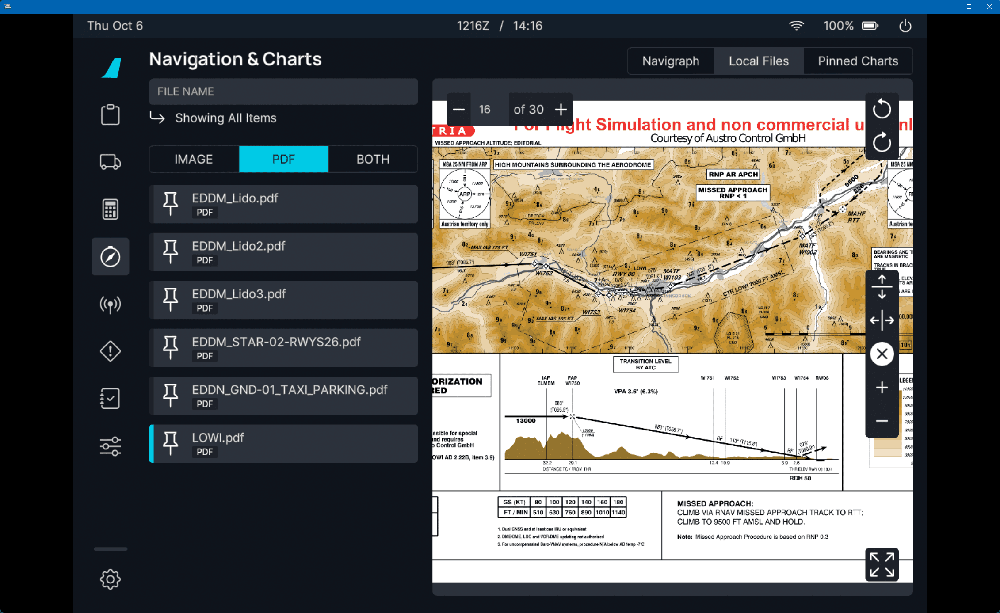
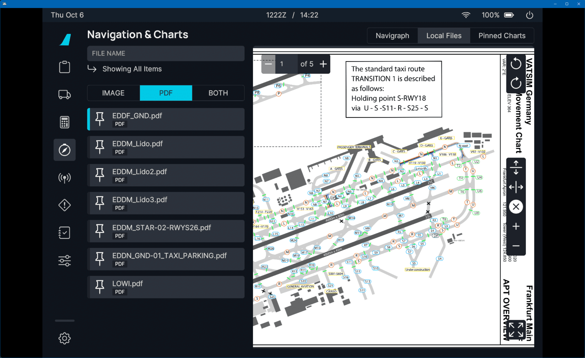

# Stable Release v0.9.0

**[Intro Text Here]**

This release now includes these major features:

- [x] Brand EFB with flyPadOS 3 with expanded feature set and quality of life updates
- [x] Realistically simulated Flight Control Computers: ELAC/SEC/FDCD/FAC
- [x] Major improvements to the FMGC resulting in better leg and navigation management
- [x] Fully realistic hydraulics simulation across all aspects of the A32NX
- [x] Improved logic, visuals and elements in the PFD, SD, and MCDU
- [x] Air Conditioning System Controller connected to our custom electrical system
- [x] Further CPDLC and ATSU improvements with new features
- [x] FBW's SimBridge external features 

## Previous Feature Releases

[See Previous Release - v0.8.0](v080.md){.md-button}

[See Previous Release - v0.7.0](v070.md){.md-button}

For a full release changelog - [see here](#changelog)

!!! tip "Recommended Settings"
    Before your first flight please make sure to read our [Recommended Settings](../fbw-a32nx/settings.md) guide.

!!! warning "Important User Experience Changes"

    Please note the following changes:

    - [SimBridge](../simbridge/index.md) is now required to use the MCDU Remote Display, external printer, and the new Local Files feature.    
    - Custom Flight Management System
        - See the [Special Notes Section](../fbw-a32nx/feature-guides/cFMS.md#special-notes) on our custom FMS page for details on the topics below:
            - Weather and Terrain are now inoperable as we wait for Asobo implementations.
            - MSFS Built-in ATC and VFR maps are on limited support.
    - [Discontinuities](../pilots-corner/advanced-guides/flight-planning/disco.md) may now appear in your flight plan — they are a feature and not a bug.
    - [Throttle calibration](../fbw-a32nx/feature-guides/flypados3/throttle-calibration.md) is mandatory.

!!! info ""
    Downloads available through our [installer](../fbw-a32nx/installation.md).

    Please see our [Support Guide](../fbw-a32nx/support/index.md) and [Reported Issues](../fbw-a32nx/support/reported-issues.md).

---

## Quick Links

Table of Contents if required for various sections below

## Realistic F/CTL Computers

Various EFCS computers have been implemented in the A32NX to facilitate realistic data acquisition from the correct sources (ADIRS, RAs, SFCCs, LGCIUs etc.) and compute their 
logics and laws from this data. Additionally, they will realistically communicate with each other via busses and discrete data.

In this first version we have also included the laws used within the computers themselves selected accurately via the built-in logic. It also performs other functions such as 
monitoring of the peripherals,(ADIRS, RA etc), and computation of miscellaneous logic, for example Aileron Droop, Ground spoiler and speedbrake functions.

The main takeaway of note is having the F/CTL computers now in the A32NX will allow for accurate representation of various system logic on aircraft displays and realistic 
communication between these systems.

## Onboard Systems

### FMGC Updates

Further tweaks and refinements have been implemented. We have notably fixed various issues related to holds, turn 
directions for course / path capture transitions, alongside fixes and support for different leg types. We've also improved the performance when loading 
various procedures. 

*[...] Improve upon this*

### Multipurpose Display and Control Unit

We have added both functional and visual updates to the MCDU. Functionally we have corrected the scrolling behavior on the arrivals/departure now true to life, added imperial runway lengths and implemented the Wind Request feature if you
have generated an OFP on simBrief. Formatting across various pages have been improved and corrected to more accurately represent the version of software we are modelling on the MCDU.

While we continue to work on other aspects this release further solidifies many of the realistic and accurate MCDU features we released in Stable Version 0.8.0.

### PFD

Barberpole indicators on the PFD are now more performance friendly and include a neat little visual effect when going too fast or too slow - the bar will stop moving with the speed scale.

The yellow GS reference line will also always be displayed if pitch and role are valid (even when the LS Pb is not active). In an effort for simulation convenience we have also created a setting on the EFB
to allow users to sync the FD/LS buttons between the CPT and FO.

## flyPadOS 3

Our latest operating system for the onboard Electronic Flight Bag (EFB) has been completely revamped with a refreshing new user experience and plenty of integrated convenience 
features for loading fuel and weight, accessing charts and local files, aircraft presets, and many more. Additionally, a first in flight simulation the EFB now supports over 30 
different languages!

We previously wrote an extensive NOTAM on our website detailing all the new features that shipped with flyPadOS 3. Please click the button below to read more!

[NOTAM: flyPadOS 3](https://flybywiresim.com/notams/flypados3/){.md-button target=new}

## Hydraulics Simulation

[ask davy]

## Air Conditioning System Controller (ACSC)

Our previous releases that feature our fully custom electrical system has allowed us to begin connecting systems properly with improved functionality
and better integration for true to life simulation which would further support failure scenarios.

The ACSC is now connected to our electrical system providing differing levels of functionality depending on what systems are powered to drive the primary and secondary computers of the ACSC.

### Scenarios with Electrical Issues

If electrical systems are shut off or in an inoperable state where the primary computer is not available, you can note that temperature cannot be changed from 24 degrees and flow is set to 100% / NORM. Additionally, if both computers are not
functioning each zone is "fed" directly by the packs resulting in zero temperature control and the pack flow valve controller no longer operable due to lack of power.

!!! warning "ECAM warnings are not yet implemented"

## CPDLC and ATSU

CPDLC enjoys a more rounded out implementation encompassing plenty of new features and improvements to those that were shipped with our previous Stable release.

If you would like to learn how to utilize CPDLC with Hoppie ACARS and see the entire feature set please see the page below!

[Hoppie ACARS](../fbw-a32nx/feature-guides/hoppie.md){.md-button}

!!! info ""
    You are now able to use the following additional features:

    - [x] Automatic position reports
    - [x] Controller report-requests and automatic preparation of pilot replies
    - [x] Controller to pilot: All Instructions including requests, confirmations, etc.
    - [x] Datalink status
    - [x] Flight Monitoring for conditional reports
    - [x] Pilot requests: All kinds, incl. emergency
    - [x] Simulation of FANS-A+ and FANS-B+ with automatic mode selection based on logon-code of ATC

We also released a [NOTAM: ATSU VDL3 Simulation](https://flybywiresim.com/notams/vdl3/){target=new} describing in detail how our new datalink works.

## SimBridge

We have released our custom-built application SimBridge, which enables our users to connect various external devices and data for use with MSFS. 

SimBridge is launched through the FBW Installer and runs silently in your taskbar during your flight. This Stable release includes a new feature that allows users to utilize local files on your PC in PNG or PDF format. 

{loading=lazy}
{loading=lazy}

Additionally, we have transitioned both the MCDU Remote Display and printing function to utilize SimBridge. Configurable settings are now easier to modify through the FBW Installer user interface.

To learn more about the various features implemented with SimBridge, guides on usage and configuration, and troubleshooting see our SimBridge section.

[SimBridge Guides](../simbridge/index.md){.md-button}

## Changelog

- [ADDON] Simbridge Integration - @lucky38i (Alex)
- [ATSU] Fix cargo weight is not set on manually PAX - @Revyn112 (Revyn112#1010)
- [BLEED] Added custom Wing Anti-Ice model - @omrygin, @Eagle941 (Joe)
- [CDSS] When off no longer displays door video - @davidwalschots (David Walschots)
- [COND] Connect Air Conditioning System to Electrical System - @mjuhe (Miquel Juhe)
- [ECAM] Fix erroneous SLATS NOT IN T.O CONFIG warning during flaps 3 takeoff - @beheh (Benedict Etzel)
- [ECAM] Move EWD to correct AC bus - @tracernz (Mike)
- [EFB] Add automatic loading of a lighting preset - @SpiritZephyr (Ben)
- [EFB] Added Local Files support - @ErickSharp (Erick Torres) @frankkopp (Frank Kopp)
- [EFB] Added Payload Loading to EFB - @2hwk (2Cas#1022)
- [EFB] Added SimBridge Health Check icon to Status Bar - @frankkopp (Frank Kopp)
- [EFB] Fix default unit to match UI and other consumers - @tracernz (Mike)
- [EFB] Improved Aircraft Presets procedures - @frankkopp (Frank Kopp)
- [EFB] flyPad pushback option to ignore controller inputs - @frankkopp (Frank Kopp)
- [ELEC] Make battery voltmeters update one digit at a time - @beheh (Benedict Etzel)
- [ENGINE] Fuel persistency between each flight - @juliansebline (Julian Sebline#8476)
- [ENGINE] Improved engine model at TOGA - @Taz5150 (TazX [Z+2]#0405)
- [EWD] E/WD visual improvements - @lukecologne (luke)
- [EWD] Use FPPU angles for flaps/slats display - @lukecologne (luke)
- [FCTL] Add realistically simulated F/CTL computers: ELAC/SEC/FCDC/FAC - @lukecologne (luke)
- [FLIGHTMODEL] Add SU10 crosswind parameters - @donstim (donbikes#4084)
- [FLIGHTMODEL] Improve pitch trim and manual braking level - @donstim (donbikes#4084)
- [FMGC] Allow stringing of STARs with non-runway approaches - @tracernz (Mike)
- [FMGC] Basic RNP at or below 0.3 support - @tracernz (Mike)
- [FMGC] Fix ident for CD legs - @tracernz (Mike)
- [FMGC] Fix inbound leg time for holds - @tracernz (Mike)
- [FMGC] Fix unnatural turn direction for course capture transition - @tracernz (Mike)
- [FMGC] Fix unnatural turn direction for path capture transition - @tracernz (Mike)
- [FMGC] Implement procedure turns (PI leg) - @tracernz (Mike)
- [FMGC] Improve procedure loading performance - @tracernz (Mike)
- [FMGC] Map leg course with station declination where required - @tracernz (Mike)
- [FMGC] Only emit decel point when an approach is selected - @tracernz (Mike)
- [FMGC] Update spoiler CD for MSFS SDK clarification - @donstim (donbikes#4084)
- [GPWS] Alt callouts now finish before altitude is reached - @2hwk (2Cas#1022)
- [HYD] Accelerations impacts hydraulic reservoir fluid movement - @Crocket63 (crocket)
- [HYD] Actuators damping chambers can be asymetrical - @Crocket63 (crocket)
- [HYD] Added a new THS mechanism simulation - @Crocket63 (crocket)
- [HYD] Added optional auxiliary hydraulic section in core hydraulic circuits - @Crocket63
- [HYD] Added possibility to lock or limit hydraulic actuators velocity - @Crocket63 (crocket)
- [HYD] Aerodynamic forces applied on gear system - @Crocket63 (crocket)
- [HYD] Fix fluid return handling of actuators - @Crocket63 (crocket)
- [HYD] Fix gear extending whith dual lgciu power loss - @Crocket63 (crocket)
- [HYD] Fixed Lgciu state machine when reverting gravity extension - @Crocket63 (crocket)
- [HYD] Fixed SFCC computer failing to send FPPU commands - @Crocket63 (crocket)
- [HYD] Fixed actuator position control demand consistency - @Crocket63 (crocket)
- [HYD] Fixed opened gear door wobbling - @Crocket63
- [HYD] Fixed too slow leak measurement valves operation - @Crocket63 (crocket)
- [HYD] Gear system now supports spawning in flight gear up - @Crocket63 (crocket)
- [HYD] More prox sensors and gear actuator failures - @Crocket63 (crocket)
- [HYD] Now allowing reverting gravity gear extension - @Crocket63 (crocket)
- [HYD] Randomised per actuator flow restrictions at plane init - @Crocket63 (crocket)
- [HYD] Refactor plane accelerations and added filtering to handle ground collisions - @Crocket63 (crocket)
- [ISIS] Added temporary ISIS font with arrows - @aweissoertel (Alexibexi#7550)
- [LIGHTS] Increased max brightness of cockpit displays - @frankkopp (Frank Kopp)
- [MCDU] Added 4:3 aspect ratio compatibility to remote mcdu client - @tyler58546 (tyler58546)
- [MCDU] Added formatter to improve text alignment and ease integration - @derl30n (Leon)
- [MCDU] Added imperial runway length - @derl30n (Leon)
- [MCDU] Allow Wind Request from Simbrief flight plan - @USA-RedDragon (Jacob McSwain)
- [MCDU] Fix padding of arc radii on F-PLN - @tracernz (Mike)
- [MCDU] Hide stored elements on A/C Status when there are none - @tracernz (Mike)
- [MCDU] Improved arrivals/departure page scrolling, more true-to-life behaviour and cosmetic apperance - @2hwk ( 2Cas#1022)
- [MCDU] Improved visuals of Init-A and Init-B page - @derl30n (Leon)
- [MCDU] Refactor and improve input handling and conversions in MCDU W&B - @sidnov (Sid)
- [MISC] Fix FDR data for support analysis - @frankkopp (Frank Kopp)
- [MODEL] Add Wheel Chocks and GSE Safety Cones - @bouveng (Johan Bouveng)
- [MODEL] Added new animated gear gravity extension handle- @tyler58546 (tyler58546), @MoreRightRudder (Mike), @Crocket63 (crocket), @Lantarius
- [MODEL] Fixed screens flickering in SU10 - @tyler58546 (tyler58546)
- [MODEL] Improved rivet mesh with more variation and detail - @Grinde (Grinde#4017)
- [MODEL] Remove blue highlights in lock mode - @tracernz (Mike)
- [MODEL] Visible pilot avatars via flyPad setting - @frankkopp (Frank Kopp)
- [PFD] Added option to sync FD/LS buttons between CPT and FO - @Eagle941 (Joe)
- [PFD] Improve PFD barberpole rendering and behaviour - @lukecologne (luke)
- [PFD] Show yellow GS reference line in correct conditions - @saschl (saschl#9432)
- [RMP] Fixed the behavior of the RMPs and ACPs (VHFs only) - Julian Sebline (Julian Sebline#8476 on Discord)
- [SD] Improve COND page visuals, fix some visual bugs on the SD - @lukecologne (luke)
- [SD] Improve F/CTL and WHEEL SD pages visuals - @lukecologne (luke)
- [SD] Visual and functional improvements/fixes to the HYD SD page - @lukecologne (luke)
- [SFCC] Add SFCC bus outputs - @lukecologne (luke)
- [TCAS] Fixed issue when turning to STBY while RA is issued - @2hwk (2Cas#1022)