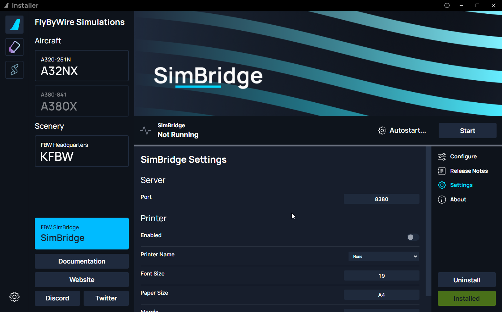

<link rel="stylesheet" href="../../stylesheets/web-mcdu.css">

# Configuration
You can configure SimBridge to provide you with options that best suit your needs.

!!! info Make sure to save
    Make sure to `Save` or `Discard` any settings you might've changed in order for the settings to be reflected in SimBridge

!!! warning Notice 
    If SimBridge is running make sure to stop and then start the service in order for SimBridge to load the modified settings

## Server Settings
This tab is dedicated to settings regarding the SimBridge server itself.

- Port
  - You can modify Simbridge's hosted port

## Printer Settings
This tab is for modifying settings regarding printing data from the MCDU to your physical printer.

- Enabled
  - A simple option to enable or disable the printer function as a whole
- Printer Name
  - This is a dropdown list that lists all of the available printers on your network
-  Font Size
   - Modify the font size of printed content, useful for special size printers
 - Paper Size
   - Modify the paper size, useful for special size printers
-  Margin
   -  Defines the margins for the printout

??? info "Supported Paper Sizes (click to expand)"
    Based on this list: [PDFKIT Paper Sizes](https://pdfkit.org/docs/paper_sizes.html){target=new}

    - A-series: A0 ... A10
    - B-series: B0 ... B10
    - C-series: C0 ... C10
    - RA-series: RA0 ... RA4
    - SRA-series: SRA0 ... SRA4
    - Common U.S. sizes
        - EXECUTIVE
        - LEGAL
        - LETTER
        - TABLOID
    - Other
        - 4A0
        - 2A0
        - FOLIO

    The exact size can be found here:
    [Overview_of_ISO_paper_sizes](https://en.wikipedia.org/wiki/Paper_size#Overview_of_ISO_paper_sizes){target=new}