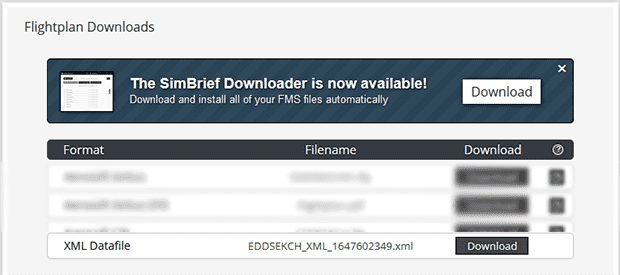
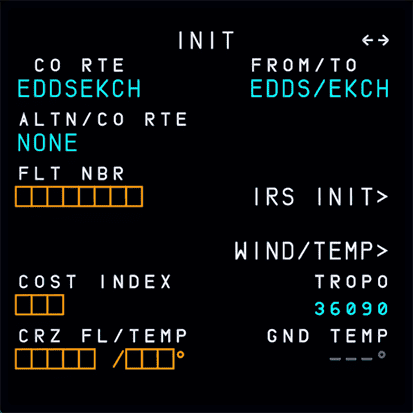
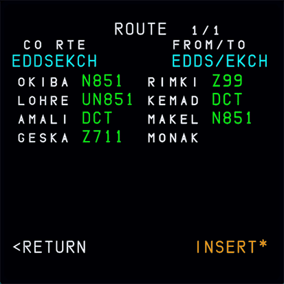

# Company Routes
Stored Company Routes allow you to save routes you regularly fly to your PC. It uses simBrief XML Datafiles format so you can easily use your simBrief planning to create a stored company route.

!!! warning Notice
    To allow the aircraft to access local files you need to SimBridge running. See [Autostart](autostart.md) documentation on how to start it. 

### Generating a Stored Company Route Using simBrief

- Generate a flight plan using simBrief 
- Download the `XML Datafile' from simbrief

    {loading=lazy}

- Save the simBrief XML Datafile to the coroutes folder in the [resources folder](installation.md#resources-folder)
- Rename the simBrief XML Datafile to any name with maximal 9 characters. E.g. the airport's IATA codes `STRCPH1.xml`

#### Entering a Company Route Name 
- Start a flight at the appropriate departure airport and follow the standard setup procedure
- When setting up the flight management system in the MCDU you can directly head to the INIT A page
- Enter the name of your company route into the `CO RTE` field

    {loading=lazy}

- This populates FROM/TO and also the basic flight plan. 
- A Stored Company Route does not include the flight number, cost index or cruise level.
- Also, SID/STAR and APPR or any other flight specific data (pax, cargo, etc.) are not part of a stored company route.
- You can now complete the flight plan setup by entering the missing data manually.

#### Entering a FROM/TO Pair
- **Alternatively** you can enter the FROM/TO pair of routes you have stored which will bring up the co-route selection page
    
    {loading=lazy}

- The co-route selection page shows summary of each stored route.
- You can navigate between the routes with the horizontal slew keys.
- For long routes you can scroll the page by using the vertical slew keys.
- You can choose and insert a route by pressing the LSK 6L next to `INSERT*`
- A Stored Company Route does not include the flight number, cost index or cruise level.
- Also, SID/STAR and APPR or any other flight specific data (pax, cargo, etc.) are not part of a stored company route.
- You can now complete the flight plan setup by entering the missing data manually.